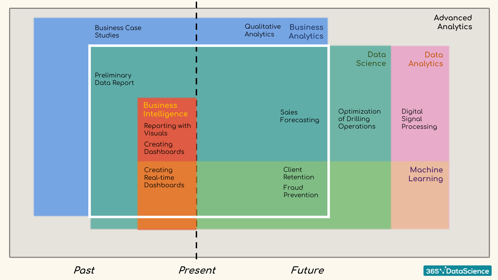

# Data Science

> Reference basis: "Data Science Bootcamp Course from Udemy" - written/compiled by Maitreya Ranade.

---

# Introduction

Please find the Big picture of Data science here in :

Some important things to keep in mind:

-   **Analytics vs Analysis** Term Analytics relates to the future
    events. It includes exploring of patterns and prediction. Term
    analysis relates to the data from past events(existing data). It
    explains how and when.

-   **Business intelligence** Process of analysing and reporting
    historical business data. Aims to explain past events using business
    data.

-   **Machine learning** The ability of machines to predict outcomes
    without being explicitly programmed. Creating and implementing
    algorithms that let machines receive data and use this data to: 1.
    Make predictions, 2. Analyse Patterns, 3. Give recommendations.

-   **Business intelligence** Simulating human knowledge and decision
    making with computers.

# Probability

## Combinatorics

Permutations (Arrange)(Used for arrangement of objects & order is relevant): Arrange entire set of elements in the sample space. Variations (Pick and arrange) (Used for arrangement of objects & order is relevant): Arrange only a few elements from the set of elements in the sample space. Combination (Pick)(order is irrelevant)

No repetition

Repetition

## Bayesian Inference

## Distributions

## Probability in Other Fields

# Statistics

## Descriptive Statistics

## Practical Example: Descriptive Statistics

## Inferential Statistics Fundamentals

## Inferential Statistics: Confidence Intervals

## Practical Example: Inferential Statistics

## Hypothesis Testing

## Practical Example: Hypothesis Testing

# Introduction to Python

## Variables and Data Types

## Basic Python Syntax

## Other Python Operators

## Conditional Statements

## Python Functions

## Sequences

## Iterations

## Advanced Python Tools

# Advanced Statistical Methods in Python

## Linear regression with StatsModels

## Multiple Linear Regression with StatsModels

## Linear Regression with sklearn

## Practical Example: Linear Regression

## Logistic Regression

## Cluster Analysis

## K-Means Clustering

## Other Types of Clustering

# Mathematics

# Deep Learning

## Introduction to Neural Networks

## How to Build a Neural Network from Scratch with NumPy

## TensorFlow 2 point 0: Introduction

## Digging Deeper into NNs: Introducing Deep Neural Networks

## Overfitting

## Initialization

## Digging into Gradient Descent and Learning Rate Schedules

## Preprocessing

## Classifying on the MNIST Dataset

## Business Case Example

## Conclusion

# Case Study

## Case Study - What is Next in the Course?

## Case Study - Preprocessing the Absenteeism Data

## Case Study - Applying Machine Learning to Create the absenteeism Module

## Case Study - Loading the absenteeism Module

## Case Study - Analyzing the Predicted Outputs in Tableau

# Appendix

## Deep Learning - TensorFlow 1: Introduction

## Deep Learning - TensorFlow 1: Classifying on the MNIST Dataset

## Deep Learning - TensorFlow 1: Business Case

## Software Integration
