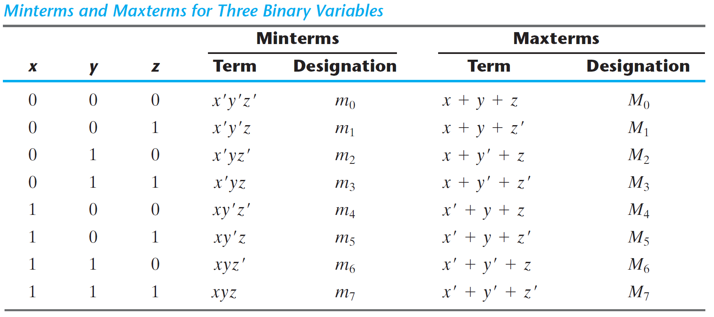
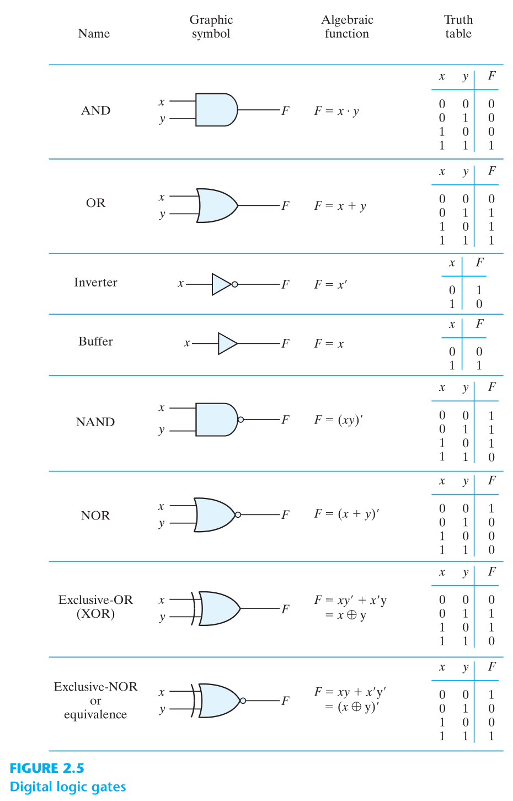

# Boolean algebra and Logic gates

---

# Introduction
- Boolean algebra was introduced by George Boole. 
- Boolean Algebra comprises of set of rules used to simplify the given logic expression without changing it's functionality.
- The most Common postulates used to formulate various algebraic structures are:

1.  Closure: A set S is closed with respect to a binary operator if, for every pair of elements of S, the binary operator specifies a rule for obtaining a unique & element of S.

2.  Associative law:$ (x*y)*z = x*(y*z)  $ for all $ x,y,z  \varepsilon S $

3.  Commutative law:$ x*y = y*x  $ for all $ x,y\varepsilon S $

4.  Identity element:$ e*x = x*e = x  $ for every $ x \varepsilon S $

5.  Inverse: A set S having the identity element e - is said to have an  inverse when ,$ x*y=e $

6.  Distributive law:$ x*(y.z) = (x*y).(x*z) $

---

# Basic theorems & Properties of boolean algebra

## Duality

If the operators and the elements are interchanged, every algebraic expression deducible from the postulates of boolean algebra remains unchanged.

## Basic theorems

- Postulate 2:
  - $ x + 0 = x $
  - $ x . 1 = x $
- Postulate 5:
  - $ x + x' = 1 $
  - $ x . x' = 0 $
- Theorem 1
  - $ x + x = x $
  - $ x . x = x $
- Theorem 2
  - $ x + 1 = 1 $
  - $ x \# 0 = 0 $
- Theorem 3, involution
  - $ (x ')' = x $
- Postulate 3, commutative
  - $ x + y = y + x $
  - $ xy = yx $
- Theorem 4, associative
  - $ x + (y + z) = (x + y) + z $
  - $ x(yz) = (xy)z $
- Postulate 4, distributive
  - $ x(y + z) = xy + xz $
  - $ x + yz = (x + y)(x + z) $
- Theorem 5, DeMorgan  
  - $ (x + y)' = x 'y'   $
  - $ (xy)' = x ' + y' $
- Theorem 6, absorption
  - $ x + xy = x $
  - $ x(x + y) = x $

## Summary operations:

1. Compliment: $ (A')' = A $
2. AND:
   1. $ A.A = A $
   2. $ A.0 = 0 $
   3. $ A.1 = A $
   4. $ A.A' = 0 $
3. OR:
   1. $ A+A = A $
   2. $ A+0 = A $
   3. $ A+1 = 1 $
   4. $ A+A' = 1 $
4. Distributive: 
   1. $ A+BC = (A+B).(A+C) $
   2. $ A.(B+C) = A.B + A.C $
   3. $ A+A'B = A+B $
   4. $ A'+AB = A'+B $
5. De Morgan's law:
   1. $(A+B)' = A'.B' $
   2. $(A.B)' = A'+B' $

## Operator Precedence

1.  Parentheses
2.  NOT
3.  AND
4.  OR

# Boolean functions

A boolean function is described by an algebraic expression consisting of binary variables, the constants (0 & 1) and the logic operation symbols. For eg.
$ F_1 = x + y'z $

A boolean function expresses the logical relationship between binary variables & is evaluated by determining the binary value of the expression for all possible values of the variables.

## Truth table

- A boolean function can be represented in a truth table. 
- Truth table enlists all the possible combinations $2^n$ of the variables (n), and the corresponding output value of boolean function.
- A boolean function can be transformed into a circuit diagram composing logic gates from algebraic expression which is also known as schematic.

---

# Canonical & standard forms

## Minterms and Maxterms

### Minterm or standard product
- The product of all variables (.), either with or without complement, is known as minterm.
- All variables forming an AND term, with or without complement, provide 2n possible combinations, called minterms

### Maxterms or standard sums
- The sum of all variables (+), either with or without complement, is known as maxterm.
- All variables forming an OR term, with or without complement, provide 2n possible combinations, called maxterms
- Shorthand notations:
  - minterm: **$m_{j}$** 
  - maxterm:  **$M_{j}$** 
  - where, j is the decimal equivalent of the binary number of the minterm designated.
- Sample Minterms and Maxterms for Three Binary Variables look like the following:

> **A Boolean function can be expressed by forming a minterm for each combination of the variables that produces a 1 in the function and then taking the OR of all those terms.**

- Say, we have a boolean expression = $ f_{1} $
- Firstly, obtain the truth table of the function directly from the algebraic expression
- Read the minterms from the truth table that produce a 1 in the $ f_{1}$
- Take OR of all those minterms.
  
For example: $ f_{1} = x'y'z + xy'z' + xyz = m_{1}+m_{4}+m_{7}  = \Sigma(1,4,7) $ 

> **Similarly, a Boolean function can be also expressed by forming a maxterm for each combination of the variables that produces a 0 in the function and then taking the AND of all those terms.**

- Similar to minterms, we have a boolean expression = $ f_{1} $
- Firstly, obtain the truth table of the function directly from the algebraic expression.
- Read the maxterms from the truth table that produce a 0 in the $ f_{1} $
- Take AND of all those minterms.

For example: $ f_{1} = (x+y+z)(x+y'+z)(x'+y+z')(x'+y'+z) = M_{0}.M_{2}.M_{3}.M_{5}.M_{6} = \Pi(0,2,3,5,6) $

> **Boolean functions expressed as a sum of minterms or product of maxterms are said to be in canonical form.**

## Conversion between Canonical Forms
The complement of a function expressed as the sum of minterms equals the sum of minterms missing from the original function.
$ m'_{j} = M_{j} $

## Standard Forms 
- In canonical form, minterm or maxterm must contain, all the variables, either with or without complement.
- Another way to express Boolean functions is in **standard form**. 
- In this form, the terms that form the function may contain one, two, or any number of literals/variables.
- For example, $ F_{1} = y' + xy + x'yz' $
- This standard type of expression results in a two‐level structure of gates. (Either group of OR gates followed by an AND gate or group of AND gates followed by an OR gate)

## Nonstandard Forms 
- A Boolean function may be expressed in a nonstandard form. 
- The function is neither in sum‐of‐products nor in product‐of‐sums form.
- For example, $ F_{1} = AB + C(D + E) $

---

# Digital logic gates 

- A gate can be extended to have multiple inputs if the binary
operation it represents is commutative and associative.

---

# Integrated Circuits

An integrated circuit (IC) is fabricated on a die of a silicon semiconductor crystal, called a chip, containing the electronic components for constructing digital gates.

## Levels of Integration

Digital ICs are categorized according to the complexity of their circuits as measured by the number of logic gates in a single package.

- SSI (Small Scale Integration): Number of gates are less than 10.
- MSI (Medium Scale integration): Number of gates are between 10 to 1000 Gates.
- LSI (Large Scale Integration): Number of gates are in thousands eg. Processors, memory chips & programmable logic devices.
- VLSI (Very Large Scale Integrations): Number of gates are in millions ex. complex microcomputer chips.

## Digital Logic Families
- Digital integrated circuits are also classified by their specific circuit technology i.e their digital logic family.
- The electronic components employed in the construction of the basic circuit are usually used to name the technology.
  - TTL transistor–transistor logic (standard)
  - ECL emitter‐coupled logic (systems requiring high‐speed operation)
  - MOS metal‐oxide semiconductor (suitable for circuits that need high component density)
  - CMOS complementary metal‐oxide semiconductor (systems
requiring low power consumption, hence dominant in the VLSI industry)

---

# Computer Aided Design of VLSI circuits

- Integrated circuits having sub-micron geometric features are manufactured by optically projecting light onto silicon wafers. 
- The design of digital systems with VLSI circuits containing millions of gates is an enormous task. Only with the help of CAD tools, this task is made possible considering system complexity.
- EDA (Electronic Design Automation) automates multiple steps of design phases of ICs. 
- Typical design flow for creating VLSI circuits:
  1.  Design entry: Schematic / HDL based model
  2.  Phyical Realisation
      1. ASIC
      2. FPGA
      3. PLD
      4. Full Custom IC
  3.  Hardware fabrication with CAD & EDA (Schematic entry)

- An important development in the design of digital systems is the use of a hardware description language (HDL).
- HDL description of a circuit’s functionality can be abstract, without reference to specific hardware, thereby freeing a designer to devote attention to higher level functional detail
- HDL‐based models of a circuit or system are simulated to check and verify its functionality before it is submitted to fabrication, thereby reducing the risk and waste of manufacturing a circuit that fails to operate correctly.
- Two HDLs—Verilog and VHDL—have been approved as standards by the Institute of Electronics and Electrical Engineers (IEEE) and are in use by design teams worldwide.