# Combinational Logic
- [Combinational Logic](#combinational-logic)
- [Introduction](#introduction)
  - [Combinational circuits](#combinational-circuits)
  - [Sequential circuits](#sequential-circuits)
- [Analysis of combinational circuits](#analysis-of-combinational-circuits)
- [Design procedure](#design-procedure)
- [Binary Adder Subtractor](#binary-adder-subtractor)
  - [Half Adder](#half-adder)
  - [Full adder](#full-adder)
  - [Binary Adder](#binary-adder)
    - [Carry propogation](#carry-propogation)
  - [Binary Subtractor](#binary-subtractor)
  - [Overflow subtractor](#overflow-subtractor)
- [Binary Multiplier](#binary-multiplier)
- [Magnitude Comparator](#magnitude-comparator)
  - [Test for equality](#test-for-equality)
  - [Test for comparison](#test-for-comparison)
  - [Boolean functions for Magnitude Comparator](#boolean-functions-for-magnitude-comparator)
- [Decoders](#decoders)
  - [Decoder Applications](#decoder-applications)
    - [Decoder Demultiplexer](#decoder-demultiplexer)
    - [Nested Decoders](#nested-decoders)
    - [Combinational Logic](#combinational-logic-1)
- [Encoder](#encoder)
  - [Priority encoder](#priority-encoder)
- [Multiplexer](#multiplexer)
  - [Three state gate (Tristate gate) (Tristate buffer)](#three-state-gate-tristate-gate-tristate-buffer)
    - [High impedence state](#high-impedence-state)
- [HDL models of combinational circuits](#hdl-models-of-combinational-circuits)

---
# Introduction
- Logic circuits for digital systems maybe combinational or sequential. 
- Combinational circuits employ boolean functions whereas, sequential circuits employ storage element in addition to logic gates.

## Combinational circuits
- A logic circuit is combinational if it's outputs are at any time are a function of only the present inputs. 
- A combinational circuit consists of an interconnection of logic gates.
- Combinational logic gates process the input signals to produce the value of the output signal.
- A combinational circuit can be specified with a truth table that lists the output.
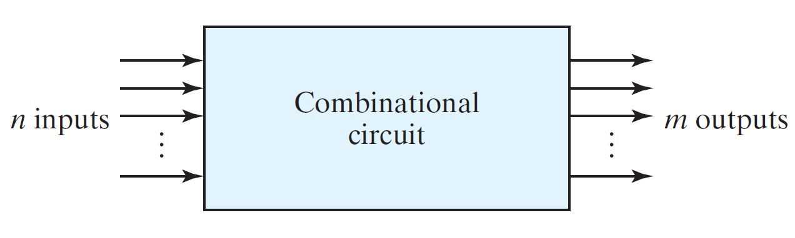 

## Sequential circuits
- Outputs of the sequential circuits are a function of the inputs and the state of the storage elements. 
- Hence, the outputs of a sequential circuit depend at any time on not only the present values of inputs but also on past inputs.

---
# Analysis of combinational circuits
- The logic diagram of a combinational circuit has logic gates with no feedback paths or memory elements. 
- Analysis of a combinational circuit determines its functionality i.e. the logic function that the circuit
implements.

Analysis of combinational circuits can be done through the following 2 methods:

- Method 1:
  1.  Make sure that the circuit is combinational & not Sequential (without memory element & feedback loops).
  2.  Obtain the output boolean functions or the truth table.
  3.  Use hierarchy and input, output to add intermediate primary logic gates to determine the boolean functions.
  4.  Derive truth table: Assign a value to the output base of on every input combination.

- Method 2:
  1.  Develop HDL model of the circuit.
  2.  Write a test-bench (logic simulation)
  3.  Step 1 still requires method 1

---
# Design procedure

These are the steps involved in the design procedure of combinational circuits:

1.  Gather specifications of the circuit.
2.  Determine number of inputs & outputs.
3.  Derive truth table.
4.  Obtain simplified boolean functions.
5.  Draw the logic diagram & verify correctness of the design. (Manually or by simulation.)

---
# Binary Adder Subtractor

- A binary adder performs an addition of 2 bits. 
- Extra bit needed for the addition which is the higher significant bit of the addition is called a "Carry". 
- The result of addition apart from the carry is called "Sum".

## Half Adder
Half Adder is a combinational circuit which adds 2 1-bit digits. Previous carry is not used in the Half Adder.
- x, y are the inputs for the addition
- S , C = sum & carry of the half adder

$$S = x'y + xy' = x \bigoplus y$$ 
$$C = xy$$ 

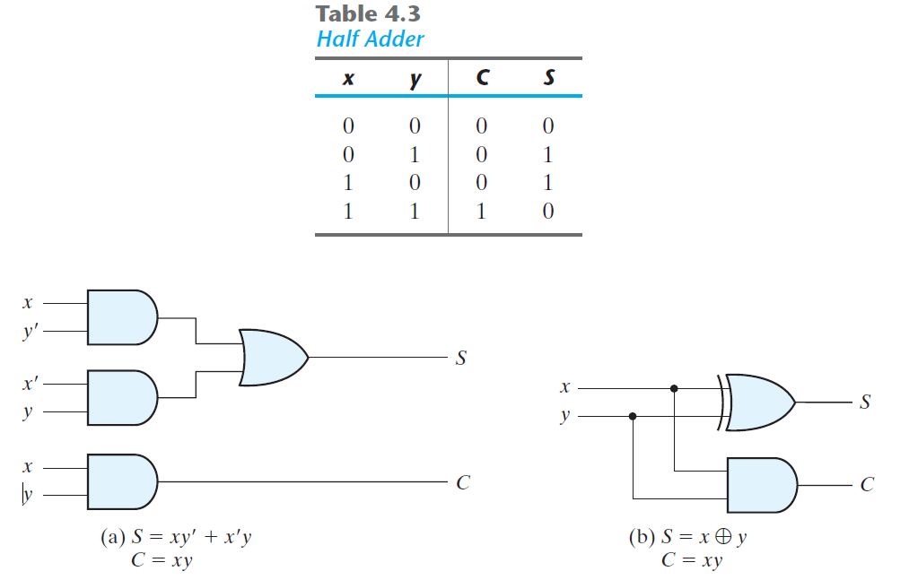

## Full adder

A full adder is a combinational circuits that forms the arithmatic sum of 3 bits (2 significant bits & carry). 
- x, y are the inputs for the addition 
- z is the third input which is the carry from the previous lower significant position. 
- S , C = sum & carry of the full adder

$$S = x'y'z + x'yz' + xy'z' + xyz$$
$$C = xy + xz + yz$$ 
or
$$S = (x \bigoplus y) \bigoplus z$$
$$C = (x \bigoplus y) \bigoplus z + xy$$

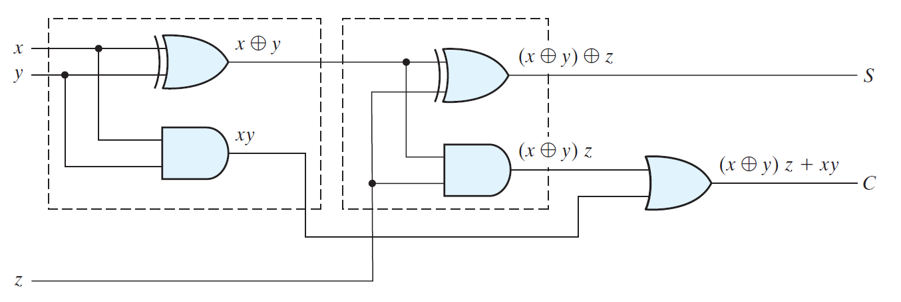

## Binary Adder
Binary adder is a digital circuit that produces the arithmatic sum of 2 binary members. 

- Binary adder is implemented with full adder connected in cascade.
- Output carry of each full adder is connected to the input carry of the next full adder.
- Addition of n-bit numbers require chain of n-full adders.

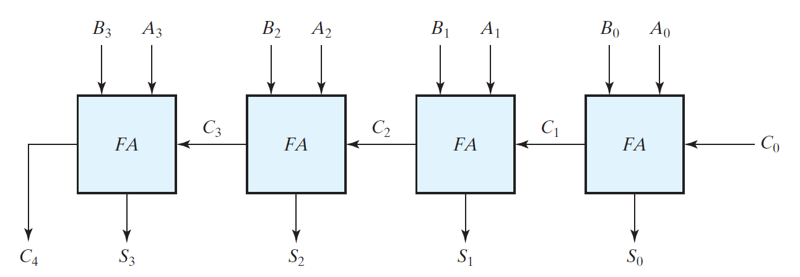

> This representation is also reffered as 4-bit binary **Ripple Carry adder** as the carry is rippled through the full adders.

For eg. consider, A = 1011, B = 0011 & $C_0$= 0. The sum and carry is calculated as follows:

| Bits      | 3 | 2 | 1 | 0 |
|-----------|---|---|---|---|
| $C_{in}$  | 0 | 1 | 1 | 0 |
| $A_i$     | 1 | 0 | 1 | 1 |
| $B_i$     | 0 | 0 | 1 | 1 |
| Sum       | 1 | 1 | 1 | 0 |
| $C_{out}$ | 0 | 0 | 1 | 1 |

### Carry propogation
In the ripple carry adder, to obtain the stable output of the adder, the carry has to be propogated through all the adders, even if all the input bits are available at t=0.
- For eg. only after $FA_0$ calculates $C_1$ & $S_0$, $FA_1$ can start computing the $C_2$ & $S_1$ values. All the other full adders will not be giving a valid output.
- For an n-bit adder, there are 2n gate levels for the carry to ripple from input to output.
- **Carry lookahead logic** is the widely used solution for reducing the carry propogation time in a parallel adder.

In the Carry lookahead logic, the full adder intermediate outputs are named as 2 new binary variables, Carry Propogate $(P_i)$ and Carry Generate $(G_i)$ as shown below:

- $P_i$ = $A_i \bigoplus B_i$
- $G_i$ = $A_iB_i$
  
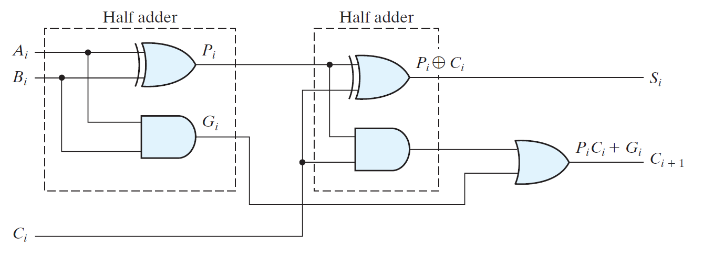

With the newly introduced variables sum and carry can be expressed as, 
- $S_i$ =  $P_i \bigoplus C_i$
- $C_{i+1}$ = $G_i$ + $P_iC_i$

Individual carry is calculated and expanded in the primary terms like this:
- $C_0$ = input carry
- $C_1$ = $G_0$ + $P_0C_0$ 
- $C_2$ = $G_1$ + $P_1C_1$ = $G_1$ + $P_1G_0$ + $P_1P_0C0$
- $C_2$ = $G_2$ + $P_2C_2$ = $G_2$ + $P_2G_1$ + $P_2P_1G_0$ + $P_2P_1P_0C0$
- $C_{i+1}$ = $G_i$ + $P_iC_i$

> With this circuit, the speed of operation is gained at the expense of additional hardware complexity.

| Carry Lookahead Generator                                        | 4-bit adder with Carry Lookahead                                            |
|------------------------------------------------------------------|-----------------------------------------------------------------------------|
| 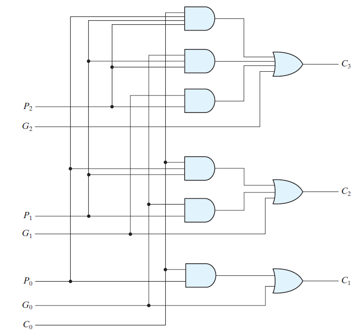 | 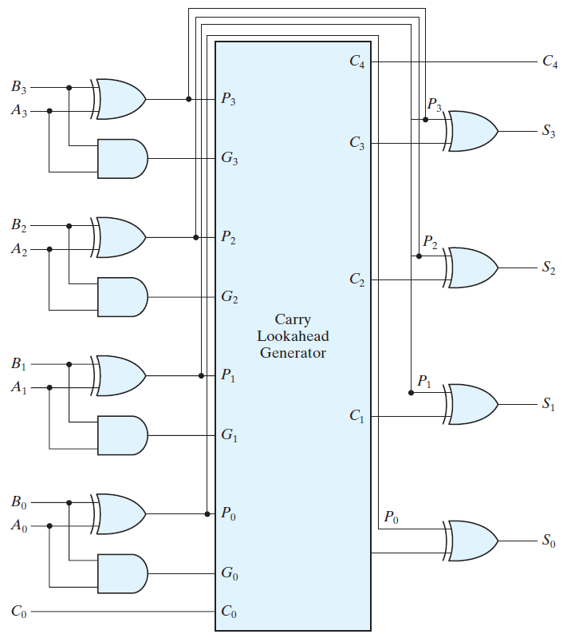 |

---
## Binary Subtractor

Subtraction of binary numbers can be done with the help of
compliments. 
- A - B = A + 2's complement of (B)
- For unsigned numbers,
  - if A $\geqslant$ B  
    - A - B = A + 2's complement of (B)
  - if (A < B) 
    - A - B = 2's complement (A + 2's complement of (B))
- For signed numbers,
  - A - B = A + 2's complement of (B), provided there is no overflow

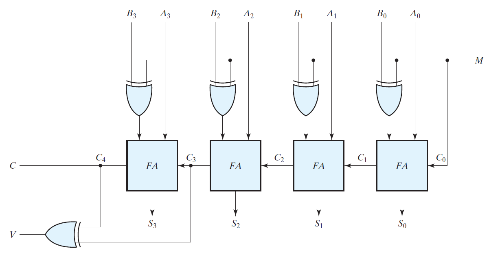
 
> Addition and subtraction operations can be combined into one circuit with one common binary adder.

Four bit adder subtractor (with overflow deletion) (mentioned in the image) is implemented as follows:
- $C_0$ is set to 1 for subtraction and 0 for addition
- $FA_i$, adds $A_i$ with 1's compliment of $B_i$ and $C_i$, which is,
  - A + 2's complement of (B) for subtraction
  - A + B for addition
- Mode input M controls operation switching
  - M = 1 for Subtraction
  - M = 0 for Addition
  - V = Output for detecting overflow.

## Overflow subtractor

Overflow occurs if 2 'n'-bit numbers are added with 'n+1'-bit result for signed, unsigned, decimal or binary numbers. 
- Overflow is a problem in digital computers because the number of bits that hold the number is finite. '(n+1)'-bit result cannot be accommodated by a 'n'-bit word. 
- Detection of an overflow is critical and is detected with a Flipflop.
- Overflow cannot occur after an addition of one positive and one negative number. 
- An overflow occurs only if both numbers to be added are either both positive or both negative.
- An overflow condition can be detected by observing the carry into the sign bit position & the carry out of the sign bit position. 
- If these 2 carries not equal, an overflow has occurred. 
- An XOR gate can be implemented for the detection as shown in 4-bit Adder Subtractor.

--- 

# Binary Multiplier

- Multiplication in binary form is the same as multiplication in decimal form. 
- The multiplicand is multiplied by each bit of the multiplier, starting from the least significant bit. 
- Each such multiplication forms a partial product. Successive partial products are shifted one position to the left. 
- The final product is obtained from the sum of partial
products.

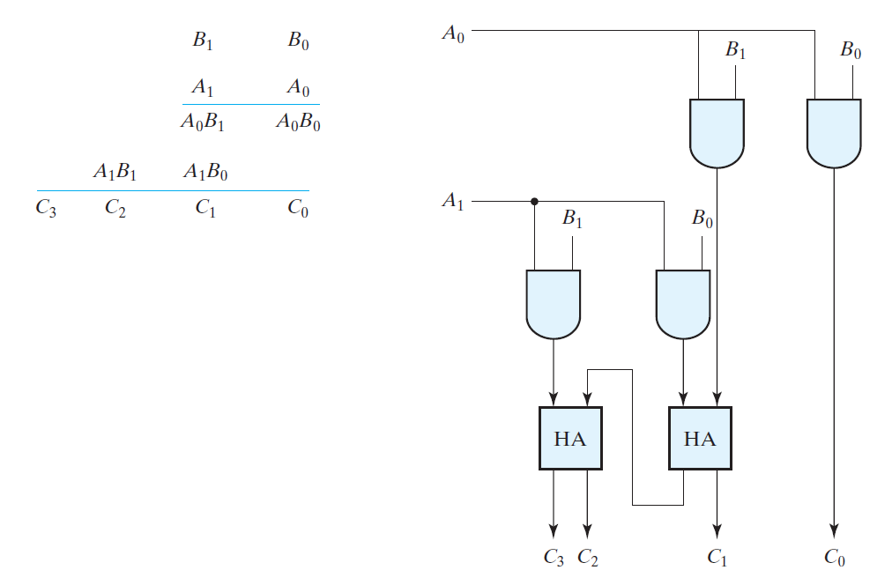

Similarly, for an 'n'-bit multiplication,'n'-bit adders can be implemented instead of Half Adders. For product terms, same AND gate can be used.

--- 

# Magnitude Comparator

Magnitude Comparator is a combinational circuit that compares a numbers to determine their relative magnitudes. 
- For eg. we consider 2 4-bit binary numbers say, 
  - $A = A_3A_2A_1A_0$
  - $B = B_3B_2B_1B_0$.

## Test for equality
A & B will be equal if and only if 
$$a_0 = b_0, a_1 = b_1, .... , a_n = b_n$$
Actual hardware implementation of the same can be done with the XNOR gate.
- $x_i = A_i$ XNOR $B_i$ for all 'n'-bits.
- Variable $x_i$ becomes 1 only if both the digits are same.

## Test for comparison

We move from MSB to LSB for the inspection.
- $x_i = A_i$ XNOR $B_i$ for all 'n'-bits.
- if $x_i = 1$ 
  - i++ until $x_i = 0$
- if $x_i = 0$
  - (A \> B) if $A_i = 1$, $B_i = 0$
  - (A \< B) if $A_i = 0$, $B_i = 1$

## Boolean functions for Magnitude Comparator

$$(A > B) = A_3B_3' + x_3A_2B_2' + x_3x_2A_1B_1'+ x_3x_2x_1A_0B_0'$$
$$(A < B) = A_3'B_3 + x_3A_2'B_2 + x_3x_2A_1'B_1+ x_3x_2x_1A_0'B_0$$
$$(A = B) = x_3x_2x_1x_0$$

These expressions can be implemented on hardware with basic logic gates.

---

# Decoders

A Decoder is a combinational circuit that converts binary information from 'n' input lines to a maximum of an unique output lines. 
- The decoders that convert n-line inputs to m-line outputs are called n to m line decoders where, $m \leqslant 2^n$.
- Ex. **3 to 8 line decoder**: 3 inputs are decoded into 8 outputs.
- The input variables represent a binary number & the outputs represent all the combinations of that binary number.
- Typical Application: binary to octal conversion.
  

## Decoder Applications

### Decoder Demultiplexer

A decoder with enable input can function as a demultiplexer. Enable line being the input and other lines as select lines.

### Nested Decoders

Decoder with enable inputs can be connected together to form a larger decoder circuits. 
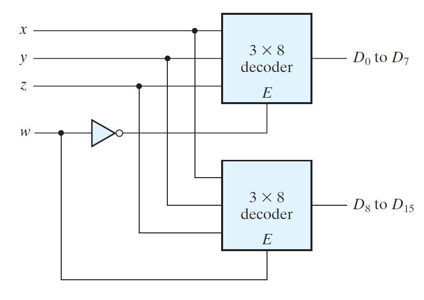

### Combinational Logic

Any combinational circuit with 'n' inputs and 'm' outputs can be implemented with an 'n' to '$2^n$' line decoder and 'm' OR gates. For eg. Implementation of a full adder with a decoder.

--- 

# Encoder

An encoder generates the binary code corresponding to each input value. Encoder has $2^n$ (or fewer) input lines and 'n' output lines.

## Priority encoder

A priority encoder is an encoder that handles inputs with certain predefined priority, to generate output accordingly. For eg. this is a 4-bit priority encoder with  

| D0 | D1 | D2 | D3 |   | a | b | V |
|----|----|----|----|---|---|---|---|
| 0  | 0  | 0  | 0  |   | X | X | 0 |
| 1  | 0  | 0  | 0  |   | 0 | 0 | 1 |
| X  | 1  | 0  | 0  |   | 0 | 1 | 1 |
| X  | X  | 1  | 0  |   | 1 | 0 | 1 |
| X  | X  | X  | 1  |   | 1 | 1 | 1 |

- D0 - D3 = Inputs
- a, b, V = Outputs 
- X = Don't care
- V = valid bit indicator
  - V is set when 1 or more inputs are equal to 1
  - when all inputs are 0, there is no valid inout and V = 0
- High Priority for higher subscript number i.e. D3 has more priority than D2

---

# Multiplexer

A multiplexer is a combinational circuit that selects binary information from one of many input lines and directs it to a single output line based on select lines. 

- If there are 'n'select lines, the input lines should be '$2^n$'. 
  
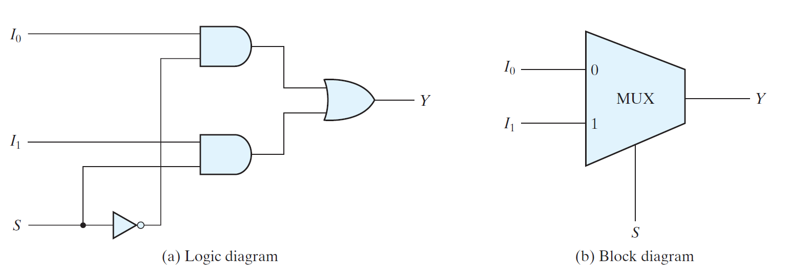

> Boolean expression can also be implemented with MUX.

MUXs can be combined with common select lines to provide multiple bit selection logic. For eg. Quadrapule 2:1 line Mux below uses same select line to select either A or B channel.

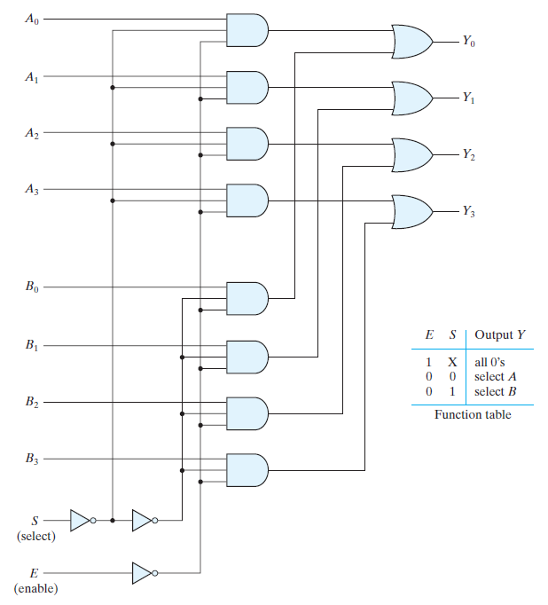

## Three state gate (Tristate gate) (Tristate buffer)
MUX can be constructed with Three State Gates (digital circuits that exhibit 3 States) These 3 states include :

1.  Logic 1
2.  Logic 0 
3.  High impedance state

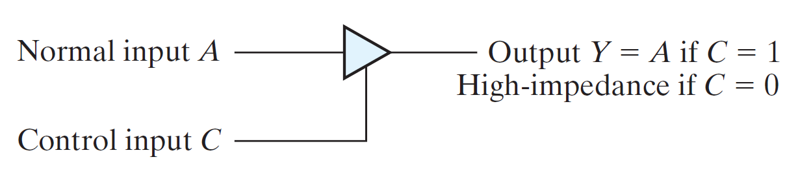

### High impedence state
- Logic behaves like an open circuit.
- The circuit has no logic significance.
- The circuit connected to the output of the 3 state gate is not affected by the inputs to the gate.
- Tristate gates may perform any conventional logic.
- However, the most commonly used tristate gate is the buffer gate. 
- For eg. Implementation of 2:1 Mux with tristate gates.

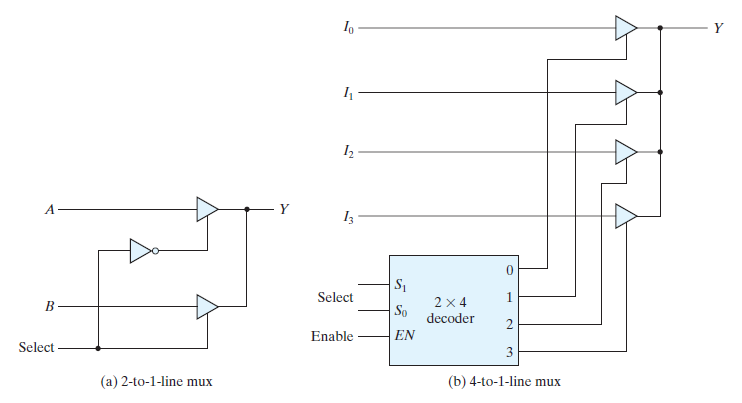

---
# HDL models of combinational circuits
Revisit