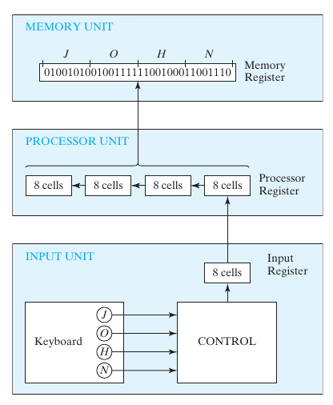
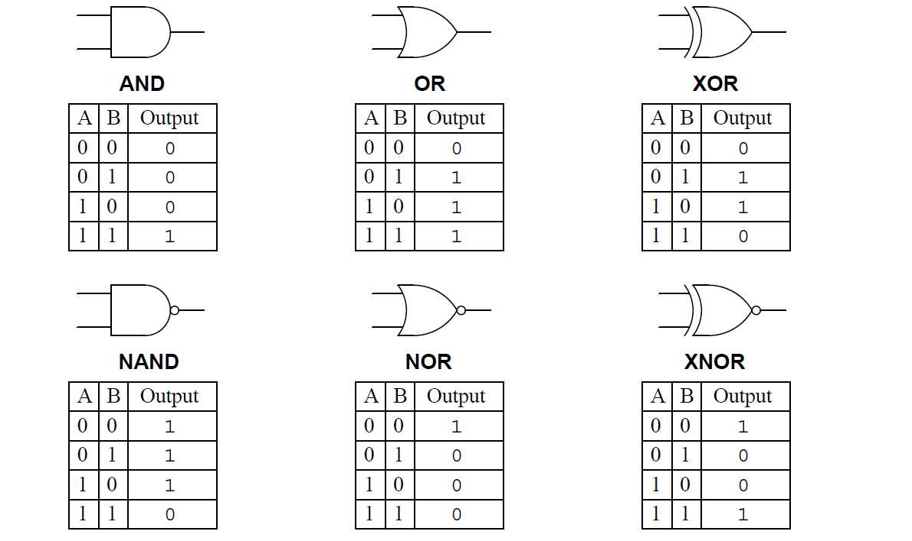

# DigitalDesign

Digital Logic Design Revision

* [Digital Systems and Binary Numbers](DigitalDesign.md#digital-systems-and-binary-numbers)
  * [Introduction](DigitalDesign.md#introduction)
  * [Number representation](DigitalDesign.md#number-representation)
  * [Number base conversion](DigitalDesign.md#number-base-conversion)
    * [Decimal](DigitalDesign.md#decimal)
    * [Binary, Octal, Hexadecimal](DigitalDesign.md#binary-octal-hexadecimal)
      * [Binary Octal Conversion](DigitalDesign.md#binary-octal-conversion)
      * [Binary Hexadecimal Conversion](DigitalDesign.md#binary-hexadecimal-conversion)
  * [Complements of numbers](DigitalDesign.md#complements-of-numbers)
    * [subtraction using complements](DigitalDesign.md#subtraction-using-complements)
  * [Signed Binary Numbers](DigitalDesign.md#signed-binary-numbers)
    * [Ordinary Arithmatic](DigitalDesign.md#ordinary-arithmatic)
    * [Signed Complement System](DigitalDesign.md#signed-complement-system)
    * [Addition of signed numbers](DigitalDesign.md#addition-of-signed-numbers)
    * [Subtraction of signed numbers](DigitalDesign.md#subtraction-of-signed-numbers)
  * [Binary codes](DigitalDesign.md#binary-codes)
    * [Binary coded Decimal code (BCD)](DigitalDesign.md#binary-coded-decimal-code-bcd)
      * [BCD addition](DigitalDesign.md#bcd-addition)
    * [Gray code](DigitalDesign.md#gray-code)
    * [ASCII character code](DigitalDesign.md#ascii-character-code)
    * [Error detecting code](DigitalDesign.md#error-detecting-code)
  * [Binary storage and registers](DigitalDesign.md#binary-storage-and-registers)
    * [Registers](DigitalDesign.md#registers)
    * [Register transfer](DigitalDesign.md#register-transfer)
  * [Binary logic](DigitalDesign.md#binary-logic)
    * [Logic gates](DigitalDesign.md#logic-gates)
* [Boolean Algebra and Logic Gates](DigitalDesign.md#boolean-algebra-and-logic-gates)
  * [Boolean algebra](DigitalDesign.md#boolean-algebra)
  * [Basic theorems & Properties of boolean algebra](DigitalDesign.md#basic-theorems--properties-of-boolean-algebra)
    * [Duality](DigitalDesign.md#duality)
    * [Basic theorems](DigitalDesign.md#basic-theorems)
    * [Operator Precedence](DigitalDesign.md#operator-precedence)
  * [Boolean functions](DigitalDesign.md#boolean-functions)
    * [Truth table](DigitalDesign.md#truth-table)
  * [Canonical & standard forms](DigitalDesign.md#canonical--standard-forms)
  * [Integrated Circuits](DigitalDesign.md#integrated-circuits)
    * [Levels of Integration](DigitalDesign.md#levels-of-integration)
  * [Computer Aided Design of VLSI circuits](DigitalDesign.md#computer-aided-design-of-vlsi-circuits)
* [Gate‐Level Minimization](DigitalDesign.md#gatelevel-minimization)
  * [Hardware Description Languages](DigitalDesign.md#hardware-description-languages)
* [Combinational Circuits](DigitalDesign.md#combinational-circuits)
  * [Introduction](DigitalDesign.md#introduction-1)
    * [Sequential circuits](DigitalDesign.md#sequential-circuits)
  * [Analysis of combinational circuits](DigitalDesign.md#analysis-of-combinational-circuits)
  * [Design procedure](DigitalDesign.md#design-procedure)
  * [Binary adder Subtractor](DigitalDesign.md#binary-adder-subtractor)
    * [Half Adder](DigitalDesign.md#half-adder)
    * [Full adder](DigitalDesign.md#full-adder)
    * [Binary Adder](DigitalDesign.md#binary-adder)
    * [Binary Subtractor](DigitalDesign.md#binary-subtractor)
    * [Adder Subtractor](DigitalDesign.md#adder-subtractor)
    * [Overflow](DigitalDesign.md#overflow)
  * [Binary Multiplier](DigitalDesign.md#binary-multiplier)
  * [Magnitude Comparator](DigitalDesign.md#magnitude-comparator)
    * [Test for equality](DigitalDesign.md#test-for-equality)
    * [Test for comparison](DigitalDesign.md#test-for-comparison)
    * [Boolean functions for Magnitude Comparator](DigitalDesign.md#boolean-functions-for-magnitude-comparator)
  * [Decoders](DigitalDesign.md#decoders)
    * [Decoder Applications](DigitalDesign.md#decoder-applications)
      * [Decoder Demultiplexer](DigitalDesign.md#decoder-demultiplexer)
      * [Nested Decoders](DigitalDesign.md#nested-decoders)
      * [combinational Logic](DigitalDesign.md#combinational-logic)
  * [Encoder](DigitalDesign.md#encoder)
    * [Priority encoder](DigitalDesign.md#priority-encoder)
  * [Multiplexer](DigitalDesign.md#multiplexer)
    * [Three state gate (Tristate gate) (Tristate buffer)](DigitalDesign.md#three-state-gate-tristate-gate-tristate-buffer)
      * [High impedence state](DigitalDesign.md#high-impedence-state)
* [Synchronous Sequential Logic](DigitalDesign.md#synchronous-sequential-logic)
  * [Introduction](DigitalDesign.md#introduction-2)
  * [Types of sequential circuits](DigitalDesign.md#types-of-sequential-circuits)
  * [Storage Elements: Latches](DigitalDesign.md#storage-elements-latches)
    * [SR Latch (Set Reset Latch)](DigitalDesign.md#sr-latch-set-reset-latch)
      * [SR latch with control input](DigitalDesign.md#sr-latch-with-control-input)
* [Registers and Counters](DigitalDesign.md#registers-and-counters)
  * [Number conversion. Revise, watch youtube videos](DigitalDesign.md#number-conversion-revise-watch-youtube-videos)
  * [Binary storage and registers](DigitalDesign.md#binary-storage-and-registers-1)
    * [Registers](DigitalDesign.md#registers-1)
    * [Register Transfer](DigitalDesign.md#register-transfer-1)
* [Memory and Programmable Logic](DigitalDesign.md#memory-and-programmable-logic)
  * [Number conversion. Revise, watch youtube videos](DigitalDesign.md#number-conversion-revise-watch-youtube-videos-1)
  * [Binary storage and registers](DigitalDesign.md#binary-storage-and-registers-2)
    * [Registers](DigitalDesign.md#registers-2)
    * [Register Transfer](DigitalDesign.md#register-transfer-2)
* [Design at the Register Transfer Level](DigitalDesign.md#design-at-the-register-transfer-level)
  * [Number conversion. Revise, watch youtube videos](DigitalDesign.md#number-conversion-revise-watch-youtube-videos-2)
  * [Binary storage and registers](DigitalDesign.md#binary-storage-and-registers-3)
    * [Registers](DigitalDesign.md#registers-3)
    * [Register Transfer](DigitalDesign.md#register-transfer-3)

## Digital Systems and Binary Numbers

### Introduction

The binary information in a digital computer must have a physical existence in some medium for storing individual bits. A binary cell is a device that possesses two stable states and is capable of storing one bit (0 or 1) of information. Bit is a binary digit with only 2 discrete values 0 & 1. Digital system is an interconnection of digital modules. These manipulate discrete quantities of information that are represented in binary form.

### Number representation

A number can be expressed in a specific number system. A general representation in a base-r system is:\
$$a_n*r^n + a_{n-1}*r^{n-1} + .... + a_1*r + a_0$$ $$+ a_{-1}*r^{-1} + a_{-2}*r^{-2} + ....$$ where, r is a base of the number system &\
$a\_{i}$ = coefficients of bases with values varying from 0 to r-1

### Number base conversion

#### Decimal

If a number includes a radix point, the number is split into an integer and a fraction part. Then conversion of decimal integer to a number in base-r is done by dividing the number and all successive quotients by r and accumulating the reminders. In case of fractions, multiplication is used instead of division

#### Binary, Octal, Hexadecimal

**Binary Octal Conversion**

Binary to Octal Conversion: Clubbing 3 bits to obtain a single Octal digit.\
Octal to Binary Conversion: Replace octal digit into corresponding 3 binary digits.

**Binary Hexadecimal Conversion**

Binary to HEX Conversion: Clubbing 4 bits to obtain a single Hex digit.\
HEX to Binary Conversion: Replace Hex digit into corresponding 4 binary digits.

### Complements of numbers

Complements are used in digital systems to simplify the subtraction operation and logical manipulation. There are 2 types of complements:

1. **Radix complement (r's complement):** r's complement of an n digit number N in base-r is defined as $r^n-n$ for N != 0 and 0 for N = 0.\
   r's complement = (r-1)'s complement + 1
2. **Diminished radix complement ((r-1)'s complement):** (r-1)'s complement of an n-digit number N in base-r is defined as $(r^{n} -1 ) - N$ where, r is base number.
   * 1's complement = toggling bits
   * 0's complement = subtracting every digit from 9

Complement of the complement restores the number to its original value.

#### subtraction using complements

M & N are n-digit unsigned numbers in base-r.\
M - N = M + (r's complement of N)

**if M $\geqslant$ N** : M - N = M + (r's complement of N) + $r^{n}$; Carry can be ignored.\
**if M < N** : M - N = $r^{n}$ - (N- M)\
\= r's complement of (N-M) (answer) result is negative.\
\= - (r's complement of answer) (familiar representation)

### Signed Binary Numbers

#### Ordinary Arithmatic

In ordinary arithmatic, negative numbers are represented with a minus sign. But due to hardware limitations, Computers must represent everything with binary digits.\
Signed Binary Numbers representation with sign bit = 0 for a positive number; sign bit = 1 for a negative number\\

**sign bit** **Number (magnitude)**

***

Unsigned number: Leftmost bit is the MSB\
Signed number: Left most bit is the sign bit. Eg. 01001 = 9 (unsigned) & + 9 (signed)\
11001 = 25 (unsigned) & -9 (signed)

This representation is known as the signed magnitude convention, or ordinary arithmatic.

#### Signed Complement System

In this representation, a negative number is indicated by its compliment Negative number in Signed Complement System representation:\\

**sign bit** **Complement**

***

Positive number in Signed Complement System representation:\\

**sign bit** **Number**

***

Complement could be (l's or 2's) but usually 2's complement.\
eg. Three different representations for -9

* Signed magnitude: 1-0001001 (Changing the leftmost bit)
* Signed is compliment: 1-1110110 (Complement of all the bits including sign bit)
* Signed as compliment: 1-1110111 (Complement of all the bits & add 1)

(Add table 1.3 to Notes)

#### Addition of signed numbers

* Signed Magnitude:
  * if signs are same:
    * Subtract magnitude.
    * Keep the sign.
  * if signs are different:
    * Compare the numbers.
    * Subtract smaller one from the larger one.
    * Append sign of the larger number.
* Signed 2's complement: simply add the numbers including sign bit and discard the carry.

#### Subtraction of signed numbers

2's complement of subtrahend (including sign bit) is added to the minuend (including sign bit) and discard the carry.

As subtraction & addition basically use the same method in a signed 2's complement representation. Computers need only one common hardware to handle both types of arithmatic.

### Binary codes

#### Binary coded Decimal code (BCD)

Decimal number representation in binary (4 bits are used to represent a decimal digit). Binary combination 0000 to 1001 represent 0-9 whereas, 1010 to 1111 are not used and have no meaning in BCD.\\

**BCD addition**

1\) Sum $\leqslant$ 1001 (without carry)\
Sum = A + B 2) Sum $\geqslant$ 1010\
Sum = add 6 (16-10) to the binary sum and also generates a carry\
Representation of signed BCD is similar to the signed numbers in binary.

#### Gray code

Advantage over straight binary numbers only one bit change in the next an increment. This is useful in continuous data such as ADCs

**Binary Number** **Gray Code**

***

0 00 1 01 2 11 3 10

#### ASCII character code

ASCII stands for American Standard code for Information Interchange.\
An alphanumeric character set representation with binary digits. This set includes 10 decimal digits, 26 letters of the alphabet (uppercase & lowercase) and multiple special characters. This is a 7 bit code with but used as a byte for storing in computers.

#### Error detecting code

A bit is added to the code to detect errors. The pit is called as parity bit. Parity bit represents total of is in the number. The parity could be odd or even.

**Number** **Even Parity** **Odd Parity**

***

101 0101 1011 111 1111 0111

### Binary storage and registers

The binary information in a digital computer must a physical existence in some medium for storing bits. A binary cell is a device that possesses 2 stable states and is capable of storing one bit of information (0 or 1)

#### Registers

A register is a contiguous group of binary cells. An n-bit register can store n bit information, and can have $2^{n}$ possible states.

#### Register transfer

A digital system is characterized by its registers and the components that perform data processing. In digital systems, a register transfer operation is a basic operation that consists of a transfer of binary information from one set of registers into another set of registers.The transfer may be direct, from one register to another, or may pass through data‐processing circuits to perform an operation. **The device most commonly used for holding data is a register, and Binary variables are manipulated by means of digital logic circuits.**

{#RTL width="4in"}

### Binary logic

Binary logic deals with variables that take on 2 discrete values and with operations that assume logical meaning. Binary logic consists of binary variables and a set of logical operation. Each variables has only 2 distinct values 1 & 0. Basic logical operations include only 3 functions: AND, OR & NOT.

#### Logic gates

are the electronic circuits that operate on one or more physical input signals to produce an output signal. Binary information into voltage levels. Voltage ranges are assigned to logic 0 & Logic 1 for interpretation.

{#LogicGates width="\textwidth"}

## Boolean Algebra and Logic Gates

### Boolean algebra

THe most Common postulates used to formulate various algebraic structures are:

1. Closure: A set S is closed with respect to a binary operator if, for every pair of elements of S, the binary operator specifies a rule for obtaining a unique & element of S.
2. Associative law: $$(x*y)*z = x*(y*z)$$ for all $x,y,z \varepsilon S$
3. Commutative law: $$x*y = y*x$$ for all $x,y\varepsilon S$
4. Identity element: if there exists an element $e \varepsilon S$ with $$e*x = x*e = x$$ for every $x \varepsilon S$
5. Inverse: A set S having the identity element e - is said to have an inverse when , $$x*y=e$$
6. Distributive law: $$x*(y.z) = (x*y).(x*z)$$

### Basic theorems & Properties of boolean algebra

#### Duality

If the operators and the elements are interchanged, every algebraic expression deducible from the postulates of boolean algebra remains unchanged.

#### Basic theorems

\- Insert table 2.1

#### Operator Precedence

1. Parentheses
2. NOT
3. AND
4. OR

### Boolean functions

A boolean function is described by an algebraic expression consisting of binary variables, the constants (0 & 1) and the logic operation symbols. $$eg. F_1 = x + y'z$$

A boolean a n function expresses the logical relationship between binary variables & is evaluated by determining the binary value of the expression for all possible values of the variables.

#### Truth table

is a boolean function can be represented in a truth table. Truth table enlists all the possible combinations $2^n$ of the variables (n), and the corresponding output value of boolean function.\
A boolean function can be transformed into a circuit diagram composing logic gates from algebraic expression which is also known as schematic.

### Canonical & standard forms

revisit Insest logic gates one pager Fig. 205

### Integrated Circuits

An integrated circuit (IC) is fabricated on a die of a silicon semiconductor crystal, called a chip, containing the electronic components for constructing digital gates.

#### Levels of Integration

Digital ICs are categorized according to the complexity of their circuits.

* SSI (Small Scale Integration): Number of gates are less than 10.
* MSI (Medium Scale integration): Number of gates are between 10 to 1000 Gates.
* LSI (Large Scale Integration): Number of gates are in thousands ex. Processors, memory chips & programmable logic devices.
* VLSI (Very Large Scale Integrations): Number of gates are in millions ex. complex microcomputer chips.

### Computer Aided Design of VLSI circuits

Integrated circuits having sub-micron geometric features are manufactured optically by projecting light onto silicon wafers. The design of digital systems with VLSI circuits containing millions of gates is an enormous task. Only with the help of CAD tools, this task is made possible considering system complexity.\
EDA (Electronic Design Automation) automates multiple steps of design phases of ICs. Typical design flow,

1. Design entry: Schematic / HDL based model
2. phyical realisation
   1. ASIC
   2. FPGA
   3. PLD
   4. Full Custom IC
3. Hardware fabrication with CAD & EDA (Schematic entry)

## Gate‐Level Minimization

Chapters 3.1 to 3.8 : Skipped, Revisit

### Hardware Description Languages

VHSIC - Very High Speed Integrated Ciruit\
VHDL - (VHSTC) Hardware Description Language\
Design Encapsulation -> Design Entry\
VHDL: design encapsulation (revisit)\\

* Basic language features\\
* syntax template\\
* Primitives\\

## Combinational Circuits

### Introduction

Logic circuits for digital systems maybe combinational or sequential. A logic circuit is combinational if it's outputs are at any time are a function of only the present inputs. Combinational circuits employ boolean functions whereas, sequential circuits employ storage element in addition to logic gates.\\

#### Sequential circuits

Their outputs are a function of the inputs and the state of the storage elements. Hence, the outputs of a sequential circuit depend at any time on not only the present values of inputs but also on past inputs.\
A combinational circuit consists of an interconnection of logic gates. Combinational logic gates process the input signals to produce the value of the output signal.\
Block diagram import fig. 4.1\
A combinational circuit can be specified with a truth table that lists the output.

### Analysis of combinational circuits

The logic diagram of a combinational circuit has logic gates with no feedback paths or memory elements. Analysis of a combinational circuit determines its functionality that is the logic function that the circuit implements.

Steps involved in the Analysis of combinational circuits method 1

1. Make sure that the circuit is combinational & not Sequential (without memory element & feedback loops).
2. Obtain the output boolean functions or the truth table. Use hierarchy and input, output to add intermediate primary logic gates to determine the boolean functions.
3. Derive truth table: Assign a value to the output base of on every input combination.

Steps involved in the Analysis of combinational circuits method 2:

1. Develop HDL model of the circuit.
2. Write a test-bench (logic simulation)
3. Step 1 still requires method 1

### Design procedure

Steps involved in the Design procedure of combinational circuits:

1. Gather specifications of the circuit.
2. Determine number of inputs & outputs.
3. Derive truth table.
4. Obtain simplified boolean functions.
5. Draw the logic diagram & verify correctness of the design. Manually or by simulation.)

### Binary adder Subtractor

A binary adder performs an addition of 2 bits. Extra bit needed for the addition which is the higher significant bit of the addition is called a "Carry". The result of addition apart from the carry is called "Sum".

#### Half Adder

Half Adder is a combinational circuit which adds 2 1 bit digits. Previous carry is not used in the Half Adder.\
$$S = x'y + xy'$$ or $$S = x \bigoplus y$$ $$C = xy$$ where, x & y = inputs,\
S& C = sum & carry

#### Full adder

A full adder is a combinational circuits that forms the arithmatic sum of 3 bits (2 significant bits & carry). x, y are the inputs for the addition whereas, z is the carry from the previous lower significant position. $$S = x'y'z + x'yz' + xy'z' + xyz$$ $$C = xy + xz + yz$$ or $$S = (x \bigoplus y) \bigoplus z$$ $$C = (x \bigoplus y) \bigoplus z + xy$$

where, x, y, z = inputs,\
S& C = sum & carry\
Insert HA full adder diagrams

full adder with 2 half adders and an OR gate

#### Binary Adder

Binary adder is a digital circuit that produces the arithmatic sum of 2 binary members. Binary adder is implemented with full adder connected in cascade. Addition of n-bit numbers require chain of n-full adders.\
Add diagram (4.9) Ripple Carry adder\
For an n-bit adder, there are 2n gate levels for the carry to ripple from input to output.\
add figure (4.10) Carry lookahead scheme\
Carry & Sum is calculated individually. $C\_0$ = input carry\
$C\_1$ = $G\_0$ + $P\_0_C\_0$ $P\_i$= $A\_i \bigoplus B\_i$_\
_$C\_2$ = $G\_1$ + $P\_1_C\_1$ $G\_i$= $A\_i_B\_i$_\
_$C\_2$ = $G\_2$ + $P\_2_C\_2$ $S\_i$= $P\_i \bigoplus C\_i$\
$C\_{i+1}$ = $G\_i$ + $P\_i\*C\_i$\
$G\_i$ = Carry Generate\
$P\_i$ = Parry Propogate

with this circuit, the speed of operation is gained at the expense of additional hardware complexity. With this sums have equal propogation delay.\
figure (4.11) & fig. 4.12\
$S\_0$= $C\_0 \bigoplus P\_0$\
$S\_1$= $C\_1 \bigoplus P\_1$\
$S\_2$= $C\_2 \bigoplus P\_2$\
$S\_3$= $C\_3 \bigoplus P\_3$

#### Binary Subtractor

Subtraction of unsigned binary numbers can be done with compliments.$C\_0$ is set to 1. With this, Full adder 0, adds A with 1's is compliment of B and ($C\_0 = 1$), which is, $$A + 2's complement of (B)$$

#### Adder Subtractor

Addition and subtraction operations can be combined into one circuit with one common binary adder. Add figure (4.13) Four bit adder subtractor (with overflow deletion). Mode input M controls operation.

M = 1 for Subtraction\
M = 0 for addition\
V = output for detecting overflow.

For unsigned numbers,\
Sum = A - B if A $\geqslant$ B\
Sum = 2's complement (B-A), if (A < B)&#x20;

For signed numbers,\
Sum= A - B, provided there is no overflow

#### Overflow

Overflow occurs if 2 'n'-bit numbers are added with 'n+1'-bit result for signed, unsigned, decimal or binary numbers.\
Overflow is a problem in digital computers because the number of bits that hold the number is finite. '(n+1)'-bit result cannot be accommodated by a 'n'-bit word. Detection of an overflow is critical and is detected with a Flipflop.\
Overflow cannot occur after an addition of one positive and one negative number. An overflow occurs only if both numbers to be added are either both positive or both negative.\
\
An overflow condition can be detected by observing the carry into the sign bit position & the carry out of the sign bit position. If these 2 carries not equal, an overflow has occurred. An XOR gate can be implemented for the detection.

### Binary Multiplier

Multiplication in binary form is the same as multiplication in decimal form. The multiplicand is multiplied by each bit of the multiplier, starting from the least significant bit. Each such multiplication forms a partial product. Successive partial products are shifted one position to the left. The final product is obtained from the sum of partial products.\
Insert Fig 4.15\
similarly 'n'-bit adders can be implemented for in bit multiplicand instead of Half Adder for 'n'-bit multiplication. For product terms, same AND gate can be used.

### Magnitude Comparator

Magnitude Comparator is a combinational circuit that compares a numbers to determine their relative magnitudes. For eg. we consider 2 4-bit binary numbers $A = A\_3A\_2A\_1A\_0$ & $B = B\_3B\_2B\_1B\_0$.

#### Test for equality

(A = B )iff $a\_0 = b\_0, a\_1 = b\_1, .... , a\_n = b\_n$ for an n-bit number.\
$x\_i = A\_i$ XNOR $B\_i$ for all 'n'-bits.\
Variable $x\_i$ becomes 1 only if both the digits are same.

#### Test for comparison

We more from MSB to LSB for the inspection.\
$x\_i = A\_i$ XNOR $B\_i$ for all 'n'-bits.\
if $x\_i = 1$ i++ until $x\_i = 0$\
if $x\_i = 0$

* (A > B) if $A\_i = 1$, $B\_i = 0$
* (A < B) if $A\_i = 0$, $B\_i = 1$

Figure 4:17 four bit magnitude comparator

#### Boolean functions for Magnitude Comparator

$$(A > B) = A_3B_3' + x_3A_2B_2' + x_3x_2A_1B_1'+ x_3x_2x_1A_0B_0'$$ $$(A < B) = A_3'B_3 + x_3A_2'B_2 + x_3x_2A_1'B_1+ x_3x_2x_1A_0'B_0$$ $$(A = B) = x_3x_2x_1x_0$$

### Decoders

converts binary A Decoder is a combinational circuit that information from 'n' input lines to a maximum of an unique output lines. The decoders that convert n-line inputs to m-line outputs are called n to m line decoders where $m \leqslant 2^n$.\
Ex. **3 to 8 line decoder** 3 inputs are decoded into 8 outputs. The input variables represent a binary number & the outputs represent the eight digits of an octal number.\
Typical Application: binary to octal conversion.\
Insert truth table, logic diagram.

#### Decoder Applications

**Decoder Demultiplexer**

A decoder with enable input can function as a demultiplexer. Enable line being the input and other lines as select lines.

**Nested Decoders**

Decoder with enable inputs can be connected together to form a larger decoder circuits. Insert ex. (4.8 practice example)

**combinational Logic**

Any combinational circuit with 'n' inputs and 'm' outputs can be implemented with an 'n' to '$2^n$' line decoder and 'm' OR gates. For example: Implementation of a full adder with a decoder.

### Encoder

An encoder generates the binary code corresponding to each input value. Encoder has $2^n$ (or fewer) input lines and 'n' output lines.

#### Priority encoder

Priority encoder is an encoder that handles inputs with certain predefined priority, to generate output accordingly. For ex. Insert Table 4.8 truth table. High Priority for higher subscript number & V = valid bit indicator

### Multiplexer

A multiplexer is a combinational circuit that selects binary information from one of many input lines and directs it to a single output line based on select lines. If there are 'n'select lines, the input lines should be '$2^n$'. For ex. 2:1 Mux Insert figure 4.24

MUXs can be combined with common select lines to provide multiple bit selection logic. Ex. Quadrapule 2:1 line Mux Insert figure

Boolean expression can be implemented with MUX.

#### Three state gate (Tristate gate) (Tristate buffer)

MUX can be constructed with Three State Gates (digital circuits that exhibit 3 States).\
3 states include :

1. Logic 1
2. Logic 0
3. High impedance state

**High impedence state**

* Logic behaves like an open circuit.
* The circuit has no logic significance.
* The circuit connected to the output of the 3 state gate is not affected by the inputs to the gate.

Tristate gates may perform any conventional logic. However, the most commonly used tristate gate is the buffer gate. Ex. Implementation of 2:1 Mux with tristate gates.\
Insert Fig 4.30\
4.12 Revisit revision VHDL Verilog

## Synchronous Sequential Logic

### Introduction

A sequential circuit is specified by a time sequence of inputs, outputs, and internal states. It consists of a combinational circuit to which memory elements are connected to form a feedback path.

::: highlight Insert Figure 5.1 Block diagram of sequential circuit

The storage elements are devices capable of storing binary information. The binary information stored in the memory elements determines the "state" of the sequential circuit. The sequential circuits receive binary information from the external inputs that, together with the present state of the storage elements, determine the binary value of the outputs. The next state of the storage elements is also a function of external inputs and the present state.

### Types of sequential circuits

* Synchronous sequential circuits: Circuits whose behavior can be defined from the knowledge of it's signals at discrete instances of time.
* Asynchronous sequential circuits: Circuits whose behavior depends on the input signals at any instance of time and the order in which the input changes.

In synchronous sequential circuits, synchronization is achieved by a timing device called as _clock generator_, which provides a periodic signal in the form of train of _clock pulses_. The clock signal is commonly denoted by the identifiers _**clock**_ or _**clk**_. The clock pulses are distributed throughout the system.

Synchronous sequential circuits, that use clock pulses to control storage elements are called _clocked sequential circuits_. The storage elements (memory) used in clocked sequential circuits are called Flip-Flops. A Flip-Flop is a binary storage device capable of storing one bit of information.

::: highlight Insert fig 5.2 synchronous sequential circuits

A storage element in a digital circuit can maintain a binary state indefinitely (as long as power is delivered to the circuit), until directed by an input signal to switch states.

### Storage Elements: Latches

Storage elements that operate with signal levels (rather than signal transitions) are referred to as _**latches**_ & those controlled by a clock transition are _**flip-flops**_. Latches are said to be level sensitive devices; flip-flops are edge-sensitive devices. The two types of storage elements are related because latches are the basic circuits from which all flip-flops are constructed.

#### SR Latch (Set Reset Latch)

The SR latch is a circuit with two cross-coupled NOR gates or two cross-coupled NAND gates, and two inputs labeled for set(S) and reset(R). The latch has two useful states. When output is tied high, the latch is said to be in the set state. When output is tied low, the latch is said to be in the reset state. Outputs Q and Q' are normally the complement of each other.

::: highlight Insert Figure 5.3 5.4 SR Latch implementation with NOR gates and NAND gates.

SR latch with two cross-coupled NOR gates:

* Setting both inputs to 1 is forbidden as it might lead to unpredictable/ "metastable" state.
* When both inputs are equal to 1 at the same time, a condition in which both outputs are equal to 0 (rather than be mutually complementary) occurs.
* If both inputs are then switched to 0 simultaneously, the device will enter an unpredictable or undefined state or a metastable state.
* When inputs are applied, the resulting (next) state is a function of inputs as well as present state of the latch.

**SR latch with control input**

The operation of the basic SR latch can be modified by providing an additional control input signal that controls when the state of the latch can be changed by determining whether S and R (or S' and R') can affect the circuit.

The control input "En" acts as an enable signal for the other two inputs. The outputs of the NAND gates stay at the logic-1 level as long as the enable signal remains at 0. This is the quiescent condition for the SR latch. When the enable input goes to 1, information from the S or R input is allowed to affect the latch. The

::: highlight Insert FIGURE 5.5 SR latch with control input

## Registers and Counters

### Number conversion. Revise, watch youtube videos

* Binary Number representation
* Binary Number conversion
* Octal Hex Number representation
* Complement of numbers
* Signed Binary Number representation
* BCD code representation
* Gray code representation

### Binary storage and registers

The binary information in a digital computer must have a physical existence in some medium for storing individual bits. A binary cell is a device that possesses two stable states and is capable of storing one bit (0 or 1) of information.

#### Registers

A register is a group of binary cells. A register with n cells can store any discrete quantity of information that contains n bits. The state of a register is an n‐tuple of 1's and 0's, with each bit designating the state of one cell in the register. For example, a 16 bit register with the following binary content: 1100001111001001. A register with n cells can be in one of $2^{n}$ possible states.

#### Register Transfer

A digital system is characterized by its registers and the components that perform data processing. In digital systems, a register transfer operation is a basic operation that consists of a transfer of binary information from one set of registers into another set of registers.The transfer may be direct, from one register to another, or may pass through data‐processing circuits to perform an operation.

## Memory and Programmable Logic

### Number conversion. Revise, watch youtube videos

* Binary Number representation
* Binary Number conversion
* Octal Hex Number representation
* Complement of numbers
* Signed Binary Number representation
* BCD code representation
* Gray code representation

### Binary storage and registers

The binary information in a digital computer must have a physical existence in some medium for storing individual bits. A binary cell is a device that possesses two stable states and is capable of storing one bit (0 or 1) of information.

#### Registers

A register is a group of binary cells. A register with n cells can store any discrete quantity of information that contains n bits. The state of a register is an n‐tuple of 1's and 0's, with each bit designating the state of one cell in the register. For example, a 16 bit register with the following binary content: 1100001111001001. A register with n cells can be in one of $2^{n}$ possible states.

#### Register Transfer

A digital system is characterized by its registers and the components that perform data processing. In digital systems, a register transfer operation is a basic operation that consists of a transfer of binary information from one set of registers into another set of registers.The transfer may be direct, from one register to another, or may pass through data‐processing circuits to perform an operation.

## Design at the Register Transfer Level

### Number conversion. Revise, watch youtube videos

* Binary Number representation
* Binary Number conversion
* Octal Hex Number representation
* Complement of numbers
* Signed Binary Number representation
* BCD code representation
* Gray code representation

### Binary storage and registers

The binary information in a digital computer must have a physical existence in some medium for storing individual bits. A binary cell is a device that possesses two stable states and is capable of storing one bit (0 or 1) of information.

#### Registers

A register is a group of binary cells. A register with n cells can store any discrete quantity of information that contains n bits. The state of a register is an n‐tuple of 1's and 0's, with each bit designating the state of one cell in the register. For example, a 16 bit register with the following binary content: 1100001111001001. A register with n cells can be in one of $2^{n}$ possible states.

#### Register Transfer

A digital system is characterized by its registers and the components that perform data processing. In digital systems, a register transfer operation is a basic operation that consists of a transfer of binary information from one set of registers into another set of registers.The transfer may be direct, from one register to another, or may pass through data‐processing circuits to perform an operation.
