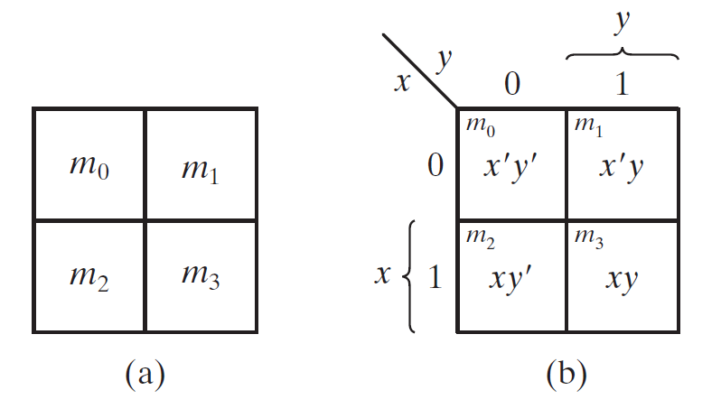
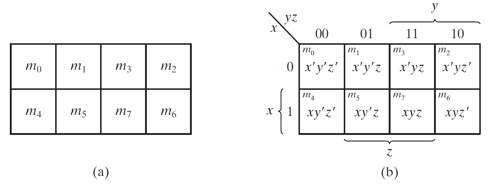
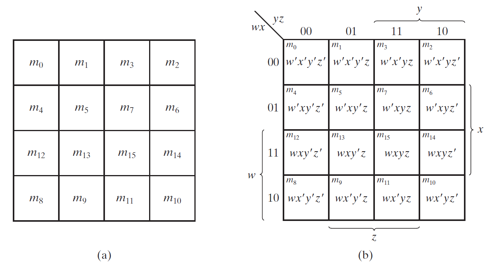
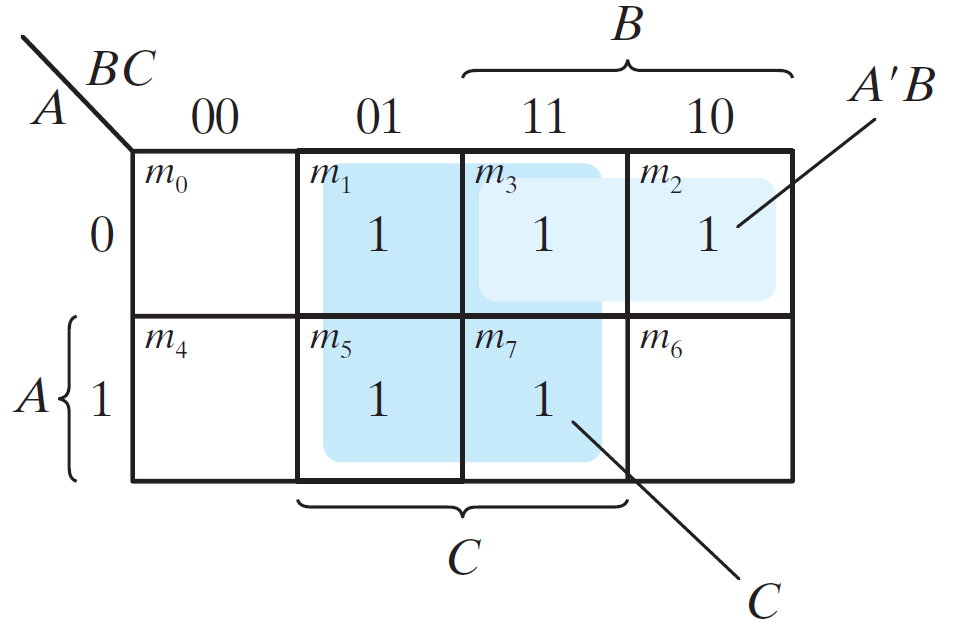
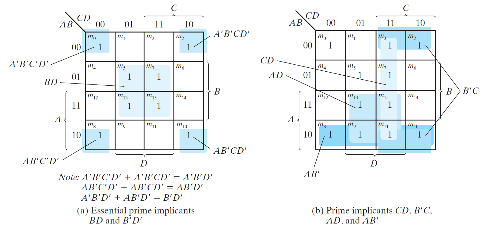
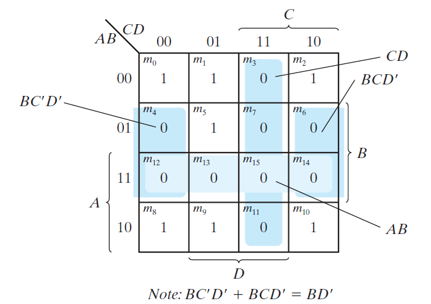
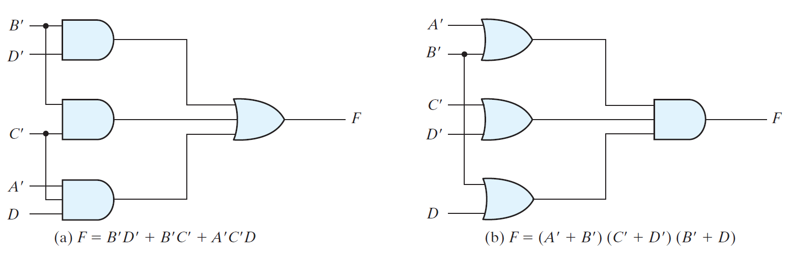
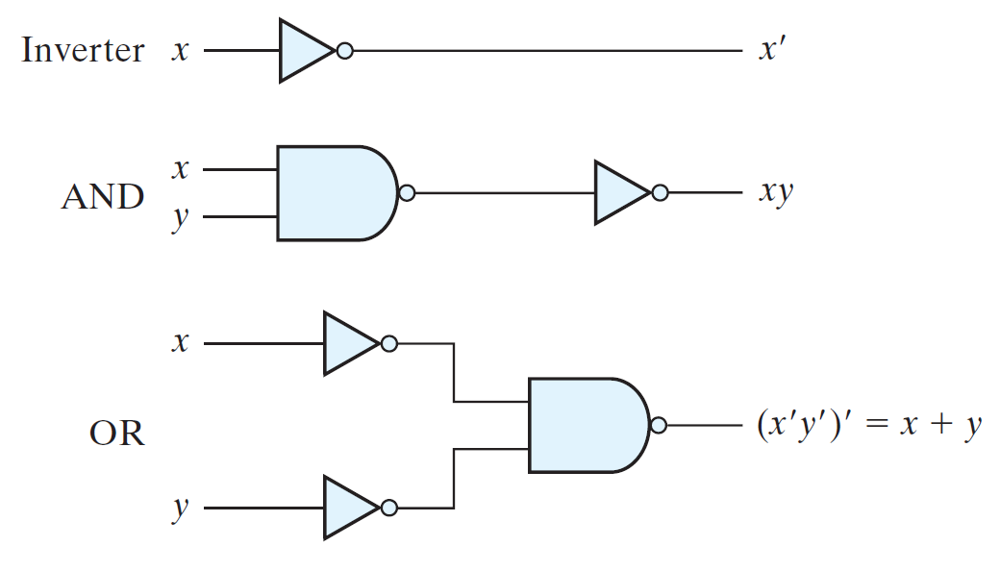
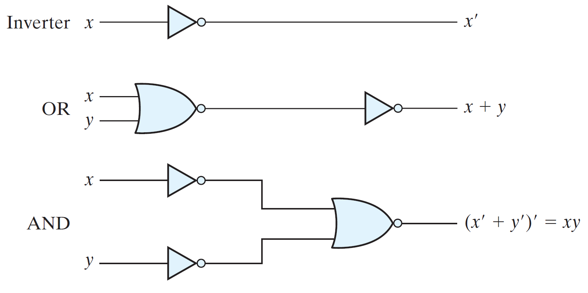

# Gate-Level Minimization
---

- [Gate-Level Minimization](#gate-level-minimization)
- [Introduction](#introduction)
- [The K-Map Method](#the-k-map-method)
  - [Two-Variable K-Map](#two-variable-k-map)
  - [Three-Variable K-Map](#three-variable-k-map)
  - [Four‐Variable K-Map](#fourvariable-k-map)
  - [Five-Variable K-Map](#five-variable-k-map)
  - [Minimizing with K-Map](#minimizing-with-k-map)
  - [Important points to note for K-Map method](#important-points-to-note-for-k-map-method)
    - [Prime Implicants](#prime-implicants)
- [Product‐of‐Sums Simplification](#productofsums-simplification)
- [Don't‐Care Conditions](#dontcare-conditions)
- [NAND and NOR Implementation](#nand-and-nor-implementation)
  - [NAND Circuits](#nand-circuits)
    - [Two-Level Implementation](#two-level-implementation)
  - [NOR Implementation](#nor-implementation)
    - [Two-Level Implementation](#two-level-implementation-1)
- [Exclusive‐OR Function](#exclusiveor-function)

---
# Introduction
Gate-level minimization is the design task of finding an optimal gate-level implementation of the Boolean functions describing a digital circuit.

- It is difficult to perform by manual methods for multi input logic.
- Computer-based logic synthesis tools can minimize a large set of Boolean equations efficiently and quickly.
- It is important that a designer understand the underlying mathematical description and solution of the problem.

---
# The K-Map Method

- Boolean expressions may be simplified by algebraic means.
- However, the map method provides a simple, straightforward & more efficient procedure for minimizing Boolean functions. 
- This method may be regarded as a pictorial form of a truth table. The map method is also known as the **Karnaugh map** or **K-map**.
- The map representation uses this basic property: "Any two adjacent(**only horizontal or vertical and not diagonal**) squares in the map differ by only one variable."

## Two-Variable K-Map
There are four minterms for two variables. Hence, the map consists of four squares, one for each minterm.

## Three-Variable K-Map
- There are eight minterms for three binary variables; therefore, the map consists of eight squares. 
- Note that the minterms are arranged, not in a binary sequence, but in a sequence similar to the Gray code.
- The characteristic of this sequence is that only one bit changes in value from one adjacent column to the next.

## Four‐Variable K-Map
- The K-Map for Boolean functions of four binary variables (w, x, y, z) as shown in the figure below have 16 minterms.
- The rows and columns are numbered in a Gray code sequence, with only one digit changing value between two adjacent rows or columns.

## Five-Variable K-Map
- Maps for more than four variables are more complex. A five-variable map needs 32 squares and a six-variable map needs 64 squares.
- When the number of variables becomes large, the number of squares becomes excessive and the geometry for combining adjacent squares becomes more involved.
- 
## Minimizing with K-Map
The procedure for minimizing a Boolean function with a K-map is explained below:
1. First, a "1" is marked in each minterm square that represents the function.
2. The next step is to find possible adjacent squares.
3. Add the minterms within the square.
   1. Any two minterms in adjacent squares (vertically or horizontally, but not diagonally) that are ORed together will cause a removal of the dissimilar variable.
4. Add the product terms from all possible squares.
5. The logical sum of the product terms gives the simplified expression.

Following example will explain the procedure for minimizing a Three-Variable Boolean function with a Three-Variable K-map.

* Sample question:
For the Boolean function F = A'C + A'B + AB'C + BC
(a) Express this function as a sum of minterms.
(b) Find the minimal sum-of-products expression.

* Answer:
  * The function can be expressed in sum-of-minterms form as
  F = A'C + A'B + AB'C + BC = $\Sigma(1, 2, 3, 5, 7)$
  * Final solution derived from the K-Map is:
  F = A'C + A'B + AB'C + BC = C + A'B

## Important points to note for K-Map method

- One square represents one minterm, giving a term with four literals.
- Two adjacent squares represent a term with three literals.
- Four adjacent squares represent a term with two literals.
- Eight adjacent squares represent a term with one literal.
- Sixteen adjacent squares produce a function that is always equal to 1.
- The result is minimized but may not be unique.

### Prime Implicants 

- In choosing adjacent squares in a map, we must ensure that:
  - All the minterms of the function are covered before we combine the squares.
  - The number of terms in the expression is minimized 
  - There are no redundant terms (i.e., minterms already
  covered by other terms).
- The group of combined minterms is referred to as an Implicant.
- A prime implicant is a product term obtained by combining the maximum possible number of adjacent squares in the map.
- The prime implicants of a function can be obtained from the map by combining all possible maximum numbers of squares.
- If a minterm in a square is covered by only one prime implicant, that prime implicant is said to be essential prime implicant.
- The following figure shows examples of Prime implicants:
  

---
# Product‐of‐Sums Simplification
- The minimized Boolean functions derived from the map in all previous examples were expressed in sum-of-products form. With a minor modification, the product-of-sums form can be obtained.
- We mark the empty squares by 0's and combine them
into valid adjacent squares.
- With this, we obtain a simplified sum-of-products expression of the complement of the function(F').
- The complement of F' gives us back the function
F in product-of-sums form (a consequence of DeMorgan's theorem).
- Following example shows the 2 representations of the same function.

* Consider a function, F (A, B, C, D) = $\Sigma(0, 1, 2, 5, 8, 9, 10)$

* Answer:
  * Combining the squares with 1's gives the simplified function in sum-of-products form: F = B'D' + B'C' + A'C'D
  * Combining the squares with 0's and applying DeMorgan's theorem gives the simplified function in product-of-sums form: F=(A'+B')(C'+D')(B'+D)

Hence, a function can be implemented in 2 ways:

1. With a group of AND gates, one for each AND term. The outputs of the AND gates are connected to a single OR gate. 

2. With a group of OR gates, one for each OR term. The outputs of the OR gates are connected to a single AND gate.

- Either configuration (sum-of-products or product-of-sums) forms two levels of gates.
- Hence, the implementation of a function in a standard form is said to be a two-level implementation.
- The two-level implementation may not be practical, depending on the number of inputs to the gates.

---
# Don't‐Care Conditions
- In some applications, function is not specified for certain combinations of the variables.
- Functions that have unspecified outputs for some input combinations are called incompletely specified functions.
- The unspecified minterms of a incompletely specified  function is known as **don't-care condition**.
- To distinguish the don't-care condition from 1's and 0's, an X is used.
- While evaluating the K-Map, the don't-care minterms may be assumed to be either 0 or 1.

---
# NAND and NOR Implementation

- Digital circuits are frequently constructed with NAND or NOR gates rather than with AND and OR gates. 
- NAND and NOR gates are easier to fabricate with electronic components and are the basic gates used in all IC digital logic families.
- Due to this, Boolean functions are converted from AND, OR, and NOT into equivalent NAND and NOR logic diagrams.

## NAND Circuits
The NAND gate is said to be a **universal gate** because any logic circuit can be implemented with it.

### Two-Level Implementation
The implementation of Boolean functions with NAND gates requires that the functions be in sum-of-products form. The implementation with AND and OR gates can easily be realized with the use of NAND gates only.

## NOR Implementation
- The NOR operation is the dual of the NAND operation.
- The NOR gate is another universal gate that can be used to implement any Boolean function.
- The complement operation is obtained from a one input NOR gate that behaves exactly like an inverter.
- The OR operation requires two NOR gates, and the AND operation is obtained with a NOR gate that has inverters in each input.

### Two-Level Implementation
A two-level implementation with NOR gates requires that the function be simplified into product-of-sums form. The implementation with AND and OR gates can easily be realized with the use of NOR gates only.

---
# Exclusive‐OR Function

The exclusive-OR (XOR), denoted by the symbol $\oplus$, is a logical operation that performs:
x $\oplus$ y = xy' + x'y

- The exclusive-OR signifies when both the inputs are not equal.

- XOR is useful in arithmetic operations and error detection and correction circuits.

---