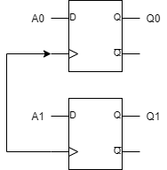
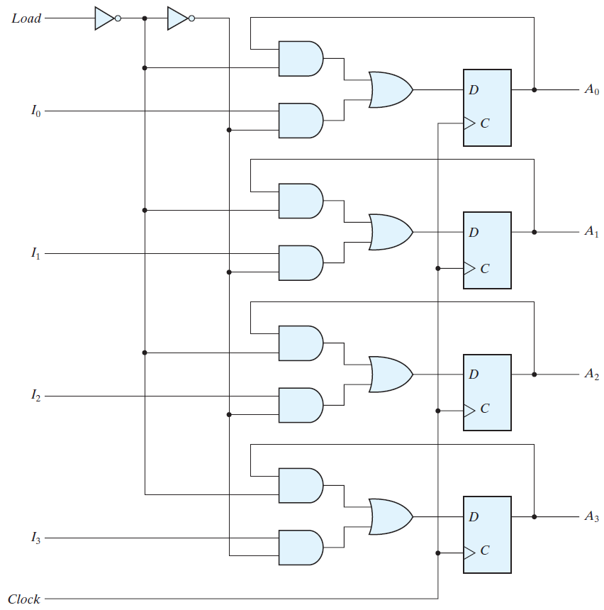
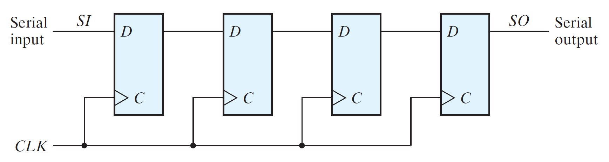
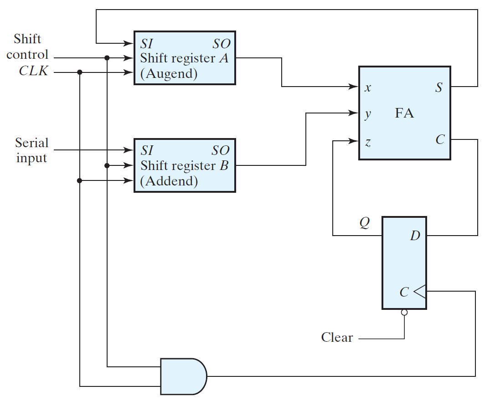
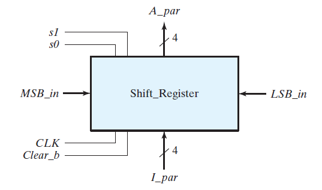
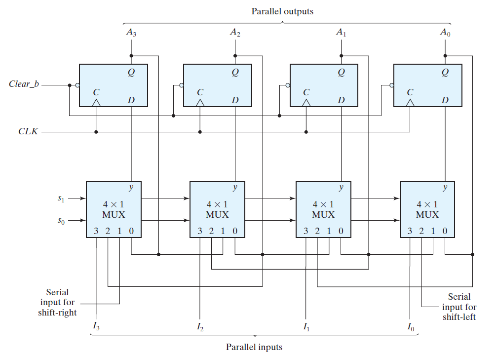
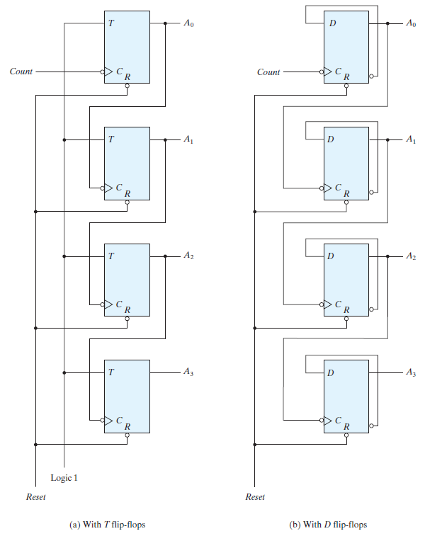
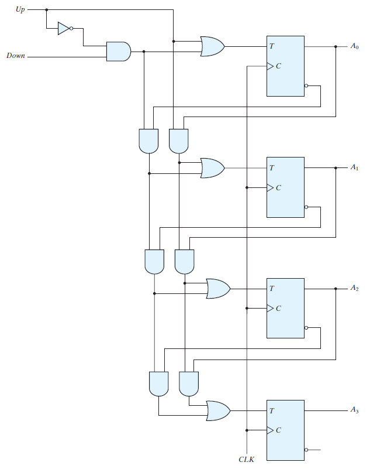

# Registers and Counters
- [Registers and Counters](#registers-and-counters)
- [Registers](#registers)
  - [Register with Parallel Load](#register-with-parallel-load)
- [Shift Registers](#shift-registers)
  - [Serial Transfer](#serial-transfer)
  - [Serial Addition](#serial-addition)
    - [Serial Adder](#serial-adder)
  - [Universal Shift Register](#universal-shift-register)
- [Ripple Counters](#ripple-counters)
  - [Ripple Counters](#ripple-counters-1)
    - [Binary Ripple Counter](#binary-ripple-counter)
  - [Synchronous Counters](#synchronous-counters)
    - [Binary Counter](#binary-counter)
    - [Up–Down Binary Counter](#updown-binary-counter)
  - [Other Counters](#other-counters)
- [HDL for Registers and Counters](#hdl-for-registers-and-counters)

---
# Registers

- A circuit with flip‐flops is considered a sequential circuit even in the absence of combinational gates.
- In the absence of flip‐flops, the circuit reduces to a purely combinational circuit. 
- Sequential circuit are usually classified by the function they perform. Two such circuits are:
  1. *Registers*: 
     - A *register* is a group of flip‐flops, each one of which shares a common clock and is capable of storing one bit of information.
     - An n‐bit register consists of a group of n flip‐flops capable of storing n bits of binary information.
  2. *Counters*: 
     - A *counter* is a register that goes through a predetermined sequence of binary states.

- The simplest register is one that consists of only flip‐flops, without any gates.

- The common clock triggers all flip‐flops on the positive edge of each pulse, and the binary data available at the four inputs are transferred into the register.
  
A simple two‐bit register using D flip‐flops:

## Register with Parallel Load
- Registers with parallel load are a fundamental building block in digital systems.
- Synchronous digital systems have a master clock generator that supplies a continuous train of clock pulses.
- The transfer of new information into a register is referred to as *loading* or *updating* the register.
- If all the bits of the register are loaded simultaneously with a common clock pulse, the loading is known as *parallel*.
- In a parallel register loading, to hold the contents of the register:
  1. The inputs must be held constant or 
  2. The clock must be inhibited from the circuit
- In both the cases, data or clock will be unavailable for other registers/ rest of the circuit.
- Gates are not inserted into the clock path because it produces uneven propagation delays between the master clock and the inputs of flip‐flops.
- To fully synchronize the system, we must ensure that all clock pulses arrive at the same time anywhere in the system, so that all flip‐flops trigger simultaneously.

> Hence, D inputs are used to control the operation of the register.

Four‐bit register with parallel load: 

- The additional gates implement a two‐channel mux whose output drives the input to the register with either the data bus or the output of the register.

---
# Shift Registers

A register capable of shifting the binary information held in each cell to its neighboring cell, in a selected direction, is called a *shift register*.

- The logical configuration of a shift register consists of a chain of flip‐flops in cascade. 
- The simplest possible shift register uses only flip‐flops, as shown below:

Four‐bit shift register

- Each clock pulse shifts the contents of the register one bit position to the right.
- The configuration does not support a left shift and is unidirectional.

## Serial Transfer
- The datapath of a digital system is said to operate in serial mode when information is transferred and manipulated one bit at a time.

- In the parallel mode, information is available from all bits of a register and all bits can be transferred simultaneously during one clock pulse.
- In the serial mode, the registers have a single serial input and a single serial output. The information is transferred one bit at a time while the registers are shifted in the same direction.
- The initial content of a register is shifted out
through its serial output and is lost unless it is transferred to another shift register.

## Serial Addition

- Operations in digital computers are usually done in parallel because that is a faster mode of operation. 
- Serial operations are slower because a datapath operation takes several clock cycles 
- Serial operations require fewer resources in hardware.

### Serial Adder

- The two binary numbers to be added serially are stored in two shift registers.
- The addition is accomplished by passing each pair of bits together with the previous carry through a single full‐adder circuit and transferring the sum, one bit at a time, into register A.
- The sum bit from the S output of the full adder could be transferred into a third shift register.
- It is possible to use one register for storing both the augend and the sum bits.
- The carry out of the full adder is transferred to a D flip‐flop, the output of which is then used as the carry input for the next pair of significant bits.

Serial adder:

- The parallel adder uses registers with a parallel load, whereas the serial adder uses shift registers.

- The number of full‐adder circuits in the parallel adder is equal to the number of bits in the binary numbers, whereas the serial adder requires only one full‐adder circuit and a carry flip‐flop.
- Excluding the registers, the parallel adder is a combinational circuit, whereas the serial adder is a sequential circuit.
- 

## Universal Shift Register

- If the flip‐flop outputs of a shift register are accessible, then information entered serially by shifting can be taken out in parallel from the outputs of the flip‐flops. 

- If a parallel load capability is added to a shift register, then data entered in parallel can be taken out in serial fashion by shifting the data stored in the register.

- The most general shift register has the following capabilities:
  1. A clear control to clear the register to 0.
  2. A clock input to synchronize the operations.
  3. A shift‐right control to enable the shift‐right operation.
  4. A shift‐left control to enable the shift‐left operation.
  5. A parallel‐load control to enable a parallel transfer and the n input lines associated with the parallel transfer.
  6. n parallel output lines.
  7. A control state that leaves the information in the register unchanged in response to the clock. 

- A register capable of shifting in both the directions is a _bidirectional_ shift register.

- If the register has both shifts and parallel‐load capabilities, it is referred to as a _universal shift register_.

The block diagram symbol and the circuit diagram of a four‐bit universal shift register is shown below: 

Block diagram:

Circuit diagram:

* $A_i$: Parallel outputs
* $I_i$: Parallel inputs
* MSB_in: data entering for a shift‐right operation 
* LSB_in: data entering for a shift‐left operation.
* Clear_b is an active‐low signal that clears all of the flip‐flops.
* S1, S0: The selection inputs which control the mode of operation of the register according to the following table:

s1 | s0 | Register Operation
---|----|-------------------
0 | 0 | No change
0 | 1 | Shift right
1 | 0 | Shift left
1 | 1 | Parallel load

1. s1s0 = 00:
   - The present value of the register is applied to the D inputs of the flip‐flops. Hence, the _output recirculates_ to the input in this mode.
2. s1s0 = 00:
   - Terminal 1 of the multiplexer inputs has a path to the D inputs of the flip‐flops. This causes a _shift‐right operation_.
3. s1s0 = 00:
   - Terminal 2 of the multiplexer inputs has a path to the D inputs of the flip‐flops. This causes a _shift‐left operation_.
4. s1s0 = 00:
   - the binary information on the parallel input lines is transferred into the register simultaneously during the next clock edge

> Shift registers are often used to interface digital systems situated remotely from each other.

---
# Ripple Counters

A register that goes through a prescribed sequence of states upon the application of input pulses is called a _counter_.

- The sequence of states may follow the binary number sequence or any other sequence of states.

- A counter that follows the binary number sequence is called a binary counter .

- An n-bit binary counter consists of 'n' flip‐flops and can count in binary from 0 through $2^{n}$ - 1.

- Counters are available in two categories: 
  1. Ripple counters
  2. Synchronous counters
   
## Ripple Counters
In a ripple counter, a flip‐flop output transition serves as a source for triggering other flip‐flops.

### Binary Ripple Counter
A binary ripple counter consists of a series connection of complementing flip‐flops, with the output of each flip‐flop connected to the C input of the next higher order flip‐flop.
- The flip‐flop holding the least significant bit receives the incoming count pulses.

- A complementing flip‐flop can be obtained:
  1. T flip‐flop
  2. D flip‐flop with the complement output connected to the D input.

- The output of each flip‐flop is connected to the C input of the next flip‐flop in sequence.
- The output of each flip‐flop is connected to the clk/control input of the next flip‐flop.
- All the flip‐flops are negative‐edge triggered.

Four‐bit binary ripple counter:

- A binary counter with a reverse count is called a _binary countdown counter_. In a countdown counter, the binary count is decremented by 1 with every input count pulse.

- A _binary countdown counter_ uses the same logic diagram of the binary ripple counter except all the flip‐flops trigger on the positive edge of the clock.

## Synchronous Counters
In _synchronous counters_, a common clock triggers all flip‐flops simultaneously, unlike in a ripple counter.

### Binary Counter

In a synchronous binary counter, the flip‐flop
in the least significant position is complemented with every pulse.
- A flip‐flop in any other position is complemented when all the bits in the lower significant positions are equal to 1.
- Synchronous binary counters have a regular pattern and can be constructed with complementing flip‐flops and gates.
- The _C inputs_ of all flip‐flops are connected to a common clock. 
- The counter is enabled by _Count_enable_.
- Binary counters are constructed most efficiently with T flip-flops because of their complement property.
- The counter can be extended to any number of stages, with each stage having an additional flip‐flop and an AND gate that gives an output of 1 if all previous flip‐flop outputs are 1.
- The flip‐flops trigger on the positive edge of the clock.
- The synchronous counter can be triggered with either the positive or the negative clock edge.

### Up–Down Binary Counter
A synchronous countdown binary counter goes through the binary states in reverse order and repeats the count.
- To achieve counting in the ascending manner, complemented output can be fed forward.
- These two operations can be combined in one circuit to form a counter capable of counting either up or down.
- The circuit of a Four‐bit up–down binary counter using T flip‐flops looks like this: 

It has an up control input and a down control input.
 1. Up = 1 & Down = 0: the circuit counts up.
 2. Up = 0 & Down = 1: the circuit counts down.
 3. Up = 0 & Down = 0: the circuit does not change state and remains in the same count.
 4. Up = 1 & Down = 1: the circuit counts up.

> Note that the up input has priority over the down input.

## Other Counters
- Counters can be designed to generate any desired sequence of states. 
- Counters are used to generate timing signals to control the sequence of operations in a digital system.
- Few common examples of nonbinary counters are:
  1. Counter with Unused States: A binary counter using fewer states than the maximum possible number of states.
  2. Ring Counter: A _ring counter_ is a circular shift register with only one flip‐flop being set at any particular time; all others are cleared.
  3. Johnson Counter: A k‐bit ring counter circulates a single bit among the flip‐flops to provide k distinguishable states.

---
# HDL for Registers and Counters

Revisit

---