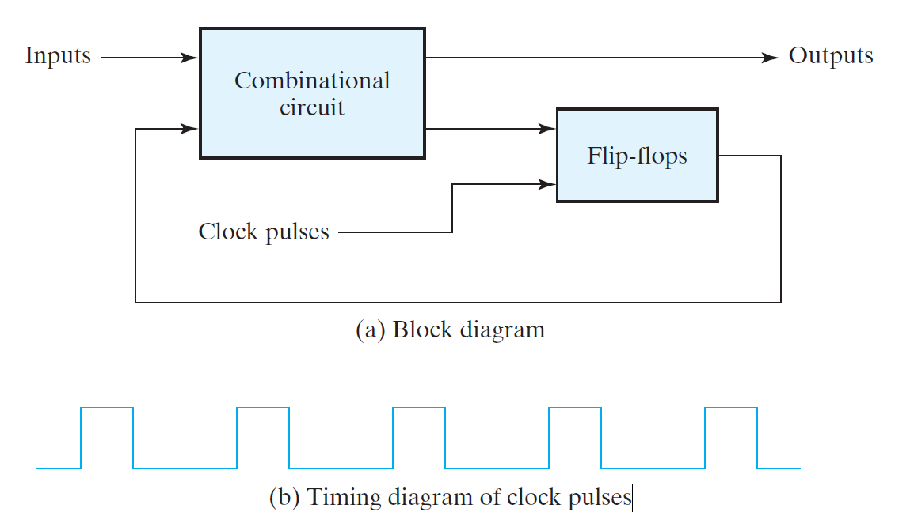

# Synchronous Sequential Logic 

- [Synchronous Sequential Logic](#synchronous-sequential-logic)
- [Introduction](#introduction)
- [Types of sequential circuits](#types-of-sequential-circuits)
- [Storage Elements: Latches](#storage-elements-latches)
- [SR Latch (Set Reset Latch)](#sr-latch-set-reset-latch)
- [SR latch with control input](#sr-latch-with-control-input)

---

# Introduction

A sequential circuit is specified by a time sequence of inputs, outputs, and internal states. It consists of a combinational circuit to which memory elements are connected to form a feedback path.

> Insert Figure 5.1 Block diagram of sequential circuit

- The storage elements are devices capable of storing binary information. 
- The binary information stored in the memory elements determines the "state" of the sequential circuit.
- The sequential circuits receive binary information from the external inputs that, together with the present state of the storage elements, determine the binary value of the outputs. 
- The next state of the storage elements is also a function of external inputs and the present state.

---

# Types of sequential circuits

-   Synchronous sequential circuits: Circuits whose behavior can be defined from the knowledge of it's signals at discrete instances of time.

-   Asynchronous sequential circuits: Circuits whose behavior depends on the input signals at any instance of time and the order in which the input changes.

In synchronous sequential circuits, synchronization is achieved by a
timing device called as *clock generator*, which provides a periodic
signal in the form of train of *clock pulses*. The clock signal is
commonly denoted by the identifiers ***clock*** or ***clk***. The clock
pulses are distributed throughout the system.

Synchronous sequential circuits, that use clock pulses to control
storage elements are called *clocked sequential circuits*. The storage
elements (memory) used in clocked sequential circuits are called
Flip-Flops. A Flip-Flop is a binary storage device capable of storing
one bit of information.

Insert fig 5.2 synchronous sequential circuits

A storage element in a digital circuit can maintain a binary state
indefinitely (as long as power is delivered to the circuit), until
directed by an input signal to switch states.

---

# Storage Elements: Latches

Storage elements that operate with signal levels (rather than signal
transitions) are referred to as ***latches*** & those controlled by a
clock transition are ***flip-flops***. Latches are said to be level
sensitive devices; flip-flops are edge-sensitive devices. The two types
of storage elements are related because latches are the basic circuits
from which all flip-flops are constructed.

#---

# SR Latch (Set Reset Latch)

The SR latch is a circuit with two cross-coupled NOR gates or two
cross-coupled NAND gates, and two inputs labeled for set(S) and
reset(R). The latch has two useful states. When output is tied high, the
latch is said to be in the set state. When output is tied low, the latch
is said to be in the reset state. Outputs Q and Q' are normally the
complement of each other.

Insert Figure 5.3 5.4 SR Latch implementation with NOR gates and NAND
gates.

SR latch with two cross-coupled NOR gates:

-   Setting both inputs to 1 is forbidden as it might lead to
    unpredictable/ \"metastable\" state.

-   When both inputs are equal to 1 at the same time, a condition in
    which both outputs are equal to 0 (rather than be mutually
    complementary) occurs.

-   If both inputs are then switched to 0 simultaneously, the device
    will enter an unpredictable or undefined state or a metastable
    state.

-   When inputs are applied, the resulting (next) state is a function of
    inputs as well as present state of the latch.

##---

# SR latch with control input

The operation of the basic SR latch can be modified by providing an
additional control input signal that controls when the state of the
latch can be changed by determining whether S and R (or S' and R') can
affect the circuit.

The control input \"En\" acts as an enable signal for the other two
inputs. The outputs of the NAND gates stay at the logic-1 level as long
as the enable signal remains at 0. This is the quiescent condition for
the SR latch. When the enable input goes to 1, information from the S or
R input is allowed to affect the latch. The

Insert FIGURE 5.5 SR latch with control input

