# Synchronous Sequential Logic 

----

# Introduction

A sequential circuit is specified by a time sequence of inputs, outputs, and internal states. It consists of a combinational circuit to which memory elements are connected to form a feedback path.

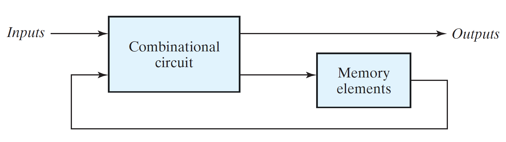

- The storage elements are devices capable of storing binary information. 
- The binary information stored in the memory elements determines the "state" of the sequential circuit.
- The sequential circuits receive binary information from the external inputs that, together with the present state of the storage elements, determine the binary value of the outputs. 
- The next state of the storage elements is also a function of external inputs and the present state.

----

# Types of sequential circuits

- **Synchronous sequential circuits**: Circuits whose behavior can be defined from the knowledge of it's signals at discrete instances of time.

- **Asynchronous sequential circuits**: Circuits whose behavior depends on the input signals at any instance of time and the order in which the input changes.

In synchronous sequential circuits, synchronization is achieved by a timing device called as *clock generator*, which provides a periodic signal in the form of train of *clock pulses*. The clock signal is commonly denoted by the identifiers ***clock*** or ***clk***. The clock pulses are distributed throughout the system.

- A clock pulse goes through two transitions: 
  - from 0 to 1 
  - from 1 to 0. 
- The 0 to 1 transition is defined as the positive edge and the 1 to 0 transition as the negative edge.

Synchronous sequential circuits, that use clock pulses to control storage elements are called *clocked sequential circuits*. The storage elements (memory) used in clocked sequential circuits are called Flip-Flops. A Flip-Flop is a binary storage device capable of storing one bit of information.

A storage element in a digital circuit can maintain a binary state indefinitely (as long as power is delivered to the circuit), until directed by an input signal to switch states.

----

# Storage Elements: Latches

Storage elements that operate with signal levels (rather than signal transitions) are referred to as ***latches*** & those controlled by a clock transition are ***flip-flops***. 
- Latches are said to be level sensitive devices; flip-flops are edge-sensitive devices. 
- The two types of storage elements are related because latches are the basic circuits from which all flip-flops are constructed.

## SR Latch (Set Reset Latch)

The SR latch is a circuit with either two cross-coupled NOR gates or two cross-coupled NAND gates, and two inputs labeled for set(S) and reset(R).
- The SR latch has two useful states:
  - **Set state:** When output is tied high, the latch is said to be in the set state. 
  - **Reset state:** When output is tied low, the latch is said to be in the reset state.
- Outputs Q and Q' are normally the complement of each other.

- Setting both inputs to 1 is forbidden as it might lead to unpredictable/ "metastable" state in a SR Latch with NOR gates.

- When both inputs are equal to 1 at the same time, a condition in which both outputs are equal to 0 (rather than be mutually complementary) occurs.
  
SR Latch implementation with two cross-coupled NOR gates:
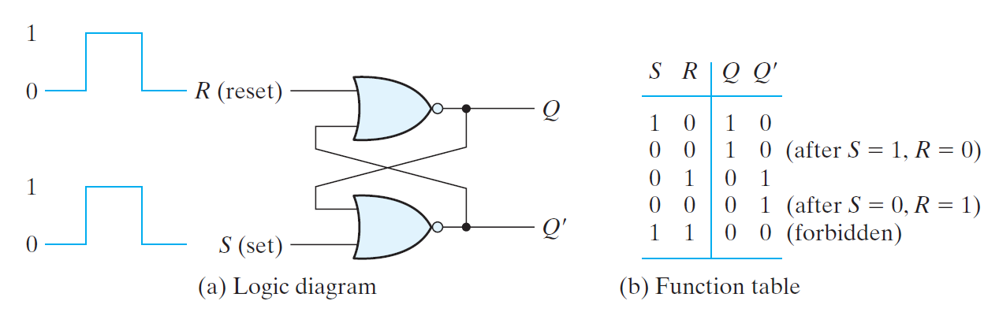

SR Latch implementation with two cross-coupled NAND gates:
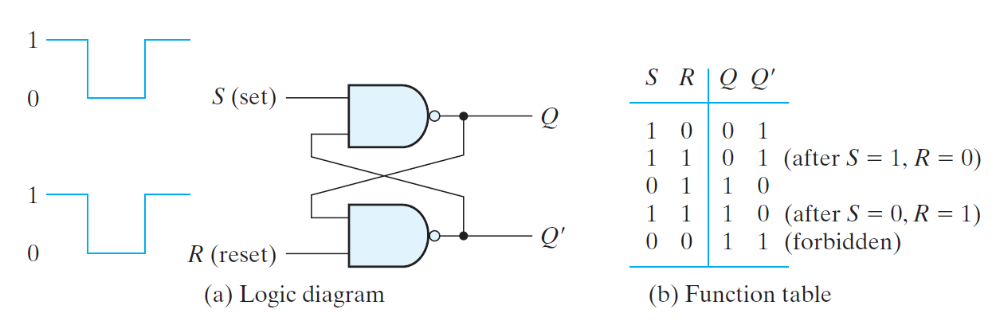

- In SR Latch witn NAND implementation, (0,0) is the forbidden output for the same reason.
  
## SR latch with control input

The operation of the basic SR latch can be modified with an additional control input signal **"*En*"**.
- Only when *"En"* goes low, information from the S or R input is allowed to affect the latch.
- The control input *"En"* acts as an enable signal for the other two inputs.
- *"En"* in turn, controls the state of the latch as well.
- An indeterminate condition occurs when all three inputs are equal to 1.

SR latch with control input:
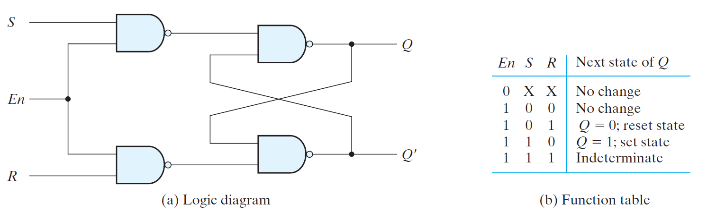

## D (Transparent) latch
To eliminate the metastable condition of the SR latch, the inputs S and R should never be high at the same time. This is done in the D latch.

- D latch has only two inputs: D (data) and En (enable).
- D signal goes to the S input.
- D complement goes to the R input.
- The output follows changes in the data input as long as the enable input is asserted.

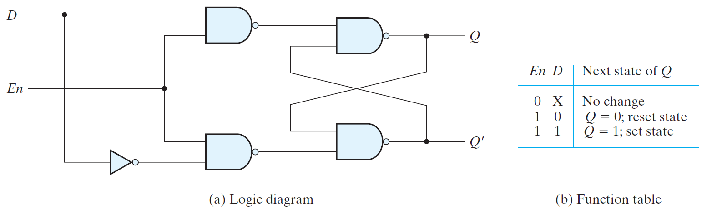

----

# Storage Elements: flip-flops

- In sequential circuit, outputs are connected to the inputs of the storage element through the combinational circuit.
- The state transitions of the latches start as soon as the control signal becomes high.
- If the inputs of the latches change while the control signal is high, the latches will respond to new values and a new output state may occur.
- Hence the state of the latches may keep changing for as long as the control signal is high.

Clock response in latch and flip-flop:
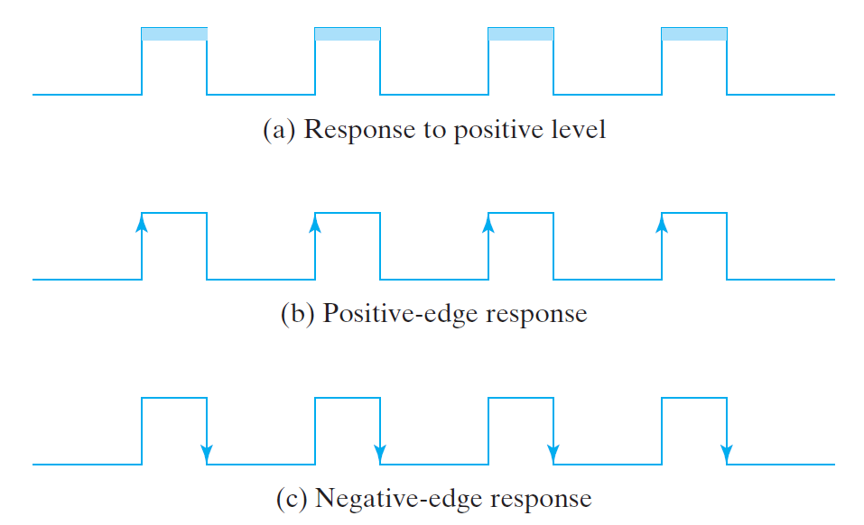

- The latch responds to a change in the level of a clock pulse whereas, a flip-flop triggers only during a signal transition.
- There are two ways to transform a latch into a flip-flop: 
  1. Employ two latches in a special configuration that isolates the output from the input changes. 
  2. A latch that triggers only during both transitions of the control signal and is disabled during the rest of the clock pulse.

> - In flip-flops, the control signal is a continuous train of pulses and is often referred to as **clk**.
> - In VLSI, the most economical and efficient flip-flop constructed is the edge-triggered D flipflop, as it uses the smallest number of gates. 
> - Two flip-flops less widely used in the design of digital systems are the JK and T flip-flops.

## Edge-Triggered D Flip-Flop
A D flip-flop is constructed with two D latches and an inverter.
- The first latch is called the master and the second the slave.
- The circuit samples the D input and changes its output Q only at the negative edge of the **clk**.

Master–slave D flip-flop:
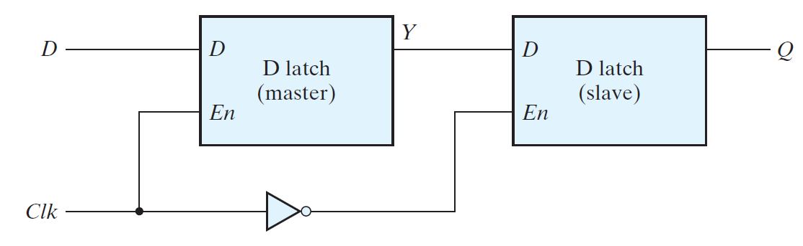

- Configuration 1: 
  - Clk = 0, clk'(slave clk) = 1
  - Slave latch is enabled & master latch is disabled
  - Y --> Q
  - Y will not change after 1 to 0 clock transition 
  - Hence, Q will also be constant for the whole pulse.

- Configuration 2: 
  - Clk = 1, clk'(slave clk) = 0
  - Slave latch is disabled & master latch is enabled
  - D --> Y
  - D will not change after 0 to 1 clock transition 
  - Hence, Y will also be constant for the whole pulse.

> Effectively, as disabled latches act as a buffer and a change in the output of the flip-flop can be triggered only by and during the transition of the clock from 1 to 0.

Another construction of an edge-triggered D flip-flop uses three SR latches as shown below:

D -type positive-edge-triggered flip-flop
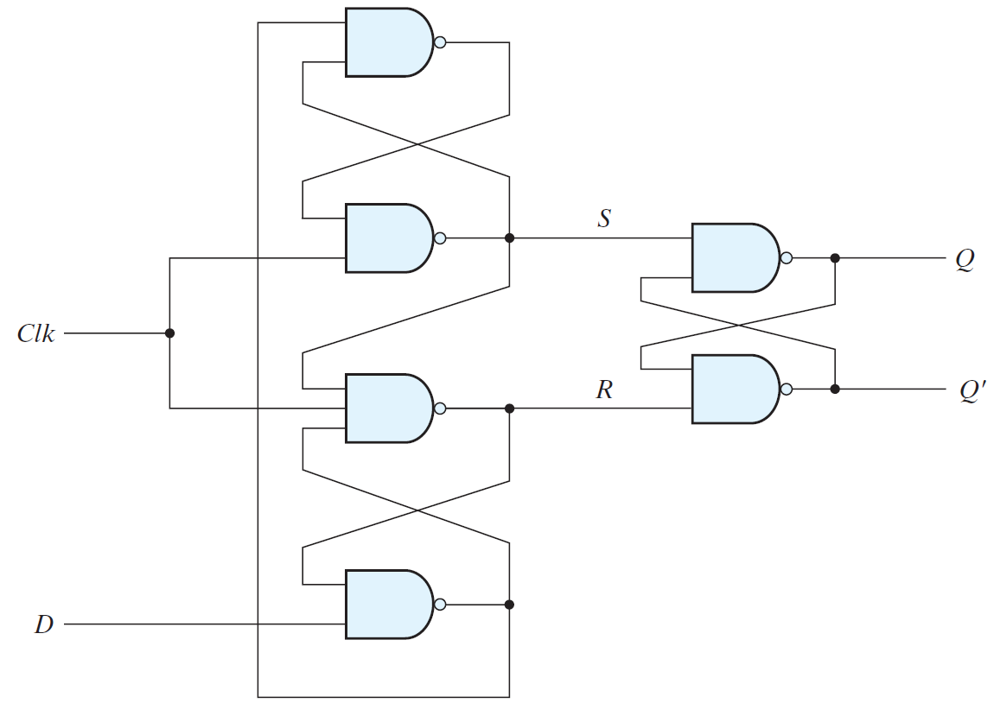

- Two latches respond to the external D (data) and Clk (clock) inputs.
- The third latch provides the outputs for the flip-flop.

### Flip-flop timing
- Minimum time during which the input must not change prior to the clock transition is called as **setup time.** 
- Minimum time during which the input must not change after the clock transition is called as **hold time.** 
- The propagation delay time of the flip-flop is defined as the interval between the trigger edge and the stabilization of the output to a new state.

## JK flip-flop

There are three operations that can be performed with a flip-flop: 
1. Set
2. Reset
3. Complement its output.
 
Synchronized by a clock signal, the JK flip-flop has two inputs and performs all three operations.
1. J = 1, K = 0, sets the flip-flop 
2. J = 0, K = 1, resets the flip-flop 
3. J = K = 1, the output is complemented.
3. J = K = 0, the output is unchanged.

JK flip-flop can be constructed with a D flip-flop and gates:
> D = JQ' + K'Q

JK flip-flop:
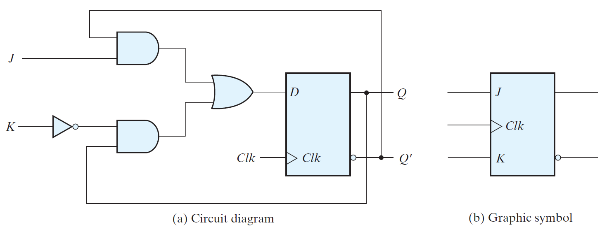

## T flip-flop
The T (toggle) flip-flop is a complementing flip-flop and can be obtained from a JK flip-flop when inputs J and K are tied together.

1. T = 1 (J = K = 1), the output is complemented.
2. T = 0 (J = K = 0), the output is unchanged.

The T flip-flop can be constructed with a D flip-flop and an XOR gate:
> D = T$\oplus$Q = TQ' + T'Q

T flip-flop:
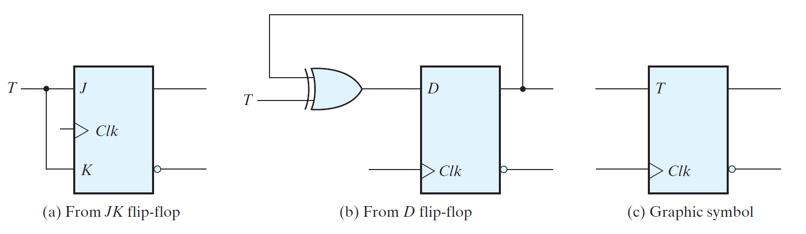

## Characteristic Tables
- A characteristic table defines the logical properties of a flip-flop by describing its operation in tabular form.
- They define the next state $Q(t+1)$ as a function of the inputs $(D/T/J,K)$ and the present state $Q(t)$.

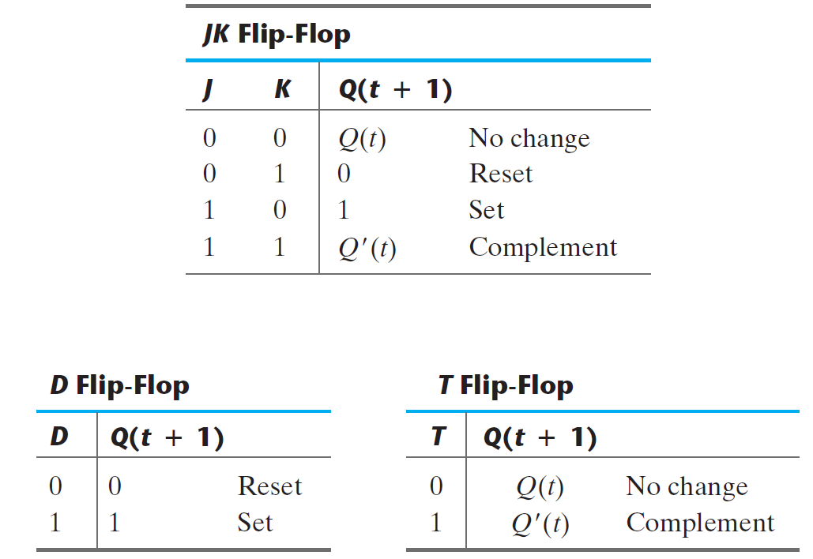

## Characteristic Equations
The logical properties of a flip-flop, as described in the characteristic table, can be expressed algebraically with a characteristic equation. 

1. D flip-flop: $Q(t + 1) = D$
2. JK flip-flop: $Q(t + 1) = JQ' + K'Q$
3. T flip-flop: $Q(t + 1) = T $$\oplus$$ Q = TQ' + T'Q$

## Direct Inputs
Some flip-flops have asynchronous inputs that are used to force the flip-flop to a particular state independently of the clock.

- The input that sets the flip-flop to 1 is called **preset** or **direct set**.
- The input that clears the flip-flop to 0 is called **clear** or **direct reset**.

D flip-flop with asynchronous reset:
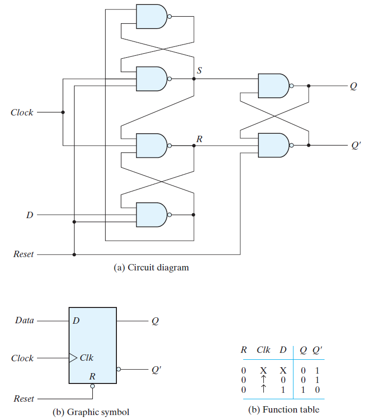

---

# Analysis of Clocked Sequential Circuits

- The behavior of a clocked sequential circuit is determined from the inputs, the outputs, and the state of its flip-flops.
- The outputs and the next state are both a function of the inputs and the present state.
- The analysis of a sequential circuit consists of obtaining a table or a diagram for the time sequence of inputs, outputs, and internal states.
- A state table and state diagram are then presented to describe the behavior of the sequential circuit.

## State Equations
A **state equation** (or *transition equation*) specifies the next state as a function of the present state and inputs.

## State Table
The time sequence of inputs, outputs, and flip-flop states can be enumerated in a **state table** (or *transition table*).

- The table consists of four sections labeled present state, input, next state, and output.
  -  present state: states of flip-flops at any given time t
  -  input: value of input signal for each possible present state
  -  next state: states of the flip-flops one clock cycle later ($t+1$)
  -  output: value of output signal at time t for each present state and input condition.
- The derivation of a state table requires listing all possible binary combinations of present states and inputs.
- The next-state values are then determined from the logic diagram or from the state equations.

A sample State Table & State diagram:
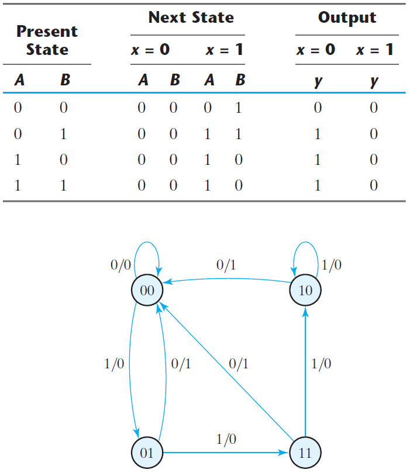

## State Diagram

The information available in a state table can be represented graphically in the form of a state diagram.

- State is represented by a circle
- The binary number inside each circle identifies the
state of the flip-flops.
- Transitions of states are indicated by directed lines connecting states
- The directed lines are labeled with two binary numbers separated by a slash.
  - Number before the slash: input during the present state
  - Number after the slash: output during the present state with the given input.

The following steps are followed during the analysis of clocked sequential circuits:

> Circuit diagram $\rightarrow$ Equations $\rightarrow$ State table $\rightarrow$ State diagram 

This sequence of steps begins with a structural representation of the circuit and proceeds to an abstract representation of its behavior.

## Flip-Flop Input Equations

- The logic diagram of a sequential circuit consists of flip-flops and gates.
- Logic diagram of the sequential circuit requires:
  - type of flip-flops
  - list of the Boolean expressions of the combinational circuit
- The part of the combinational circuit that generates external outputs is described algebraically by a set of Boolean functions called **output equations**.
- The part of the circuit that generates the inputs to flip-flops is described algebraically by a set of Boolean functions called flip-flop **input equations** (or *excitation equations*).

## Mealy and Moore Models of Finite State Machines
The most general model of a sequential circuit has inputs, outputs, and internal states. 

There are two models of representing sequential circuits: 
  1. Mealy model
  2. Moore model

Block diagrams of Mealy and Moore state machines: 
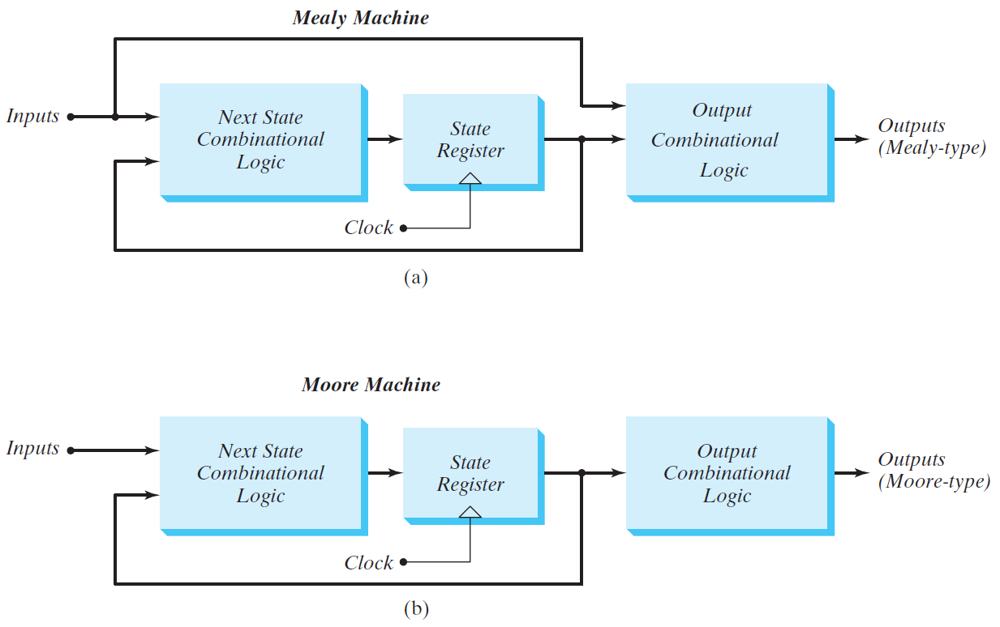

- These two models of a sequential circuit are commonly referred to as a ***Finite State Machine***, abbreviated **FSM**.

> They differ only in the way the output is generated.

Examples of Mealy & Moore State Machines:

Mealy State Machine        |  Moore State Machine 
:-------------------------:|:-------------------------:
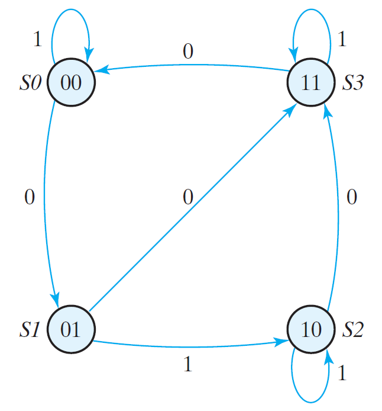   |  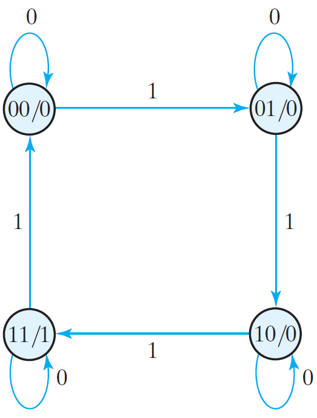

### Mealy model
- In mealy model, the output is a function of both the present state and the input. 
- The Mealy model of a sequential circuit is referred to as a *Mealy FSM* or *Mealy machine*.
- the output of the Mealy machine is the value that is present immediately before the active edge of the clock.

### Moore model
- In the Moore model, the output is a function of only the present state. A circuit may have both types of outputs.
- The Moore model is referred to as a *Moore FSM* or *Moore machine*.
- The outputs of the sequential circuit are synchronized with the clock, because they depend only on flip-flop outputs that are synchronized with the clock.

---

# State Reduction and Assignment

- The *analysis* of sequential circuits starts from a circuit diagram and culminates in a state table or diagram. 
- The *design* (synthesis) of a sequential circuit starts from a set of specifications and culminates in a logic diagram.
- The goal here is to simplify a design by reducing the number of gates and flip-flops it uses.

## State Reduction
- The reduction in the number of flip-flops in a sequential circuit is referred to as the *state-reduction* problem.
 
- It is more convenient to apply procedures for state reduction with the use of a table rather than a diagram.
- Algorithm for the state reduction of a completely specified state table:
> Two states are said to be equivalent if, for each member of the set of inputs, they give exactly the same output and send the circuit either to the same state or to an equivalent state.
- When two states are equivalent, one of them can be removed without altering the input–output relationships.

## State Assignment
- In order to design a sequential circuit with physical components, it is necessary to assign unique coded binary values to the states.
- For a circuit with 'm' states, the codes must contain 'n' bits, where 2n $\geq$ m. For example, n = 3, codes = 000 - 111.
- Unused states are treated as don't-care conditions during the design.
- Types of state assignments:
  - binary numbers
  - decimal equivalents
  - Gray code
  - one-hot assignment
- The deciding factors of the assignments:
  - simplicity of the design
  - decoding logic
  - silicon area
  - speed
  - efficiency

---

# Design Procedure

- Design procedures or methodologies specify hardware that will implement a desired behavior.
- The design effort for small circuits may be manual, but industry relies on automated synthesis tools for designing massive integrated circuits. 
- The sequential building block used by synthesis tools is the D flip-flop.
- Together with additional logic, it can implement the behavior of JK and T flip-flops.
- The first step in the design of sequential circuits is to obtain a state table or a state diagram.
- The number of flip-flops is determined from the number of states needed in the circuit and the choice of state assignment codes.
- The combinational circuit is derived from the state table by evaluating the flip-flop input equations and output equations.

The procedure for designing synchronous sequential circuits comprises of the following steps:
1. From the word description and specifications of the desired operation, derive a state diagram for the circuit.
2. Reduce the number of states if necessary.
3. Assign binary values to the states.
4. Obtain the binary-coded state table.
5. Choose the type of flip-flops to be used.
6. Derive the simplified flip-flop input equations and output equations.
7. Draw the logic diagram.

- The part of the design that follows a well-defined procedure is referred to as synthesis.
- Designers using logic synthesis tools (software) can follow a simplified process that develops an HDL description directly from a state diagram, letting the synthesis tool determine the circuit elements and structure that implement the description.

---