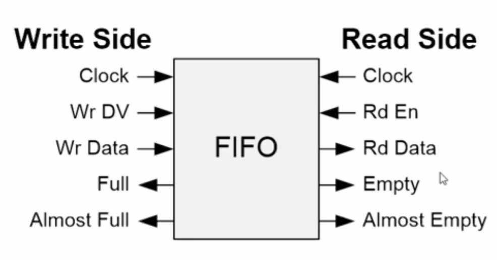

# Clock Domain Crossing(CDC)

Clock domain refers to all sequential logic (Flip-Flops, RAMs) that run
at one clock frequency. Occasionally multiple clock domains are needed
in an FPGA. One needs to be careful while crossing this boundary. The
main reason is setup an hold times cannot be guaranteed across clock
boundaries. With that, one might lose/corrupt data, or face timing
errors.\
Whenever crossing clock domains, one should be concerned about creating
a metastable condition. In general, it's a good idea to use a primitive
that is capable of crossing clock domains, such as a Block RAM. Unless
one is careful with the register logic and create timing constraints
that tell the tools about the exact functionality. Additionally, thr
data storage element should be deep enough to cross between the clock
domains without losing data.

## Basic definitions

-   Clock is a signal oscillates between a high and a low state (an
    analog square wave) and is used like a metronome to coordinate
    actions of digital circuits.

-   Rise time refers to the time a clock takes for the rising edge of a
    pulse to rise from its minimum(10%) to its maximum(90%) value.

-   Fall time refers to the time a clock takes for the falling edge of a
    pulse to fall from its maximum(90%) to minimum(10%) its value.

-   Settling time is the time required for an output to reach and remain
    within a given error band following some input stimulus.

-   Low-to-High-level output (tPLH)

-   High-to-Low-level output (tPHL)

Questions Kumar KJ video\
[VIDEO shared by
Ashwini](https://web.microsoftstream.com/video/e25c7905-a2b7-4a78-a2f2-cbddc09c7e5d?channelId=eaf91042-11bc-4238-8425-dea0e029582d)

## Asynchronous Clocks

**Two clocks are called asynchronous if they have do not originate from
same clock source and differ in polarity, phase.**

## Basic definitions for CDC

### Setup Time

**Setup time** is the amount of time required for the input of a
Flip-Flop to be stable before the clock edge comes along.

### Hold Time

**Hold time** is the amount of time required for the input of a
Flip-Flop to be stable after the clock edge comes along.

### Metastability

**Metastability** refers to signals that do not assume stable 0 or 1
states for some duration of time at some point during normal operation
of a design. In a multi-clock design, metastability cannot be avoided
but the detrimental effects of metastability can be neutralized. In
other words, **Metastability** is a phenomenon that can cause a system
failure in digital devices, including FPGAs, when a signal is
transferred between circuitry in unrelated or asynchronous clock
domains. There's an uncertainty in the logic state of the input data
during Metastability condition.

A synchronization failure occurs when a signal generated in one clock
domain is sampled too close to the rising edge of a clock signal from a
second clock domain. Synchronization failure is caused by an output
going metastable and not converging to a legal stable state by the time
the output must be sampled again.

### Why is metastability a problem?

A metastable output that traverses additional logic in the receiving
clock domain can cause illegal signal values to be propagated throughout
the rest of the design.\
Since the CDC signal can fluctuate for some period of time, the input
logic in the receiving clock domain might recognize the logic level of
the fluctuating signal to be different values and hence propagate
erroneous signals into the receiving clock domain.

Every Flip-Flop that is used in any design has a specified setup and
hold time.

### Synchronizers

A synchronizer is a device that samples an asynchronous signal and
outputs a version of the signal that has transitions synchronized to a
local or sample clock.

There are two scenarios that are possible when passing signals across
CDC boundaries:

-   It is permitted to miss samples that are passed between clock
    domains. Sometimes it is not necessary to sample every value, but it
    is important that the sampled values are accurate. Ex. gray code
    counters.

-   Every signal passed between clock domains must be sampled. A CDC
    signal must be properly recognized or acknowledged before a change
    is permitted on the CDC signal.

In both of these scenarios, the CDC signals will require some form of
synchronization into the receiving clock domain.

### Two Flip-Flop synchronizer

The simplest and most common synchronizer used by digital designers is a
two-Flip-Flop synchronizer. The first Flip-Flop samples the asynchronous
input signal into the new clock domain and waits for a full clock cycle
to permit any metastability on the stage-1 output signal to decay, then
the stage-1 signal is sampled by the same clock into a second stage
Flip-Flop, with the intended goal that the stage-2 signal is now a
stable and valid signal synchronized and ready for distribution within
the new clock domain. Both the Flip-Flops run on the destination clock.

### Mean Time Before Failure (MTBF)

It is theoretically possible for the stage-1 signal to still be
sufficiently metastable by the time the signal is clocked into the
second stage to cause the stage-2 output signal to also go metastable.
Mean time between synchronization failures (MTBF) Definition.

The calculation of the probability of the (MTBF) depends on:

-   clock frequencies of the input

-   clock the synchronizing Flip-Flops

-   the sample clock frequency (how fast are signals being sampled into
    the receiving clock domain) and

-   the data change frequency (how fast is the data changing that
    crosses the CDC boundary)

For most synchronization applications, the two Flip-Flop synchronizer is
sufficient to remove all likely metastability.

It is important to run a calculation of the MTBF for any signal crossing
a CDC boundary. Failure in this case means that the signal passed to a
synchronizing Flip-Flop, goes metastable on the first stage synchronizer
Flip-Flop, and continues to be metastable one cycle later when it is
sampled into the second stage synchronizer Flip-Flop.

Since the signal did not settle to a known value after one clock cycle,
the signal could still be metastable when sampled and passed to the
receiving clock domain, causing potential failures to the corresponding
logic.

Larger MTBF numbers indicate longer periods of time between potential
failures, while smaller MTBF numbers indicate that metastability could
happen frequently, similarly causing failures within the design.

$$MTBF = 1/(f_{clk} * f_{data} * X )$$

where,\
X = other factors,\
$f_{clk}$ : Synchronizing clock frequency,\
$f_{data}$ : Data changing frequency.

Failures occur more frequently in designs with higher speeds, or when
the sampled data changes are more frequent.

### Three Flip-Flop synchronizer

For some very high speed designs, the MTBF of a two-flop synchronizer is
too short and a third flop is added to increase the MTBF to a
satisfactory duration of time.

Synchronizing signals from the sending clock domain is necessary. Also,
synchronizing signals into the receiving clock domain is necessary
before being passed to a CDC boundary.

The synchronization of signals from the sending clock domain reduces the
number of edges that can be sampled in the receiving clock domain,
effectively reducing the data-change frequency and hence, increasing
MTBF.

## Synchronizing fast signals into slow clock domains

One issue associated with synchronizers is the possibility that a signal
from a sending clock domain might change values twice before it can be
sampled, or might be too close to the sampling edges of a slower clock
domain.\
When missed samples are not allowed, there are two general approaches to
the problem:

-   An open-loop solution to ensure that signals are captured without
    acknowledgment.

-   A closed-loop solution that requires acknowledgement of receipt of
    the signal that crosses a CDC boundary.

### The \"three edge\" guideline

According to Mark Litterick, when passing one CDC signal between clock
domains through a two-flip-flop synchronizer, the CDC signal must be
wider than 1.5 times the cycle width of the receiving domain clock
period.\

**\"Input data values must be stable for three destination clock
edges.\"**

The \"three edge\" requirement actually applies to both open-loop and
closed-loop solutions, but the closed-loop solution implementations
already follow the requirement.

Issues while sending fast signals into slow clock domains:

-   The CDC signal could have a transition between the rising edges of a
    slower clock and will not be captured into the slower clock domain.

-   The CDC signal that is slightly wider than the period of the
    receiving clock frequency might change too close to the two rising
    clock edges of the receiving clock domain making setup and hold
    violations.

### Open loop solution

There is a requirement for reliable signal passing between clock
domains. One solution to resolve this issue is to use a faster clock
domain frequency 1.5 times (or more) than that of the slower clock
domain frequency.\
Since the faster clock signal might sample the slower clock domain
signal one or more times.\
This solution can be used when relative clock frequencies are fixed and
properly analyzed.

#### Advantage

The open loop solution is the fastest way to pass signals across CDC
Boundaries that does not require acknowledgement of the received
signals.

#### Disadvantage

Another engineer might mistake the solution for a general purpose
solution, or the design requirements might change and an engineer might
fail to reanalyze the original open loop solution. This problem can be
minimized by adding a SystemVerilog Assertion to the model to detect if
the input pulse ever fails to exceed the \"three edges\" design
requirement.

### Closed loop solution

In closed loop solution, will send an enabling control signal and
synchronize it into the new clock domain and then pass the synchronized
signal back through another synchronizer to the sending clock domain as
acknowledge signal.

The closed loop solution is a more general solution and can be used in a
variety of designs in contrast to open loop solution.

#### Advantage

Synchronizing a feedback signal is a very safe technique to acknowledge
that the first control signal was recognized and sampled into the new
clock domain.

#### Disadvantage

There is potentially considerable delay associated with synchronizing
control signals in both directions before allowing the control signal to
change.

## Passing multiple signals between clock domains

A frequent mistake made by engineers when working on multi-clock designs
is passing multiple CDC bits required in the same transaction from one
clock domain to another and overlooking the importance of the
synchronized sampling of the CDC bits.

The problem is that multiple signals that are synchronized to one clock
will experience small data changing skews that can occasionally be
sampled on different rising clock edges in a second clock domain.
Multi-bit CDC strategies must be employed to avoid skewed sampling of
the multi-bit value.

### Multi-bit CDC strategies

There are 3 main categories of the multi-bit CDC strategies.

-   Multi-bit signal consolidation

-   Multi-cycle path formulations

-   Passing multiple CDC bits using gray codes

### Multi-bit signal consolidation

Where possible, consolidate multiple CDC signals into a 1bit CDC signal.
If the order or alignment of the control signals is significant, care
must be taken to correctly pass the signals into the new clock domain.

### Multi-cycle path(MCP) formulations

An MCP formulation refers to sending an unsynchronized data to a
receiving clock domain paired with a synchronized control signal.\
The data and control signals are sent simultaneously allowing the data
to setup on the inputs of the destination register while the control
signal is synchronized for two receiving clock cycles before it arrives
at the load input of the destination register.

#### Advantages

-   The sending clock domain is not required to calculate the
    appropriate pulse width to send between clock domains.

-   The sending clock domain is only required to toggle an enable into
    the receiving clock domain to indicate that data has been passed and
    is ready to be loaded. The enable signal is not required to return
    to its initial logic level.

The receiving clock domain is not allowed to sample the multi-bit CDC
signals until the synchronized enable passes through synchronization and
arrives at the receiving register.

The unsynchronized data word is passed directly to the receiving clock
domain and held for multiple receiving clock cycles, allowing an enable
signal to be synchronized and recognized into the receiving clock domain
before permitting the unsynchronized data word to change. This is why,
this strategy is called Multi-Cycle Path Formulation.

As the unsynchronized data is passed and held stable for multiple clock
cycles before being sampled, there is no danger of Metastability.

#### MCP formulation using a synchronized enable pulse

This method employs a toggling enable signal that is passed to a
synchronized pulse generator to indicate that the unsynchronized
multi-cycle data word can be captured on the next receiving clock edge.

A key feature of this synchronized enable pulse generation is that the
polarity of the input signal does not matter.

$$*******************Revisit*******$$

Multi-Cycle Path (MCP) formulations can be used to address problems
related to passing multiple CDC signals. THere are two types of MCP
formulations that can be used to fix this problem:

1.  Closed-loop - MCP formulation with feedback

2.  Closed-loop - MCP formulation with acknowledge feedback

#### Closed-loop - MCP formulation with feedback

An important technique while using an MCP formulation is to pass the
enable signal back to the sending clock domain as an acknowledge
signal.\
This is an automatic feedback path that assumes that the receiving clock
domain will always be ready for the next data word synchronized through
an MCP formulation.

#### Closed-loop - MCP formulation with acknowledge feedback

Another important technique while using an MCP formulation is to pass
the enable signal back to the sending clock domain as an acknowledge
signal only after the receiving clock domain acknowledges the receipt of
the data with a bload pulse.

### Passing multiple CDC bits using gray codes

One characteristic of binary counters is that half of all sequential
binary incrementing operations require that two or more counter bits
must change. In contrast to binary counters, Gray codes only allow one
bit to change for each clock transition, eliminating the problem
associated with trying to synchronize multiple changing CDC bits across
a clock domain.

This in turn reduces chances of errors due to less number of bit changes
per transaction.

### Additional multi-bit CDC techniques

Standard FIFOs are used to pass data and control signals between clock
domains. FIFO techniques can be used to address problems related to
passing multiple CDC signals. FIFO strategies that act as closed loop
solutions to this problem are:

1.  Asynchronous FIFO implementation

2.  1-deep / 2-register FIFO implementation

#### Asynchronous FIFO implementation

Passing multiple bits, whether data bits or control bits, can be done
through an asynchronous FIFO. An asynchronous FIFO is a shared memory or
register buffer where data is inserted from the write clock domain and
data is removed from the read clock domain. Since both sender and
receiver operate within their own respective clock domains, using a
dual-port buffer, such as a FIFO, is a safe way to pass multi-bit values
between clock domains.

A standard asynchronous FIFO device allows multiple data or control
words to be inserted as long as the FIFO is not full, and the receiver
and then extract multiple data or control words when convenient as long
as the FIFO is not empty.

#### 1-deep / 2-register FIFO implementation

On reset, both pointers are cleared and the FIFO is empty and hence the
FIFO is not full. We use the inverted not-full condition to indicate
that the FIFO is ready to receive a data or control word (wrdy is high).
After a data or control word is put into the FIFO (using wput), the wptr
toggles and the FIFO becomes full, or in other words, the wrdy signal
goes low, which also disables the ability to toggle the wptr and
therefore also disables the ability to put another word into the
2-register FIFO until the first word is removed from the FIFO by the
receiving clock-domain logic.

What is especially interesting about this design is that the wptr is now
pointing to the second location in the 2-register FIFO, so when the FIFO
does again become ready (when wrdy is high), the wptr is already
pointing to the next location to write.

The same concept is replicated on receiving side of the FIFO. When a
data or control word is written into the FIFO, the FIFO becomes not
empty. We use the inverted not-empty condition to indicate that the FIFO
is has a data or control word that is ready to be received (rrdy is
high).

By using two registers to store the multi-bit CDC values, we are able to
remove one clock cycle from the send MCP formulation and another cycle
from the acknowledge feedback path.

## Naming conventions & design partitioning

Naming conventions help to ensure good team communication and also
facilitate the use of scripting languages to gather and group all
signals in a design that are associated with a particular clock. Good
design partitioning can significantly reduce the effort to synthesize
and verify the timing of a multi-clock design.

There are two approaches to address potential CDC problems: (1) verify
that the design meets qualified CDC rules, (2) avoid the problem. Both
approaches are valuable and should be used to ensure an error-free
design.

The problem could be avoided by employing a few good coding guidelines.

### Clock & signal naming conventions

Guideline: Use a clock naming convention to identify the clock source of
every signal in a design. One proven naming convention requires that a
leading prefix character be used to identify the various asynchronous
clock domains. Examples included: uClk for the microprocessor clock,
vClk for the video clock and dClk for the display clock. Each signal is
then synchronized to one of the clock domains in the design and each
signal-name is labeled with a prefix character to identify the clock
domain used to generate that signal.

### Multi-clock / multi-source modules with no naming convention

If your team does not using any particular clock-oriented signal naming
convention and if modules are allowed to have multiple clock inputs,
there is always the danger that the CDC analysis tool might not be setup
correctly and it is easy to miss bad CDC design practices.

### Timing verification for each clock domain

To verify the timing of any design, one must verify the that timing is
met for each clock domain in a design. Although tools have improved over
the past decade to help automate the analysis and verification of
signals in separate clock domains, it is still a good practice to
approach multiclock design using good partitioning and naming
conventions. By partitioning a design to permit only one clock per
module, static timing analysis becomes a significantly easier task for
each domain in the design.

### Clock oriented design partitioning

Some of the simplest and best design partitioning methodologies are
implemented using design partitioning at clock boundaries. guidelines

-   Only allow one clock per module except the top module

-   Partition the design blocks into one-clock modules

-   Create synchronizer modules to pass signals from one clock domain
    into another clock domain and only allow one clock per synchronizer
    module.

Timing analysis of clock-partitioned modules

### Partitioning with MCP formulations

Partitioning a design at clock boundaries into separate design blocks
and synchronizer blocks works well most of the time, but if multiple
signals need to be passed between clock domains using an MCP
formulation, then some of the signals that are passed to a design block
may come from a different clock domain.

Design blocks with asynchronous inputs can still be easily timed if a
clock based naming convention has been used for the signals in the
design. Before performing STA on the design block in question, simply
exclude the asynchronous inputs from the analysis. With this, only the
inputs to the synchronizers and MCP formulation data paths require
\"set_false_path\" commands.

## Multi-clock gate-level simulation issues

Following issues faced during Multi-clock gate-level simulations:

-   

Synchronizer gate-level CDC simulation issue: Digital simulation models
typically generate X's when synchronizers recognize setup and hold time
violations on CDC signals.

### Strategies to remove X-propagation from gate-level simulations

There exists an unwanted propagation of X's every time a signal violates
a setup or hold time on the first stage of the synchronizer. Below are
some of the strategies that have been considered to address the
X-propagation problem:

-   Simulator command to turn off timing checks (Not Recommended as this
    method ignores the desired timing checks for the rest of the
    design.)

-   Change flip-flop setup and hold times to 0 (Simulation Libraries)

-   Use multiple SDF files (The first SDF file can have all the actual
    delays, including accurate setup and hold times, for the entire
    design. The second SDF file with only the first stage flip-flops
    included can have the setup and hold times are set to 0.)

## Summary

Clock Domain Crossing (CDC) errors can cause serious design failures.
These expensive failures can be avoided by following a few critical
guidelines and using well established verification techniques.

### Recommended 1-bit CDC techniques

When passing one bit between clock domains:

-   register the signal in the sending clock domain to remove
    combinational settling

-   synchronize the signal into the receiving clock domain. A
    Multi-Cycle Path (MCP) formulation may be necessary

### Recommended multi-bit CDC techniques

When passing multiple control or data signals between clock domains, use
one of the following strategies:

-   Consolidate - first attempt to combine multiple signals into a 1-bit
    representation in the sending clock domain before synchronizing the
    signal into the receiving domain

-   Use Multi-Cycle Path (MCP) formulations to pass multiple signals
    across clock domains

-   Use FIFOs to pass multi-bit buses, either data or control buses

-   Use gray code counters

### Recommended naming conventions and design partitioning

-   Use a clock-based naming convention

-   As much as possible, partition the design sub-blocks into completely
    synchronous 1-clock designs

### Recommended solutions to multi-clock gate-level CDC simulations

There are multiple useful solutions to the CDC X-propagation simulation
issues during gate-level simulation:

-   Use a Synopsys switch to generate 0-setup and 0-hold times for first
    stage flip-flops on synchronizers. Works okay with Synopsys tools
    only

-   Use multiple SDF files - good technique described later in this
    section

-   Vendor provides a synchronizer cell and appropriate SDF tools -
    great solution if your ASIC or FPGA vendor provides the models and
    tools (very few do - ask you ASIC & FPGA vendors to support this
    feature)

-   Use creative SystemVerilog models to model synchronization problems

## Reference for CDC Section

Clock Domain Crossing (CDC) Design & Verification Techniques Using
SystemVerilog\
Clifford E. Cummings\
Sunburst Design, Inc.\
Important design considerations require that multi-clock designs be
carefully constructed at Clock Domain Crossing (CDC) boundaries. This
paper details some of the latest strategies and best known methods to
address passing of one and multiple signals across a CDC boundary.
Included in the paper are techniques related to CDC verification and an
interesting 2-deep FIFO design for passing multiple control signals
between clock domains. Although the design methods described in the
paper can be generally implemented using any HDL, the examples are shown
using efficient SystemVerilog techniques.

## Clock Domain Crossing from NANDLAND

### Case I : Crossing from Slow to Fast domain

This is the first case of getting a metastable condition while crossing
clock domains. This specific condition refers to the crossing from slow
to fast clock domain. There's a simple solution to overcome this
condition. One can add 2 flip flops with a clock of faster clock
**(Synchronizer)** to get a stable input for the FPGA as shown in fig .
This is also used to bring non-clocked data into the FPGA from an
external source.

::: center
{#SlowToFastCDC width="5in"}
:::

### Case II : Crossing from Fast to Slow domain

This is the second case of getting a metastable condition while crossing
clock domains. This specific condition refers to the crossing from fast
to slow clock domain. There's a simple solution to overcome this
condition. One can stretch the faster clock pulse for a duration in
whcih the slower clock can definitely detect it as shown in the sample
clocks of fig .

::: center
{#FastToSlowCDC width="5in"}
:::

### Case III : Crossing with Streaming Data

This is the third case of getting a metastable condition while crossing
clock domains. This specific condition refers to the crossing with
streaming data. There's a simple solution to overcome this condition.
The best solution to ensure a stable condition over Metastability is
using FIFOs.

**FIFO** stands for First In First Out. It usually comprises of an input
data, an output data, width, and depth of the FIFO. FIFOs are made up of
either registers or BRAMs. Register based FIFOs are usually smaller when
compared with the BRAM based FIFOs. FIFOs are synchronous on both input
and output sides of FIFO. FIFOs can use an Independent or a common clock
for the input and output. There are two checklists for a FIFO: Never
read from an empty FIFO and Never write to a Full FIFO. Don't go beyond
overflow and underflow.

::: center
{#FIFO width="5in"}
:::

### Timing Errors

Design tools throw timing errors when there are multiple clock domains.
One has to know the reason, the source and the solution of each and
every timing error. Timing constraints are written in order to
overcome/neglect these timing errors. The place and route score should
be zero in order to achieve the stable system.

### Propogation Delay

Propagation Delay is the time taken for a signal to travel from a source
Flip-flop to a destination Flip-flop. Voltage in wires take time to
travel. This distance between the Flip-flops due to routing and
placement results in a propagation delay.
