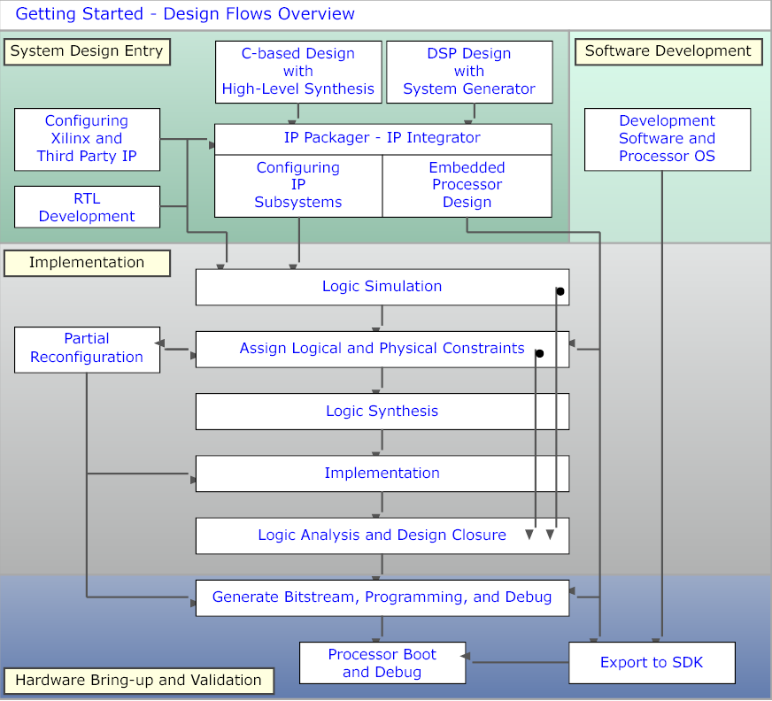
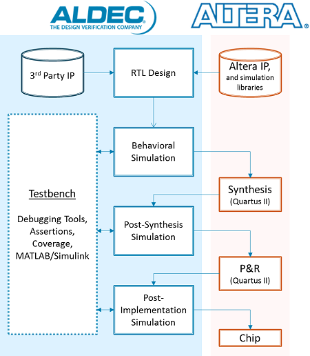

# FPGA Development Process

- FPGA development is the process of converting a hardware idea into a configured FPGA that performs the desired digital function.
- The flow transforms a high-level description into a physical implementation using synthesis, placement, routing, and configuration.
- The process is iterative and includes verification at multiple stages to ensure correctness and performance.

## 1. Design & Specification Stage
- The Design and Specification stage defines **what the FPGA must implement** before any coding begins.  
- It includes system requirements, architecture planning, and identification of reusable IP.  
- Decisions made here directly impact performance, resource usage, and development time.  

### 1. Design Specification
- Defines functional requirements such as input and output behavior, data rates, latency, and protocols.  
- Includes performance targets such as clock frequency, throughput, and power constraints.  
- Identifies interfaces such as memory, communication buses, and external peripherals.  
- Establishes design constraints such as timing budgets and resource limits.  
- Produces system-level documentation and block diagrams.

### 2. IP Design and System-Level Integration
- Breaks the system into reusable modules or IP blocks.  
- Integrates vendor IP cores such as memory controllers, DSP blocks, and communication interfaces.  
- Defines interconnections between modules using standard interfaces such as AXI or Avalon.  
- Ensures compatibility between different IP blocks in terms of clocking and data width.  
- Reduces development time by reusing pre-verified components.

### 3. IP Subsystem Design
- Groups related IP blocks into subsystems such as processing pipelines or communication units.  
- Defines data flow, control logic, and buffering between modules.  
- Handles clock domain boundaries and synchronization between subsystems.  
- Optimizes subsystem-level performance and resource utilization.  
- Improves modularity and scalability of the overall design.

### 4. Hard IP Cores
- Hard IP cores are pre-implemented, fixed-function blocks built into the FPGA silicon.  
- Examples include transceivers, PCIe controllers, DDR memory controllers, and processors.  
- Provide high performance and lower power compared to soft logic implementations.  
- Reduce FPGA resource usage since they do not consume LUTs or registers.  
- Must be configured and integrated correctly within the system architecture.

---

## 2. Design Entry Stage

- The Design Entry stage converts system architecture into an **implementable hardware description**.  
- It includes writing RTL code and defining physical aspects such as I/O and clocking.  
- This stage directly impacts synthesis quality, timing closure, and hardware reliability.  

### 1. RTL Design (Design Entry)
- RTL design describes hardware behavior using **Verilog, VHDL, or SystemVerilog**.  
- It defines data flow, control logic, state machines, and module hierarchy.  
- Designs are written in a **modular and hierarchical manner** for reuse and scalability.  
- Synthesizable constructs must be used to ensure correct hardware mapping.  
- Coding style affects area, timing, and power optimization.    

### 2. I/O Planning
- Defines how internal signals connect to external FPGA pins.  
- Includes **pin assignment, I/O standards, voltage levels, and drive strength**.  
- Ensures compatibility with external devices such as sensors, memory, and communication interfaces.  
- Improper I/O planning can lead to signal integrity issues or hardware damage.  

### 3. Clock Planning
- Defines clock sources, distribution, and frequency requirements.  
- Ensures proper synchronization across all sequential elements.  
- Critical for achieving timing closure and reliable operation.  

---

## 3. Verification (Pre-Synthesis) stage
- Pre-synthesis verification ensures that the RTL design is **functionally correct before hardware mapping**.  
- It focuses on validating logic behavior without considering physical delays or FPGA resources.  
- Early verification reduces debugging effort and prevents costly iterations later in the flow.  

### 1. Behavioral / Functional Simulation
- Behavioral simulation verifies the logical correctness of the RTL design using testbenches.  
- It checks whether outputs match expected results for given inputs.  
- No timing delays or physical effects are considered in this stage.  
- Simulation is event-driven and based purely on HDL behavior.  

### 2. Design Analysis and Simulation
- Involves deeper validation of design structure, hierarchy, and basic performance.  
- Ensures correct module connectivity and signal interactions.  
- Includes static checks such as syntax, linting, and design rule verification.  
- May include preliminary timing estimation based on RTL structure.  

---

## 4. Synthesis Stage

- Synthesis converts RTL code into a **technology-mapped gate-level netlist** using FPGA primitives such as LUTs, flip-flops, and DSP blocks.  
- It bridges the gap between high-level HDL description and hardware implementation.  
- The quality of synthesis directly affects **area, timing, and power**.  

### Synthesis Substages

1. **RTL Elaboration**
- Parses HDL code and builds a hierarchical design representation.  
- Resolves parameters, constants, and module instantiations.  
- Checks syntax and detects structural issues.  
- Creates an intermediate representation of the design.  

2. **RTL Optimization**
- Simplifies logic before technology mapping.  
- Removes redundant logic and unused signals.  
- Performs constant propagation and logic minimization.  
- Improves efficiency without changing functionality.  

3. **Technology Mapping**
- Maps optimized logic to FPGA primitives such as LUTs, flip-flops, and DSP blocks.  
- Selects appropriate hardware resources based on design requirements.  
- Converts abstract logic into implementable structures.  

4. **Resource Binding**
- Assigns operations to specific hardware resources such as DSP blocks or memory blocks.  
- Decides whether to use LUT-based logic or dedicated hardware.  
- Impacts performance and resource utilization.  

5. **Netlist Generation**
- Produces a gate-level netlist describing the design in terms of FPGA primitives.  
- Includes connectivity between logic elements.  
- Used as input for implementation (placement and routing).  

6. **Constraint Interpretation**
- Applies timing and design constraints during synthesis.  
- Influences optimization decisions such as pipelining and resource usage.  
- Ensures synthesis aligns with timing requirements.  

7. **Reporting and Analysis**
- Generates reports for:
  - Resource utilization  
  - Timing estimates  
  - Logic structure  
- Helps identify bottlenecks and optimization opportunities.  

---

## 5. Constraint Definition
- The Constraint Definition stage specifies **timing, physical, and design rules** that guide synthesis and implementation tools.  
- Constraints define how the design should behave in terms of timing, clocking, and I/O placement.  
- Proper constraints are essential for **timing closure, functional correctness, and reliable hardware operation**.  

### Types of Constraints

1. **Timing Constraints**
- Define clock characteristics and timing requirements for all paths.  
- Ensure that signals meet setup and hold timing conditions.  
- Used by tools to optimize placement and routing.  

2. **Physical Constraints**
- Define pin assignments and I/O standards.  
- Specify physical placement of certain blocks if required.  
- Ensure compatibility with board-level design.  

3. **Design Constraints**
- Define special conditions such as false paths and multicycle paths.  
- Guide tools to ignore or relax specific timing paths.  
- Help improve optimization efficiency.  

### Common and Important Timing Constraints

1. Clock Definition
- Defines primary and generated clocks in the design.  
- Includes clock frequency, period, waveform, and source.  
- All timing analysis is based on defined clocks.  

2. Input Delay
- Specifies delay between external device and FPGA input pin.  
- Ensures correct timing analysis for incoming signals.  
- Accounts for board-level delays and external device timing.  

3. Output Delay
- Specifies delay from FPGA output pin to external device.  
- Ensures data is available within required time at receiving device.  

4. Clock Uncertainty
- Accounts for clock jitter and skew.  
- Reduces available timing margin to ensure robustness.  

5. False Path
- Specifies paths that should be ignored during timing analysis.  
- Used for asynchronous or non-critical paths.  

6. Multicycle Path
- Defines paths that require more than one clock cycle to complete.  
- Relaxes timing requirements for such paths.  

7. Maximum and Minimum Delay
- Sets explicit delay limits for specific paths.  
- Used for fine control over timing behavior.  

8. Clock Groups
- Defines relationships between different clock domains.  
- Used to mark clocks as asynchronous to each other.  

---

## 6. Implementation (Place and Route) Stage

- The Implementation stage maps the synthesized netlist onto the **physical resources of the FPGA**.  
- It converts logical design into a **fully placed and routed hardware layout**.  
- This stage is critical for achieving timing, performance, and resource utilization goals.  
- Implementation includes optimization, placement, and routing.  

### 1. Implementation (Overall Stage)

- Implementation is the process of transforming the synthesized netlist into a physical design.  
- It includes multiple internal optimization steps to improve timing and reduce congestion.  
- Tools consider constraints such as timing, I/O placement, and clock requirements.  
- Produces a design ready for timing verification and bitstream generation.  

### 2. Placement

- Placement assigns each logic element such as LUTs, registers, and DSP blocks to a **specific physical location** on the FPGA.  
- The goal is to minimize distance between connected elements to reduce delay.  
- Placement algorithms consider timing constraints and connectivity.  

### 3. Routing

- Routing connects placed elements using the FPGA’s programmable interconnect network.  
- Determines actual signal paths between logic blocks.  
- Routing must satisfy timing, signal integrity, and congestion constraints.  

### 4. Optimization During Implementation

- Tools perform iterative optimization during placement and routing.  
- Techniques include:
  - Logic replication to reduce fanout delay  
  - Retiming to balance pipeline stages  
  - Buffer insertion for signal integrity  
- Optimization continues until timing constraints are met or best effort is achieved.  

### 5. Output of Implementation
- Fully placed and routed design.  
- Updated netlist with physical mapping.  
- Reports including:
  - Timing summary  
  - Resource utilization  
  - Congestion analysis  

---

## 7. Static Timing Analysis (STA)
- Static Timing Analysis verifies that the implemented design meets all timing constraints without using simulation vectors.  
- It analyzes all possible timing paths in the design to ensure correct operation at the target clock frequency.  
- STA is performed after implementation and is essential for **timing closure and reliable hardware operation**.  

### Objectives of STA
- Ensure all timing paths meet setup and hold requirements.  
- Validate that clock frequencies and timing constraints are satisfied.  
- Identify critical paths that limit performance.  
- Detect timing violations before hardware deployment.  

### Key Timing Concepts

1. Timing Paths
- A timing path is a path from a starting point such as a register or input to an endpoint such as a register or output.  
- Types include:
  - Register to register paths  
  - Input to register paths  
  - Register to output paths  

2. Setup Time
- Setup time is the minimum time before the clock edge that data must be stable.  
- Violation occurs when data arrives too late.  

3. Hold Time
- Hold time is the minimum time after the clock edge that data must remain stable.  
- Violation occurs when data changes too early.  

4. Clock Period and Frequency
- Clock period defines the time available for data propagation.  
- Frequency is the inverse of the clock period.  
- Timing analysis ensures paths complete within one clock cycle or defined cycles.  

5. Slack
- Slack is the difference between required time and arrival time.  
- Positive slack indicates timing is met.  
- Negative slack indicates a timing violation.  

6. Critical Path
- The path with the longest delay in the design.  
- Determines the maximum operating frequency.  
- Optimization focuses on reducing critical path delay.  

7. Clock Skew
- Difference in arrival time of the clock signal at different registers.  
- Can impact setup and hold timing.  

8. Clock Uncertainty
- Accounts for jitter and variation in clock signals.  
- Reduces available timing margin.  

9. Path Delays
- Includes logic delay and routing delay.  
- Routing delay often dominates in FPGA designs.  

10. Timing Exceptions
- False paths are excluded from timing analysis.  
- Multicycle paths allow more than one clock cycle for data transfer.  
- Used to guide timing analysis and optimization.  

### STA Process
- Extract timing paths from the implemented design.  
- Apply constraints such as clocks and delays.  
- Calculate arrival and required times for each path.  
- Compute slack for setup and hold conditions.  
- Generate reports highlighting violations and critical paths.  

### STA Reports
- Setup and hold timing summary.  
- Worst negative slack and total negative slack.  
- Critical path details.  
- Clock domain analysis.  
- Path-based timing reports for debugging.  

---

## 8. Post-Implementation Verification stage
- Post-implementation verification validates the design **after synthesis and placement and routing**.  
- It uses timing-aware simulation models that include actual delays from the implemented design.  
- This stage ensures that the design behaves correctly under **real hardware timing conditions**.  

### Types of Post-Implementation Simulation

1. Post-Synthesis Simulation
- Performed after synthesis but before placement and routing.  
- Uses a gate-level netlist with estimated delays.  
- Verifies logical correctness after synthesis transformations.  
- Helps detect issues introduced during synthesis optimization.  

2. Post-Implementation Simulation (Post-Route Simulation)
- Performed after placement and routing.  
- Uses final netlist with **accurate timing delays** from implementation.  
- Includes routing delays, clock skew, and physical effects.  
- Most accurate simulation before hardware testing.  

### Important Concepts

1. Timing Back-Annotation
- Timing delays from implementation are added to the netlist.  
- Ensures simulation reflects real hardware timing.  

2. Gate-Level Simulation
- Simulation is performed on synthesized netlist instead of RTL.  
- Includes actual logic elements such as LUTs and flip-flops.  

3. Glitches and Hazards
- Temporary signal transitions due to delay differences.  
- Can be observed only in timing-aware simulations.  

4. Clock Domain Interaction
- Verifies correct operation across multiple clock domains.  
- Helps identify synchronization issues.  

### Limitations
- Slower compared to RTL simulation.  
- Complex setup and longer simulation times.  
- Often used selectively for critical parts of the design.  

### Importance
- Provides high confidence before hardware deployment.  
- Detects timing-related issues missed in earlier stages.  
- Complements Static Timing Analysis.  

---

## 9. Bitstream Generation and Device Programming

### Bitstream Generation
- Bitstream generation converts the fully implemented design into a **configuration file** that defines FPGA behavior.  
- The file contains information about logic configuration, routing, memory initialization, and I/O settings.  
- It is device-specific and depends on the target FPGA architecture.  
- Generated after successful implementation and timing closure.  
- Includes configuration of LUTs, registers, interconnect, and I/O.  
- Incorporates initialization data for memories and registers if required.  
- Ensures that all constraints and design settings are embedded.  

### Device Programming
- The bitstream is loaded into the FPGA using programming tools or external configuration memory (JTAG, SPI flash, or other interfaces).  
- Configures the FPGA to implement the desired hardware functionality.  
- For SRAM-based FPGAs, configuration must be loaded at every power-up.  
- Supports both volatile and non-volatile configuration methods. 

---

## 10.Hardware Verification
- Test the design on actual hardware to verify real-world behavior.
- Use debugging tools such as logic analyzers and on-chip debugging cores.
- Validate functionality, timing, and interfaces.
- Iterate design if issues are found.

### Hardware Testing and Debugging
- Validates the design on actual FPGA hardware under real operating conditions.  
- Confirms correct functionality, timing behavior, and interface operation.  
- Tests system-level behavior including interaction with external components.  

#### Key Aspects
- Apply real input signals and observe outputs.  
- Verify communication interfaces such as memory and peripherals.  
- Check system performance under different conditions.  
- Identify mismatches between simulation and hardware behavior.  

### Hardware Debug and Validation
- Uses on-chip debugging tools to monitor internal signals.  
- Helps identify and fix issues that are not visible externally.  
- Enables real-time observation of internal states and data paths.  

#### Key Aspects
- Insert debug cores into design for signal capture.  
- Analyze waveforms and timing behavior.  
- Validate clock domain crossings and synchronization.  
- Perform iterative debugging and fixes.  

---

## 11. Optimization and Iteration
- Optimize design for performance, power, and area.
- Refine RTL, constraints, or architecture based on results.
- Repeat synthesis, implementation, and testing as needed.
- Iterative improvement is common in FPGA design.

- Optimization improves performance, power, and resource utilization after initial implementation.  
- Iteration involves refining design based on analysis and hardware results.  

### Key Optimization Areas
- **Timing Optimization** : Improve critical path delays using pipelining, retiming, or logic restructuring.  

- **Area Optimization** : Reduce resource usage by optimizing logic and sharing resources.  

- **Power Optimization** : Reduce switching activity and optimize clock usage.  

- **Functional Optimization** : Fix design bugs and improve system behavior.  

### Iteration Process
- Modify RTL or constraints based on analysis results.  
- Re-run synthesis, implementation, and verification.  
- Repeat until design meets all requirements.  

### Importance
- Ensures final design meets performance and reliability targets.  
- Improves efficiency and reduces cost.  
- Essential for complex and high-performance systems.  

---

## Comprehensive FPGA Design Flow Comparison

| Stage | Xilinx / AMD (Vivado) | Intel / Altera (Quartus) | Key Difference |
|------|----------------------|--------------------------|----------------|
| **1. Design Specification** | Defined outside tool, supported via block design planning | Defined outside tool, supported via system planning | Conceptually identical |
| **2. System-Level / IP Integration** | IP Integrator (Block Design GUI, AXI-based) | Platform Designer (Qsys, Avalon-based) | AXI vs Avalon interconnect |
| **3. RTL Design (Design Entry)** | Verilog, VHDL, SystemVerilog in Vivado IDE | Verilog, VHDL in Quartus IDE | Similar HDL support |
| **4. I/O Planning** | I/O Planning tool, XDC constraints | Pin Planner, assignments editor | Different tools but same purpose |
| **5. Clock Planning** | Clocking Wizard, XDC constraints | PLL IP tools, SDC constraints | XDC vs SDC format |
| **6. Behavioral / Functional Simulation** | Vivado Simulator (XSIM), integrated | ModelSim / Questa (Intel Edition) | Vivado more integrated |
| **7. Design Analysis / Linting** | Integrated elaboration and design checks | Analysis and elaboration stage | Quartus separates this step |
| **8. Synthesis** | Vivado Synthesis | Analysis and Synthesis | Naming difference |
| **9. Constraint Definition** | XDC (Tcl-based constraints) | SDC (Synopsys standard) | Different formats |
| **10. Implementation (Overall)** | Implementation stage | Fitter stage | Naming difference |
| **11. Placement** | Part of Implementation | Part of Fitter | Same function |
| **12. Routing** | Part of Implementation | Part of Fitter | Same function |
| **13. Optimization During Implementation** | Strategy-driven optimization | Compilation and fitter optimization | Similar capability |
| **14. Static Timing Analysis (STA)** | Vivado Timing Analyzer | TimeQuest Timing Analyzer | Separate tool in Quartus |
| **15. Post-Synthesis Simulation** | Supported within Vivado | Supported via ModelSim | Tool integration difference |
| **16. Post-Implementation Simulation** | Supported with SDF back-annotation | Supported with SDF in ModelSim | Similar capability |
| **17. Bitstream Generation** | Generate Bitstream (.bit) | Assembler generates (.sof / .pof) | Naming and file formats differ |
| **18. Device Programming** | Vivado Hardware Manager | Quartus Programmer | Separate tools in Quartus |
| **19. Hardware Debug** | Integrated Logic Analyzer (ILA) | SignalTap Logic Analyzer | Different debug tools |
| **20. Hardware Validation** | Integrated debug + external tools | SignalTap + external tools | Similar workflow |
| **21. Optimization & Iteration** | Strategy-based iterative flow | Compilation-based iterative flow | Vivado more unified |
| **22. Overall Flow Style** | Unified, GUI-driven environment | Modular, tool-separated flow | Major practical difference |

---

### High-Level Mapping Summary

| Vivado Term | Quartus Equivalent |
|------------|-------------------|
| Synthesis | Analysis and Synthesis |
| Implementation | Fitter |
| Bitstream Generation | Assembler |
| Vivado Simulator | ModelSim |
| Vivado Timing Analyzer | TimeQuest |
| IP Integrator | Platform Designer |
| ILA | SignalTap |

---

## Xilinx / AMD Vivado design flow

## Intel / Altera Quartus design flow

---