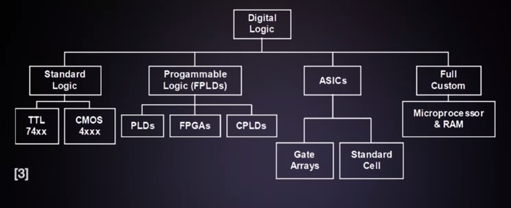
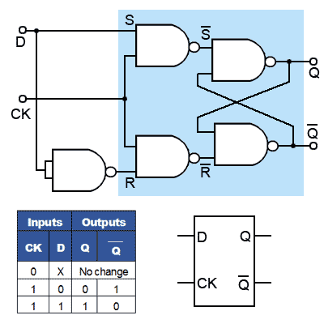
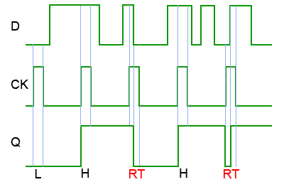
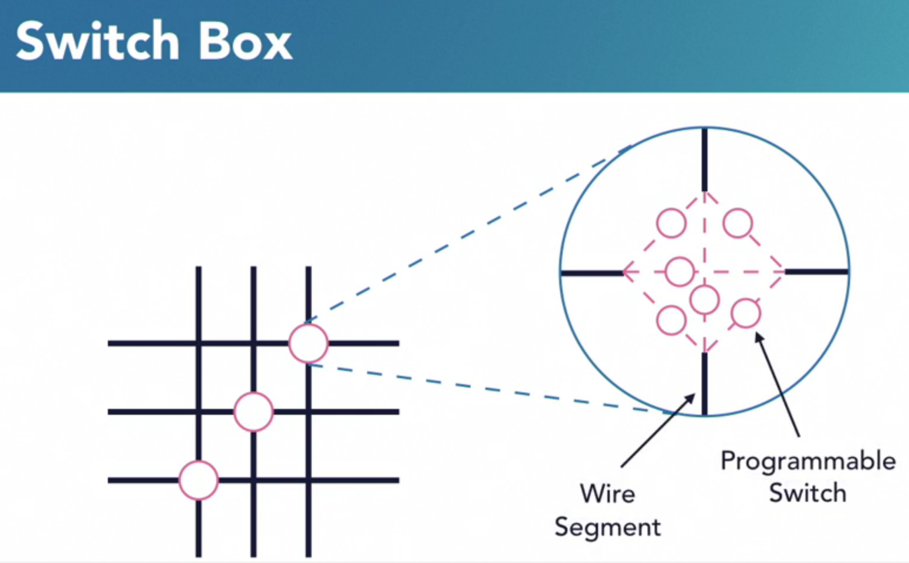
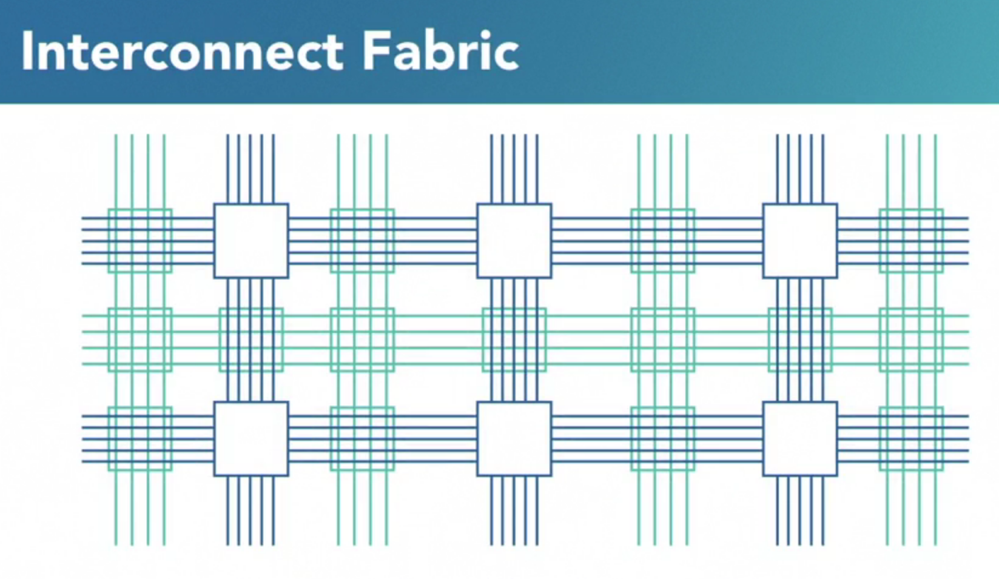

# Introduction

## What is an FPGA?

FPGA stands for field-programmable gate array, and it's a special type
of integrated circuit that implements an arbitrary digital design of
one's own. FPGA is an integrated circuit consisting of an array of
programmable logic blocks with programmable routing between the blocks,
that allows the device to be configured to perform complex digital logic
functions. In other words, the code determines the configuration of the
digital circuitry inside the chip.

FPGAs are the key technology enabling many of the great new product
developments in the near future. Including autonomous vehicles, the
Internet of Things, secure data centers and cloud computing, robotics,
machine vision and learning, renewable energy, home automation, 8K video
and video surveillance, facial recognition and bioinformatics, 5G
cellular networks, and smart medical diagnostics.

So how is an FPGA customized? We can sum it all up in three steps.

-   The system is designed as source code in a hardware description
    language like VHDL or Verilog.

-   The code is synthesized by a software tool essentially similar to a
    compiler. FPGA synthesis is the process of taking the source code
    and producing an output file that describes the internal connections
    that the FPGA needs in order to become one's design.

-   The output file is downloaded into the FPGA, which has a special
    memory for this binary data.

## FPGAs are not microcontrollers

FPGAs may sound similar to microcontrollers, but it's very important to
understand the difference. First, FPGAs are flexible in that they
customize their internal connections. On the other hand,
microcontrollers can't behave as anything other than microcontrollers.
They are application-specific integrated circuits, or ASIC. Next,
remember that an FPGA may implement a CPU, so technically, an FPGA can
achieve more than a microcontroller. Another key difference is that
FPGAs do not execute code, microcontrollers do. And finally, embedded
systems were originally based in microcontrollers or microprocessors,
and over the years they have evolved to include FPGAs as well.\
\
Suggested Readings:

-   FPGAs for Dummies, Altera Version, available here:
    http://design.altera.com/New2FPGAeBook, Chapters 1, 2, and 5 (27
    pages).

-   Rapid Prototyping of Digital Systems: SOPC Edition, by Hamblen, Hall
    and Furman; ISBN 9780387726700, Chapter 3 (14 pages)

-   Design Recipes for FPGAs Using Verilog and VHDL, 2nd Edition, by
    Peter Wilson, Chapter 2 (7 pages)

## Programmable Logic Devices (PLD)

FPGAs are a subset programmable logic devices.

CPLD (Complex Programmable Logic Devices):\
CPLDs have several useful characteristics, including easy generation of
wide input functions, and easy to calculate timing that is very
predictable. It's said to be deterministic. They are still a good choice
for glue logic applications today. However, for designs that required a
lot of registers, data transfers, bus interfaces. These logic intensive
flip-flop scarce devices did not scale well, leading to the development
of another PLD architecture,the FPGA.

CPLD re-introduced reprogrammability to programmable logic devices, an
important new feature. CPLDs also reinforced hierarchical design
methods. The architecture of the CPLD allowed for easy design of wide
input combinational logic functions like address decoders and state
machines with deterministic timing. However, the CPLD architecture did
not scale effectively for designs that required many flip flips. This
has become the province of the FPGA.

FPGA vs PLD vs ASIC:

### Programmable Logic Devices

Highly configurable Fast Design Time Can't support complex logic SPLD:
Simple PLD CPLD: Complex PLD

### Application Specific Integrated Circuits

No reconfiguration Application Specific Area and power optimized Time
consuming design Highly expensive Supports complex logic

### FPGAs

FPGAs sit in tbetween these two extemities. Reconfigurable Inexpensive
Easy to program Reprogrammable chip Time to market is less (  a month as
opposed to ASIC which needs around 6-8 months) Can be used as a \"Glue
logic\" in order to connect large ICs. Reduces system complexity Density
of FPGA continue to grow (gates/area) FPGA prototyping for ASIC
verification

  **Performance**   **Non recurring cost**   **Unit Cost**    **Time to Market**
  ----------------- ------------------------ ---------------- --------------------
  ASIC              ASIC                     FPGA             ASIC
  FPGA              FPGA                     Microprocessor   FPGA
  Microprocessor    Microprocessor           ASIC             Microprocessor

# FPGA Architecture

## Plain FPGA / Inside an FPGA: Logic blocks

There are many basic elements inside FPGAs that make it possible to
provide the arbitrary functionality we want. Here are the most basic of
these elements. First we have logic blocks, which contain the logic
elements that finally implement one's design. These include digital
devices like lookup tables, flip-flops and multiplexers. Next we have
the inter-connect block, which is an enormous network of switches that
route the logic elements to connect them as one's design requires. I/O
blocks contain the circuitry for input and output things in the
integrated circuit. Most FPGAs contain memory blocks to implement large
arrays, and also a clock management block to implement sequential
systems.

### Logic blocks

These are also known as configurable logic blocks or CLB's. Each logic
block contains a number of logic cells which are smaller groups of basic
logic elements. Although the letter G in FPGA stands for Gate, logic
cells don't usually contain gates. Real logic cells may have these
elements, like types of flip-flops, D multiplexers, larger lookup
tables, small register arrays, and so on.\

**Lookup Tables** FPGAs use LUTs of various sizes to implement logic.
There's a tradeoff between the size of the LUT and the amount of routing
required. Larger LUTs can create more logic, which will require less
routing. Smaller LUTs will require more routing, but offer better logic
efficiency. LUTs can be used to create a variety of combinatorial logic
functions.

**Flip-flops / Register** A flip-flop is a circuit that has two stable
states and can be used to store state information. A flip-flop is a
device which stores a single bit of data; one of its two states
represents a \"one\" and the other represents a \"zero\". Such data
storage can be used for storage of state, and such a circuit is
described as sequential logic in electronics. A flip-flop usually
comprises of a clock(CLK), input(D) and an output(Q) signal.

A clock signal oscillates between a high and a low state (an analog
square wave) and is used like a metronome to coordinate actions of
digital circuits. FPGAs usually runs on a clock with a MHz frequency.
This clock runs multiple Flip-flops inside an FPGA. These Flip-flops
operate on the clock edges (usually the rising edge).

Types: D FF, JK FF, T FF.

-   D Flip-flop: Aligns input data to the clock edges.

    
    
    

    
    
    

-   JK Flip-flop

-   T Flip-flop

### Interconnects

This is the part of the FPGA that has all the custom connections between
logic cells across logic blocks. The interconnects are typically
implemented by switch boxes which contain a number of simple
semiconductor switches. Each of these switches is either open or closed
depending on a logic state in it's input. These open or closed states
come from a special memory in the FPGA.

This is how a switch box may be implemented in . At the left we have six
different wires that may be connected between each other in any way.
This is possible because there are switch boxes at the intersections.
Now look This is how a switch box may be implemented. ing closer at the
switch box, it may contain as many as six switches to route any signal
in any direction needed. If one look carefully, one'll see that a single
switch box is capable of routing two different signals. For example, one
that goes horizontally and one that goes vertically through the switch
box.

Interconnect seems simple enough and they are very simple indeed as
shown in . But the real power in an FPGA comes from the enormous number
of interconnects available. An FPGA has so many interconnects that it's
humanly impossible to create a design by hand. This huge network
architecture is sometimes called an interconnect fabric and it requires
software to keep track of all of the routing that needs to be done.

Aside from logic block and interconnects there are many more important
elements in an FPGA for eg. I/O blocks, clock management blocks, memory
blocks, and hard I/P cores.

### I/O blocks

Input/Output blocks are always included in FPGAs because integrated
circuits work with very low powers, voltages and currents internally.
However, the outside world usually works with higher powers. That's why
I/O blocks contain line drivers to provide power to the outputs, and
line receivers to condition the incoming signals to the lower internal
power levels. I/O blocks also contain protection devices to avoid damage
from external conditions, such as electrostatic discharges. Output pins
can sometimes customize other perameters like strength or speed of the
outgoing signal.

### Clock management blocks

These are usually provided in FPGAs because virtually all useful systems
are sequential, and thus require a clock signal. External oscillators
are almost always required. This is not the usual case with
microcontrollers which may contain an internal, good enough oscillator.
There are several features in a clock manager, but most are related with
changing the incoming frequency to some other frequency. So one can
reduce it by some factor with a rescaler, or one can boost it up with a
control system called a phase-locked loop or PLL.

### Memory blocks

Memory blocks are almost always included because most applications
require RAM and ROM. Because the digital design that will be written to
an FPGA is not known in advance, these memories have to support
segmentation to meet the programmers needs. These are general purpose
memories with at risk inputs and data lines. These memories are
available from the source code as memory blocks defined in the hardware
description language. Finally, the interconnects take care of the
segmentation.

### Hard IP Cores

A very special part of the FPGA world are IP cores. Intellectual
property cores are functional blocks available for use. This can be
provided in libraries for one to use in the code, or they can be
hardware blocks like the ones available in most microcontrollers. Hard
IP cores are accessible from one's code as if they were instances of
logic designs. Having these available in hardware helps keeping one's
custom designs smaller, and speeds up the development process. Some
examples of Hard IP cores are HDMI controllers, serial ports, CPUs,
digital signal processors, and USB controllers.

## System on Chip / SoC

A System on a Chip or a System on Chip (SOC) is an integrated circuit
that integrates all components of a computer into an electronic system
into a single chip. It may contain digital, analog, mixed-signal and
other radio frequency functions on a single chip substrate. SOCs are
very common in the mobile electronics market because of their low power
consumption. Another typical application is in the area of embedded
systems. Another definition for a System on a Chip or System on Chip is
an integrated circuit that integrates more than one component into a
single chip along with a CPU. Typical component types are GPUs,
communication interfaces, analog functions, and radios. If it includes
programmable logic then it is a programmable SoC, or an SoC FPGA. The
higher integration of an SoC provides lower cost, smaller size, and
lower power than alternatives.

Heavylifting is done on the FPGA and rest with less computation time
(non real time) is done on the processor part. Zynq architecture fusion
of a processor(PS) and an FPGA(PL). They communicate with AXI protocols.
Zynq is mainly used for acceleration. Processor with FPGA work together
to get higher operation speeds. Application include: Image processing,
DSP etc.

### Software Profiling

What to put in FPGA and what to put in the processor.
