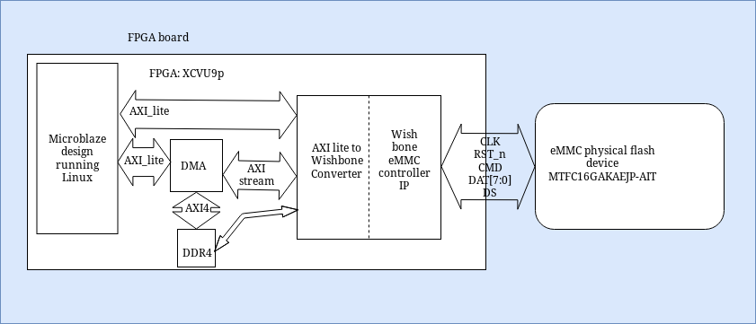
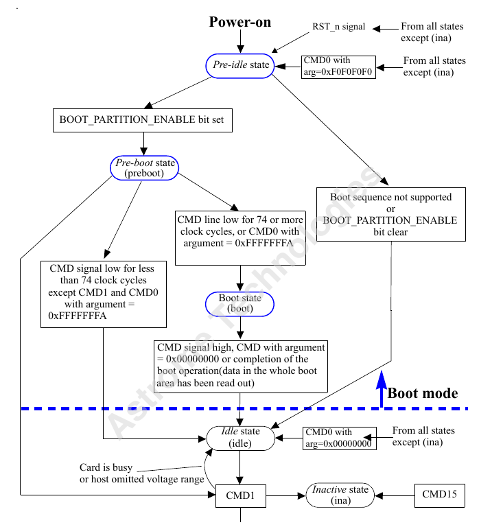

# FPGAPrimer

FPGA Primer

* [Overview](FPGAPrimer.md#overview)
* [Hardware](FPGAPrimer.md#hardware)
  * [Introduction](FPGAPrimer.md#introduction)
    * [History of Programmable Logic](FPGAPrimer.md#history-of-programmable-logic)
    * [What is an FPGA?](FPGAPrimer.md#what-is-an-fpga)
    * [FPGAs are not microcontrollers](FPGAPrimer.md#fpgas-are-not-microcontrollers)
    * [Programmable Logic Devices (PLD)](FPGAPrimer.md#programmable-logic-devices-pld)
      * [Programmable Logic Devices](FPGAPrimer.md#programmable-logic-devices)
      * [Application Specific Integrated Circuits](FPGAPrimer.md#application-specific-integrated-circuits)
      * [FPGAs](FPGAPrimer.md#fpgas)
  * [FPGA Architecture](FPGAPrimer.md#fpga-architecture)
    * [Intel FPGA Architechture](FPGAPrimer.md#intel-fpga-architechture)
      * [Look Up Tables(LUTs)](FPGAPrimer.md#look-up-tablesluts)
      * [Programmable Register](FPGAPrimer.md#programmable-register)
      * [Carry and Register chains](FPGAPrimer.md#carry-and-register-chains)
      * [Adaptive Logic Module (ALM)](FPGAPrimer.md#adaptive-logic-module-alm)
    * [Intel Products](FPGAPrimer.md#intel-products)
      * [Intel FPGAs](FPGAPrimer.md#intel-fpgas)
      * [Intel eASIC Devices](FPGAPrimer.md#intel-easic-devices)
    * [Plain FPGA / Inside an FPGA: Logic blocks](FPGAPrimer.md#plain-fpga--inside-an-fpga-logic-blocks)
      * [Logic blocks](FPGAPrimer.md#logic-blocks)
      * [Interconnects](FPGAPrimer.md#interconnects)
      * [I/O blocks](FPGAPrimer.md#io-blocks)
      * [Clock management blocks](FPGAPrimer.md#clock-management-blocks)
      * [Memory blocks](FPGAPrimer.md#memory-blocks)
      * [Hard IP Cores](FPGAPrimer.md#hard-ip-cores)
    * [System on Chip / SoC](FPGAPrimer.md#system-on-chip--soc)
      * [Software Profiling](FPGAPrimer.md#software-profiling)
  * [Timing Analysis](FPGAPrimer.md#timing-analysis)
    * [Introduction](FPGAPrimer.md#introduction-1)
    * [Reasons for performing Timing Analysis](FPGAPrimer.md#reasons-for-performing-timing-analysis)
    * [Types of Timing Analysis](FPGAPrimer.md#types-of-timing-analysis)
      * [Clock directives](FPGAPrimer.md#clock-directives)
      * [Flip-Flop directives](FPGAPrimer.md#flip-flop-directives)
  * [Static Timing Analysis (STA)](FPGAPrimer.md#static-timing-analysis-sta)
    * [Definition](FPGAPrimer.md#definition)
    * [Description](FPGAPrimer.md#description)
    * [Timing Paths](FPGAPrimer.md#timing-paths)
    * [Types of Timing Paths](FPGAPrimer.md#types-of-timing-paths)
      * [Data path](FPGAPrimer.md#data-path)
        * [Types of Data Paths](FPGAPrimer.md#types-of-data-paths)
      * [Clock Path](FPGAPrimer.md#clock-path)
      * [Clock Gating Path](FPGAPrimer.md#clock-gating-path)
      * [Asynchronous path](FPGAPrimer.md#asynchronous-path)
    * [Other types of Paths](FPGAPrimer.md#other-types-of-paths)
    * [Setup and Hold Time](FPGAPrimer.md#setup-and-hold-time)
      * [Definition](FPGAPrimer.md#definition-1)
    * [Setup and Hold Violation](FPGAPrimer.md#setup-and-hold-violation)
    * [Delay Calculation](FPGAPrimer.md#delay-calculation)
    * [Timing Constraints](FPGAPrimer.md#timing-constraints)
      * [About XDC Constraints](FPGAPrimer.md#about-xdc-constraints)
      * [Recommended Constraints Sequence](FPGAPrimer.md#recommended-constraints-sequence)
      * [create\_clock](FPGAPrimer.md#create\_clock)
        * [virtual clock](FPGAPrimer.md#virtual-clock)
      * [set\_clock\_uncertainty](FPGAPrimer.md#set\_clock\_uncertainty)
      * [set\_clock\_latency](FPGAPrimer.md#set\_clock\_latency)
      * [set\_clock\_transition](FPGAPrimer.md#set\_clock\_transition)
      * [set\_input\_delay](FPGAPrimer.md#set\_input\_delay)
      * [set\_output\_delay](FPGAPrimer.md#set\_output\_delay)
      * [set\_false\_path](FPGAPrimer.md#set\_false\_path)
      * [set\_clock\_groups](FPGAPrimer.md#set\_clock\_groups)
      * [Timing effects](FPGAPrimer.md#timing-effects)
  * [Clock Domain Crossing(CDC)](FPGAPrimer.md#clock-domain-crossingcdc)
    * [Basic definitions](FPGAPrimer.md#basic-definitions)
    * [Asynchronous Clocks](FPGAPrimer.md#asynchronous-clocks)
    * [Basic definitions for CDC](FPGAPrimer.md#basic-definitions-for-cdc)
      * [Setup Time](FPGAPrimer.md#setup-time)
      * [Hold Time](FPGAPrimer.md#hold-time)
      * [Metastability](FPGAPrimer.md#metastability)
      * [Why is metastability a problem?](FPGAPrimer.md#why-is-metastability-a-problem)
      * [Synchronizers](FPGAPrimer.md#synchronizers)
      * [Two Flip-Flop synchronizer](FPGAPrimer.md#two-flip-flop-synchronizer)
      * [Mean Time Before Failure (MTBF)](FPGAPrimer.md#mean-time-before-failure-mtbf)
      * [Three Flip-Flop synchronizer](FPGAPrimer.md#three-flip-flop-synchronizer)
    * [Synchronizing fast signals into slow clock domains](FPGAPrimer.md#synchronizing-fast-signals-into-slow-clock-domains)
      * [The "three edge" guideline](FPGAPrimer.md#the-three-edge-guideline)
      * [Open loop solution](FPGAPrimer.md#open-loop-solution)
        * [Advantage](FPGAPrimer.md#advantage)
        * [Disadvantage](FPGAPrimer.md#disadvantage)
      * [Closed loop solution](FPGAPrimer.md#closed-loop-solution)
        * [Advantage](FPGAPrimer.md#advantage-1)
        * [Disadvantage](FPGAPrimer.md#disadvantage-1)
    * [Passing multiple signals between clock domains](FPGAPrimer.md#passing-multiple-signals-between-clock-domains)
      * [Multi-bit CDC strategies](FPGAPrimer.md#multi-bit-cdc-strategies)
      * [Multi-bit signal consolidation](FPGAPrimer.md#multi-bit-signal-consolidation)
      * [Multi-cycle path(MCP) formulations](FPGAPrimer.md#multi-cycle-pathmcp-formulations)
        * [Advantages](FPGAPrimer.md#advantages)
        * [MCP formulation using a synchronized enable pulse](FPGAPrimer.md#mcp-formulation-using-a-synchronized-enable-pulse)
        * [Closed-loop - MCP formulation with feedback](FPGAPrimer.md#closed-loop---mcp-formulation-with-feedback)
        * [Closed-loop - MCP formulation with acknowledge feedback](FPGAPrimer.md#closed-loop---mcp-formulation-with-acknowledge-feedback)
      * [Passing multiple CDC bits using gray codes](FPGAPrimer.md#passing-multiple-cdc-bits-using-gray-codes)
      * [Additional multi-bit CDC techniques](FPGAPrimer.md#additional-multi-bit-cdc-techniques)
        * [Asynchronous FIFO implementation](FPGAPrimer.md#asynchronous-fifo-implementation)
        * [1-deep / 2-register FIFO implementation](FPGAPrimer.md#1-deep--2-register-fifo-implementation)
    * [Naming conventions & design partitioning](FPGAPrimer.md#naming-conventions--design-partitioning)
      * [Clock & signal naming conventions](FPGAPrimer.md#clock--signal-naming-conventions)
      * [Multi-clock / multi-source modules with no naming convention](FPGAPrimer.md#multi-clock--multi-source-modules-with-no-naming-convention)
      * [Timing verification for each clock domain](FPGAPrimer.md#timing-verification-for-each-clock-domain)
      * [Clock oriented design partitioning](FPGAPrimer.md#clock-oriented-design-partitioning)
      * [Partitioning with MCP formulations](FPGAPrimer.md#partitioning-with-mcp-formulations)
    * [Multi-clock gate-level simulation issues](FPGAPrimer.md#multi-clock-gate-level-simulation-issues)
      * [Strategies to remove X-propagation from gate-level simulations](FPGAPrimer.md#strategies-to-remove-x-propagation-from-gate-level-simulations)
    * [Summary](FPGAPrimer.md#summary)
      * [Recommended 1-bit CDC techniques](FPGAPrimer.md#recommended-1-bit-cdc-techniques)
      * [Recommended multi-bit CDC techniques](FPGAPrimer.md#recommended-multi-bit-cdc-techniques)
      * [Recommended naming conventions and design partitioning](FPGAPrimer.md#recommended-naming-conventions-and-design-partitioning)
      * [Recommended solutions to multi-clock gate-level CDC simulations](FPGAPrimer.md#recommended-solutions-to-multi-clock-gate-level-cdc-simulations)
    * [Reference for CDC Section](FPGAPrimer.md#reference-for-cdc-section)
    * [Clock Domain Crossing from NANDLAND](FPGAPrimer.md#clock-domain-crossing-from-nandland)
      * [Case I : Crossing from Slow to Fast domain](FPGAPrimer.md#case-i--crossing-from-slow-to-fast-domain)
      * [Case II : Crossing from Fast to Slow domain](FPGAPrimer.md#case-ii--crossing-from-fast-to-slow-domain)
      * [Case III : Crossing with Streaming Data](FPGAPrimer.md#case-iii--crossing-with-streaming-data)
      * [Timing Errors](FPGAPrimer.md#timing-errors)
      * [Propogation Delay](FPGAPrimer.md#propogation-delay)
* [Protocols](FPGAPrimer.md#protocols)
  * [AXI UART](FPGAPrimer.md#axi-uart)
  * [AXI](FPGAPrimer.md#axi)
    * [Protocol Overview](FPGAPrimer.md#protocol-overview)
      * [Summary of AXI4 Benefits](FPGAPrimer.md#summary-of-axi4-benefits)
      * [How AXI Works](FPGAPrimer.md#how-axi-works)
  * [SPI](FPGAPrimer.md#spi)
    * [Protocol Overview](FPGAPrimer.md#protocol-overview-1)
    * [Data Transmission](FPGAPrimer.md#data-transmission)
    * [Clock Polarity and Clock Phase](FPGAPrimer.md#clock-polarity-and-clock-phase)
    * [Multislave Configuration](FPGAPrimer.md#multislave-configuration)
      * [Regular SPI Mode](FPGAPrimer.md#regular-spi-mode)
      * [Daisy-Chain Method](FPGAPrimer.md#daisy-chain-method)
  * [PCIe](FPGAPrimer.md#pcie)
    * [PCI speeds](FPGAPrimer.md#pci-speeds)
    * [PCIe features](FPGAPrimer.md#pcie-features)
    * [PCI connector](FPGAPrimer.md#pci-connector)
    * [PCIe clock recovery](FPGAPrimer.md#pcie-clock-recovery)
      * [8b/10b encoding](FPGAPrimer.md#8b10b-encoding)
      * [Packetized transactions](FPGAPrimer.md#packetized-transactions)
    * [PCIe Stack](FPGAPrimer.md#pcie-stack)
* [Peripherals & IPs](FPGAPrimer.md#peripherals--ips)
  * [Memory](FPGAPrimer.md#memory)
    * [Types of memory](FPGAPrimer.md#types-of-memory)
    * [Memory Hierarchy Design](FPGAPrimer.md#memory-hierarchy-design)
  * [RAM](FPGAPrimer.md#ram)
    * [SRAM](FPGAPrimer.md#sram)
      * [Large SRAM implementation](FPGAPrimer.md#large-sram-implementation)
    * [DRAM](FPGAPrimer.md#dram)
      * [DRAM vs SRAM](FPGAPrimer.md#dram-vs-sram)
      * [Asynchronous & Synchronous DRAM](FPGAPrimer.md#asynchronous--synchronous-dram)
      * [Interleaving](FPGAPrimer.md#interleaving)
      * [Organization of the DRAM](FPGAPrimer.md#organization-of-the-dram)
      * [DRAM Subsystem](FPGAPrimer.md#dram-subsystem)
  * [::: {#tab:DRAMComponents}](FPGAPrimer.md#-tabdramcomponents)
    * [Basic DRAM Controller Operation](FPGAPrimer.md#basic-dram-controller-operation)
    * [Internal Physical Structure of DRAM](FPGAPrimer.md#internal-physical-structure-of-dram)
    * [DDR RAM](FPGAPrimer.md#ddr-ram)
    * [DDR2 RAM](FPGAPrimer.md#ddr2-ram)
    * [DDR3 RAM](FPGAPrimer.md#ddr3-ram)
    * [DDR4 RAM](FPGAPrimer.md#ddr4-ram)
    * [Application specific DDR versions](FPGAPrimer.md#application-specific-ddr-versions)
    * [DDR Packaging](FPGAPrimer.md#ddr-packaging)
    * [Xilinx DDR MIG Controller IP](FPGAPrimer.md#xilinx-ddr-mig-controller-ip)
  * [Flash Memory](FPGAPrimer.md#flash-memory)
    * [QSPI Flash](FPGAPrimer.md#qspi-flash)
  * [EMMC](FPGAPrimer.md#emmc)
    * [eMMC Device Overview](FPGAPrimer.md#emmc-device-overview)
  * [Gigabit Ethernet](FPGAPrimer.md#gigabit-ethernet)
    * [1G/2.5G Ethernet IP](FPGAPrimer.md#1g25g-ethernet-ip)
    * [10G/25G Ethernet IP](FPGAPrimer.md#10g25g-ethernet-ip)
  * [Direct Memory Access](FPGAPrimer.md#direct-memory-access)
* [Software & Tools](FPGAPrimer.md#software--tools)
  * [FPGA development process overview](FPGAPrimer.md#fpga-development-process-overview)
    * [FPGA generic design flow](FPGAPrimer.md#fpga-generic-design-flow)
      * [Design Entry](FPGAPrimer.md#design-entry)
      * [Design Implementation](FPGAPrimer.md#design-implementation)
      * [Design Verification](FPGAPrimer.md#design-verification)
    * [RTL Design](FPGAPrimer.md#rtl-design)
    * [IP Design and System-Level Design Integration](FPGAPrimer.md#ip-design-and-system-level-design-integration)
    * [IP Subsystem Design](FPGAPrimer.md#ip-subsystem-design)
    * [I/O and Clock Planning](FPGAPrimer.md#io-and-clock-planning)
    * [Xilinx Platform Board Support](FPGAPrimer.md#xilinx-platform-board-support)
      * [Board Files](FPGAPrimer.md#board-files)
    * [Synthesis](FPGAPrimer.md#synthesis)
    * [Design Analysis and Simulation](FPGAPrimer.md#design-analysis-and-simulation)
      * [Simulation](FPGAPrimer.md#simulation)
    * [Placement and Routing](FPGAPrimer.md#placement-and-routing)
    * [Hardware Debug and Validation](FPGAPrimer.md#hardware-debug-and-validation)
    * [Generate Bitstream](FPGAPrimer.md#generate-bitstream)
    * [Program FPGA](FPGAPrimer.md#program-fpga)
    * [FAQs](FPGAPrimer.md#faqs)
  * [Vivado](FPGAPrimer.md#vivado)
  * [HDL](FPGAPrimer.md#hdl)
    * [Digital system modeling](FPGAPrimer.md#digital-system-modeling)
      * [Levels of abstraction](FPGAPrimer.md#levels-of-abstraction)
    * [Verilog](FPGAPrimer.md#verilog)
      * [Features of Verilog](FPGAPrimer.md#features-of-verilog)
      * [Verilog Code structure](FPGAPrimer.md#verilog-code-structure)
      * [Net data types](FPGAPrimer.md#net-data-types)
      * [Variable data types](FPGAPrimer.md#variable-data-types)
      * [Two methods to define port connections](FPGAPrimer.md#two-methods-to-define-port-connections)
      * [Operators](FPGAPrimer.md#operators)
      * [Assignments](FPGAPrimer.md#assignments)
      * [RTL processes](FPGAPrimer.md#rtl-processes)
      * [Behavioral statements](FPGAPrimer.md#behavioral-statements)
      * [Subprograms](FPGAPrimer.md#subprograms)
    * [Verilog vs SystemVerilog](FPGAPrimer.md#verilog-vs-systemverilog)
  * [Petalinux](FPGAPrimer.md#petalinux)
    * [Petalinux Design Flow](FPGAPrimer.md#petalinux-design-flow)
    * [QEMU](FPGAPrimer.md#qemu)
  * [Version Control: Git, Bitbucket](FPGAPrimer.md#version-control-git-bitbucket)
  * [Scripting](FPGAPrimer.md#scripting)
    * [Shell](FPGAPrimer.md#shell)
      * [Time commands and set variables](FPGAPrimer.md#time-commands-and-set-variables)
      * [Bash startup](FPGAPrimer.md#bash-startup)
      * [Sourcing and aliasing with bash](FPGAPrimer.md#sourcing-and-aliasing-with-bash)
      * [echo command](FPGAPrimer.md#echo-command)
      * [The typeset and declare commands for variables](FPGAPrimer.md#the-typeset-and-declare-commands-for-variables)
      * [Debugging](FPGAPrimer.md#debugging)
    * [TCL](FPGAPrimer.md#tcl)
  * [CMake](FPGAPrimer.md#cmake)
  * [Linux Commands](FPGAPrimer.md#linux-commands)
    * [File Commands](FPGAPrimer.md#file-commands)
    * [Process management](FPGAPrimer.md#process-management)
    * [File permission](FPGAPrimer.md#file-permission)
    * [Searching](FPGAPrimer.md#searching)
    * [System Info](FPGAPrimer.md#system-info)
    * [Compression](FPGAPrimer.md#compression)
    * [Network](FPGAPrimer.md#network)
    * [Shortcuts](FPGAPrimer.md#shortcuts)
    * [Miscellaneous](FPGAPrimer.md#miscellaneous)
* [Links & References](FPGAPrimer.md#links--references)
  * [FPGA overview Material](FPGAPrimer.md#fpga-overview-material)
  * [Important References for additional information](FPGAPrimer.md#important-references-for-additional-information)
  * [Books](FPGAPrimer.md#books)

## Overview

On the first day of joining, following tasks were allotted to me. I was responsible for running Linux on a Microblaze processor with Ethernet handling capacity. I was also entitled for developing Network controller for the base-band system of satellite payload with proper definition of top level architecture of this Network Controller system. After completion of designing the Network Controller, I was expected to contribute in the development of OFDM base-band blocks of the communication system.

## Hardware

### Introduction

#### History of Programmable Logic

TTL(Transistor Transistor Logic) logic design

: Implementng logic by using basic logic funtions available on separate chips/ ICs (ex: Texas Instruments 7400 device family) on a breadboard. Methodology:

```
-   Creating truth table.

-   Cration Karnaugh map.

-   Generate logical expression.

-   Final logic implementation.
```

Programamble logic

:

```
Programamble Array Logic(PAL)

:   Simplest implementation of programmable logic. Logic gates and
    registers fixed. Programmable sum of products array and output
    control. Floating-gate transistors at array crossings set to
    never conduct after applying programming voltages.\
    Put image here

Programamble Logic Devices (PLD)

:   Arrange multiple PAL arrays in a single device. It is comprised
    of: i. Variable product term distribution ii. Programmable
    macrocells

    Programmable macrocells: Generated programmable output from sum
    of products. Provided feedback (using output pin as input)
```

Complex Programamble Logic Devices (CPLD)

: Combine multiple PLDs(logic blocks) in a single device with programmable interconnect and I/O.

```
Put image here:

CPLD logic block or Logic Array Blocks(LAB):

Contain multiple macrocells (typically 4 to 20) Local programmable
interconnect like a PLD.
```

Other architectures

:

```
Programmable Interconnect Array(PI or PIA)

:   Similar to PAL programming technology. Global routing connects
    any signal to any destination in device. Programmed wih
    EPROM,EEPROM or flash technology.

I/O control blocks

:   Introduction in CPLDs. Seprated from logic by PI. I/O specific
    logic provides control, more features. Tri-state buffer control
    to enable input, outputs, or bidirectional on any I/O pin.

In-System Programming (ISP) with JTAG

:   Simple 4 or 5 wire serial interface. Shifts data through one or
    more devices on a board (JTAG chain). Used for device self test
    or ISP. PLD Hardware generates EEPROM programming voltages
    controlled by JTAG interface.
```

#### What is an FPGA?

FPGA stands for field-programmable gate array, and it's a special type of integrated circuit that implements an arbitrary digital design of one's own. FPGA is an integrated circuit consisting of an array of programmable logic blocks with programmable routing between the blocks, that allows the device to be configured to perform complex digital logic functions. In other words, the code determines the configuration of the digital circuitry inside the chip.

FPGAs are the key technology enabling many of the great new product developments in the near future. Including autonomous vehicles, the Internet of Things, secure data centers and cloud computing, robotics, machine vision and learning, renewable energy, home automation, 8K video and video surveillance, facial recognition and bioinformatics, 5G cellular networks, and smart medical diagnostics.

So how is an FPGA customized? We can sum it all up in three steps.

* The system is designed as source code in a hardware description language like VHDL or Verilog.
* The code is synthesized by a software tool essentially similar to a compiler. FPGA synthesis is the process of taking the source code and producing an output file that describes the internal connections that the FPGA needs in order to become one's design.
* The output file is downloaded into the FPGA, which has a special memory for this binary data.

#### FPGAs are not microcontrollers

FPGAs may sound similar to microcontrollers, but it's very important to understand the difference. First, FPGAs are flexible in that they customize their internal connections. On the other hand, microcontrollers can't behave as anything other than microcontrollers. They are application-specific integrated circuits, or ASIC. Next, remember that an FPGA may implement a CPU, so technically, an FPGA can achieve more than a microcontroller. Another key difference is that FPGAs do not execute code, microcontrollers do. And finally, embedded systems were originally based in microcontrollers or microprocessors, and over the years they have evolved to include FPGAs as well.\
\
Suggested Readings:

* FPGAs for Dummies, Altera Version, available here: http://design.altera.com/New2FPGAeBook, Chapters 1, 2, and 5 (27 pages).
* Rapid Prototyping of Digital Systems: SOPC Edition, by Hamblen, Hall and Furman; ISBN 9780387726700, Chapter 3 (14 pages)
* Design Recipes for FPGAs Using Verilog and VHDL, 2nd Edition, by Peter Wilson, Chapter 2 (7 pages)

#### Programmable Logic Devices (PLD)

FPGAs are a subset programmable logic devices.

{#PLD width="5in"}

CPLD (Complex Programmable Logic Devices):\
CPLDs have several useful characteristics, including easy generation of wide input functions, and easy to calculate timing that is very predictable. It's said to be deterministic. They are still a good choice for glue logic applications today. However, for designs that required a lot of registers, data transfers, bus interfaces. These logic intensive flip-flop scarce devices did not scale well, leading to the development of another PLD architecture,the FPGA.

CPLD re-introduced reprogrammability to programmable logic devices, an important new feature. CPLDs also reinforced hierarchical design methods. The architecture of the CPLD allowed for easy design of wide input combinational logic functions like address decoders and state machines with deterministic timing. However, the CPLD architecture did not scale effectively for designs that required many flip flips. This has become the province of the FPGA.

FPGA vs PLD vs ASIC:

**Programmable Logic Devices**

Highly configurable Fast Design Time Can't support complex logic SPLD: Simple PLD CPLD: Complex PLD

**Application Specific Integrated Circuits**

No reconfiguration Application Specific Area and power optimized Time consuming design Highly expensive Supports complex logic

**FPGAs**

FPGAs sit in tbetween these two extemities. Reconfigurable Inexpensive Easy to program Reprogrammable chip Time to market is less (  a month as opposed to ASIC which needs around 6-8 months) Can be used as a "Glue logic" in order to connect large ICs. Reduces system complexity Density of FPGA continue to grow (gates/area) FPGA prototyping for ASIC verification

**Performance** **Non recurring cost** **Unit Cost** **Time to Market**

***

ASIC ASIC FPGA ASIC FPGA FPGA Microprocessor FPGA Microprocessor Microprocessor ASIC Microprocessor

### FPGA Architecture

#### Intel FPGA Architechture

FPGA Logic Array Blocks (LABs) are made up of Logic Elements (LEs) or Adaptive Logic Modules (ALMs). Each of these logic blocks consists of Look Up Tables(LUTs), and registers.

**Look Up Tables(LUTs)**

Creating sum of products function out of combinatorial logic in an FPGA. FPGA uses four or more input LUTs to create complicated functions. A LUT is made up of a series of cascaded multiplexers where the LUT inputs are used as the select lines. The inputs to the multiplexers are programmed as hugh ir low logic levels. The logic is called a Look Up Table.

**Programmable Register**

This is the synchronous part of an Logic Elements. It is driven by a global device clock. Aynchronous control signals of the registers(ex. clear, reset) can be generated by other logic or come from an I/O pin. The output of the register can drive out of the LE to the device's routing channels, or be fed back into the LUT. Register could be bypassed for a combinatorial logic. LUT could also be bypassed and only register could be used for memory. This flexibility in the output stage of the LE makes it extremely efficient.

**Carry and Register chains**

Chains carry bits between LEs. Register outputs can chain to other LE registers in LAB toform LUT independent shift registers.

**Register packing**\
FPGA LEs can be configured to perform a function called Register packing. Two seperate functions can be output from a single LE, one from the carry and chain logic and the other from the output register. This helps in saving device resources.

**Adaptive Logic Module (ALM)**

Replacement for the LEs from traditional FPGAs due to lack of cascading and feedback which is necessary to generate functions with more inputs than are available. It improves performance and resource utilization. ALMS comprise of 2 to 4 output registers to provide even more options for logic chaining, register packing, and generating multiple functions within a single logic block. ALMs also have dedicated built-in hardware adder blocks. The main differentiator between LEs and LUTs is a LUT. The LUT in an ALM is an Adaptive LUT or ALUT. ALUT can be split and configured into different sized LUTs to accommodate two separate functions.

FPGA Routing:\
In an FPGA, the LABs are all arranged into a large array. Programmable routing is placed in the spaces between LABs, similar to the streets in a city.

#### Intel Products

Intel delivers a broad portfolio of custom logic solutions such as FPGAs, SoCs, structured ASICs, and CPLDs together with software tools, intellectual property (IP), embedded processors, customer support, and technical training.

**Intel FPGAs**

Intel Agilex FPGAs

: This FPGA family integrate an 10nm FPGA. Intel Agilex SoC FPGAs integrate the quad-core Arm Cortex-A53 processor. Applications: wide range of compute and bandwidth intensive applications.

INTEL AGILEX F-SERIES FPGAs AND SoCs

: This FPGA and SoC FPGA family bring together transceiver support, digital signal processing (DSP) capabilities along with an option to integrate the quad-core Arm Cortex-A53 processor. Applications: wide range of data center, networking, and edge applications.

INTEL AGILEX I-SERIES SoC FPGAs

: This FPGA family is optimized for high-performance processor interface and bandwidth-intensive applications.

INTEL AGILEX M-SERIES SoC FPGAs

: This SoC FPGA family is optimized for compute and memory intensive applications.

Intel Stratix Series

: This FPGA and SoC family enables you to deliver high-performance, state-of-the-art products to market faster with lower risk and higher productivity.

Intel Arria Series

: This device family delivers performance and power efficiency in the midrange. The Intel Arria 10 FPGAs and SoCs are ideal for the end market applications such as Wireless, Cloud Service and Storage, Broadcast.

Intel Cyclone Series

: The Intel Cyclone FPGA series is built to meet your low-power, cost-sensitive design needs, enabling you to get to market faster.

Intel MAX Series

: This non-volatile FPGA family is optimized for a wide range of high-volume, cost-sensitive applications, such as Automotive, Industrial, Communications.

**Intel eASIC Devices**

Intel eASIC devices are structured ASICs, an intermediary technology between FPGAs and standard-cell ASICs, that provide lower unit cost and lower power compared to FPGAs. These devices provide faster time to market and lower non-recurring engineering (NRE) cost compared to standard-cell ASICs. Different eASIC amilies are: Intel eASIC N5X Devices (Comes with Arm Cortex-A53 hard processor system), Intel eASIC N3XS Devices, Intel eASIC N3X and N2XT Devices.

#### Plain FPGA / Inside an FPGA: Logic blocks

There are many basic elements inside FPGAs that make it possible to provide the arbitrary functionality we want. Here are the most basic of these elements. First we have logic blocks, which contain the logic elements that finally implement one's design. These include digital devices like lookup tables, flip-flops and multiplexers. Next we have the inter-connect block, which is an enormous network of switches that route the logic elements to connect them as one's design requires. I/O blocks contain the circuitry for input and output things in the integrated circuit. Most FPGAs contain memory blocks to implement large arrays, and also a clock management block to implement sequential systems.

**Logic blocks**

These are also known as configurable logic blocks or CLB's. Each logic block contains a number of logic cells which are smaller groups of basic logic elements. Although the letter G in FPGA stands for Gate, logic cells don't usually contain gates. Real logic cells may have these elements, like types of flip-flops, D multiplexers, larger lookup tables, small register arrays, and so on.\\

**Lookup Tables** FPGAs use LUTs of various sizes to implement logic. There's a tradeoff between the size of the LUT and the amount of routing required. Larger LUTs can create more logic, which will require less routing. Smaller LUTs will require more routing, but offer better logic efficiency. LUTs can be used to create a variety of combinatorial logic functions.

**Flip-flops / Register** A flip-flop is a circuit that has two stable states and can be used to store state information. A flip-flop is a device which stores a single bit of data; one of its two states represents a "one" and the other represents a "zero". Such data storage can be used for storage of state, and such a circuit is described as sequential logic in electronics. A flip-flop usually comprises of a clock(CLK), input(D) and an output(Q) signal.

A clock signal oscillates between a high and a low state (an analog square wave) and is used like a metronome to coordinate actions of digital circuits. FPGAs usually runs on a clock with a MHz frequency. This clock runs multiple Flip-flops inside an FPGA. These Flip-flops operate on the clock edges (usually the rising edge).

Types: D FF, JK FF, T FF.

*   D Flip-flop: Aligns input data to the clock edges.

    {#DFF width="4in"}

    {#DFFTime width="4in"}
* JK Flip-flop
* T Flip-flop

**Interconnects**

This is the part of the FPGA that has all the custom connections between logic cells across logic blocks. The interconnects are typically implemented by switch boxes which contain a number of simple semiconductor switches. Each of these switches is either open or closed depending on a logic state in it's input. These open or closed states come from a special memory in the FPGA.

{#SwitchBox width="5in"}

This is how a switch box may be implemented in . At the left we have six different wires that may be connected between each other in any way. This is possible because there are switch boxes at the intersections. Now look This is how a switch box may be implemented. ing closer at the switch box, it may contain as many as six switches to route any signal in any direction needed. If one look carefully, one'll see that a single switch box is capable of routing two different signals. For example, one that goes horizontally and one that goes vertically through the switch box.

{#Interconnect width="5in"}

Interconnect seems simple enough and they are very simple indeed as shown in . But the real power in an FPGA comes from the enormous number of interconnects available. An FPGA has so many interconnects that it's humanly impossible to create a design by hand. This huge network architecture is sometimes called an interconnect fabric and it requires software to keep track of all of the routing that needs to be done.

Aside from logic block and interconnects there are many more important elements in an FPGA for eg. I/O blocks, clock management blocks, memory blocks, and hard I/P cores.

**I/O blocks**

Input/Output blocks are always included in FPGAs because integrated circuits work with very low powers, voltages and currents internally. However, the outside world usually works with higher powers. That's why I/O blocks contain line drivers to provide power to the outputs, and line receivers to condition the incoming signals to the lower internal power levels. I/O blocks also contain protection devices to avoid damage from external conditions, such as electrostatic discharges. Output pins can sometimes customize other perameters like strength or speed of the outgoing signal.

**Clock management blocks**

These are usually provided in FPGAs because virtually all useful systems are sequential, and thus require a clock signal. External oscillators are almost always required. This is not the usual case with microcontrollers which may contain an internal, good enough oscillator. There are several features in a clock manager, but most are related with changing the incoming frequency to some other frequency. So one can reduce it by some factor with a rescaler, or one can boost it up with a control system called a phase-locked loop or PLL.

**Memory blocks**

Memory blocks are almost always included because most applications require RAM and ROM. Because the digital design that will be written to an FPGA is not known in advance, these memories have to support segmentation to meet the programmers needs. These are general purpose memories with at risk inputs and data lines. These memories are available from the source code as memory blocks defined in the hardware description language. Finally, the interconnects take care of the segmentation.

**Hard IP Cores**

A very special part of the FPGA world are IP cores. Intellectual property cores are functional blocks available for use. This can be provided in libraries for one to use in the code, or they can be hardware blocks like the ones available in most microcontrollers. Hard IP cores are accessible from one's code as if they were instances of logic designs. Having these available in hardware helps keeping one's custom designs smaller, and speeds up the development process. Some examples of Hard IP cores are HDMI controllers, serial ports, CPUs, digital signal processors, and USB controllers.

#### System on Chip / SoC

A System on a Chip or a System on Chip (SOC) is an integrated circuit that integrates all components of a computer into an electronic system into a single chip. It may contain digital, analog, mixed-signal and other radio frequency functions on a single chip substrate. SOCs are very common in the mobile electronics market because of their low power consumption. Another typical application is in the area of embedded systems. Another definition for a System on a Chip or System on Chip is an integrated circuit that integrates more than one component into a single chip along with a CPU. Typical component types are GPUs, communication interfaces, analog functions, and radios. If it includes programmable logic then it is a programmable SoC, or an SoC FPGA. The higher integration of an SoC provides lower cost, smaller size, and lower power than alternatives.

Heavylifting is done on the FPGA and rest with less computation time (non real time) is done on the processor part. Zynq architecture fusion of a processor(PS) and an FPGA(PL). They communicate with AXI protocols. Zynq is mainly used for acceleration. Processor with FPGA work together to get higher operation speeds. Application include: Image processing, DSP etc.

**Software Profiling**

What to put in FPGA and what to put in the processor.

### Timing Analysis

#### Introduction

Timing analysis is the methodical analysis of a digital circuit to determine if the timing constraints imposed by components or interfaces are met. Typically, this means that you are trying to meet all set-up, hold, and pulse-width times requirement.\
During designing there is a trade-offs between speed, area, power, and runtime according to the constraints set by the designer. However, a chip must meet the timing constraints to operate at the intended clock rate, so timing is the most important design constraint.

#### Reasons for performing Timing Analysis

* To verify whether the design meets all the timing requirements.
* To verify that the design for all combinations of components over the entire specified operating environment at every time instance.
* Timing analysis can also help with component selection.

#### Types of Timing Analysis

There are 2 type of Timing Analysis:

* **Static Timing Analysis:** Checks static delay requirements of the circuit without any input or output vectors.
* **Dynamic Timing Analysis:** verifies functionality of the design by applying input vectors and checking for correct output vectors.

The basis of all timing analysis are the "Clock" and "Sequential component" (Flip-flop, Latches) of the design. Following are a few directives related to clock and Flip-Flop for Timing analysis.

**Clock directives**

* Clock must be well understood parametrically and glitch-free.
* Timing analysis must ensure that any clock that is generated by the digital logic is clean, of bounded period & duty cycle, and of a known phase relationship to other clock signals of interest.
* The clock must, for both high and low phases, meet the minimum pulse width requirements.
* Certain circuits, may require monitoring maximum jitter. Jitter might become a critical parameter, with higher clock speeds.
* When "passing" data from one clock edge to the other, one has to ensure that the worst-case duty cycle is used for the calculation. Remember: A frequent source of error is the designer assuming that every clock will have a 50% duty cycle.

**Flip-Flop directives**

* Make sure that all the parameters of Flip-Flops always met. The only exception is when synchronizers are used to synchronize asynchronous signals.
* For asynchronous presets and clears, Recovery and Removal constraints must be met.
* All setup and hold times are met for the earliest/latest arrival times for the clock.
* Setup times are generally calculated by designers and suitable margins can be demonstrated under test. Hold times, however, are frequently not calculated by designers.
* When passing data from one clock domain to another, ensure that there is either known phase relationships which will guarantee meeting setup and hold times or that the circuits are properly synchronized.

### Static Timing Analysis (STA)

**Definition**

Static timing analysis (STA) is a method of validating the timing performance of a design by checking all possible paths for timing violations under worst-case conditions. STA is more thorough because it checks the worst-case timing for all possible logic conditions, not just those sensitized by a particular set of test vectors. However, STA can only check the timing, not the functionality, of a circuit design unlike functional simulation.

**Description**

In static timing analysis, the word static alludes to the fact that this timing analysis is carried out in an input-independent manner. There are huge numbers of logic paths inside a chip of complex design. The advantage of STA is that it performs timing analysis on all possible paths (whether they are real or potential false paths). However, it is worth noting that STA is not suitable for all design styles. It has proven efficient only for fully synchronous designs. Since the majority of chip design is synchronous, it has become a mainstay of chip design over the last few decades.\
Static timing analysis involves following steps:

1. Breaks a design down into timing paths.
2. Calculates the signal propagation delay along each path.
3. Checks for violations of timing constraints inside the design and at the input/output interface.

#### Timing Paths

When performing timing analysis, STA first breaks down the design into timing paths. Each timing path consists of the following elements:

1. **Startpoint** The start of a timing path where data is launched by a clock edge or where the data must be available at a specific time. Every startpoint must be either an input port or a register clock pin.
2. **Combinatorial logic network** Elements that have no memory or internal state. Combinatorial logic can contain AND, OR, XOR, and inverter elements, but cannot contain Flip-Flops, latches, registers, or RAM.
3. **Endpoint** The end of a timing path where data is captured by a clock edge or where the data must be available at a specific time. Every endpoint must be either a register data input pin or an output port.

{#STAPaths width="4.5in"}

A combinatorial logic cloud might contain multiple paths, as shown in the . STA uses the longest path to calculate a maximum delay and the shortest path to calculate a minimum delay.

{#STAMultipath width="4in"}

The STA tool analyzes all the paths from each and every startpoint to each and every endpoint and compares it against the constraint that (should) exist for that path. All paths should be constrained, most paths are constrained by the definition of the period of the clock, and the timing characteristics of the primary inputs and outputs of the circuit.

#### Types of Timing Paths

There are 4 types of Timing Paths:

1. Data Path
2. Clock Path
3. Clock Gating Path
4. Asynchronous Path

{#STAPathTypes width="4.5in"}

Each of the Timing Paths, is explained with the help of in sections below.

**Data path**

Data path is a path from a clock input port or Clock pin, through the Flip-Flop/latch/memory (sequential cell), to the Data input pin of the sequential element.

* Start Point: Input port of the design (for data from some external source) or,\
  Clock pin of the Flip-Flop/latch/memory (sequential cell).
* End Point: Data input pin of the Flip-Flop/latch/memory (sequential cell) or,\
  Output port of the design (for the data captured by some external sink).

**Types of Data Paths**

With the combination of 2 types of Starting Points and 2 types of End Points, there are 4 types of Timing Paths, which are mentioned below:

1. Input pin/port to Register(Flip-Flop).
2. Input pin/port to Output pin/port.
3. Register (Flip-Flop) to Register (Flip-Flop)
4. Register (Flip-Flop) to Output pin/port

{#STADataPath width="\textwidth"}

* PATH1- starts at an input port and ends at the data input of a sequential element. (Input port to Register)
* PATH2- starts at the clock pin of a sequential element and ends at the data input of a sequential element. (Register to Register)
* PATH3- starts at the clock pin of a sequential element and ends at an output port.(Register to Output port).
* PATH4- starts at an input port and ends at an output port. (Input port to Output port)

**Clock Path**

As per , Clock path is a path from a clock input port or cell pin, through one or more buffers or inverters, to the clock pin of a sequential element for data setup and hold checks. In between the Start point and the end point there may be lots of Buffers/Inverters/clock divider.

* Start Point: Clock input port
* End Point: Clock pin of the Flip-Flop/latch/memory (sequential cell)

**Clock Gating Path**

As per , Clock path may be passed trough a gated element to achieve additional advantages. this type of clock path is called as gated clock path. Clock gating path is a path from an input port to a clock-gating element for clock gating setup and hold checks.

* Start Point: Input port of the design
* End Point: Input port of clock-gating element.

**Asynchronous path**

As per , asynchronous path is a path from an input port to an asynchronous set or clear pin of a sequential element; for recovery and removal checks.

* Start Point: Input port of the design
* End Point: Set/Reset/Clear pin of the Flip-Flop/latch/memory (sequential cell)

As you know that the functionality of set/reset pin is independent from the clock edge. Its level triggered pins and can start functioning at any instance of time. In other words, this path is not synchronous with the rest of the circuit and hence is called as Asynchronous path.

#### Other types of Paths

There are few more types of path which are used during timing analysis. Those are a subset of above mentioned paths with some specific characteristics. Other types of Paths include:

* Critical path
* False Path
* Multi-cycle path
* Single Cycle path
* Launch Path
* Capture Path
* Longest Path ( Also know as Worst Path, Late Path, Max Path, Maximum Delay Path)
* Shortest Path ( Also Know as Best Path, Early Path, Min Path, Minimum Delay Path)

#### Setup and Hold Time

Say, an Input "DIN" and an external clock "CLK" are buffered and passed through a combinational logic to reach a synchronous input and a clock input of a D Flip-Flop (say positive edge triggered). To capture the data correctly at D Flip-Flop, data should be present at the time of positive edge of clock signal at the Clk pin.

{#STASetupHold width="4.5in"}

Where,

* $T\_{pdDIN}$: Propagation delay of DIN
* $T\_{pdClk}$: Propagation delay of CLK
* $T\_{s(in)}$: Setup time of the system
* $T\_{h(in)}$: Hold time of the system
* $T\_{s}$: Setup time of the D Flip-Flop
* $T\_{h)}$: Hold time of the D Flip-Flop
* DIN: System input
* CLK: System clock

In an ideal case, the setup and hold time would be zero. But still, 2 cases would arise.

* $T\_{pdDIN} > T\_{pdClk}$: For a successful capture, the data should be stable for $T\_{pdDIN} - T\_{pdClk} = T\_{S(in)}$ time at DIN pin before the positive clock edge at CLK pin. This Time "$T\_{s(in)}$" is know as Setup time of the System.
* $T\_{pdDIN} < T\_{pdClk}$: For a successful capture, the data should remain stable for "$T\_{h(in)}$" time at DIN pin after the positive clock edge at CLK pin. This time "$T\_{h(in)}$" is know as Hold Time of the System.

From the above conditions, both the conditions are mutually exclusive. But we have to consider few more things in this.

* Worst case and best case (Max delay and min delay): Considering the environmental & Operating(PVT) conditions, analysis is performed for the worst case (max delay) and best case (min delay).
* Shortest Path or Longest path (Min Delay and Max delay): If a combinational logic has multiple paths, then the analysis is performed for the shortest path (min delay) & longest path (max delay).

In other words,

* $T\_{pdDIN(max)} > T\_{pdClk(min)}$: $$Setup Time = T_{pdDIN(max)} - T_{pdClk(min)}$$
* $T\_{pdDIN(min)} < T\_{pdClk(max)}$: $$Hold Time = T_{pdClk(max)} - T_{pdDIN(min)}$$

When a hold check is performed we have to consider two things:

* Minimum delay along the data path
* Maximum delay along the clock path

When a setup check is performed we have to consider two things:

* Maximum delay along the data path
* Minimum delay along the clock path

**Definition**

**Setup time** is the minimum amount of time the data signal should be held steady before the clock event so that the data are reliably sampled by the clock. In other words, Setup time is the minimum amount of time required for the input of a Flip-Flop to be stable before the clock edge comes along.\
**Hold time** is the minimum amount of time the data signal should be held steady after the clock event so that the data are reliably sampled. In other words, Hold time is the minimum amount of time required for the input of a Flip-Flop to be stable after the clock edge comes along.\\

{#STASetupHold2 width="4.5in"}

As the D Flip-Flop can be constructed with various implementations like, JK Flip-Flop, master slave Flip-Flop, Using 2 D type latches etc. Since, the internal circuitry is different for each type of Flip-Flop, the Setup and Hold time is different for every Flip-Flop.

#### Setup and Hold Violation

If the data is not stable before the Setup time calculated from active edge of the clock, there is a Setup violation at that Flip-Flop.\
If the data is not stable after Hold time calculated from active edge of the clock, there is a hold violation at that Flip-Flop.

{#STASetupHoldViolation width="4.5in"}

is used to explain the Setup and Hold time Violation. The register transfer level is implemented on the hardware with VLSI technologies. The actual implemented hardware looks exactly like this instance of RTL from . This representation is the most commonly occurring structure inside any digital design hardware implementations. Two registers working on a single clock launching and capturing data with some form of combinatorial logic sitting between the two.

{#TimingFF width="\textwidth"}

{#TimingDiaFF width="\textwidth"}

Following are the basic concepts of Timing Analysis & Setup, Hold Violation:

* **Launch Edge** the edge which "launches" the data from source register.
* **Latch/Capture Edge** the edge which "Latches/Captures" the data at destination register (with respect to the launch edge).
* **Launch Flip-Flop** the Flip-Flop which "launches" the data on the launch edge.
* **Latch/Capture Flip-Flop** the Flip-Flop which "Latches/Captures" the data on the Latch/Capture edge.
* **Data Arrival Time** The time for data to arrive at destination register's D input. Setup time is not considered while calculating Data Arrival Time. $$Data Arrival Time = launch edge + Tclk1 + Tcq +Tdata$$
* **Data Required Time (Setup)** The minimum time required for the data to get latched into the destination register. $$Data Required Time Setup = Clock Arrival Time - Tsu - Setup Uncertainty$$
* **Data Required Time (Hold)** The minimum time required for the data to get latched into the destination register $$Data Required Time Hold = Clock Arrival Time + Th + Hold Uncertainty$$
*   **Setup Slack** The margin by which the setup timing requirement is met. It ensures launched data arrives in time to meet the latching requirement. One reason for negative slack might be a large combinatorial logic. One of the Solutions: One more Flip-Flop can be added by breaking combinatorial logic into 2 parts. Setup slack is calculated on the next clock edge. And hence, it is dependant on clock frequency. If the value of the setup slack is

    * positive: there is no setup violation.
    * negative: (Data Arrival Time > Data Required Time(Setup)) Timing requirement is not met.

    $$Setup Slack = Data Required Time(Setup) - Data Arrival Time$$ Where,

    * Arrival time (max) = clock delay FF1 (max) + Clk2Q delay FF1 (max) + comb. Delay( max)
    * Required time = clock adjust + clock delay FF2(min) - Set up time FF2
    * Clock adjust = clock period (since setup is analyzed at next edge)
*   **Hold Slack** The margin by which the hold timing requirement is met. It ensures latch data is not corrupted by data from another launch edge. It also prevents "double-clocking". Hold slack is calculated on a single clock edge. And hence, it is not dependant on clock frequency. If the value of the Hold slack is

    * positive: There is no setup violation. Data is not corrupted by the data from another launch edge.
    * negative: Timing requirement is not met. Data is corrupted by the data from another launch edge.

    $$Hold slack = Data Arrival Time - Data Required Time(Hold)$$ Where,

    * Arrival time (min) = clock delay FF1 (min) + Clk2Q delay FF1 (min) + comb. Delay( min)
    * Required time = clock adjust + clock delay FF2 (max) + hold time FF2
    * Clock adjust = 0 (since hold is analyzed at same edge)
* **Maximum Clock Frequency**: is the reciprocal of maximum delay out of (register to register, clk to q, & pin to pin delays\
  MaxClkFreq = 1 / max(Reg2Reg delay, Clk2Q delay, Pin2Pin delay). Where,
  * Reg2Reg Delay = Clk2Q delay of FF1(max) + comb delay(max) + setup time of FF2.
  * Clk2Q Delay = Clock delay w.r.t FF(max) + Clk2Q delay of FF1 (max) + comb delay (max)
  * Pin2Pin delay = Comb delay between input pin to output pin (max)
* **Removal** The minimum time an asynchronous signal must be de-asserted AFTER clock edge.
* **Recovery** The minimum time an asynchronous signal must be de-asserted BEFORE clock edge.

{#TimingRR width="\textwidth"}

Formulae

* **Setup Calculations**
  * Setup Slack = Data Required Time(Setup) - Data Arrival Time
  * Arrival time (max) = clock delay FF1 (max) + Clk2Q delay FF1 (max) + comb. Delay( max)
  * Required time = clock adjust + clock delay FF2(min) - Set up time FF2
  * Clock adjust = clock period (since setup is analyzed at next edge)
* **Hold Calculation**
  * Hold slack = Data Arrival Time - Data Required Time(Hold)
  * Arrival time (min) = clock delay FF1 (min) + Clk2Q delay FF1 (min) + comb. Delay( min)
  * Required time = clock adjust + clock delay FF2 (max) + hold time FF2
  * Clock adjust = 0 (since hold is analyzed at same edge)
* **Maximum Clock Frequency**:
  * MaxClkFreq = 1 / max(Reg2Reg delay, Clk2Q delay, Pin2Pin delay)
  * Reg2Reg Delay = Clk2Q delay of FF1(max) + comb delay(max) + setup time of FF2.
  * Clk2Q Delay = Clock delay w.r.t FF(max) + Clk2Q delay of FF1 (max) + comb delay (max)
  * Pin2Pin delay = Comb delay between input pin to output pin (max)

#### Delay Calculation

After breaking down a design into a set of timing paths, an STA tool calculates the delay along each path. The total delay of a path is the sum of all cell and net delays in the path. **Cell delay** is the amount of delay from input to output of a logic gate in a path. In the absence of back-annotated delay information from an SDF file, the tool calculates the cell delay from delay tables provided in the logic library for the cell.

Typically, a delay table lists the amount of delay as a function of one or more variables, such as input transition time and output load capacitance. From these table entries, the tool calculates each cell delay.

Net delay is the amount of delay from the output of a cell to the input of the next cell in a timing path. This delay is caused by the parasitic capacitance of the interconnection between the two cells, combined with net resistance and the limited drive strength of the cell driving the net.

STA then checks for violations of timing constraints, such as setup and hold constraints:

A setup constraint specifies how much time is necessary for data to be available at the input of a sequential device before the clock edge that captures the data in the device. This constraint enforces a maximum delay on the data path relative to the clock edge. A hold constraint specifies how much time is necessary for data to be stable at the input of a sequential device after the clock edge that captures the data in the device. This constraint enforces a minimum delay on the data path relative to the clock edge. The following example shows how STA checks setup and hold constraints for a Flip-Flop

**Reset signal** A Reset signal is required to initialize a hardware design for system operation and to force a hardware into a known state for simulation. There are two types of reset.

Synchronous Reset: A synchronous reset signal will only reset the state of the Flip-Flop on the active edge of the clock.

Asynchronous Reset: An asynchronous reset will reset the state of the Flip-Flop asynchronously i.e. no matter what the clock signal is. This is considered as high priority signal and system reset happens as soon as the reset assertion is detected.

Synchronous reset is good as everything's predictable. But with asynchronous resets should not cause issues only if the recovery and removal conditions are met. Right?

Asynchronous resets have a number of drawbacks:

1. They may cause metastability in Flip-Flops, leading to a non-deterministic behavior.
2. The asynchronous resets may incur reliability problems.

Steps to Using TimeQuest

1. Generate timing netlist
2. Read SDC file
3. Update timing netlist
4. Generate timing reports

#### Timing Constraints

**About XDC Constraints**

XDC constraints are a combination of:

* Industry standard Synopsys Design Constraints (SDC), and
* Xilinx proprietary physical constraints

XDC constraints have the following properties:

* They are not simple strings, but are commands that follow the Tcl semantic.
* They can be interpreted like any other Tcl command by the Vivado Tcl interpreter.
* They are read in and parsed sequentially the same as other Tcl commands.

**Recommended Constraints Sequence**

* Timing Assertions Section
  * Primary clocks
  * Virtual clocks
  * Generated clocks
  * Clock Groups
  * Input and output delay constraints
* Timing Exceptions Section
  * False Paths
  * Max Delay / Min Delay
  * Multicycle Paths
  * Case Analysis
  * Disable Timing
* Physical Constraints Section
  * located anywhere in the file, preferably before or after the timing constraints
  * or stored in a separate XDC file

**create\_clock**

A primary clock is a board clock that enters the design either through an input port, or A gigabit transceiver output pin (for example, a recovered clock). A primary clock can be defined only by the create\_clock command. A primary clock must be attached to a netlist object. This netlist object represents the point in the design from which all the clock edges originate and propagate downstream on the clock tree. create\_clock constraint constrains all the reg to reg paths running on a particular clock.\\

ex. create\_clock -period 10 \[get\_ports clk] -waveform(o) "duty cycle"

**virtual clock**

A virtual clock is a clock without any source. In other words, a clock that has been defined, but has not been associated with any pin/port. TO constrain virtual clocks, no arguments like "get\_ports" are used.\\

ex. create\_clock -period 10 -waveform(o) "duty cycle"

**set\_clock\_uncertainty**

Modelling clock skew Uncertainty models the maz delay difference between clock network branches (Clock skew)\\

clock Uncertainty = clock skew + jitter + time\_margin

set\_clock\_uncertainty -setup 0.5 \[get\_ports clk]

**set\_clock\_latency**

Modelling the latency or latency or insertion delay. Latency is modelled in 2 parts:

* Source Latency : delay between clock source to clock port External to the
* Network Latency : delay between clock port to register clock pin
* Total Latency = Source Latency + Network Latency

Ex. set\_clock\_latency -source(Source Latency) 0.2 -max(Network Latency) 0.3 \[get\_ports clk]

**set\_clock\_transition**

Modelling transition time. Models the rise & fall time on clock waveform.\\

ex. set\_clock\_transition -max 0.6 \[get\_clocks clk]

**set\_input\_delay**

Constraining input paths. data arrival time.\\

ex. set\_input\_delay -max 0.6 -clock vclk \[get\_ports A]

**set\_output\_delay**

maximum output delay: amount of delay for the external designs capturing clock edge.\\

ex. set\_output\_delay -max 0.45 -clock vclk1 \[get\_ports B]

**set\_false\_path**

Tells STA tool that a particular path is not used and should not be considered for the analysis.\\

ex. set\_false\_path -from \[get\_clocks clk1] -to \[get\_clocks clk2]

**set\_clock\_groups**

Tells STA tool that a particular path is not used and should not be considered for the analysis.\\

ex. set\_clock\_groups -logically\_exclusive -group clk1 -group clk2

**Timing effects**

Timing effects of

*   Transition time at input ports\\

    set\_input\_transition -max 0.12 \[get\_ports A]
*   Capacitive loading on output ports\\

    set\_load -max \[expr 30.0/1000] \[get\_ports B]

### Clock Domain Crossing(CDC)

Clock domain refers to all sequential logic (Flip-Flops, RAMs) that run at one clock frequency. Occasionally multiple clock domains are needed in an FPGA. One needs to be careful while crossing this boundary. The main reason is setup an hold times cannot be guaranteed across clock boundaries. With that, one might lose/corrupt data, or face timing errors.\
Whenever crossing clock domains, one should be concerned about creating a metastable condition. In general, it's a good idea to use a primitive that is capable of crossing clock domains, such as a Block RAM. Unless one is careful with the register logic and create timing constraints that tell the tools about the exact functionality. Additionally, thr data storage element should be deep enough to cross between the clock domains without losing data.

#### Basic definitions

* Clock is a signal oscillates between a high and a low state (an analog square wave) and is used like a metronome to coordinate actions of digital circuits.
* Rise time refers to the time a clock takes for the rising edge of a pulse to rise from its minimum(10%) to its maximum(90%) value.
* Fall time refers to the time a clock takes for the falling edge of a pulse to fall from its maximum(90%) to minimum(10%) its value.
* Settling time is the time required for an output to reach and remain within a given error band following some input stimulus.
* Low-to-High-level output (tPLH)
* High-to-Low-level output (tPHL)

Questions Kumar KJ video\
[VIDEO shared by Ashwini](https://web.microsoftstream.com/video/e25c7905-a2b7-4a78-a2f2-cbddc09c7e5d?channelId=eaf91042-11bc-4238-8425-dea0e029582d)

#### Asynchronous Clocks

**Two clocks are called asynchronous if they have do not originate from same clock source and differ in polarity, phase.**

#### Basic definitions for CDC

**Setup Time**

**Setup time** is the amount of time required for the input of a Flip-Flop to be stable before the clock edge comes along.

**Hold Time**

**Hold time** is the amount of time required for the input of a Flip-Flop to be stable after the clock edge comes along.

**Metastability**

**Metastability** refers to signals that do not assume stable 0 or 1 states for some duration of time at some point during normal operation of a design. In a multi-clock design, metastability cannot be avoided but the detrimental effects of metastability can be neutralized. In other words, **Metastability** is a phenomenon that can cause a system failure in digital devices, including FPGAs, when a signal is transferred between circuitry in unrelated or asynchronous clock domains. There's an uncertainty in the logic state of the input data during Metastability condition.

A synchronization failure occurs when a signal generated in one clock domain is sampled too close to the rising edge of a clock signal from a second clock domain. Synchronization failure is caused by an output going metastable and not converging to a legal stable state by the time the output must be sampled again.

**Why is metastability a problem?**

A metastable output that traverses additional logic in the receiving clock domain can cause illegal signal values to be propagated throughout the rest of the design.\
Since the CDC signal can fluctuate for some period of time, the input logic in the receiving clock domain might recognize the logic level of the fluctuating signal to be different values and hence propagate erroneous signals into the receiving clock domain.

Every Flip-Flop that is used in any design has a specified setup and hold time.

**Synchronizers**

A synchronizer is a device that samples an asynchronous signal and outputs a version of the signal that has transitions synchronized to a local or sample clock.

There are two scenarios that are possible when passing signals across CDC boundaries:

* It is permitted to miss samples that are passed between clock domains. Sometimes it is not necessary to sample every value, but it is important that the sampled values are accurate. Ex. gray code counters.
* Every signal passed between clock domains must be sampled. A CDC signal must be properly recognized or acknowledged before a change is permitted on the CDC signal.

In both of these scenarios, the CDC signals will require some form of synchronization into the receiving clock domain.

**Two Flip-Flop synchronizer**

The simplest and most common synchronizer used by digital designers is a two-Flip-Flop synchronizer. The first Flip-Flop samples the asynchronous input signal into the new clock domain and waits for a full clock cycle to permit any metastability on the stage-1 output signal to decay, then the stage-1 signal is sampled by the same clock into a second stage Flip-Flop, with the intended goal that the stage-2 signal is now a stable and valid signal synchronized and ready for distribution within the new clock domain. Both the Flip-Flops run on the destination clock.

**Mean Time Before Failure (MTBF)**

It is theoretically possible for the stage-1 signal to still be sufficiently metastable by the time the signal is clocked into the second stage to cause the stage-2 output signal to also go metastable. Mean time between synchronization failures (MTBF) Definition.

The calculation of the probability of the (MTBF) depends on:

* clock frequencies of the input
* clock the synchronizing Flip-Flops
* the sample clock frequency (how fast are signals being sampled into the receiving clock domain) and
* the data change frequency (how fast is the data changing that crosses the CDC boundary)

For most synchronization applications, the two Flip-Flop synchronizer is sufficient to remove all likely metastability.

It is important to run a calculation of the MTBF for any signal crossing a CDC boundary. Failure in this case means that the signal passed to a synchronizing Flip-Flop, goes metastable on the first stage synchronizer Flip-Flop, and continues to be metastable one cycle later when it is sampled into the second stage synchronizer Flip-Flop.

Since the signal did not settle to a known value after one clock cycle, the signal could still be metastable when sampled and passed to the receiving clock domain, causing potential failures to the corresponding logic.

Larger MTBF numbers indicate longer periods of time between potential failures, while smaller MTBF numbers indicate that metastability could happen frequently, similarly causing failures within the design.

$$MTBF = 1/(f_{clk} * f_{data} * X )$$

where,\
X = other factors,\
$f\_{clk}$ : Synchronizing clock frequency,\
$f\_{data}$ : Data changing frequency.

Failures occur more frequently in designs with higher speeds, or when the sampled data changes are more frequent.

**Three Flip-Flop synchronizer**

For some very high speed designs, the MTBF of a two-flop synchronizer is too short and a third flop is added to increase the MTBF to a satisfactory duration of time.

Synchronizing signals from the sending clock domain is necessary. Also, synchronizing signals into the receiving clock domain is necessary before being passed to a CDC boundary.

The synchronization of signals from the sending clock domain reduces the number of edges that can be sampled in the receiving clock domain, effectively reducing the data-change frequency and hence, increasing MTBF.

#### Synchronizing fast signals into slow clock domains

One issue associated with synchronizers is the possibility that a signal from a sending clock domain might change values twice before it can be sampled, or might be too close to the sampling edges of a slower clock domain.\
When missed samples are not allowed, there are two general approaches to the problem:

* An open-loop solution to ensure that signals are captured without acknowledgment.
* A closed-loop solution that requires acknowledgement of receipt of the signal that crosses a CDC boundary.

**The "three edge" guideline**

According to Mark Litterick, when passing one CDC signal between clock domains through a two-flip-flop synchronizer, the CDC signal must be wider than 1.5 times the cycle width of the receiving domain clock period.\\

**"Input data values must be stable for three destination clock edges."**

The "three edge" requirement actually applies to both open-loop and closed-loop solutions, but the closed-loop solution implementations already follow the requirement.

Issues while sending fast signals into slow clock domains:

* The CDC signal could have a transition between the rising edges of a slower clock and will not be captured into the slower clock domain.
* The CDC signal that is slightly wider than the period of the receiving clock frequency might change too close to the two rising clock edges of the receiving clock domain making setup and hold violations.

**Open loop solution**

There is a requirement for reliable signal passing between clock domains. One solution to resolve this issue is to use a faster clock domain frequency 1.5 times (or more) than that of the slower clock domain frequency.\
Since the faster clock signal might sample the slower clock domain signal one or more times.\
This solution can be used when relative clock frequencies are fixed and properly analyzed.

**Advantage**

The open loop solution is the fastest way to pass signals across CDC Boundaries that does not require acknowledgement of the received signals.

**Disadvantage**

Another engineer might mistake the solution for a general purpose solution, or the design requirements might change and an engineer might fail to reanalyze the original open loop solution. This problem can be minimized by adding a SystemVerilog Assertion to the model to detect if the input pulse ever fails to exceed the "three edges" design requirement.

**Closed loop solution**

In closed loop solution, will send an enabling control signal and synchronize it into the new clock domain and then pass the synchronized signal back through another synchronizer to the sending clock domain as acknowledge signal.

The closed loop solution is a more general solution and can be used in a variety of designs in contrast to open loop solution.

**Advantage**

Synchronizing a feedback signal is a very safe technique to acknowledge that the first control signal was recognized and sampled into the new clock domain.

**Disadvantage**

There is potentially considerable delay associated with synchronizing control signals in both directions before allowing the control signal to change.

#### Passing multiple signals between clock domains

A frequent mistake made by engineers when working on multi-clock designs is passing multiple CDC bits required in the same transaction from one clock domain to another and overlooking the importance of the synchronized sampling of the CDC bits.

The problem is that multiple signals that are synchronized to one clock will experience small data changing skews that can occasionally be sampled on different rising clock edges in a second clock domain. Multi-bit CDC strategies must be employed to avoid skewed sampling of the multi-bit value.

**Multi-bit CDC strategies**

There are 3 main categories of the multi-bit CDC strategies.

* Multi-bit signal consolidation
* Multi-cycle path formulations
* Passing multiple CDC bits using gray codes

**Multi-bit signal consolidation**

Where possible, consolidate multiple CDC signals into a 1bit CDC signal. If the order or alignment of the control signals is significant, care must be taken to correctly pass the signals into the new clock domain.

**Multi-cycle path(MCP) formulations**

An MCP formulation refers to sending an unsynchronized data to a receiving clock domain paired with a synchronized control signal.\
The data and control signals are sent simultaneously allowing the data to setup on the inputs of the destination register while the control signal is synchronized for two receiving clock cycles before it arrives at the load input of the destination register.

**Advantages**

* The sending clock domain is not required to calculate the appropriate pulse width to send between clock domains.
* The sending clock domain is only required to toggle an enable into the receiving clock domain to indicate that data has been passed and is ready to be loaded. The enable signal is not required to return to its initial logic level.

The receiving clock domain is not allowed to sample the multi-bit CDC signals until the synchronized enable passes through synchronization and arrives at the receiving register.

The unsynchronized data word is passed directly to the receiving clock domain and held for multiple receiving clock cycles, allowing an enable signal to be synchronized and recognized into the receiving clock domain before permitting the unsynchronized data word to change. This is why, this strategy is called Multi-Cycle Path Formulation.

As the unsynchronized data is passed and held stable for multiple clock cycles before being sampled, there is no danger of Metastability.

**MCP formulation using a synchronized enable pulse**

This method employs a toggling enable signal that is passed to a synchronized pulse generator to indicate that the unsynchronized multi-cycle data word can be captured on the next receiving clock edge.

A key feature of this synchronized enable pulse generation is that the polarity of the input signal does not matter.

$$*******************Revisit*******$$

Multi-Cycle Path (MCP) formulations can be used to address problems related to passing multiple CDC signals. THere are two types of MCP formulations that can be used to fix this problem:

1. Closed-loop - MCP formulation with feedback
2. Closed-loop - MCP formulation with acknowledge feedback

**Closed-loop - MCP formulation with feedback**

An important technique while using an MCP formulation is to pass the enable signal back to the sending clock domain as an acknowledge signal.\
This is an automatic feedback path that assumes that the receiving clock domain will always be ready for the next data word synchronized through an MCP formulation.

**Closed-loop - MCP formulation with acknowledge feedback**

Another important technique while using an MCP formulation is to pass the enable signal back to the sending clock domain as an acknowledge signal only after the receiving clock domain acknowledges the receipt of the data with a bload pulse.

**Passing multiple CDC bits using gray codes**

One characteristic of binary counters is that half of all sequential binary incrementing operations require that two or more counter bits must change. In contrast to binary counters, Gray codes only allow one bit to change for each clock transition, eliminating the problem associated with trying to synchronize multiple changing CDC bits across a clock domain.

This in turn reduces chances of errors due to less number of bit changes per transaction.

**Additional multi-bit CDC techniques**

Standard FIFOs are used to pass data and control signals between clock domains. FIFO techniques can be used to address problems related to passing multiple CDC signals. FIFO strategies that act as closed loop solutions to this problem are:

1. Asynchronous FIFO implementation
2. 1-deep / 2-register FIFO implementation

**Asynchronous FIFO implementation**

Passing multiple bits, whether data bits or control bits, can be done through an asynchronous FIFO. An asynchronous FIFO is a shared memory or register buffer where data is inserted from the write clock domain and data is removed from the read clock domain. Since both sender and receiver operate within their own respective clock domains, using a dual-port buffer, such as a FIFO, is a safe way to pass multi-bit values between clock domains.

A standard asynchronous FIFO device allows multiple data or control words to be inserted as long as the FIFO is not full, and the receiver and then extract multiple data or control words when convenient as long as the FIFO is not empty.

**1-deep / 2-register FIFO implementation**

On reset, both pointers are cleared and the FIFO is empty and hence the FIFO is not full. We use the inverted not-full condition to indicate that the FIFO is ready to receive a data or control word (wrdy is high). After a data or control word is put into the FIFO (using wput), the wptr toggles and the FIFO becomes full, or in other words, the wrdy signal goes low, which also disables the ability to toggle the wptr and therefore also disables the ability to put another word into the 2-register FIFO until the first word is removed from the FIFO by the receiving clock-domain logic.

What is especially interesting about this design is that the wptr is now pointing to the second location in the 2-register FIFO, so when the FIFO does again become ready (when wrdy is high), the wptr is already pointing to the next location to write.

The same concept is replicated on receiving side of the FIFO. When a data or control word is written into the FIFO, the FIFO becomes not empty. We use the inverted not-empty condition to indicate that the FIFO is has a data or control word that is ready to be received (rrdy is high).

By using two registers to store the multi-bit CDC values, we are able to remove one clock cycle from the send MCP formulation and another cycle from the acknowledge feedback path.

#### Naming conventions & design partitioning

Naming conventions help to ensure good team communication and also facilitate the use of scripting languages to gather and group all signals in a design that are associated with a particular clock. Good design partitioning can significantly reduce the effort to synthesize and verify the timing of a multi-clock design.

There are two approaches to address potential CDC problems: (1) verify that the design meets qualified CDC rules, (2) avoid the problem. Both approaches are valuable and should be used to ensure an error-free design.

The problem could be avoided by employing a few good coding guidelines.

**Clock & signal naming conventions**

Guideline: Use a clock naming convention to identify the clock source of every signal in a design. One proven naming convention requires that a leading prefix character be used to identify the various asynchronous clock domains. Examples included: uClk for the microprocessor clock, vClk for the video clock and dClk for the display clock. Each signal is then synchronized to one of the clock domains in the design and each signal-name is labeled with a prefix character to identify the clock domain used to generate that signal.

**Multi-clock / multi-source modules with no naming convention**

If your team does not using any particular clock-oriented signal naming convention and if modules are allowed to have multiple clock inputs, there is always the danger that the CDC analysis tool might not be setup correctly and it is easy to miss bad CDC design practices.

**Timing verification for each clock domain**

To verify the timing of any design, one must verify the that timing is met for each clock domain in a design. Although tools have improved over the past decade to help automate the analysis and verification of signals in separate clock domains, it is still a good practice to approach multiclock design using good partitioning and naming conventions. By partitioning a design to permit only one clock per module, static timing analysis becomes a significantly easier task for each domain in the design.

**Clock oriented design partitioning**

Some of the simplest and best design partitioning methodologies are implemented using design partitioning at clock boundaries. guidelines

* Only allow one clock per module except the top module
* Partition the design blocks into one-clock modules
* Create synchronizer modules to pass signals from one clock domain into another clock domain and only allow one clock per synchronizer module.

Timing analysis of clock-partitioned modules

**Partitioning with MCP formulations**

Partitioning a design at clock boundaries into separate design blocks and synchronizer blocks works well most of the time, but if multiple signals need to be passed between clock domains using an MCP formulation, then some of the signals that are passed to a design block may come from a different clock domain.

Design blocks with asynchronous inputs can still be easily timed if a clock based naming convention has been used for the signals in the design. Before performing STA on the design block in question, simply exclude the asynchronous inputs from the analysis. With this, only the inputs to the synchronizers and MCP formulation data paths require "set\_false\_path" commands.

#### Multi-clock gate-level simulation issues

Following issues faced during Multi-clock gate-level simulations:

*

Synchronizer gate-level CDC simulation issue: Digital simulation models typically generate X's when synchronizers recognize setup and hold time violations on CDC signals.

**Strategies to remove X-propagation from gate-level simulations**

There exists an unwanted propagation of X's every time a signal violates a setup or hold time on the first stage of the synchronizer. Below are some of the strategies that have been considered to address the X-propagation problem:

* Simulator command to turn off timing checks (Not Recommended as this method ignores the desired timing checks for the rest of the design.)
* Change flip-flop setup and hold times to 0 (Simulation Libraries)
* Use multiple SDF files (The first SDF file can have all the actual delays, including accurate setup and hold times, for the entire design. The second SDF file with only the first stage flip-flops included can have the setup and hold times are set to 0.)

#### Summary

Clock Domain Crossing (CDC) errors can cause serious design failures. These expensive failures can be avoided by following a few critical guidelines and using well established verification techniques.

**Recommended 1-bit CDC techniques**

When passing one bit between clock domains:

* register the signal in the sending clock domain to remove combinational settling
* synchronize the signal into the receiving clock domain. A Multi-Cycle Path (MCP) formulation may be necessary

**Recommended multi-bit CDC techniques**

When passing multiple control or data signals between clock domains, use one of the following strategies:

* Consolidate - first attempt to combine multiple signals into a 1-bit representation in the sending clock domain before synchronizing the signal into the receiving domain
* Use Multi-Cycle Path (MCP) formulations to pass multiple signals across clock domains
* Use FIFOs to pass multi-bit buses, either data or control buses
* Use gray code counters

**Recommended naming conventions and design partitioning**

* Use a clock-based naming convention
* As much as possible, partition the design sub-blocks into completely synchronous 1-clock designs

**Recommended solutions to multi-clock gate-level CDC simulations**

There are multiple useful solutions to the CDC X-propagation simulation issues during gate-level simulation:

* Use a Synopsys switch to generate 0-setup and 0-hold times for first stage flip-flops on synchronizers. Works okay with Synopsys tools only
* Use multiple SDF files - good technique described later in this section
* Vendor provides a synchronizer cell and appropriate SDF tools - great solution if your ASIC or FPGA vendor provides the models and tools (very few do - ask you ASIC & FPGA vendors to support this feature)
* Use creative SystemVerilog models to model synchronization problems

#### Reference for CDC Section

Clock Domain Crossing (CDC) Design & Verification Techniques Using SystemVerilog\
Clifford E. Cummings\
Sunburst Design, Inc.\
Important design considerations require that multi-clock designs be carefully constructed at Clock Domain Crossing (CDC) boundaries. This paper details some of the latest strategies and best known methods to address passing of one and multiple signals across a CDC boundary. Included in the paper are techniques related to CDC verification and an interesting 2-deep FIFO design for passing multiple control signals between clock domains. Although the design methods described in the paper can be generally implemented using any HDL, the examples are shown using efficient SystemVerilog techniques.

#### Clock Domain Crossing from NANDLAND

**Case I : Crossing from Slow to Fast domain**

This is the first case of getting a metastable condition while crossing clock domains. This specific condition refers to the crossing from slow to fast clock domain. There's a simple solution to overcome this condition. One can add 2 flip flops with a clock of faster clock **(Synchronizer)** to get a stable input for the FPGA as shown in fig . This is also used to bring non-clocked data into the FPGA from an external source.

{#SlowToFastCDC width="5in"}

**Case II : Crossing from Fast to Slow domain**

This is the second case of getting a metastable condition while crossing clock domains. This specific condition refers to the crossing from fast to slow clock domain. There's a simple solution to overcome this condition. One can stretch the faster clock pulse for a duration in whcih the slower clock can definitely detect it as shown in the sample clocks of fig .

{#FastToSlowCDC width="5in"}

**Case III : Crossing with Streaming Data**

This is the third case of getting a metastable condition while crossing clock domains. This specific condition refers to the crossing with streaming data. There's a simple solution to overcome this condition. The best solution to ensure a stable condition over Metastability is using FIFOs.

**FIFO** stands for First In First Out. It usually comprises of an input data, an output data, width, and depth of the FIFO. FIFOs are made up of either registers or BRAMs. Register based FIFOs are usually smaller when compared with the BRAM based FIFOs. FIFOs are synchronous on both input and output sides of FIFO. FIFOs can use an Independent or a common clock for the input and output. There are two checklists for a FIFO: Never read from an empty FIFO and Never write to a Full FIFO. Don't go beyond overflow and underflow.

{#FIFO width="5in"}

**Timing Errors**

Design tools throw timing errors when there are multiple clock domains. One has to know the reason, the source and the solution of each and every timing error. Timing constraints are written in order to overcome/neglect these timing errors. The place and route score should be zero in order to achieve the stable system.

**Propogation Delay**

Propagation Delay is the time taken for a signal to travel from a source Flip-flop to a destination Flip-flop. Voltage in wires take time to travel. This distance between the Flip-flops due to routing and placement results in a propagation delay.

## Protocols

### AXI UART

A universal asynchronous receiver transmitter (UART) is a computer hardware device for asynchronous serial communication in which the data format and transmission speeds are configurable. The electric signaling levels and methods are handled by a driver circuit external to the UART. Astrome has used multiple AXI UART IPs from Xilinx as UARTs for debugging and inter-communication between the device. The LogiCORE IP AXI Universal Asynchronous Receiver Transmitter (UART) Lite interface connects to the Advanced Microcontroller Bus Architecture (AMBA) specifications Advanced eXtensible Interface (AXI) and provides the controller interface for asynchronous serial data transfer. This soft LogiCORE IP core is designed to interface with the AXI4-Lite protocol. The internals of AXI UART IP is shown in .

{#UART width="\textwidth"}

### AXI

#### Protocol Overview

Xilinx adopted the Advanced eXtensible Interface (AXI) protocol for Intellectual Property (IP)

There are three types of AXI4 interfaces:

1. AXI4: For high-performance memory-mapped requirements
2. AXI4-Lite: For simple, low-throughput memory-mapped communication (for example, to and from control and status registers)
3. AXI4-Stream: For high-speed streaming data.

**Summary of AXI4 Benefits**

1. Productivity: By standardizing on the AXI interface, developers need to learn only a single protocol for IP.
2. Flexibility: Providing the right protocol for the application:
   1. AXI4 is for memory-mapped interfaces and allows high throughput bursts of up to 256 data transfer cycles with just a single address phase.
   2. AXI4-Lite is a light-weight, single transaction memory-mapped interface. It has a small logic footprint and is a simple interface to work with both in design and usage.
   3. AXI4-Stream removes the requirement for an address phase altogether and allows unlimited data burst size. AXI4-Stream interfaces and transfers do not have address phases and are therefore not considered to be memory-mapped.
3. Availability: By moving to an industry-standard, you have access not only to the Vivado IP Catalog, but also to a worldwide community of ARM partners.
   1. Many IP providers support the AXI protocol.
   2. A robust collection of third-party AXI tool vendors is available that provide many verification, system development, and performance characterization tools. As you begin developing higher performance AXI-based systems, the availability of these tools is essential.

**How AXI Works**

1. The AXI specifications describe an interface between a single AXI master and AXI slave, representing IP cores that exchange information with each other. Multiple memory-mapped AXI masters and slaves can be connected together using AXI infrastructure IP blocks
2. Both AXI4 and AXI4-Lite interfaces consist of five different channels:
   1. Read Address Channel
   2. Write Address Channel
   3. Read Data Channel
   4. Write Data Channel
   5. Write Response Channel
3. Data can move in both directions between the master and slave simultaneously, and data transfer sizes can vary. The limit in AXI4 is a burst transaction of up to 256 data transfers (Requires a single address and then bursts up to 256 words of data). AXI4-Lite allows only one data transfer per transaction.
4.  AXI4 Read Transaction:

    {#AXIREAD width="4in"}
5.  AXI4 Write Transaction:

    {#AXIWRITE width="4in"}
6. At a hardware level, AXI4 allows systems to be built with a different clock for each AXI master-slave pair. In addition, the AXI4 protocol allows the insertion of register slices (often called pipeline stages) to aid in timing closure.
7. AXI4-Lite is similar to AXI4 with some exceptions: The most notable exception is that bursting is not supported.
8. The AXI4-Stream protocol defines a single channel for transmission of streaming data. The AXI4-Stream channel models the write data channel of AXI4. Unlike AXI4, AXI4-Stream interfaces can burst an unlimited amount of data.

### SPI

#### Protocol Overview

SPI stands for Serial Peripheral Interface. Serial Peripheral Interface (SPI) is one of the most widely used interfaces between microcontroller and peripheral ICs such as sensors, ADCs, DACs, shift registers, SRAM, and others. SPI is a synchronous, full duplex master-slave-based interface. The SPI interface can be either 3-wire or 4-wire.

{#SPI width="4in"}

4-wire SPI devices have four signals:

1. Clock (SPI CLK, SCLK)
2. Chip select (CS)
3. Master out, slave in (MOSI)
4. Master in, slave out (MISO)

The device that generates the clock signal is called the Master. Data transmitted between the master and the slave is synchronized to the clock generated by the master. The data from the master or the slave is synchronized on the rising or falling clock edge. Both master and slave can transmit data at the same time. SPI devices support much higher clock frequencies compared to I2C interfaces. SPI interfaces can have only one master and can have one or multiple slaves. MOSI and MISO are the data lines. MOSI transmits data from the master to the slave and MISO transmits data from the slave to the master. The chip select signal from the master is used to select the slave. This is normally an active low signal and is pulled high to disconnect the slave from the SPI bus. When multiple slaves are used, an individual chip select signal for each slave is required from the master.

#### Data Transmission

To begin SPI communication, the master must send the clock signal and select the slave by enabling the CS signal. Usually chip select is an active low signal. Hence, the master must send a logic 0 on this signal to select the slave. SPI is a full-duplex interface both master and slave can send data at the same time via the MOSI and MISO lines respectively. During SPI communication, the data is simultaneously transmitted (shifted out serially onto the MOSI/SDO bus) and received (the data on the bus (MISO/SDI) is sampled or read in). The serial clock edge synchronizes the shifting and sampling of the data. The SPI interface provides the user with flexibility to select the rising or falling edge of the clock to sample and/or shift the data. Please refer to the device data sheet to determine the number of data bits transmitted using the SPI interface.

#### Clock Polarity and Clock Phase

In SPI, the master can select the clock polarity and clock phase. The CPOL bit sets the polarity of the clock signal during the idle state. The idle state is defined as the period when CS is high and transitioning to low at the start of the transmission and when CS is low and transitioning to high at the end of the transmission. The CPHA bit selects the clock phase. Depending on the CPHA bit, the rising or falling clock edge is used to sample and/or shift the data. The master must select the clock polarity and clock phase, as per the requirement of the slave. Depending on the CPOL and CPHA bit selection, four SPI modes are available.

through show an example of communication in four SPI modes. In these examples, the data is shown on the MOSI and MISO line. The start and end of transmission is indicated by the dotted green line, the sampling edge is indicated in orange, and the shifting edge is indicated in blue.\
shows the timing diagram for SPI Mode 0. In this mode, clock polarity is 0, which indicates that the idle state of the clock signal is low. The clock phase in this mode is 0, which indicates that the data is sampled on the rising edge and the data is shifted on the falling edge of the clock signal.

{#SPIMode0 width="90%"}

shows the timing diagram for SPI Mode 1. In this mode, clock polarity is 0, which indicates that the idle state of the clock signal is low. The clock phase in this mode is 1, which indicates that the data is sampled on the falling edge and the data is shifted on the rising edge of the clock signal.

{#SPIMode1 width="90%"}

shows the timing diagram for SPI Mode 2. In this mode, the clock polarity is 1, which indicates that the idle state of the clock signal is high. The clock phase in this mode is 1, which indicates that the data is sampled on the falling edge and the data is shifted on the rising edge of the clock signal.

{#SPIMode2 width="90%"}

shows the timing diagram for SPI Mode 3. In this mode, the clock polarity is 1, which indicates that the idle state of the clock signal is high. The clock phase in this mode is 0, which indicates that the data is sampled on the rising edge and the data is shifted on the falling edge of the clock signal.

{#SPIMode3 width="90%"}

#### Multislave Configuration

Multiple slaves can be used with a single SPI master. The slaves can be connected in regular mode or daisy-chain mode.

**Regular SPI Mode**

{#SPIMultiSlave width="4in"}

In regular mode, an individual chip select for each slave is required from the master. Once the chip select signal is enabled (pulled low) by the master, the clock and data on the MOSI/MISO lines are available for the selected slave. If multiple chip select signals are enabled, the data on the MISO line is corrupted, as there is no way for the master to identify which slave is transmitting the data. As the number of slaves increase, the number of chip select lines from the master increase. This can quickly add to the number of inputs and outputs needed from the master and limit the number of slaves that can be used.

**Daisy-Chain Method**

{#SPIDaisy width="2in"}

In daisy-chain mode, the slaves are configured such that the chip select signal for all slaves is tied together and data propagates from one slave to the next. In this configuration, all slaves receive the same SPI clock at the same time. The data from the master is directly connected to the first slave and that slave provides data to the next slave and so on.

As data is propagated from one slave to the next, the number of clock cycles required to transmit data is proportional to the slave position in the daisy chain. shows the clock cycles and data propagating through the daisy chain. Daisy-chain mode is not necessarily supported by all SPI devices.

{#SPIDaisyTiming width="50%"}

### PCIe

PCIe or PCI Express, PCIe stands for Peripheral Component Interface Express. It was developed by PCI Special Interest Group, also known as PCI SIG.

* PCI was Synchronous which means that it uses one clock.
* PCI was also transaction or burst orientated. PCI could start a transaction. One could specify the starting address and then send as much data as needed and then end the transaction. PCI was also 32bit bus and had 32 line transfer data. Once the address is specified, the manydata cycles can go through. Hence, the PCI bandwidth is the best utilized in burst mode.
* PCI allowed bus mastering. This means that it works in a master-slave configuration. The master is the agent that initiated a transaction that can be a read or write, while the CPU or host is often the bus master. So all the PCI both can potentially claim the bus and become the bus master.
* PCI was also plug and play. So that means that the whole CPU or host operating system can basically determine the identity of the PCI board in the PCI bus.

#### PCI speeds

PCI the first generation which was created around 1992 to 1993, had a decent speed of 133 to 533 MBps. PCI X, which is the next generation and was developedaround 1995, had one GBps. The latest, PCIe architectures, have very highr data rates as mentioned below:

{#PCIeSpeeds width="5in"}

#### PCIe features

* PCIe is a point to point system. So one can have a master and slave similar to RS-232.
* PCIe is a serial bus, which means it requires much fewer pins than a parallel bus.
* PCIe is also scalable and allows for lane aggregation. This means that if a single lane can transfer 2GB/s another lane can transfer 4GB/s, thus scaling up the bandwidth two times.
* PCIe is also packet based transaction protocol similar to ethernet and it uses the same memoryIO configuration address space as PCI. which means it's backward compatible with PCI.
* PCIe also has improved data integrity and error handling.

#### PCI connector

PCI Express comes commonly in two sizes: The 1 line and the 16 line. The 1 line is used for regular boards and 16 lines are useful graphic cards. The 1 link connect has 36 contacts arranged in two rows of 18 contacts. Out of the 36 contacts, only six are useful to transfer data. The rest are power lines as well as auxiliary signals.\
The six function opens are use in three pairs. The first pair is called REFCLK, which is the reference clock pair. The Second pair is your PER, which is a received pair. And the last one is a transmit pair, which is called PET.\
So the pairs are often referred to as differential pairs because a signal from a pair carries the same signal, but with one inverted from the other. The reason for using differential pairs is mainly for reliability of transmission.

#### PCIe clock recovery

At speeds starting at 2.5 GHz, the point to point architecture is still a challenge to get working because the duration of each part is so short. The timing jitter, which is the timing, uncertainty surrounding the arrival each but becomes a problem. And even if each signal pair had an associated clock pair transferred along with it the clockpair also be subjected to timing jitter. So instead, a new technique called clock recovery is used.\
Basically for each signal pair, a pair receiver looks at the signal transitions a bit zero,followed by a bit one or vice versa from which it can infer the position of the surrounding bits.

**8b/10b encoding**

So one problem is that many successive bits are transmitted with the same value. Like a lot of zeros or a lot of ones and also no signal transition is seen.\
So extra transmit transmitted to ensure that the signal transitions are not too far apart, which synchronizes the clock recovery mechanism. The extra bits are sent using a scheme called 8b/10b encoding, so that for each 8 bits of useful data inputs are actually transmitteda 20 percent overhead, basically in a specific way that guarantees enough signal transitions.\
Unfortunately, that also means that for 2.5 gigahertz we only have 250 mbps of useful bandwidth per pair, instead of the three 312 mbps, which would usually get without encoding overhead.\
\
Differential pair lanes:\
Advantages\\

1. It is more immune to external interference's like EMF or electromagnetic fields.\\
2. It can operate at low voltages. Lower voltages also mean lower power consumption and thus help for Clock recovery to get a more precise signal transition.\
   \
   Disadvantage\\
3. It takes twice as many wires to transmit one signal.\\

**Packetized transactions**

PCI Express is a serial bus. Hence, from a computer's perspective, it is a conventional bus where read and write transactions can be achieved. The trick is that all operations are packetized.\
\
Let us assume the CPU wants to write some data to the device. It folds the order to the PCI Express bridge, which generates a packet. The packet contains the address and data to be written and is forwarded serially to the targeted device. And thus the device depacketizes the data and executes it.\
\
While reading the data, the bridge forwards packet to the targeted device which now has to execute to read, create a return packet and send it to the bridge.

#### PCIe Stack

As packets are transmitted at very high speed, they have to be deserialized, assembled, decoded (8b/10b encoding) at destination, interleaved if multiple lines are used and then checked against line corruption, which means using CRC checks.\
\
Most of the complex functions mentioned above are handled by the PCIExpress stack. PCIExpress stack is composed of three layers Physical layer, Datalink layer, and Transition layer.

{#PCIeStack width="5in"}

PCI Express FPGA core usually which is a combination of the hard and soft core. This handles all the complexity. So as the user end, one only has to work in the transaction layer.\\

* Physical layer comprises of pins toggling, 8b/10b encoding,decoding, link assembly and disassembly.
* Data link layer checks the data integrity, checks CRC (cyclic redundancy check).
* PCIe transaction layer receive packets. The packet lengths are always multiples of 32 ("double word") as they arrive on the 32bit bus. Transaction layer accept packets and issues packets as it's main task. The packets are structured in a specific format called the Transaction Layer Packets "TLPs". TLPs contain a header and a data payload. The header contains 3 or 4 double words where as the data payload can range from 0 to 1023 double words, and even up to 4096 double words in latest generations.

## Peripherals & IPs

### Memory

A memory unit is a device to which binary information is transferred for storage and from which information is retrieved when needed for processing. A memory unit is an integral part of any computing system, and its primary purpose is to hold instructions and data. When data processing takes place, information from memory is transferred to selected registers in the processing unit. Intermediate and final results obtained in the processing unit are transferred back to be stored in memory.

shows a logical picture of components of a Modern Computer. One can observe how different types of memories are interfaced with a processor.

{#ModernComputer width="\textwidth"}

#### Types of memory

In a broad sense, a memory system in any digital systems can be divided into two types:

1. Read Only Memory (ROM), and
2. Random Access Memory (RAM)

**Read Only Memory (ROM)** is a type of memory where the data has been prerecorded. This means that suitable binary information is already stored inside memory and can be retrieved or read at any time. However, that information cannot be altered by writing. Data stored in ROM is retained even after the computer is turned off non-volatile. There are four types of ROM:

Programmable ROM (PROM)

: where the data is written after the memory chip has been created. It is non-volatile.

Erasable Programmable ROM (EPROM)

: where the data on this non-volatile memory chip can be erased by exposing it to high-intensity UV light.

Electrically Erasable Programmable ROM (EEPROM)

: where the data on this non-volatile memory chip can be electrically erased using field electron emission.

Mask ROM

: in which the data is written during the manufacturing of the memory chip.

**Random Access Memory (RAM)** is used to store the programs and data being used by the CPU in real-time. The data on the random access memory can be read, written, and erased any number of times. RAM is a hardware element where the data being currently used is stored. It is a volatile memory which means that the data stored on the RAM gets erased on a power reset.

#### Memory Hierarchy Design

In the Computer System Design, Memory Hierarchy is an enhancement to organize the memory such that it can minimize the access time. The Memory Hierarchy was developed based on a program behavior known as locality of references. clearly demonstrates the different levels of memory hierarchy:

{#MemoryStructure width="\textwidth"}

This Memory Hierarchy Design is divided into 2 main types:

External Memory or Secondary Memory

: Comprising of Magnetic Disk, Optical Disk, Magnetic Tape peripheral storage devices which are accessible by the processor via I/O Module.

Internal Memory or Primary Memory

: Comprising of Main Memory, Cache Memory & CPU registers. This is directly accessible by the processor.

In the Internal Memory or Primary Memory, the entire program and data of a given application cannot be located fully inside local memories BRAMs, UltraRAMs(FPGAs), cache memories (processors). The memory is implemented as a hierarchy, where we have the registers inside the processor/FPGAs as the fastest memory, then we have caches/BRAMs. And, then the next level of memory is known as the main memory or DRAM system.

### RAM

**Random Access Memory (RAM)** is the internal memory of the digital system for storing data, program, and program result. It is a read/write memory which stores data until the machine is working. There are two types of RAM:

Static RAM (SRAM)

: which stores a bit of data using the state of a six transistor memory cell.

Dynamic RAM (DRAM)

: which stores a bit data using a pair of transistor and capacitor which constitute a DRAM memory cell.

#### SRAM

Static random access memory (static RAM or SRAM) is a type of RAM that uses latching circuitry (flip-flop) to store each bit. shows an SRAM cell.

{#SRAM width="5in"}

SRAM cell can store 1 bit of information which consists of a row line and a bitline. A pair of bit lines is used for storage of every bit, one is bitline and the other one is bitline compliment. Bitline compliment is a logical compliment of the bitline.

Two cross coupled NOT gates are connected by two transistor, which are connected to the row select. So, once a particular row is selected both T1 and T2 is going to be in on position. So, whatever value is there in the bitline it flows into the not gates. The value in the bitline will get stored inside the two cross coupled NOT gates loop. Hence, transistor will basically act as a switch in this context.

**Large SRAM implementation**

These SRAM memory cells, consisting of six transistors, organized as rows and columns to get an organized structure for the main memory. Address needs to be generated consisting two components, 'n' bits representing the rows and 'm' bits representing the columns.

While reading from the memory, the row is chosen by using an n to $2^(n)$ decoder.Once the row is selected, the entire contents of the row are transferred to a sense amplifier. And, the single bit extracted by selecting from 'm' column number.

Read sequence is as follows:

1. Address decode
2. Drive row select
3. Selected bit-cells drive bitlines (entire row is read together)
4. Column select (Data is ready)

#### DRAM

Dynamic random access memory (Dynamic RAM or DRAM) is a type of random access memory that stores each bit of data in a memory cell, usually consisting of a tiny capacitor and a transistor, both typically based on metal-oxide-semiconductor (MOS) technology.

{#DRAMCell width="5in"}

Bits are basically stored as charges on the capacitor and a memory cell lose charge when it is read. When there exists a potential difference between the parallel plates of a capacitor, it is called as logic 1. And, when the potential difference between the two parallel plates of a capacitor is less than a threshold value, then it is called as logic 0.

* Bits are stored as charges on capacitor.
* Memory cell loses charge when read.
* Memory cell loses charge over time.
* A flip flop in sense amplifier amplifies and regenerates the bitline and data bit is multiplexed out of it.

Since the capacitor discharges over time, the information stored eventually fades unless the capacitor is periodically REFRESHed. This is where the 'D' in DRAM comes from. It refers to Dynamic as opposed to static in SRAM.

**DRAM vs SRAM**

**DRAM**

* Slower access (capacitor)
* Higher density (transistor, capacitor cell)
* Lower cost
* Requires refresh (power, performance, circuitry)
* Manufacturing requires putting capacitor and logic together

**SRAM**

* Faster access (no capacitor)
* Lower density (6 transistor cell)
* Higher cost
* No need for refresh
* Manufacturing compatible with logic process (no capacitor)

::: highlight Density plays a crucial role in accommodating larger memory in a smaller size memory. DRAM is preferred in order to implement the primary memory.

**Asynchronous & Synchronous DRAM**

In different generations of dynamic RAM there is an improvement in the speed as well as the reduction in the power consumption. Asynchronous Dynamic RAM can be considered as the oldest generation of dynamic RAM. Asynchronous DRAM means that the RAM is not synchronized with the CPU clock. The obvious disadvantage of this particular type of RAM was that then CPU does not know the exact timing at which the data will be available from the RAM on the input output bus.

This problem has been overcome by the next generation of RAM, which is known as the synchronous DRAM. In case of SDRAM, the RAM is synchronized with the CPU clock. Now, the advantage of this type of SDRAM is that the CPU or to be precise, the DRAM memory controller knows the exact timing or the number of cycles after which the data will be available on the bus. And hence, the CPU does not need to wait for the memory access. This also results in increasing memory read & write speeds. The synchronous DRAM modules are operated at 3.3V. SDRAM or synchronous DRAM is also known as the Single Data Rate SDRAM as the data is transferred at the every rising edge of the clock cycle.

**Interleaving**

One of the main issues in accessing a single monolithic memory is that A single monolithic memory array takes long to access and does not enable multiple accesses in parallel.

The solution to this problem is to divide the entire memory into multiple banks that can be accessed independently (in the same cycle or in consecutive cycles).

The key design issue is to map the data into different banks. This issue is resolved by the process referred to as Interleaving, or Banking. In interleaving,

* Address space partitioned into separate banks
* No increase in data store area
* Bits in address determines which bank an address maps to
* Cannot satisfy multiple accesses to the same bank
* Crossbar interconnect in input as well as output
* Bank conflicts: Two accesses to the same bank are difficult to handle

One simple way of implementing banking is odd even separation. All the even addresses can be considered as mapped to bank 0 and all the odd addresses can be considered as mapped to bank 1.

The address provided to read the data is typically referred as "logical address". Logical address is translated to a physical address before it is presented to the DRAM. The physical address is made up of the following fields:

* Bank Group
* Bank
* Row
* Column

These individual fields are then used to identify the exact location in the memory to read-from or write-to.

**Organization of the DRAM**

DRAM consists of multiple hierarchies of channels, DIMM(Dual Inline Memory Module), rank, chip, bank, row columns, and B-cells/ Memory Cells. A digital system can request data reads from memory at any point of time. To read from the memory, address has to be provided and to write to the memory, data & address has to be provided.

shows the organization of the DRAM.

* The processor may have multiple channels it may have multiple address buses or data buses.
* A channel is formed by joining multiple DIMMs.
* The DIMM has a front side (known as rank 0) and a back side (known as rank 1).
* Rank is a set of chips that respond to the same command and same address at the same time, but with different pieces of requested data.
* Both ranks are usually provided with a common address, and one rank, either rank 0 or rank 1, gives the corresponding data.
* Rank comprises of multiple chips.
* Each chip holds and shares a sub component of the entire data held by a rank.
* Each chip has a 3D structure consisting multiple banks with each bank consisting a layer of rows and columns.
* Breaking down a bank, each bank consists of rows as well as columns.

{#DRAMOrganization width="\textwidth"}

Going down another level, DRAM consists of a page mode structure. DRAM bank is a 2D array of cells which consists of rows and columns. Each Bank contains the following:

* Memory Arrays
* Row Decoder
* Column Decoder
* Sense Amplifiers

Once the Bank Group and Bank have been identified, the Row part of the address activates a line in the memory array. This is called the "Word Line" and activating it reads data from the memory array into "Sense Amplifiers". Sense amplifier are kept in row buffers. The Column address then reads out a part of the word that was loaded into the Sense Amplifiers. The width of the column is called the "Bit Line".

The width of a column is standard it is either 4 bits, 8 bits or 16 bits wide and DRAMs are classified as x4, x8 or x16 based on this column width. Another thing to note is that, the width of the data bus is same as the column width.

**DRAM Subsystem**

The DRAM talks to the ASIC or FPGA through the system called as the DRAM Subsystem. DRAM Subsystem is made up of 3 components:

* The DRAM memory
* A DRAM PHY
* A DRAM Controller

{#DRAMSubsystem width="\textwidth"}

| ::: {#tab:DRAMComponents}                                           |
| ------------------------------------------------------------------- |
| **Block** **Description**                                           |
| ----------------- ------------------------------------------------- |
| Physical (PHY) The direct interface to the external DRAM memory     |
| Layer bus. Instantiates logic resources to generate the             |

```
                memory clock, control/address signals, and
                data/data strobes to/from the memory. Executes
                the DRAM power-up and initialization sequence
                after system reset. Performs read data capture
                timing training calibration after system reset,
                and adjusts read data timing using (IDELAY)
                elements.
```

Controller Generates memory commands (Read, Write, Precharge, Refresh) based on commands from the User Interface block. Optionally, can implement a bank management scheme to reduce overhead with opening and closing of bank/rows. The controller logic takes over the DRAM address/control bus after successful completion of DRAM memory initialization and read timing calibration by the PHY layer.

User Interface Custom interface for the user specific application to issue commands and write data to the DRAM memory interface, and to receive read data from the DRAM memory interface.

### Clocking / Reset Generates clocks using Digital Clock Manager Logic (DCM) module. Synchronizes resets to the various clock domains used in rest of design.

: DRAM Memory Interface Design Major components & Descriptions

The DRAM is soldered down on the board. The PHY and controller, along with user logic are typically part of the same FPGA or ASIC. The interface between the user logic and the controller can be user defined and need not be standard. When the user logic makes a read or write request to the controller, it issues a logical address. The controller then converts this logical address to a physical address and issues a command to the PHY. The Controller and PHY talk to each other over a standard interface called the DFI interface. The PHY then does all the lower level signaling and drives the physical interface to the DRAM. This interface between the PHY and memory is specified in the JEDEC standard. Think of the controller as the brains and the PHY as the brains.

When you activate a row, the whole page is loaded into the Sense Amplifiers, so multiple reads to an already open page are lesser expensive because you can skip the first step of row activation. The controller typically has the capability to re-order requests issued by the user to take advantage of this. To do the re-ordering it uses a small cache or TCAM and always returns the latest data, so you don't have to worry about stale data or collisions occurring because of this re-ordering done by the controller. The PHY contains the analog drivers and provides the capability to tweak registers to increase drive strength or change terminations, in order to improve signal integrity.

**Basic DRAM Controller Operation**

**DRAM Commands Issued by the Controller:** The commands are detected by the memory using these control signals: Row Address Select (RAS), Column Address Select (CAS), and Write Enable (WE) signals. Clock Enable (CKE) is held High after device configuration, and Chip Select (CS) is held Low throughout device operation.

**DRAM Memory Commands:**

::: description It is used to deactivate the open row in a particular bank. The bank is available for a subsequent row activation a specified time (tRP) after the Precharge command is issued.

Precharge command:

1. Destructive read: Any read operation that is carried out on a capacitor, will discharge the charges that exist over the capacitor plates leading to a 0 potential layer any reading operation will delete the value stored.
2. The existing value in the row buffer should be stored back for a new read command.
3. The operation of storing the contents in the row buffer back to the appropriate row is known as Precharge.

DRAM devices need to be refreshed regularly after a certain time period. The circuit to flag the Auto Refresh commands is built into the controller. The controller issues an Auto Refresh command after it has completed its current burst. Auto Refresh commands are given the highest priority in the design of the controller.

Before any read or write commands can be issued to a bank within the DRAM memory, a row in the bank must be activated using an active command. After a row is opened, read or write commands can be issued to the row.

The Read command is used to initiate a burst read access to an active row. The values in registers select the bank address & the starting column location in the active row. After the read burst is over, the row is still available for subsequent access until it is precharged.

The Write command is used to initiate a burst write access to an active row. The values in registers select the bank address & the starting column location in the active row. DRAMs use a Write Latency (WL) equal to Read Latency (RL) minus one clock cycle.\
$Write Latency = Read Latency - 1 = (Additive Latency + CAS Latency) - 1$

DRAM Controller Operation is as follows:

* In order to carry out the instruction execution with the help of an instruction pipeline, during the fetch stage cache memory will be used. If the required instruction or data is not available even in the last level cache then DRAM is required.
* Main processing unit has to communicate with the physical DRAM device and that communication is carried out by the DRAM controller. The controller itself has it's own latency called as Controller latency.
* Multiple requests coming from multiple tiles or multiple processors queue up inside the DRAM controller. These requests have to be scheduled in order to be executed by the DRAM controller resulting in Queuing delay & scheduling delay.
* Once scheduling is done, these requests have to be converted into a couple of basic commands.
* Appropriate commands are then propagated from the controller to the physical memory and generating bus latency.
* Once the request reaches the physical memory unit, it has to split into column address and row address.
* There are different scenarios while handling a request:
  * Opened Row Scenario: A scenario where a given row is already kept in the row buffer is known as a open row scenario. In this scenario, only a Column Address Strobe (CAS) is required. There is no need of Activate command.
  * Closed Row Scenario: A scenario where a given row is not already kept in the row buffer is known as a closed row scenario. Access to a closed row is as follows:
    * Activate command
    * Read/Write command
    * Precharge command closes the row and prepares the bank for next access
  * Row conflict Scenario: In this scenario, some other row is already open. In this case row has to be closed first and then Row Address Strobe (RAS) and Column Address Strobe (CAS) has to be given one after another with appropriate timing gap between them.
* The physical memory unit returns the data back to the controller generating bus latency.
* Once data reaches DRAM controller, the controller transfers it to the CPU or the last level cache.

**Internal Physical Structure of DRAM**

{#Top Level width="\textwidth"}

Usually, DRAM has clock, reset, chip-select, address and data inputs as shown in . The mentions all the pins in detail.

{#DRAM ports width="\textwidth"}

#### DDR RAM

In case of the next generation of the SDR DRAM (Single Data Rate DRAM or synchronous DRAM), the data is transferred twice during the clock cycle. First, during the positive edge and secondly, during the negative edge of the clock cycle. And that is why this generation of the SDRAM is known as the **Double Data Rate** or **DDR SDRAM**.

There are different generations of DDR RAM ranging from the DDR1 up to the DDR4 which is considered to be the latest. The first generation of DDR RAM is known as the DDR1 RAM. As compared to the SDR SDRAM, the voltage levels has been reduced from 3.3V to the 2.5V.

There are a total two types of frequencies associated with DRAM:

Input output clock frequency

: is the frequency at which the data is being transferred between the RAM and the memory controller.

RAM Internal clock frequency

: of the RAM is the frequency which is being used by the RAM for the internal operations.

In case of SDRAM, input output clock frequency and the internal clock frequency of the RAM are same. For PC-100 specification on the SDRAM module means that the input output clock frequency is 100 mega transfers per second and if the data bus is 64 bit wide, then the data rate in terms of the bits per second will be 100 MHz into 64 bits. Which is 800 Megabytes per second.

In case of DDR RAM, the data is being transferred both during the rising as well as the falling edge of the clock cycle. Hence, in a single clock cycle, instead of a single bit, 2 bits are pre-fetched which is known as the **2 bit pre-fetch**. In case of DDR1 RAM, the internal clock frequency, as well as the input output bus clock frequency, are same. Generally, DDR1 RAM is operated in the range of 133 MHz up to 200 MHz. But if you see the data rate at the input output bus, it will be double compared to the clock frequency. In case of DDR1 RAM, the data is transferred both during rising as well as the falling edge. For suppose if DDR1 RAM is operated at 133 MHz then the data rate will be 266 Mega transfer per second. If the bus frequency is 200 MHz then the data transfer rate will be 400 Mega transfer per second. And if the input output bus is 64 bits wide, then the data rate will be 3200 Megabytes per second.

Nowadays, DDR RAMs are generally denoted by the term DDR followed by the transfer rate of this RAM. For a DDR1 module or a DDR1 stick, most probably will have a specification like PC-3200. It means that the maximum speed or the maximum bandwidth which can be achieved by this DDR1 RAM is 3200 Megabytes per second.

#### DDR2 RAM

After the first generation, the second generation of DDR RAM is DDR2 RAM. DDR2 SDRAM superseded the original DDR1 SDRAM specification, and was superseded by DDR3 SDRAM when launched in 2007. The maximum capacity on commercially available DDR2 DIMMs is 8GB, but chipset support and availability for those DIMMs is sparse and more common 2GB per DIMM are used. In case of DDR2 RAM, it is operated at 1.8 V instead of 2.5 V unlike the DDR1 RAM. The internal RAM clock frequency is same as the previous generation. Instead the data rate is doubled compared to the first generation which was achieved by increasing the number of bits that are being pre-fetched during each cycle. In case of this DDR2 RAM instead of 2 bits, 4 bits are pre-fetched during each cycle. In other words, the internal bus width of DDR2 RAM has been doubled when compared with DDR1.

For suppose if the input output bus is 64 bits wide, then the internal bus width of this RAM will be equal to 128 bits. So, in this way, in a single cycle, this RAM can handle double amount of data. To handle the same amount of data, the clock frequency of this input output bus should be get doubled. Suppose DDR2 RAM, is operated at 100 MHz internal clock frequency then the input output bus should have the clock frequency of 200 MHz. And in case of this DDR RAM, as data is transferred both during rising and falling edge, so the data rate will be doubled compared to the clock frequency, that is 400 mega transfer per second. Suppose if DDR2 RAM is operated at 400 MHz clock frequency, then the data rate will be equal to 800 mega transfer per second. And in terms of DDR terminology, it can be written as DDR2-800 or PC2-6400.

#### DDR3 RAM

After the second generation, the third generation of DDR RAM is the DDR3 RAM. DDR3 SDRAM superseded the original DDR2 SDRAM specification, and was superseded by DDR4 SDRAM when launched in 2014. The DDR3 standard permits DRAM chip capacities of up to 8 gibibits (Gibit), and up to four ranks of 64 bits each for a total maximum of 16 gibibytes (GiB) per DDR3 DIMM. In case of this DDR3 RAM, the voltage is further reduced from 1.8V to the 1.5V. The internal clock frequency of DDR3 RAM is slightly improved compared to DDR2. But the data rate that you can achieve with the same frequency has been doubled as compared to the DDR2. In case of DDR3 RAM, the number of bits that is being pre-fetched has been further increased from 4 bits to the 8 bits. In other words, the internal data bus width of RAM has been increased 2 times compared to DDR2 and 4 times to DDR1.

For suppose if the internal clock frequency is 100 MHz, then to match the data rate, the input output bus should be get operated at the 4 times the clock frequency that is 400 MHz. And the transfer rate will be 800 mega transfer per second. For DDR3-800 followed by PC3-6400 on any DDR3 RAM, means that the clock frequency of this RAM is 400 MHz and the maximum transfer rate which can be achieved is 800 mega transfer per second. Maximum bandwidth of the RAM is 6400 Megabytes per second.

#### DDR4 RAM

DDR4 SDRAM is the abbreviation for 'Double Data Rate fourth generation synchronous dynamic random-access memory', the latest variant of memory in computing. DDR4 is able to achieve higher speed and efficiency thanks to increased transfer rates and decreased voltage. The primary advantages of DDR4 over its predecessor, DDR3, include higher module density and lower voltage requirements, coupled with higher data rate transfer speeds. The DDR4 standard allows for DIMMs of up to 64 GiB in capacity, compared to DDR3's maximum of 16 GiB per DIMM.

After the third generation, the fourth generation of DDR RAM is DDR4 RAM. DDR4 SDRAM superseded the original DDR3 SDRAM specification, and was superseded by DDR5 SDRAM when launched in 2020. The DDR4 standard allows for DIMMs of up to 64 GiB in capacity, compared to DDR3's maximum of 16 GiB per DIMM. In case of this DDR4 RAM, the operating voltage has been further reduced from 1.5V to the 1.2V. The number of bits that are being pre-fetched is same as DDR3 i.e. 8 bits per cycle. In case of this DDR4 RAM, the internal clock frequency of the RAM has been increased. For suppose if you are operating at 400 MHz then the clock frequency of the input output bus should be 4 times, that means 1600 MHz. The transfer rate will be equal to 3200 Mega transfer per second. Module terminology DDR4-3200 followed by PC4-25600. 25600 is the speed in terms of Megabytes per second.

* **Single channel mode:** In single channel mode, the physical RAM, uses the usual input output bus width (64 bits).
* **Dual channel mode** In dual channel mode, the same physical RAM, uses twice the input output bus width to effectively achieve twice the data rate. Suppose, there is an 8 GB DDR4 RAM running in single channel mode and two 4 GB DDR4 RAMs running in dual channel mode, then the bandwidth that can be achieved with two 4 GB of DDR4 RAM will be better as compared to the single channel 8GB of DDR4 RAM.

#### Application specific DDR versions

A compact version of DIMM module is known as Small Outline DIMM Modules (SO-DIMM). Another version of dynamic RAMs which are used inside the mobile or smartphones are known as the mobile DDR or Low Power DDR. Low Power DDR RAMs are also having different generations. Starting from LPDDR1 up to the LPDDR4. LPDDR RAMs are optimised for the low power consumption. Another specially catered version of DDR RAMs which is used for graphics cards is known as the graphics DDR or GDDR. As this Graphical DDR is used for the multimedia applications, the data handling is quite extensive. Hence, GDDR RAMs have larger bandwidth compared to usual DDRs.

#### DDR Packaging

The older generations of DRAMs were available in the Dual Inline Package(DIP). Then after the next generation of RAMs were available in the Single In-Line Modules (SIMM). In Single In-Line module, the memory chips are soldered onto the one PCB, and the pins are available on the single side of the PCB. And that is a reason, it is known as the Single In-Line Modules. Single In-line module can provide data bus width of 32 bits. But suppose if you want 64 bits of the data bus, then you need to connect the two single In-line modules in the parallel.

After the next generation of RAMs were available in the Dual In-Line Module or DIMM. In Dual In-Line Module, it is possible to have 64 bits wide data bus. Also, the pins are available both in front as well as the back of the PCB. And that is a reason, it is known as the Dual In-Line Module.

All the DDR generations have a different number of pins as well as the different operating voltage. Hence, all the four generation of RAMs are not either forward or backward compatible. So, suppose a motherboard supporting DDR3 RAM, will not support either DDR2 or DDR4 RAM.

#### Xilinx DDR MIG Controller IP

The Memory Interface Generator (MIG) generates DDR4 SDRAM, DDR3 SDRAM, DDRII SRAM, DDR SDRAM, DDR2 SDRAM, QDRII SRAM, and RLDRAM II interfaces for various Xilinx FPGAs. The tool takes inputs such as the memory interface type, FPGA family, FPGA devices, frequencies, data width, memory mode register values, and so forth, from the user through a graphical user interface (GUI). The tool generates RTL, SDC, UCF, and document files as output. RTL or EDIF (EDIF is created after running a script file, where the script file is a tool output) files can be integrated with other design files.

MIG is a tool used to generate memory interfaces for Xilinx FPGAs. MIG generates Verilog or VHDL RTL design files, user constraints files (UCF), and script files. The script files are used to run simulations, synthesis, map, and par for the selected configuration.

### Flash Memory

Flash memory is an electronic (solidstate) nonvolatile computer memory storage medium that can be electrically erased and reprogrammed. The two main types of flash memory are named after the NAND and NOR logic gates. The individual flash memory cells, consisting of floatinggate MOSFETs (floatinggate metaloxidesemiconductor fieldeffect transistors), exhibit internal characteristics similar to those of the corresponding gates. While EPROMs had to be completely erased before being rewritten, NANDtype flash memory may be erased, written and read in blocks (or pages) which are generally much smaller than the entire device. NORtype flash allows a single machine word (byte) to be written to an erased location or read independently. A flash memory device typically consists of one or more flash memory chips (each holding many flash memory cells) along with a separate flash memory controller chip. The NAND type is found primarily in memory cards, USB flash drives, solidstate drives (those produced in 2009 or later), and similar products, for general storage and transfer of data. NAND or NOR flash memory is also often used to store configuration data in numerous digital products, a task previously made possible by EEPROM or batterypowered static RAM.

**Serial Flash** Serial flash is a small, lowpower flash memory that provides only serial access to the data rather than addressing individual bytes, the user reads or writes large contiguous groups of bytes in the address space serially. Serial Peripheral Interface Bus (SPI) is a typical protocol for accessing the device. When incorporated into an embedded system, serial flash requires fewer wires on the PCB than parallel flash memories, since it transmits and receives data one bit at a time. This may permit a reduction in board space, power consumption, and total system cost. A flash memory controller (or flash controller) manages data stored on flash memory and communicates with a computer or electronic device. Flash memory controllers can be designed for operating in low dutycycle environments like SD cards, Compact Flash cards, or other similar media.

#### QSPI Flash

AXI Quad SPI LogiCORE IP AXI Quad Serial Peripheral Interface (SPI) core connects the AXI4 interface to those SPI slave devices that support the Standard, Dual, or Quad SPI protocol instruction set. This core provides a serial interface to SPI slave devices. The Dual/Quad SPI is an enhancement to the standard SPI protocol (described in the Motorola M68HC11 data sheet) and provides a simple method for data exchange between a master and a slave.

Configurable SPI modes:

* Standard SPI mode
* Dual SPI mode
* Quad SPI mode
* Programmable SPI clock

### EMMC

eMMC stands for embedded MultiMedia Card and refers to a package consisting of both flash memory and a flash memory controller. The controller here is divided into 2 parts: 1. Host controller 2. Device controller. Host controller sits on the host device and is usually operates on a higher layer of programming. Device controller sits inside the flash memory hardware. It takes signals controlled by the Host controller and converts them into interpretable signals for the flash memory. The eMMC specification covers the behavior of the interface and the device controller. As part of this specification the existence of a host controller and a memory storage array are implied but the operation of these pieces is not fully specified.

#### eMMC Device Overview

The eMMC device transfers data via a configurable number of data bus signals. The communication signals are:

* **CLK** Each cycle of this signal directs a one bit transfer on the command and either a one bit (1x) or a two bits transfer (2x) on all the data lines. The frequency may vary between zero and the maximum clock frequency.
* **Data Strobe** This signal is generated by the device and used for data output and CRC status response output in HS400 mode. The frequency of this signal follows the frequency of CLK. For data output each cycle of this signal directs two bits transfer(2x) on the data one bit for positive edge and the other bit for negative edge. For CRC status response output, the CRC status is latched on the positive edge only, and don't care on the negative edge.
* **CMD** This signal is a bidirectional command channel used for device initialization and transfer of commands. The CMD signal has two operation modes: opendrain for initialization mode, and pushpull for fast command transfer. Commands are sent from the eMMC host controller to the eMMC device and responses are sent from the device to the host.
* **DAT0DAT7** These are bidirectional data channels. The DAT signals operate in pushpull mode. Only the device or the host is driving these signals at a time. By default, after power up or reset, only DAT0 is used for data transfer. A wider data bus can be configured for data transfer, using either DAT0DAT3 or DAT0DAT7, by the eMMC host controller. The eMMC device includes internal pullups for data lines DAT1DAT7. Immediately after entering the 4bit mode, the device disconnects the internal pull ups of lines DAT1, DAT2, and DAT3. Correspondingly, immediately after entering to the 8bit mode the device disconnects the internal pullups of lines DAT1DAT7.

All communication between host and device are controlled by the host (master). The host sends a command, which results in a device response. Five operation modes are defined for the eMMC system (hosts and devices):

* Boot mode The device will be in boot mode after power cycle, reception of CMD0 with argument of 0xF0F0F0F0 or the assertion of hardware reset signal.
* Device identification mode The device will be in device identification mode after boot operation mode is finished or if host and /or device does not support boot operation mode. The device will be in this mode, until the SET\_RCA command (CMD3) is received.
* Interrupt mode Host and device enter and exit interrupt mode simultaneously. In interrupt mode there is no data transfer. The only message allowed is an interrupt service request from the device or the host.
* Data transfer mode The device will enter data transfer mode once an RCA is assigned to it. The host will enter data transfer mode after identifying the device on the bus.
* Inactive mode The device will enter inactive mode if either the device operating voltage range or access mode is not valid. The device can also enter inactive mode with GO\_INACTIVE\_STATE command (CMD15). The device will reset to Pre-idle state with power cycle.

{#emmc width="\textwidth"}

If the CMD line is held LOW for 74 clock cycles and more after powerup or reset operation (either through CMD0 with the argument of 0xF0F0F0F0 or assertion of hardware reset for eMMC, if it is enabled in Extended CSD register byte \[162], bits \[1:0]) before the first command is issued, the slave recognizes that boot mode is being initiated and starts preparing boot data internally. Timing diagram of EMMC IP Boot up sequence is shown in

{#BootUpSeqTiming width="\textwidth"}

The partition from which the master will read the boot data can be selected in advance using EXT\_CSD byte \[179], bits \[5:3]. The data size that the master can read during boot operation can be calculated as 128KB X BOOT\_SIZE\_MULT (EXT\_CSD byte \[226]). Within 1 second after the CMD line goes LOW, the slave starts to send the first boot data to the master on the DAT line(s). The master must keep the CMD line LOW to read all of the boot data. The master must use push-pull mode until boot operation is terminated.

The master can choose to use single data rate mode with backward-compatible interface timing, single data rate with high-speed interface timing or dual data rate timing (if it supported) shown in 10.6 by setting a proper value in EXT\_CSD register byte \[177] bits \[4:3]. EXT\_CSD register byte \[228], bit 2 tells the master if the high-speed timing during boot is supported by the device. The master can also choose to use the dual data rate mode with interface during boot by setting '10' in EXT\_CSD register byte \[177], bits \[4:3]. EXT\_CSD register byte \[228], bit 1 tells the master if the dual data rate mode during boot is supported by the device.

The master can choose to receive boot acknowledge from the slave by setting '1' in EXT\_CSD register, byte \[179], bit 6, so that the master can recognize that the slave is operating in boot mode. If boot acknowledge is enabled, the slave has to send acknowledge pattern '010' to the master within 50ms after the CMD line goes LOW. If boot acknowledge is disabled, the slave will not send out acknowledge pattern '0-1-0.' In the single data rate mode, data is clocked out by the device and sampled by the host with the rising edge of the clock and there is a single CRC per data line.

In the dual data rate mode, data is clocked out with both the rising edge of the clock and the falling edge of the clock and there are two CRC appended per data line. In this mode, the block length is always 512 bytes, and bytes come interleaved in either 4-bit or 8-bit width configuration. Bytes with odd number (1,3,5, ... ,511) shall be sampled on the rising edge of the clock by the host and bytes with even number (2,4,6, ... ,512) shall be sampled on the falling edge of the clock by the host. The device will append two CRC16 per each valid data line, one corresponding to the bits of the 256 odd bytes to be sampled on the rising edge of the clock by the host and the second for the remaining bits of the 256 even bytes of the block to be sampled on the falling edge of the clock by the host. All timings on DAT lines shall follow DDR timing mode. The start bit, the end bit and Boot acknowledge bits are only valid on the rising edge of the clock. The value of the falling edge is not guaranteed. The master can terminate boot mode with the CMD line HIGH. If the master pulls the CMD line HIGH in the middle of data transfer, the slave has to terminate the data transfer or acknowledge pattern within NST clock cycles (one data cycle and end bit cycle). If the master terminates boot mode between consecutive blocks, the slave must release the data line(s) within NST clock cycles.

Boot operation will be terminated when all contents of the enabled boot data are sent to the master. After boot operation is executed, the slave shall be ready for CMD1 operation and the master needs to start a normal MMC initialization sequence by sending CMD1. Please find the boot sequence in which will be operated by the eMMC driver in the hindsight for initialization and then for the operation of the eMMC memory.

{#BootUpSeq width="\textwidth"}

### Gigabit Ethernet

1G/10G Ethernet IP contains PCS, PMA, Phy management and reset controller.

Transceiver: Combination tx/rx used when sending high-speed digital data/control signals acreoss physical Medium. Used in PHY layer of OSI model. Made up of the physical coding sublayer (PCS) and physical medium attachment (PMA).

PCS: Digital logic that prepares and formats data for TX across a physical medium type or restores RX data to original form. Ex. Encoding, decoding, scrambling, descrambling.

PMA: Converts digital data to serial analog streams or reverse.

**Data link Layer** Concerned with packaging data into frames and transmitting those frames on the network, performing error detection/correction and uniquely identifying network devices with an address(MAC) and flow control

MAC (Media Access Control):

* Physical addressing: 48 bit address assigned to a device's network interface card (NIC)
* Logical topology: Logical network topologies
* Method of transmitting: CSMA/CD

LLC (Link Layer Control):

* Connection services: provides for acknowledgement of receipt of a message.
  * Flow control: Limits amount of data sender can send at one time
  * Error Control: Allows rx to let tx know when an expected data frame wasn't received or was corrupted by using a checksum.
* Synchronizing transmissions

#### 1G/2.5G Ethernet IP

In computer networking, Gigabit Ethernet (GbE or 1 GigE) is the term applied to transmitting Ethernet frames at a rate of a gigabit per second (1 billion bits per second) and is defined by the IEEE 802.3ab standard. There are five physical layer standards for Gigabit Ethernet using optical fiber (1000BASEX), twisted pair cable (1000BASET), or shielded balanced copper cable (1000BASECX). The IEEE 802.3z standard includes 1000BASESX for transmission over multimode fiber, 1000BASELX for transmission over singlemode fiber, and the nearly obsolete 1000BASECX for transmission over shielded balanced copper cabling. These standards use 8b/10b encoding, which inflates the line rate by 25%, from 1000 Mbit/s to 1250 Mbit/s, to ensure a DC balanced signal. The symbols are then sent using NRZ. Optical fiber transceivers are most often implemented as userswappable modules in SFP form or GBIC on older devices. IEEE 802.3ab, which defines the widely used 1000BASET interface type, uses a different encoding scheme in order to keep the symbol rate as low as possible, allowing transmission over twisted pair.

{#1G width="\textwidth"}

The AXI Ethernet Subsystem provides a control interface to internal registers via a 32bit AXI4Lite Interface subset. This AXI4Lite slave interface supports single beat read and write data transfers (no burst transfers). The transmit and receive data interface is via the AXI4Stream interface. This core has been designed incorporating the applicable features described in IEEE Std. 802.3. This core supports the use of MII, GMII, SGMII, RGMII, and 1000BASEX interfaces to connect a media access control (MAC) to a physicalside interface (PHY) chip. The internals of 1G/2.5G Ethernet Subsystem IP is shown in .

The subsystem provides an AXI4Lite bus interface for a simple connection to the processor core to allow access to the registers. This AXI4Lite slave interface supports single beat read and write data transfers (no burst transfers). 32bit AXI4Stream buses are provided for moving transmit and receive Ethernet data to and from the subsystem. These buses are designed to be used with an AXI Direct Memory Access (DMA) IP core, AXI4Stream Data FIFO, or any other custom logic in any supported device. The AXI4Stream buses are designed to provide support for TCP/UDP partial or full checksum offload in hardware if required. The PHY side of the subsystem is connected to an offtheshelf Ethernet PHY device, which performs the BASET standard at 1 Gb/s, 100 Mb/s, and 10 Mb/s speeds. The PHY device can be connected using any of the following supported interfaces: GMII/MII, RGMII, or, by using the 1G/2.5G Ethernet PCS/PMA or SGMII module.

#### 10G/25G Ethernet IP

{#10G width="\textwidth"}

The Xilinx LogiCORE IP 10G/25G Ethernet solution provides a 10 Gigabit or 25 Gigabit per second (Gbps) Ethernet Media Access Controller integrated with a PCS/PMA in BASER/KR modes or a standalone PCS/PMA in BASER/KR modes. The core is designed to work with the latest Xilinx UltraScale and UltraScale+ FPGAs. The 25G Ethernet IP is designed to the new 25 Gb/s Ethernet Consortium standard and supports the demand of cloud data centers to enable lower cost and increased performance solutions between the server and the top of rack switch and to increase the front panel density by two. The internals of 10G/25G Ethernet Subsystem IP is shown in .

### Direct Memory Access

## Software & Tools

### FPGA development process overview

#### FPGA generic design flow

FPGA generic design flow is shown in the .

{#FPGAGenFlow width="\textwidth"}

**Design Entry**

Creating design Schematic / HDL Code

**Design Implementation**

Partitioning Placing Routing

**Design Verification**

Simulation for checking functionality Debugging on the hardware: Logic Analyser

FPGA development process as shown in the is usually divided in two parts: implementation and verification.

* **Implementation** is the process of moving forward from your abstract design all the way to the final application. This is done by a tool chain of programs that perform a number of steps just like a compiler does.
* **Verification** which is the necessary process of testing the design in every step of the implementation. And this is, as you may imagine, an iterative process.

{#FPGADevelopment width="\textwidth"}

These are the steps involved in the implementation process. The first step is to write the source code which is a description of the hardware under development. There are several levels of abstraction to write this code. For example, your code can specify the connections in your system or the behavior of your system. This code is written in a hardware description language. The two most popular of which are VHDL and Verilog. Once the code is written, it goes through logic synthesis. A process very similar to software compiling. In fact, this whole process is sometimes called compiling. Logic synthesis consists in converting the source code into a net list that is a logic representation of the connections in the design under development. By this stage, not all HDL code is synthesizable. There are limitations in the FPGA's architecture that require your code to comply with some rules. A special level of abstraction known as the register transfer level or RTL is regarded as synthesizable most of the time. So it's very common to refer to the source code as RTL code. Once your design is understood by the tool chain, you get to specify the constraints of the final operational system. These are the requirements that you want the system to meet. The most important of these are timing constraints. You have to specify how fast you need your system to operate. When you inform the tool chain about your timing requirements, it can use these hints to choose a combination of connections that will produce the best system possible. Other aspects specified as user constraints are pin assignments, the area you want your design to occupy inside the chip, and the logic level voltages in the pins. Next the design goes through a process called place and route. This is where the net lists are translated into devices and connections, and these in turn are assigned to specific parts of the FPGA in what is known as a floor plan. Cells are assigned to logic elements, and the interconnects are routed. Finally you get to generate the programming file. The output of this stage is a binary file sometimes called a bit stream. The target may be an FPGA or some other memory. In fact, more often than not, FPGAs implement their internal configuration memory as volatile RAM. So there's usually an on board non-volatile memory with a boot up procedure that loads its content into the FPGAs configuration RAM. This whole process is prone to errors and bugs. So that's why the verification process is so important. There's at least one way to verify and validate your design at each step of the implementation. At the source code stage, you get to perform a behavioral simulation which reveals how the system behaves logically. After synthesis, a functional simulation can be performed which uses the newly produced gate level model. Once the timing constraints have been considered by the tool chain, a timing analysis can be performed to predict if there's any risk that your system will not meet these requirements, and the final application hardware can be put to the test with the help of in-circuit verification tools often provided by the FPGA vendor.

{#VivadoOverview width="\textwidth"}

The individual blocks Xilinx Vivado Workflow are explained below:

#### RTL Design

You can specify RTL source files to create a project and use these sources for RTL code development, analysis, synthesis and implementation. Xilinx supplies a library of recommended RTL and constraint templates to ensure RTL and XDC are formed optimally for use with the Vivado Design Suite. Vivado synthesis and implementation support multiple source file types, including Verilog, VHDL, SystemVerilog, and XDC.

#### IP Design and System-Level Design Integration

The Vivado Design Suite provides an environment to configure, implement, verify, and integrate IP as a standalone module or within the context of the system-level design. IP can include logic, embedded processors, digital signal processing (DSP) modules, or C-based DSP algorithm designs. Custom IP is packaged following IP-XACT protocol and then made available through the Vivado IP catalog. The IP catalog provides quick access to the IP for configuration, instantiation, and validation of IP. Xilinx IP utilizes the AXI4 interconnect standard to enable faster system-level integration. Existing IP can be used in the design either in RTL or netlist format.

#### IP Subsystem Design

The Vivado IP Integrator environment enables you to stitch together various IP into IP subsystems using the AMBA AXI4 interconnect protocol. You can interactively configure and connect IP using a block design style interface and easily connect entire interfaces by drawing DRC-correct connections similar to a schematic. Connecting the IP using standard interfaces saves time over traditional RTL-based connectivity. Connection automation is provided as well as a set of DRCs to ensure proper IP configuration and connectivity. These IP block designs are then validated, packaged, and treated as a single design source. Block designs can be used in a design project or shared among other projects. The IP Integrator environment is the main interface for embedded design and the Xilinx evaluation board interface.

#### I/O and Clock Planning

The Vivado IDE provides an I/O pin planning environment that enables I/O port assignment either onto specific device package pins or onto internal die pads, and provides tables to let you design and analyze package and I/O-related data. Memory interfaces can be assigned interactively into specific I/O banks for optimal data flow. You can analyze the device and design-related I/O data using the views and tables available in the Vivado pin planner. The tool also provides I/O DRC and simultaneous switching noise (SSN) analysis commands to validate your I/O assignments.

#### Xilinx Platform Board Support

In the Vivado Design Suite, you can select an existing Xilinx evaluation platform board as a target for your design. In the platform board flow, all of the IP interfaces implemented on the target board are exposed to enable quick selection and configuration of the IP used in your design. The resulting IP configuration parameters and physical board constraints, such as I/O standard and package pin constraints, are automatically assigned and proliferated throughout the flow. Connection automation enables quick connections to the selected IP.

**Board Files**

#### Synthesis

Vivado synthesis performs a global, or top-down synthesis of the overall RTL design. However, by default, the Vivado Design Suite uses an out-of-context (OOC), or bottom-up design flow to synthesize IP cores from the Xilinx IP Catalog and block designs from the Vivado IP integrator. You can also choose to synthesize specific modules of a hierarchical RTL design as OOC modules. This OOC flow lets you synthesize, implement, and analyze design modules of a hierarchical design, IP cores, or block designs, out of the context of, or independent from the top-level design. The OOC synthesized netlist is stored and used during top-level implementation to preserve results and reduce runtime. The OOC flow is an efficient technique for supporting hierarchical team design, synthesizing and implementing IP and IP subsystems, and managing modules of large complex designs.

The Vivado Design Suite also supports the use of third-party synthesized netlists, including EDIF or structural Verilog. However, IP cores from the Vivado IP Catalog must be synthesized using Vivado synthesis, and are not supported for synthesis with a third-party synthesis tool.

Synthesis derives an optimized list of physical components and their interconnections called a netlist from the model of a digital system described in an HDL. Synthesis produces a database describing the elements and structure of a circuit. It specifies how to fabricate a phyical integrated circuit that implements in silicon the functionality described by design entry.

#### Design Analysis and Simulation

The Vivado Design Suite lets you analyze, verify, and modify the design at each stage of the design process. You can run design rule and design methodology checks, logic simulation, timing and power analysis to improve circuit performance. This analysis can be run after RTL elaboration, synthesis, and implementation.

The Vivado simulator enables you to run behavioral and structural logic simulation of the design at different stages of the design flow. The simulator supports Verilog and VHDL mixed-mode simulation, and results can be displayed in a waveform viewer integrated in the Vivado IDE. You can also use third-party simulators that can be integrated into and launched from the Vivado IDE.

**Simulation**

Logic debugging on PC before implementation of hardware. Allows line by line debug. Allows use of external files to simulate circuit. Testbench is another wrapper which tests the module you want to test (DUT: Device under test).

Functions only in the simulation(non synthesizable):

* $monitor
* $display
* $stop
* $finish
* $error

clock generation:

_always begin_\
_clk <= 1; #5;_\
_clk <= 0; #5;_\
_end;_

#### Placement and Routing

When the synthesized netlist is available, Vivado implementation provides all the features necessary to optimize, place and route the netlist onto the available device resources of the target part. Vivado implementation works to satisfy the logical, physical, and timing constraints of the design. For challenging designs the Vivado IDE also provides advanced floorplanning capabilities to help drive improved implementation results. These include the ability to constrain specific logic into a particular area, or manually placing specific design elements and fixing them for subsequent implementation runs.

#### Hardware Debug and Validation

After implementation, the device can be programmed and then analyzed with the Vivado logic analyzer, or within the standalone Vivado Lab Edition environment. Debug signals can be identified in the RTL design, or inserted after synthesis and are processed throughout the flow. Debug cores can be configured and inserted either in RTL, in the synthesized netlist, or in the implemented design using incremental implementation techniques. Existing debug probes can be also modified, or internal signals routed to a package pin for external probing using the ECO flow.

#### Generate Bitstream

#### Program FPGA

#### FAQs

### Vivado

### HDL

Hardware Description Language (HDL) is a specialized computer language used to describe the structure and behavior of electronic circuits, and most commonly, digital logic circuits.

A hardware description language enables a precise, formal description of an electronic circuit that allows for the automated analysis and simulation of an electronic circuit. It also allows for the synthesis of an HDL description into a netlist (a specification of physical electronic components and how they are connected together), which can then be placed and routed to produce the set of masks used to create an integrated circuit.

First, the purpose of an HDL is hardware entry for your toolchain to understand what system you want to produce. A simulator may be used to interpret your code in order to predict its behavior. And later a synthesis tool may be used to implement the design in a FPGA or ASIC. The built in structure of an HDL based project consists of two categories of modules.

A. Descriptive modules, where you define your hardware and test bench or stimulus modules, where you enter a sequence of inputs to your system.

B. Test bench modules are used by simulators to execute the steps you entered and produce the results you want to see.

In we have two code examples for the same module in Verilog and VHDL. The module is the one shown in the schematic diagram and it's a halfAdder, a basic block to implement a circuit that adds two integers. A halfAdder calculates the addition of a one bit number with another one bit number. If you look at the Verilog code at the left, you'll see that the syntax is somewhat similar to the C programming language. Modules are defined in a similar way to functions in C, but instead of a parameter list they have a port list because remember, this is a hardware module. Notice that this list specifies which port is an input and which port is an output. Next, the body of the module is just two lines of code which are instantiations of an and gate and an xor gate. Notice that the first wire specified is the output and the remaining ones are the inputs. Take your time to read the code and try to understand what it means.

{#HDLCode width="5in"}

At the right we have its equivalent in VHDL, which is a language inspired by the Ada and Pascal programming languages. In VHDL the port list is specified in what is known as an entity and the implementation is defined in an architecture. One can notice the differences and similarities between these languages.

{#HDLTB width="5in"}

Finally, here's a partial test bench module in both languages describing the same course of events for a simulation. In this example we have two registers named A and B, which both take the value of zero. Then there's a 100 nanosecond pause before assigning one to A and then more assignments are performed on A and B separated by 10 nanosecond pauses.

#### Digital system modeling

There are two main categories of digital systems.

* **Combinational logic**, where the signals travel from an input through the logic circuit, progressing forward with no feedback loops, all the way to the output. Combinational systems have no memory and thus no notion of time. Every combination of input values will always yield the same output. Examples of combinational circuits are multiplexers, de-multiplexers, and arithmetic Adders.
* **Sequential logic** has a combinational part with some feedback loops. This is the basic principle for flip flops, which are elements capable of holding a value acting as memory. This characteristic gives sequential systems a notion of time so they require a clock signal, which is a sequence of zeros and ones, at a constant known frequency. Examples of sequential systems are registers, counters, shift registers, and virtually every useful digital system, like a computer.

When it comes to modeling a digital system there are several levels of abstraction that you may use in your code to let the toolchain know what hardware you want to implement.

* Behavioral Model: A rather high level of abstraction is the behavioral model in which you tell the toolchain what your system is supposed to do, how it's supposed to behave.
* Structural Model: There's also the structural model where you specify connections. Remember that you're designing hardware and so, multiple blocks will eventually be connected to each other. So in a structural model, you get to specify these connections. This the level you'll use when you instantiate modules.
* Gate-level Model: A lower level of abstraction is the gate level model which is very specific on the individual connections inside logic cells. This is similar to assembly language where most of the time you're advised to leave it to the compiler.

Just like in traditional programming, these levels of abstraction are not mutually exclusive so you may have parts of your code at different levels if you need to. Hardware description languages were created to implement a modular design. So the modules you'll write are describing blocks of hardware, like a counter, a pre-scaler, an adder, or a decoder. These modules are instantiated as hardware building blocks, so a complete digital system is usually created by nesting these block instances. Now be aware that instantiating hardware blocks inside a loop makes no sense at all. You would be instructing the toolchain to dynamically spawn new hardware blocks. This is just not as safe as allocating memory in a program because you have no guarantees on how the new hardware will behave. So all hardware modules are rigid. They don't change dynamically.

**Levels of abstraction**

When writing a code in a hardware description language, one gets to express your digital systems in several levels of abstraction. In Verilog, there's a traditional distinction between the following levels.

* Gate level, also called as Structural level: The gate level is the assembly language of FPGAs. At this level, all of the connections and devices are explicitly described. The building blocks are single logic devices or gates. So at the gate level the code only contains wires and gates.
* Register-transfer level(RTL): The register-transfer level is the most widely-used level of abstraction, so much so that Verilog and VHDL code is often referred to as RTL code. The register-transfer level employs higher-level semantics than the gate level.
* Behavioral level: The behavioral level concentrates on the behavior of your system. The code is not always synthesizable, meaning that some parts of the code may be a little too ambiguous to successfully yield a physical FPGA or ASIC. This level contains elements to provide quick information to the development tools, often useful in simulations for validation and verification.

These levels are not mutually exclusive. In fact, it's very uncommon to come across code that uses one level exclusively. Useful digital systems aren't exclusively written at the behavioral, register-transfer, or gate level. As one may presume, they may combine modules at different levels of abstraction.

#### Verilog

Operator Precedence: The order of the table tells what operation is made first, the first ones has the highest priority. The () can be used to override default.

**Features of Verilog**

* Case sensitive
* All keywords are lowercase
* Semicolon is the statement terminator
* //: single line comment
* /\* \*/: multiline comment

**Verilog Code structure**

Sample code to explain verilog code structure:

```
// timescale directive tells the simulator the base units and precision of the simulation 
        `timescale 1 ns / 10 ps 
        module name (input and outputs); 
        // parameter declarations 
        parameter parameter_name = parameter value; 
        // Input output declarations 
        input in1; 
        input in2; // single bit inputs 
        output [msb:lsb] out; // a bus output 
        // internal signal register type declaration - register types (only assigned within always statements). reg register
        variable 1; 
        reg [msb:lsb] register variable 2; 
        // internal signal. net type declaration - (only assigned outside always statements) wire net variable 1; 
        // hierarchy - instantiating another module 
        reference name instance name ( 
        .pin1 (net1), 
        .pin2 (net2), 
        . 
        .pinn (netn) 
        ); 
        // synchronous procedures 
        always @ (posedge clock) 
        begin 
        . 
        end 
        // combinatinal procedures 
        always @ (signal1 or signal2 or signal3) 
        begin 
        . 
        end 
        assign net variable = combinational logic; 
        endmodule 
```

Types of elements in Verilog are Wires and Registers.

* **Wires** make connections between elements. They implement nets. Otherwise known as nodes in the circuit. Since wires are simply nets. They are driven by signals. They may not always have a value. So, they may have a high impedance or High-Z state. Which is neither a zero or one. But, equivalent to a floating node.
* **Registers** can also make connections between elements in the code. But, registers can be a assign values. And they hold those values until the next assignment. And finally registers can drive wires.

Just a quick warning! The name register is misleading. Because Verilog registers do not necessary produce Flip flops in a FPGA or ASIC implementation. The synthesis tool will decide if the behavior really requires and actual register.

**Net data types**

* wire: represents a node or connection
* tri: represents a tri-state node
* supply0: constant logic 0
* supply1: constant logic 1

**Variable data types**

* reg: unsigned variable of any bit size (reg signed : signed implementation)
* integer: signed 32-bit variable
* real,time,realtime: non-synthesizable

**Two methods to define port connections**

* By ordered list: port connections defined by the order of the port list in the lower-level module.
* By name: port connections defined by name, order of the port connections does not matter.
* Mixed is not possible.

Parameter is value assigned to a symbolic name. localparam is same as parameter but cannot be overwritten.

**Operators**

Verilog operators operate on several data types to produce an output. Not all Verilog operators are synthesible (can produce gates). Some operators are similar to those in the C language. Remember, you are making gates, not an algorithm (in most cases).

**Character** **Operation** **Type of operator**

***

\+ Add Arithmatic - Subtract Arithmatic / Divide Arithmatic \* Multiply Arithmatic % Modulus Arithmatic $\sim$ Invert bitwise & And bitwise | Or bitwise $\wedge$ Xor bitwise $\wedge$$\sim$ or $\sim$$\wedge$ Xnor bitwise & And all bits reduction $\sim$ & Nand all bits reduction | Or all bits reduction $\sim$ | Nor all bits reduction $\wedge$ Xor all bits reduction $\wedge$ or $\sim\$$\wedge$ Xnor all bits reduction > Greater than Relational < Smaller than Relational >= Greater than or equal Relational <= Smaller than or equal Relational == Equality Relational != Inequality Relational === Case equality Relational !=== Case inequality Relational ! Not true Logical && Both expressions true Logical || One or both expressions true Logical >> Shift right shift << Shift left shift ? Conditions testing Misc {} Concatenate Misc \{{\}} Replicate Misc

Operator Precedence: The order of the table tells what operation is made first, the first ones has the highest priority. The () can be used to override default.

{#OperatorPrecedence width="5in"}

**Assignments**

Assignment statements are categorized as follows:

Continuous assignments

: Model the behavior of combinational logic by using expressions and operators. Always active: LHS is updated upon RHS changes LHS must be a net data type. RHS can be a bet, register or function calls. Delay values can be assigned to model gate delays.

Procedural assignments

: Procedural assignments are made inside procedural blocks such as:\
i. initial: Initializes behavioral statements for simulation. Initial block starts at 0, executes only once during simulation, and then does not execute again.\
ii. always: Descibe the circuit functionality using behavioral statements. Block executes concurrently starting at time 0 and continuously in a looping fashion.

```
Each always and initial block represents a separate process.
Processes run in parallel and start at simulation time 0. Statements
inside a process execute sequentially. always and inital blocks
cannot be nested.

Two types of procedural assignents:

-   Blocking assignments: executed in the order they are specified
    in a sequential block

-   Non blocking assignments: Allow scheduling of assignments
    without blocking execution of the statements that follow in a
    sequential block.
```

**RTL processes**

There are two types of RTL processes:

* Combinatorial Process: sensitive to all inputs used in the combinatorial logic. ex: always @(a,b,sel)
* Clocked proess: sensitive to a clock or/and control signal. ex: always @(posedge clk, posedge rst)

**Behavioral statements**

Must be inside a procedural block (initial or always)

if-else

: conditions are evaluated in order from top to bottom, Prioritization

case

: conditions are evaulated at once, No prioritization

Loop

: used for repetitive operations.

```
-   forever: infinite loop, non synthesizable

-   repeat: executes a fixed number of times

-   while: repeates until condition is achieved, non synthesizable

-   for: executes initial assignment at the start of the loop and
    then executes loop body if expression is true.
```

**Subprograms**

Defined within a module. Uses: replacing repititive code, enhancing readability.

Functions

: return a value based on its inputs, produces combinational logic. Always execute in zero time. Cannot pause their execution. Cannot contain delay, event, or timing control statements. Must have at least one input argument. Arguments may not be outputs, or inouts. Always return a single value. Ex: assign multOut = mult(ina, inb)

Tasks

: Like procedures in other languages, can be combinatorial or registered. May execute in non-zero simulation time. May contain delay, event, or timing control statements. May have zero or more input, output, or inout arguments. Ex: stmOut(nxt, first, sel, filter)

```
{#VerilogFuncTasks width="5in"}
```

#### Verilog vs SystemVerilog

System Verilog and verilog both Both are IEEE standards, Verilog is IEEE 1364 -2005 (Latest Version)and System verilog is IEEE 1800 - 2017( Latest version). Verilog is a Hardware Description Language , whereas System verilog is a combination of Hardware Description Language (HDL) and Hardware Verification Language (HVL). So, System verilog can be considered as an extension or a superset of Verilog.

* **History**\
  Verilog, is the popular Hardware Description Language invented in early 1980's. Whereas, System Verilog started initially with a name, as Superlog in 2002 and was standardized in 2005 with its own name.\
  System verilog for RTL design is an extension of verilog (2005) and has all of its features.System verilog for verification uses Object-oriented programming techniques.
* **Data types** Verilog has majorly two datatypes -- Reg and Wire which are 4 valued logic 0,1,x,z. Whereas, System verilog has logic(inclusive of Wire & Reg), int, shortint, longint, logic, bit, real, realtime, reg, chandle, user defined data type, etc. which are both combination of 4 and 2 valued logic.
* **Memory**Verilog does not allow packed array concept and the lifetime of memories will be static. Whereas, System verilog allows packed array declaration and the lifetime of memories can be dynamic.
* **Procedural Block** Verilog has a general purpose always block to model different types of hardware structures. Whereas, System verilog uses three different procedural blocks namely, always\_comb , always\_ff and always\_latch intended to model specific type of hardware description.
* **Construction** Verilog design is based on hierarchy of modules, where modules encapsulate the design hierarchy, and communicate with other modules through ports. Whereas , System verilog uses Class based design.
* **Interface** Verilog ports (larger designs) for describing a module's connectivity with other module is difficult. Whereas, System verilog uses interface to reduce the redundancy of port declarations between modules.
* **Random** Verilog uses inbuit system functions like $random and $urandom, whereas System Verilog uses a method called Randomize().
* **Constraints** Verilog does not support any control over the variable to be randomized,Whereas System verilog uses constraints to have a control of what is being randomized.
* **TB Environment** Verilog does not support for having reusable testbenches and so for complex designs verification will be a milestone.Whereas, System verilog supports for having reusable testbenches.
* **Synchronisation** SystemVerilog uses interface construct which has used for bunching of all the signals along with clocking block which is used for synchronisation unlike Verilog in which instantiation with the DUT becomes tedious because of large number of signals.

### Petalinux

PetaLinux is a free Xilinx tool which offers everything necessary to customize, build and deploy Embedded Linux solutions on Xilinx processing systems. It enables developers to configure, build and deploy essential open source and systems software to Xilinx silicon, including:

* FSBL
* U-Boot
* ARM Trusted Firmware
* Linux
* Libraries and applications

With this tool developers can customize the boot loader, Linux kernel, or Linux applications. They can add new kernels, device drivers, applications, libraries, and boot & test software stacks on the included full system simulator (QEMU) or on physical hardware via network or JTAG. Some features of Petalinux include:

1. **Custom BSP Generation Tools** PetaLinux tools will automatically generate a custom, Linux Board Support Package including device drivers for Xilinx embedded processing IP cores, kernel and boot loader configurations.
2. **Linux Configuration Tools** PetaLinux includes tools to customize the boot loader, Linux kernel, file system, libraries and system parameters.
3. **Software Development Tools** PetaLinux tools integrate development templates that allow software teams to create custom device drivers, applications, libraries and BSP configurations.
4. **Reference Linux Distribution** PetaLinux provides a complete, reference Linux distribution that has been integrated and tested for Xilinx devices. The reference Linux distribution includes both binary and source Linux packages including:
   * Boot loader
   * CPU optimized kernel
   * Linux applications & libraries
   * C & C++ application development
   * Debug
   * Thread and FPU support
   * Integrated web server for easy remote management of network and firmware configurations

There are seven independent tools that make up the PetaLinux design flow.

1. **petalinux-create** tool either creates a new PetaLinux project directory structure or a component within the specified project.
2. **petalinux-config** tool allows you to customize the specified project. Either a project is initialized or updated to reflect the specified hardware configuration or a specified component is customized using a menuconfig interface.
3. **petalinux-build** tool builds either the entire embedded Linux system or a specified component of the Linux system. This tool uses the Yocto Project underneath. Whenever petalinux-build is invoked, it internally calls bitbake.
4. **petalinux-boot** command boots MicroBlaze CPU, Zynq and Zynq UltraScale devices with PetaLinux images through JTAG/QEMU. With JTAG, images are downloaded and booted on a physical board using a JTAG cable connection. With QEMU, images are loaded and booted using QEMU, the software emulator.
5. **petalinux-package** tool packages a PetaLinux project into a format suitable for deployment. Based on the target package format, the supported formats/workflows are boot(.BIN or .MCS), bsp, and pre-built.
6. **petalinux-util** tool provides various support services to the other PetaLinux workflows.
7. **petalinux-upgrade** PetaLinux tool has system software components (embedded SW, ATF, Linux, U-Boot, OpenAMP, and Yocto framework) and host tool components (Vivado Design Suite, Xilinx Software Development Kit (SDK), HSI, and more). To upgrade to the latest system software components, you must install the corresponding host tools (Vivado design tools). The petalinux-upgrade command resolves this issue by upgrading the system software components without changing the host tool components.

#### Petalinux Design Flow

1. **Hardware platform creation** Vivado Design Suite
2. **Create PetaLinux project** petalinux-create -t project
3. **Initialize PetaLinux project** petalinux-config --get-hw-description
4. **Configure system-level options** petalinux-config
5. **Create user components** petalinux-create -t COMPONENT
6. **Configure the Linux kernel** petalinux-config -c kernel
7. **Configure the root file system** petalinux-config -c rootfs
8. **Build the system** petalinux-build
9. **Test the system on qemu** petalinux-boot --qemu
10. **Deploy the system** petalinux-package --boot
11. **Update the PetaLinux tool system software components** petalinux-upgrade --url/--file

#### QEMU

QEMU (Quick EMUlator) is an open source, cross-platform, system emulator. It is an executable that runs on an x86 Linux or Windows operating systems. QEMU can emulate a full system (commonly referred to as the guest), such as a Xilinx development boards. The emulation includes the processors, peripherals, and other hardware on the development board; allowing one to launch an operating system or other applications on the virtualized hardware. These applications can be developed using the exact same toolchain that would be used on physical hardware. QEMU can also interact with the host machine through interfaces, such as CAN, Ethernet and USB; allowing real-world data from the host to be used in the guest machine in real time.

Reasons why QEMU is used as an emulator and testing tool:

* Remote Development
* Easier Debugging
* Easier Testing
* Developing and Running an OS
* Hardware Modeling and Verification
* Safety and Security

QEMU works by using dynamic translation. Instructions are translated from the guest's instruction set to the equivalent host machine instructions. The equivalent host instructions are then executed on the host, and the results of those instructions are then pushed back into the guest machine.

{#QEMU width="\textwidth"}

### Version Control: Git, Bitbucket

* **git config**\
  Utility : To set your user name and email in the main configuration file.\
  How to : To check your name and email type in git config --global user.name and git config --global user.email. And to set your new email or name git config --global user.name = Maitreya Ranade" and git config --global user.email = maitreya.ranade@gmail.com"
* **git init**\
  Utility : To initialise a git repository for a new or existing project.\
  How to : git init in the root of your project directory.
* **git clone**\
  Utility : To copy a git repository from remote source, also sets the remote to original source so that you can pull again.\
  How to : git clone <:clone git url:>
* **git status**\
  Utility : To check the status of files you've changed in your working directory, i.e, what all has changed since your last commit.\
  How to : git status in your working directory. lists out all the files that have been changed.
* **git add**\
  Utility : adds changes to stage/index in your working directory.\
  How to : git add .
* **git commit**\
  Utility : commits your changes and sets it to new commit object for your remote.\
  How to : git commit -m "sweet little commit message"
* **git push/git pull**\
  Utility : Push or Pull your changes to remote. If you have added and committed your changes and you want to push them. Or if your remote has updated and you want those latest changes.\
  How to : git pull <:remote:> <:branch:> and git push <:remote:> <:branch:>
* **git branch**\
  Utility : Lists out all the branches.\
  How to : git branch or git branch -a to list all the remote branches as well.
* **git checkout**\
  Utility : Switch to different branches.\
  How to : git checkout <:branch:> or \*
* **git stash**\
  Utility : Save changes that you don't want to commit immediately.\
  How to : git stash in your working directory. git stash apply if you want to bring your saved changes back.
* **git merge**\
  Utility : Merge two branches you were working on.\
  How to : Switch to branch you want to merge everything in. git merge <:branch\_you\_want\_to\_merge:>
* **git reset**\
  Utility : You know when you commit changes that are not complete, this sets your index to the latest commit that you want to work on with.\
  How to : git reset <:mode:> <:COMMIT:>
* **git remote**\
  Utility : To check what remote/source you have or add a new remote.\
  How to : git remote to check and list. And git remote add <:remote\_url:> \*\_git checkout -b <:branch:> if you want to create and switch to a new branch.

### Scripting

#### Shell

Scripts are interpreted, and it's important that the very first two characters in your script file be the "#!" Hash or pound sign and the exclamation point, sometimes known as bangs, so pound bang should be the very first two characters. (Eg. #! /bin/bash). Change execute permission of script file by chmod u+x scriptFile

**Time commands and set variables**

Bash has builtin commands.

* **time** With the time command, you can say time and then another command. When that command finishes, bash will report how long it took to execute the command. The ouptput of the time command has 3 values real, user and sys. The real line is how long it took in real time like if you had timed it with a stop watch. User and sys are CPU times. So how much time the program was actually processing, not sleeping, say, or getting preempted by other processes. And user was time or instructions in the program itself, and sys was time or instructions in the operating system, in the kernel doing something for that process.
* **sleep** With sleep command and for a duration. CPU sleeps for the particular duration.
* **export** Export puts the variable into the environment.
* **enable** To take a look at the builtin.
* **compgen minus k** list out the keywords.

Variables:\
Variables in Bash, you assign a value with equal sign. One of the important things with Bash is no spaces before or after the equal sign. If the value you want to assign to the variable has any special characters in it like a space, then make sure you quote it.\
To remove the variable, then you can use the unset Bash command.\
To get the value of a variable, normally, you have to put the dollar sign in front of it. So echo myvar is $myvar\
It's important to realize that your shell keeps variables in two different areas. The area called your environment, or exported variables, are copied to new processes that you run or, say, new shells that you run, including a shell script program. So if you want to assign a variable and then run a shell program to get a value from that variable, then you need to export it. So in Bash, it's most common just to use the keyword export. So if you say export mynewvar, then the shell puts mynewvar in your shell's environment, the set of exported variables. And whenever it starts a new process, like by running a shell program, then that new process gets a copy of those variables. They're not shared. It gets a copy.\
When you create a variable, you can export it at the same time. for eg. export var=0\
So one of the nice features of a function is that when you change a variable in a function, it changes the corresponding variable in the shell. Functions don't get a copy of the variables. They share the variables.

**Bash startup**

When Bash gets started Bash reads some startup files to, say, initialize some variables. And there's a couple of those in home directory that one can use to customize settings in Bash. One of them is .bash\_profile, that's read just when Bash is started when you log in. And the file .bashrc is executed every time a new shell is started.

**Sourcing and aliasing with bash**

Another way to execute a shell script is to source it, and one can use the source command to source a script, or one can use dot space to source a script. What's different is when you source a script, your current shell just interprets the commands inside the source script as if they were done themself. When a script is sourced and the script does things like assigns a value to a variable, then that's happening in the calling script itself.For example, sourcing is used to import variable assignments or definitions of functions. So one can have a script that defines some functions, and you could just source it, and then you can call those functions from your script. Another handy thing to do with Bash is to define alternative, oftentimes shorter alternatives to commands "Alias". To unset an alias, unalias command is used for it.

**echo command**

The echo command is how you print a message. There're a few options to echo:

* \-n : don't print usual trailing newline.
* \-e : tells echo to interpret some special characters.
* backslash n : is print a newline
* backslash t : means print a tab character.
* \-E : disables special characters in case you want to see the backslash and the n instead of a newline.

Echo is particularly helpful when you want to do file globbing to expand out the names of things. ls \* shows the contents of the directory whereas echo \* shows the names of things. Echo is also used for saving files with the usual file redirection techniques. for eg. >&2 means send standard output to the same place as file number two, which is standard error. This is the technique you use with echo to print error messages.

**The typeset and declare commands for variables**

Local variable is a variable that is private inside of a function. And when it's changed in the function, it doesn't affect a variable outside of the function.

This is important because if you write a fairly complicated shell script, you may have variables you use in the script that you overlook, and you assign to a variable the same name in a function and you change the global one. That could be pretty confusing and a tricky bug. So if you have variables in a function that you only need in the function, then it's good practice to declare them to be local. And you could do that by declaring them with the typeset command. If the variable's only going to have integer values then you can say typeset -i. And that makes the arithmetic faster. In fact, a little benchmark I did, it was like 10 times faster. Also, if you declare a variable to be an integer then bash lets you use some integer operations with them.

**Debugging**

* bash prog : run prog don't need execution
* bash -x prog : echo commands after processing can also do set +/- x inside a script to choose which commands to echo.
* bash -n prog : do not execute commands, check syntax.
* bash -u : reports usage of unset, variable gives error.
* lots of echo statements for debugging
* tee command : redirects to output. eg. cmd | tee log.file | ...
* trap command : similar to breakpoint.

Two more important commands are eval and getopt. For more information and syntax for any of the commands, please connect to the internet.

#### TCL

### CMake

### Linux Commands

#### File Commands

* **ls** Directory listing
* **ls -al** Formatted listing with hidden files
* **ls -lt** Sorting the Formatted listing by time modification
* **cd dir** Change directory to dir
* **cd** Change to home directory
* **pwd** Show current working directory
* **mkdir** dir Creating a directory dir
* **cat >file** Places the standard input into the file
* **more file** Output the contents of the file
* **head file** Output the first 10 lines of the file
* **tail file** Output the last 10 lines of the file
* **tail -f file** Output the contents of file as it grows,starting with the last 10 lines
* **touch file** Create or update file
* **rm file** Deleting the file
* **rm -r dir** Deleting the directory
* **rm -f file** Force to remove the file
* **rm -rf dir** Force to remove the directory dir
* **cp file1 file2** Copy the contents of file1 to file2
* **cp -r dir1 dir2** Copy dir1 to dir2;create dir2 if not present
* **mv file1 file2** Rename or move file1 to file2,if file2 is an existing directory
* **ln -s file link** Create symbolic link link to file

#### Process management

* **ps** To display the currently working processes
* **top** Display all running process
* **kill pid** Kill the process with given pid
* **killall proc** Kill all the process named proc
* **pkill pattern** Will kill all processes matching the pattern
* **bg** List stopped or background jobs,resume a stopped job in the background
* **fg** Brings the most recent job to foreground
* **fg** n Brings job n to the foreground

#### File permission

* **chmod octal file** Change the permission of file to octal,which can be found separately for user,group,world by adding, 4-read(r) 2-write(w) 1-execute(x). The digits you can use and what they represent are: 0: No permission, 1: Execute permission, 2: Write permission, 3: Write and execute permissions, 4: Read permission, 5: Read and execute permissions, 6: Read and write permissions, 7: Read, write and execute permissions.
* **sudo chown owner:group file** Allows you to change the owner and group owner of a file.

#### Searching

* **grep pattern file** Search for pattern in file
* **grep -r pattern dir** Search recursively for pattern in dir
* **command | grep pattern** Search pattern in the output of a command
* **locate file** Find all instances of file
* **find . -name filename** Searches in the current directory (represented by a period) and below it, for files and directories with names starting with filename
* **pgrep pattern** Searches for all the named processes , that matches with the pattern and, by default, returns their ID

#### System Info

* **date** Show the current date and time
* **cal** Show this month's calender
* **uptime** Show current uptime
* **w** Display who is on line
* **whoami** Who you are logged in as Unix/Linux Command Reference
* **finger user** Display information about user
* **uname -a** Show kernel information
* **cat /proc/cpuinfo** Cpu information
* **cat proc/meminfo** Memory information
* **man command** Show the manual for command
* **df** Show the disk usage
* **du** Show directory space usage
* **free** Show memory and swap usage
* **whereis app** Show possible locations of app
* **which app** Show which applications will be run by default

#### Compression

* **tar cf file.tar** file Create tar named file.tar containing file
* **tar xf file.tar** Extract the files from file.tar
* **tar czf file.tar.gz** files Create a tar with Gzip compression
* **tar xzf file.tar.gz** Extract a tar using Gzip
* **tar cjf file.tar.bz2** Create tar with Bzip2 compression
* **tar xjf file.tar.bz2** Extract a tar using Bzip2
* **gzip file** Compresses file and renames it to file.gz
* **gzip -d file.gz** Decompresses file.gz back to file

#### Network

* **ping host** Ping host and output results
* **whois domain** Get whois information for domains
* **dig domain** Get DNS information for domain
* **dig -x host** Reverse lookup host
* **wget file** Download file
* **wget -c file** Continue a stopped download

#### Shortcuts

* **ctrl+c** Halts the current command
* **ctrl+z** Stops the current command, resume with fg in the foreground or bg in the background
* **ctrl+d** Logout the current session, similar to exit
* **ctrl+w** Erases one word in the current line
* **ctrl+u** Erases the whole line
* **ctrl+r** Type to bring up a recent command
* **!!** Repeats the last command
* **exit** Logout the current session

#### Miscellaneous

* **alias** Give your own name to a command or sequence of commands

## Links & References

### FPGA overview Material

This is a suggested flow for the basic FPGA overview:

1. [What is an FPGA?](https://www.youtube.com/watch?v=CfmlsDW3Z4c)
2. [What is an SoC?](https://www.youtube.com/watch?v=RVM-ESUMOMU)
3. [What is Zynq, basic Zynq architecture](https://www.youtube.com/watch?v=-VE97r5XpEU)
4. Xilinx zynq 7 series FPGA:
   1. [Xilinx 7 series FPGA overview](https://www.youtube.com/watch?v=yCXIodRwWYU)
   2. [Zynq 7000 documentation](https://www.xilinx.com/products/silicon-devices/soc/zynq-7000.html#documentation)
   3. [Zynq 7000 Architecture](https://www.youtube.com/watch?v=SIQD3\_iQcU4)
5. Software Introduction Overview:
   1. [Zynq software Ecosystem Overview](https://www.youtube.com/watch?v=ClsRJ3KKf08\&list=PLRr5m7hDN9TKiMF5fhq3EyoOjQVHyZkry\&index=16)
   2. [Zynq Development Tools Overview](https://www.youtube.com/watch?v=K\_nTqlimVlM\&list=PLRr5m7hDN9TKiMF5fhq3EyoOjQVHyZkry\&index=22)
   3. [Xilinx Vivado software, Basic tool flow](https://www.youtube.com/watch?v=Grs0gjeMPOY)
6. Xilinx SDK Overview:
   1. [Xilinx SDK overview](https://www.youtube.com/watch?v=K9NUiDW42BA\&list=PLRr5m7hDN9TKiMF5fhq3EyoOjQVHyZkry\&index=3)
   2. [Bare Metal Application Development using Xilinx SDK](https://www.youtube.com/watch?v=hsvwCAH-uSw\&list=PLRr5m7hDN9TKiMF5fhq3EyoOjQVHyZkry\&index=12)
   3. [Create Linux Applications using Xilinx SDK](https://www.youtube.com/watch?v=lBR3GlVQuTQ\&list=PLRr5m7hDN9TKiMF5fhq3EyoOjQVHyZkry\&index=8)
   4. [Building a Hardware and Software Project Vivado, SDK flow](https://www.youtube.com/watch?v=u0bW6lQvsVI)
7. I highly recommend this video. This is a nice explanation and demonstration of Zynq PS - PL communication with an example in 2 parts:
   1. [Part 1](https://www.youtube.com/watch?v=\_odNhKOZjEo)
   2. [Part 2](https://www.youtube.com/watch?v=AOy5l36DroY)

### Important References for additional information

1. [Why zynq](https://www.youtube.com/watch?v=w2qGO0HwTRY\&list=PLRr5m7hDN9TKiMF5fhq3EyoOjQVHyZkry\&index=10)
2. [Zynq Hardware Architecture Highlights](https://youtu.be/-VE97r5XpEU)
3. [Xilinx official video Portal](https://www.xilinx.com/video.html)
4. [Xilinx YouTube Channel](https://www.youtube.com/user/XilinxInc)
5. [Intel YouTube Channel](https://www.youtube.com/channel/UC0wEPiFb0J6AZZ3oPXRoRpw)
6. Some informal Knowledge sources (YouTube channels, Websites etc.):
   1. [The development channel](https://www.youtube.com/channel/UC1ptV25-NEHRIEnM1kXMCrQ)
   2. [Nandland](https://www.youtube.com/channel/UCsdA-aNqtMA1\_2T15aXePWw)
   3. [VLSI Deepdive](https://vlsideepdive.com/)
   4. [VLSI Expert](http://www.vlsi-expert.com/)
   5. [Chip Verify](https://www.chipverify.com/verilog/verilog-tutorial)

### Books

* Digital design by Morris Mano
* Digital Systems Design with FPGAs and CPLDs by Ian Grout
* Verilog HDL with Samir palnitkar
* Gateway to VLSI want to be an FPGA Engineer? by Kshitij Goel & Bharat Agarwal
* A VHDL Primer by J. Bhaskar
* Advanced FPGA Design by Steve Kilts
* Digital System Design with FPGA Implementation Using Verilog and VHDL by Bora Tar
* Digital Systems Design Using VHDL by Charles Roth
* Digital VLSI Design with Verilog by John Williams
* Digital VLSI Systems Design A Design Manual for Implementation of Projects on FPGAs and ASICs Using Verilog by Dr. S. Ramachandran
* FPGA Prototyping with Verilog examples by Pong P. Chu
* Modern VLSI Design by Wayne Wolf
* Digital Integrated Circuits by Rabaey
* Static Timing Analysis for Nanometer Designs A Practical Approach by J. Bhasker
* SystemVerilog Language Manualby Accellera
