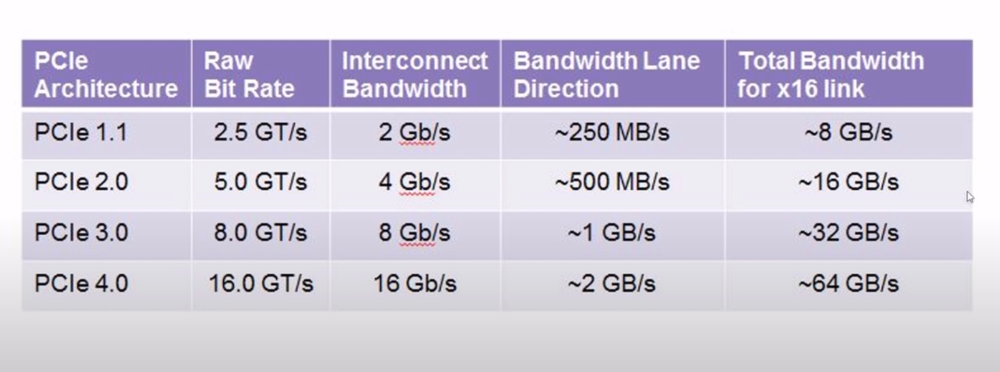
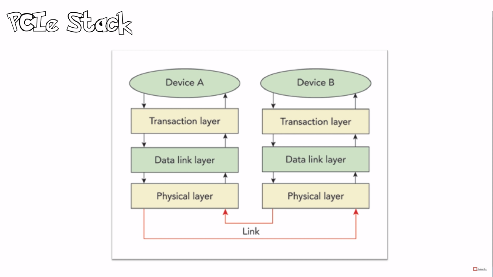

# PCIe

PCIe or PCI Express, PCIe stands for Peripheral Component Interface
Express. It was developed by PCI Special Interest Group, also known as
PCI SIG.

-   PCI was Synchronous which means that it uses one clock.

-   PCI was also transaction or burst orientated. PCI could start a
    transaction. One could specify the starting address and then send as
    much data as needed and then end the transaction. PCI was also 32bit
    bus and had 32 line transfer data. Once the address is specified,
    the manydata cycles can go through. Hence, the PCI bandwidth is the
    best utilized in burst mode.

-   PCI allowed bus mastering. This means that it works in a
    master-slave configuration. The master is the agent that initiated a
    transaction that can be a read or write, while the CPU or host is
    often the bus master. So all the PCI both can potentially claim the
    bus and become the bus master.

-   PCI was also plug and play. So that means that the whole CPU or host
    operating system can basically determine the identity of the PCI
    board in the PCI bus.

## PCI speeds

PCI the first generation which was created around 1992 to 1993, had a
decent speed of 133 to 533 MBps. PCI X, which is the next generation and
was developedaround 1995, had one GBps. The latest, PCIe architectures,
have very highr data rates as mentioned below:

## PCIe features

-   PCIe is a point to point system. So one can have a master and slave
    similar to RS-232.

-   PCIe is a serial bus, which means it requires much fewer pins than a
    parallel bus.

-   PCIe is also scalable and allows for lane aggregation. This means
    that if a single lane can transfer 2GB/s another lane can transfer
    4GB/s, thus scaling up the bandwidth two times.

-   PCIe is also packet based transaction protocol similar to ethernet
    and it uses the same memoryIO configuration address space as PCI.
    which means it's backward compatible with PCI.

-   PCIe also has improved data integrity and error handling.

## PCI connector

PCI Express comes commonly in two sizes: The 1 line and the 16 line. The
1 line is used for regular boards and 16 lines are useful graphic cards.
The 1 link connect has 36 contacts arranged in two rows of 18 contacts.
Out of the 36 contacts, only six are useful to transfer data. The rest
are power lines as well as auxiliary signals.\
The six function opens are use in three pairs. The first pair is called
REFCLK, which is the reference clock pair. The Second pair is your PER,
which is a received pair. And the last one is a transmit pair, which is
called PET.\
So the pairs are often referred to as differential pairs because a
signal from a pair carries the same signal, but with one inverted from
the other. The reason for using differential pairs is mainly for
reliability of transmission.

## PCIe clock recovery

At speeds starting at 2.5 GHz, the point to point architecture is still
a challenge to get working because the duration of each part is so
short. The timing jitter, which is the timing, uncertainty surrounding
the arrival each but becomes a problem. And even if each signal pair had
an associated clock pair transferred along with it the clockpair also be
subjected to timing jitter. So instead, a new technique called clock
recovery is used.\
Basically for each signal pair, a pair receiver looks at the signal
transitions a bit zero,followed by a bit one or vice versa from which it
can infer the position of the surrounding bits.

### 8b/10b encoding

So one problem is that many successive bits are transmitted with the
same value. Like a lot of zeros or a lot of ones and also no signal
transition is seen.\
So extra transmit transmitted to ensure that the signal transitions are
not too far apart, which synchronizes the clock recovery mechanism. The
extra bits are sent using a scheme called 8b/10b encoding, so that for
each 8 bits of useful data inputs are actually transmitteda 20 percent
overhead, basically in a specific way that guarantees enough signal
transitions.\
Unfortunately, that also means that for 2.5 gigahertz we only have 250
mbps of useful bandwidth per pair, instead of the three 312 mbps, which
would usually get without encoding overhead.\
\
Differential pair lanes:\
Advantages\
1. It is more immune to external interference's like EMF or
electromagnetic fields.\
2. It can operate at low voltages. Lower voltages also mean lower power
consumption and thus help for Clock recovery to get a more precise
signal transition.\
\
Disadvantage\
1. It takes twice as many wires to transmit one signal.\

### Packetized transactions

PCI Express is a serial bus. Hence, from a computer's perspective, it is
a conventional bus where read and write transactions can be achieved.
The trick is that all operations are packetized.\
\
Let us assume the CPU wants to write some data to the device. It folds
the order to the PCI Express bridge, which generates a packet. The
packet contains the address and data to be written and is forwarded
serially to the targeted device. And thus the device depacketizes the
data and executes it.\
\
While reading the data, the bridge forwards packet to the targeted
device which now has to execute to read, create a return packet and send
it to the bridge.

## PCIe Stack

As packets are transmitted at very high speed, they have to be
deserialized, assembled, decoded (8b/10b encoding) at destination,
interleaved if multiple lines are used and then checked against line
corruption, which means using CRC checks.\
\
Most of the complex functions mentioned above are handled by the
PCIExpress stack. PCIExpress stack is composed of three layers Physical
layer, Datalink layer, and Transition layer.

PCI Express FPGA core usually which is a combination of the hard and
soft core. This handles all the complexity. So as the user end, one only
has to work in the transaction layer.\

-   Physical layer comprises of pins toggling, 8b/10b encoding,decoding,
    link assembly and disassembly.

-   Data link layer checks the data integrity, checks CRC (cyclic
    redundancy check).

-   PCIe transaction layer receive packets. The packet lengths are
    always multiples of 32 (\"double word\") as they arrive on the 32bit
    bus. Transaction layer accept packets and issues packets as it's
    main task. The packets are structured in a specific format called
    the Transaction Layer Packets \"TLPs\". TLPs contain a header and a
    data payload. The header contains 3 or 4 double words where as the
    data payload can range from 0 to 1023 double words, and even up to
    4096 double words in latest generations.
