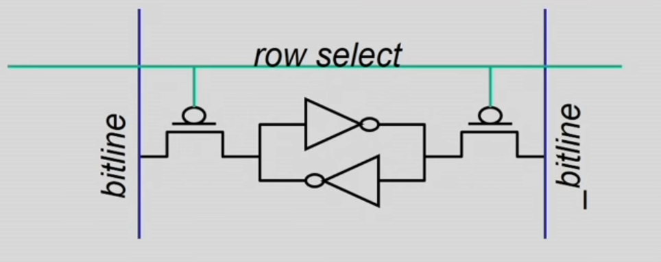
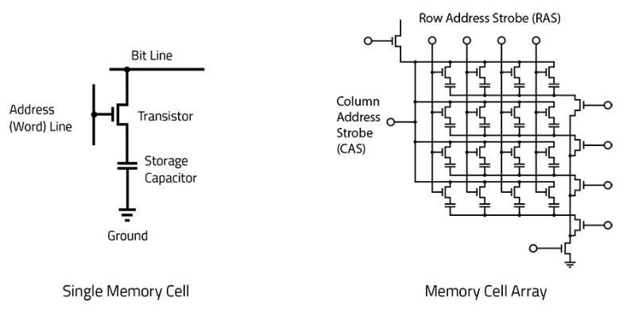
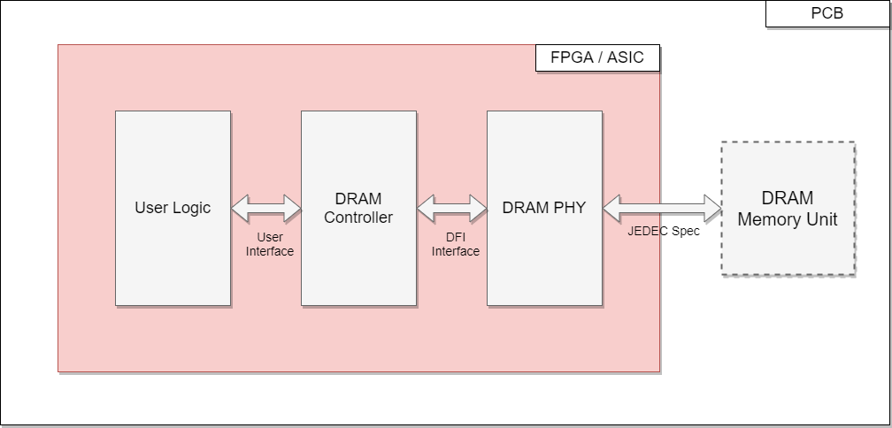
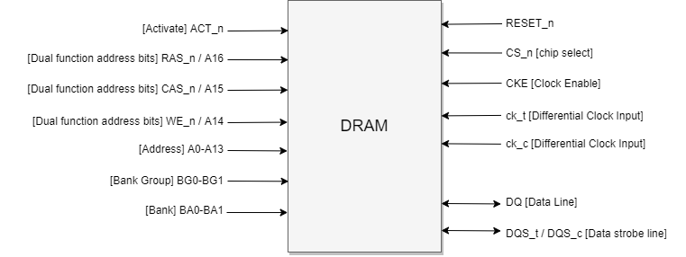
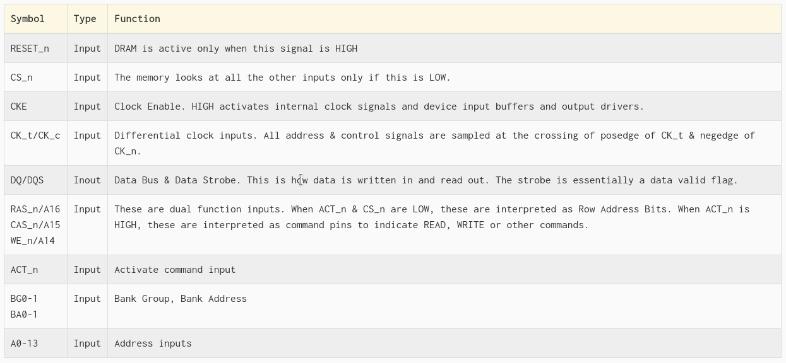

# RAM

**Random Access Memory (RAM)** is the internal memory of the digital
system for storing data, program, and program result. It is a read/write
memory which stores data until the machine is working. There are two
types of RAM:

Static RAM (SRAM)

:   which stores a bit of data using the state of a six transistor
    memory cell.

Dynamic RAM (DRAM)

:   which stores a bit data using a pair of transistor and capacitor
    which constitute a DRAM memory cell.

## SRAM

Static random access memory (static RAM or SRAM) is a type of RAM that
uses latching circuitry (flip-flop) to store each bit. shows an SRAM
cell.

{#SRAM width="5in"}

SRAM cell can store 1 bit of information which consists of a row line
and a bitline. A pair of bit lines is used for storage of every bit, one
is bitline and the other one is bitline compliment. Bitline compliment
is a logical compliment of the bitline.

Two cross coupled NOT gates are connected by two transistor, which are
connected to the row select. So, once a particular row is selected both
T1 and T2 is going to be in on position. So, whatever value is there in
the bitline it flows into the not gates. The value in the bitline will
get stored inside the two cross coupled NOT gates loop. Hence,
transistor will basically act as a switch in this context.

### Large SRAM implementation

These SRAM memory cells, consisting of six transistors, organized as
rows and columns to get an organized structure for the main memory.
Address needs to be generated consisting two components, 'n' bits
representing the rows and 'm' bits representing the columns.

While reading from the memory, the row is chosen by using an n to
$2^(n)$ decoder.Once the row is selected, the entire contents of the row
are transferred to a sense amplifier. And, the single bit extracted by
selecting from 'm' column number.

Read sequence is as follows:

1.  Address decode

2.  Drive row select

3.  Selected bit-cells drive bitlines (entire row is read together)

4.  Column select (Data is ready)

## DRAM

Dynamic random access memory (Dynamic RAM or DRAM) is a type of random
access memory that stores each bit of data in a memory cell, usually
consisting of a tiny capacitor and a transistor, both typically based on
metal-oxide-semiconductor (MOS) technology.

{#DRAMCell width="5in"}

Bits are basically stored as charges on the capacitor and a memory cell
lose charge when it is read. When there exists a potential difference
between the parallel plates of a capacitor, it is called as logic 1.
And, when the potential difference between the two parallel plates of a
capacitor is less than a threshold value, then it is called as logic 0.

-   Bits are stored as charges on capacitor.

-   Memory cell loses charge when read.

-   Memory cell loses charge over time.

-   A flip flop in sense amplifier amplifies and regenerates the bitline
    and data bit is multiplexed out of it.

Since the capacitor discharges over time, the information stored
eventually fades unless the capacitor is periodically REFRESHed. This is
where the 'D' in DRAM comes from. It refers to Dynamic as opposed to
static in SRAM.

### DRAM vs SRAM

**DRAM**

-   Slower access (capacitor)

-   Higher density (transistor, capacitor cell)

-   Lower cost

-   Requires refresh (power, performance, circuitry)

-   Manufacturing requires putting capacitor and logic together

**SRAM**

-   Faster access (no capacitor)

-   Lower density (6 transistor cell)

-   Higher cost

-   No need for refresh

-   Manufacturing compatible with logic process (no capacitor)

Density plays a crucial role in accommodating larger memory in a smaller
size memory. DRAM is preferred in order to implement the primary memory.

### Asynchronous & Synchronous DRAM

In different generations of dynamic RAM there is an improvement in the
speed as well as the reduction in the power consumption. Asynchronous
Dynamic RAM can be considered as the oldest generation of dynamic RAM.
Asynchronous DRAM means that the RAM is not synchronized with the CPU
clock. The obvious disadvantage of this particular type of RAM was that
then CPU does not know the exact timing at which the data will be
available from the RAM on the input output bus.

This problem has been overcome by the next generation of RAM, which is
known as the synchronous DRAM. In case of SDRAM, the RAM is synchronized
with the CPU clock. Now, the advantage of this type of SDRAM is that the
CPU or to be precise, the DRAM memory controller knows the exact timing
or the number of cycles after which the data will be available on the
bus. And hence, the CPU does not need to wait for the memory access.
This also results in increasing memory read & write speeds. The
synchronous DRAM modules are operated at 3.3V. SDRAM or synchronous DRAM
is also known as the Single Data Rate SDRAM as the data is transferred
at the every rising edge of the clock cycle.

### Interleaving

One of the main issues in accessing a single monolithic memory is that A
single monolithic memory array takes long to access and does not enable
multiple accesses in parallel.

The solution to this problem is to divide the entire memory into
multiple banks that can be accessed independently (in the same cycle or
in consecutive cycles).

The key design issue is to map the data into different banks. This issue
is resolved by the process referred to as Interleaving, or Banking. In
interleaving,

-   Address space partitioned into separate banks

-   No increase in data store area

-   Bits in address determines which bank an address maps to

-   Cannot satisfy multiple accesses to the same bank

-   Crossbar interconnect in input as well as output

-   Bank conflicts: Two accesses to the same bank are difficult to
    handle

One simple way of implementing banking is odd even separation. All the
even addresses can be considered as mapped to bank 0 and all the odd
addresses can be considered as mapped to bank 1.

The address provided to read the data is typically referred as \"logical
address\". Logical address is translated to a physical address before it
is presented to the DRAM. The physical address is made up of the
following fields:

-   Bank Group

-   Bank

-   Row

-   Column

These individual fields are then used to identify the exact location in
the memory to read-from or write-to.

### Organization of the DRAM

DRAM consists of multiple hierarchies of channels, DIMM(Dual Inline
Memory Module), rank, chip, bank, row columns, and B-cells/ Memory
Cells. A digital system can request data reads from memory at any point
of time. To read from the memory, address has to be provided and to
write to the memory, data & address has to be provided.

shows the organization of the DRAM.

-   The processor may have multiple channels it may have multiple
    address buses or data buses.

-   A channel is formed by joining multiple DIMMs.

-   The DIMM has a front side (known as rank 0) and a back side (known
    as rank 1).

-   Rank is a set of chips that respond to the same command and same
    address at the same time, but with different pieces of requested
    data.

-   Both ranks are usually provided with a common address, and one rank,
    either rank 0 or rank 1, gives the corresponding data.

-   Rank comprises of multiple chips.

-   Each chip holds and shares a sub component of the entire data held
    by a rank.

-   Each chip has a 3D structure consisting multiple banks with each
    bank consisting a layer of rows and columns.

-   Breaking down a bank, each bank consists of rows as well as columns.

{#DRAMOrganization
width="\\textwidth"}

Going down another level, DRAM consists of a page mode structure. DRAM
bank is a 2D array of cells which consists of rows and columns. Each
Bank contains the following:

-   Memory Arrays

-   Row Decoder

-   Column Decoder

-   Sense Amplifiers

Once the Bank Group and Bank have been identified, the Row part of the
address activates a line in the memory array. This is called the \"Word
Line\" and activating it reads data from the memory array into \"Sense
Amplifiers\". Sense amplifier are kept in row buffers. The Column
address then reads out a part of the word that was loaded into the Sense
Amplifiers. The width of the column is called the \"Bit Line\".

The width of a column is standard it is either 4 bits, 8 bits or 16 bits
wide and DRAMs are classified as x4, x8 or x16 based on this column
width. Another thing to note is that, the width of the data bus is same
as the column width.

### DRAM Subsystem

The DRAM talks to the ASIC or FPGA through the system called as the DRAM
Subsystem. DRAM Subsystem is made up of 3 components:

-   The DRAM memory

-   A DRAM PHY

-   A DRAM Controller

{#DRAMSubsystem
width="\\textwidth"}

 {#tab:DRAMComponents}
  -------------------------------------------------------------------
  **Block**         **Description**
  ----------------- -------------------------------------------------
  Physical (PHY)    The direct interface to the external DRAM memory
  Layer             bus. Instantiates logic resources to generate the
                    memory clock, control/address signals, and
                    data/data strobes to/from the memory. Executes
                    the DRAM power-up and initialization sequence
                    after system reset. Performs read data capture
                    timing training calibration after system reset,
                    and adjusts read data timing using (IDELAY)
                    elements.

  Controller        Generates memory commands (Read, Write,
                    Precharge, Refresh) based on commands from the
                    User Interface block. Optionally, can implement a
                    bank management scheme to reduce overhead with
                    opening and closing of bank/rows. The controller
                    logic takes over the DRAM address/control bus
                    after successful completion of DRAM memory
                    initialization and read timing calibration by the
                    PHY layer.

  User Interface    Custom interface for the user specific
                    application to issue commands and write data to
                    the DRAM memory interface, and to receive read
                    data from the DRAM memory interface.

  Clocking / Reset  Generates clocks using Digital Clock Manager
  Logic             (DCM) module. Synchronizes resets to the various
                    clock domains used in rest of design.
  -------------------------------------------------------------------

  : DRAM Memory Interface Design Major components & Descriptions

The DRAM is soldered down on the board. The PHY and controller, along
with user logic are typically part of the same FPGA or ASIC. The
interface between the user logic and the controller can be user defined
and need not be standard. When the user logic makes a read or write
request to the controller, it issues a logical address. The controller
then converts this logical address to a physical address and issues a
command to the PHY. The Controller and PHY talk to each other over a
standard interface called the DFI interface. The PHY then does all the
lower level signaling and drives the physical interface to the DRAM.
This interface between the PHY and memory is specified in the JEDEC
standard. Think of the controller as the brains and the PHY as the
brains.

When you activate a row, the whole page is loaded into the Sense
Amplifiers, so multiple reads to an already open page are lesser
expensive because you can skip the first step of row activation. The
controller typically has the capability to re-order requests issued by
the user to take advantage of this. To do the re-ordering it uses a
small cache or TCAM and always returns the latest data, so you don't
have to worry about stale data or collisions occurring because of this
re-ordering done by the controller. The PHY contains the analog drivers
and provides the capability to tweak registers to increase drive
strength or change terminations, in order to improve signal integrity.

### Basic DRAM Controller Operation

**DRAM Commands Issued by the Controller:** The commands are detected by
the memory using these control signals: Row Address Select (RAS), Column
Address Select (CAS), and Write Enable (WE) signals. Clock Enable (CKE)
is held High after device configuration, and Chip Select (CS) is held
Low throughout device operation.

**DRAM Memory Commands:**

 description
It is used to deactivate the open row in a particular bank. The bank is
available for a subsequent row activation a specified time (tRP) after
the Precharge command is issued.

Precharge command:

1.  Destructive read: Any read operation that is carried out on a
    capacitor, will discharge the charges that exist over the capacitor
    plates leading to a 0 potential layer any reading operation will
    delete the value stored.

2.  The existing value in the row buffer should be stored back for a new
    read command.

3.  The operation of storing the contents in the row buffer back to the
    appropriate row is known as Precharge.

DRAM devices need to be refreshed regularly after a certain time period.
The circuit to flag the Auto Refresh commands is built into the
controller. The controller issues an Auto Refresh command after it has
completed its current burst. Auto Refresh commands are given the highest
priority in the design of the controller.

Before any read or write commands can be issued to a bank within the
DRAM memory, a row in the bank must be activated using an active
command. After a row is opened, read or write commands can be issued to
the row.

The Read command is used to initiate a burst read access to an active
row. The values in registers select the bank address & the starting
column location in the active row. After the read burst is over, the row
is still available for subsequent access until it is precharged.

The Write command is used to initiate a burst write access to an active
row. The values in registers select the bank address & the starting
column location in the active row. DRAMs use a Write Latency (WL) equal
to Read Latency (RL) minus one clock cycle.\
$Write Latency = Read Latency - 1 = (Additive Latency + CAS Latency) - 1$

DRAM Controller Operation is as follows:

-   In order to carry out the instruction execution with the help of an
    instruction pipeline, during the fetch stage cache memory will be
    used. If the required instruction or data is not available even in
    the last level cache then DRAM is required.

-   Main processing unit has to communicate with the physical DRAM
    device and that communication is carried out by the DRAM controller.
    The controller itself has it's own latency called as Controller
    latency.

-   Multiple requests coming from multiple tiles or multiple processors
    queue up inside the DRAM controller. These requests have to be
    scheduled in order to be executed by the DRAM controller resulting
    in Queuing delay & scheduling delay.

-   Once scheduling is done, these requests have to be converted into a
    couple of basic commands.

-   Appropriate commands are then propagated from the controller to the
    physical memory and generating bus latency.

-   Once the request reaches the physical memory unit, it has to split
    into column address and row address.

-   There are different scenarios while handling a request:

    -   Opened Row Scenario: A scenario where a given row is already
        kept in the row buffer is known as a open row scenario. In this
        scenario, only a Column Address Strobe (CAS) is required. There
        is no need of Activate command.

    -   Closed Row Scenario: A scenario where a given row is not already
        kept in the row buffer is known as a closed row scenario. Access
        to a closed row is as follows:

        -   Activate command

        -   Read/Write command

        -   Precharge command closes the row and prepares the bank for
            next access

    -   Row conflict Scenario: In this scenario, some other row is
        already open. In this case row has to be closed first and then
        Row Address Strobe (RAS) and Column Address Strobe (CAS) has to
        be given one after another with appropriate timing gap between
        them.

-   The physical memory unit returns the data back to the controller
    generating bus latency.

-   Once data reaches DRAM controller, the controller transfers it to
    the CPU or the last level cache.

### Internal Physical Structure of DRAM

{#Top Level
width="\\textwidth"}

Usually, DRAM has clock, reset, chip-select, address and data inputs as
shown in . The mentions all the pins in detail.

{#DRAM ports
width="\\textwidth"}

