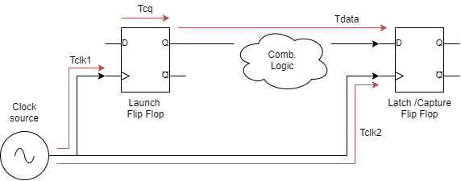
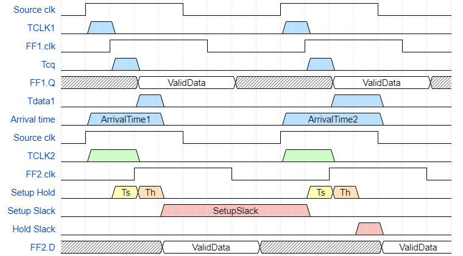

# Timing Analysis

## Introduction

Timing analysis is the methodical analysis of a digital circuit to
determine if the timing constraints imposed by components or interfaces
are met. Typically, this means that you are trying to meet all set-up,
hold, and pulse-width times requirement.\
During designing there is a trade-offs between speed, area, power, and
runtime according to the constraints set by the designer. However, a
chip must meet the timing constraints to operate at the intended clock
rate, so timing is the most important design constraint.

## Reasons for performing Timing Analysis

-   To verify whether the design meets all the timing requirements.

-   To verify that the design for all combinations of components over
    the entire specified operating environment at every time instance.

-   Timing analysis can also help with component selection.

## Types of Timing Analysis

There are 2 type of Timing Analysis:

-   **Static Timing Analysis:** Checks static delay requirements of the
    circuit without any input or output vectors.

-   **Dynamic Timing Analysis:** verifies functionality of the design by
    applying input vectors and checking for correct output vectors.

The basis of all timing analysis are the \"Clock\" and \"Sequential
component\" (Flip-flop, Latches) of the design. Following are a few
directives related to clock and Flip-Flop for Timing analysis.

### Clock directives

-   Clock must be well understood parametrically and glitch-free.

-   Timing analysis must ensure that any clock that is generated by the
    digital logic is clean, of bounded period & duty cycle, and of a
    known phase relationship to other clock signals of interest.

-   The clock must, for both high and low phases, meet the minimum pulse
    width requirements.

-   Certain circuits, may require monitoring maximum jitter. Jitter
    might become a critical parameter, with higher clock speeds.

-   When \"passing\" data from one clock edge to the other, one has to
    ensure that the worst-case duty cycle is used for the calculation.
    Remember: A frequent source of error is the designer assuming that
    every clock will have a 50% duty cycle.

### Flip-Flop directives

-   Make sure that all the parameters of Flip-Flops always met. The only
    exception is when synchronizers are used to synchronize asynchronous
    signals.

-   For asynchronous presets and clears, Recovery and Removal
    constraints must be met.

-   All setup and hold times are met for the earliest/latest arrival
    times for the clock.

-   Setup times are generally calculated by designers and suitable
    margins can be demonstrated under test. Hold times, however, are
    frequently not calculated by designers.

-   When passing data from one clock domain to another, ensure that
    there is either known phase relationships which will guarantee
    meeting setup and hold times or that the circuits are properly
    synchronized.

# Static Timing Analysis (STA)

### Definition

Static timing analysis (STA) is a method of validating the timing
performance of a design by checking all possible paths for timing
violations under worst-case conditions. STA is more thorough because it
checks the worst-case timing for all possible logic conditions, not just
those sensitized by a particular set of test vectors. However, STA can
only check the timing, not the functionality, of a circuit design unlike
functional simulation.

### Description

In static timing analysis, the word static alludes to the fact that this
timing analysis is carried out in an input-independent manner. There are
huge numbers of logic paths inside a chip of complex design. The
advantage of STA is that it performs timing analysis on all possible
paths (whether they are real or potential false paths). However, it is
worth noting that STA is not suitable for all design styles. It has
proven efficient only for fully synchronous designs. Since the majority
of chip design is synchronous, it has become a mainstay of chip design
over the last few decades.\
Static timing analysis involves following steps:

1.  Breaks a design down into timing paths.

2.  Calculates the signal propagation delay along each path.

3.  Checks for violations of timing constraints inside the design and at
    the input/output interface.

## Timing Paths

When performing timing analysis, STA first breaks down the design into
timing paths. Each timing path consists of the following elements:

1.  **Startpoint** The start of a timing path where data is launched by
    a clock edge or where the data must be available at a specific time.
    Every startpoint must be either an input port or a register clock
    pin.

2.  **Combinatorial logic network** Elements that have no memory or
    internal state. Combinatorial logic can contain AND, OR, XOR, and
    inverter elements, but cannot contain Flip-Flops, latches,
    registers, or RAM.

3.  **Endpoint** The end of a timing path where data is captured by a
    clock edge or where the data must be available at a specific time.
    Every endpoint must be either a register data input pin or an output
    port.

A combinatorial logic cloud might contain multiple paths, as shown in
the . STA uses the longest path to calculate a maximum delay and the
shortest path to calculate a minimum delay.

The STA tool analyzes all the paths from each and every startpoint to
each and every endpoint and compares it against the constraint that
(should) exist for that path. All paths should be constrained, most
paths are constrained by the definition of the period of the clock, and
the timing characteristics of the primary inputs and outputs of the
circuit.

## Types of Timing Paths

There are 4 types of Timing Paths:

1.  Data Path

2.  Clock Path

3.  Clock Gating Path

4.  Asynchronous Path

Each of the Timing Paths, is explained with the help of in sections
below.

### Data path

Data path is a path from a clock input port or Clock pin, through the
Flip-Flop/latch/memory (sequential cell), to the Data input pin of the
sequential element.

-   Start Point: Input port of the design (for data from some external
    source) or,\
    Clock pin of the Flip-Flop/latch/memory (sequential cell).

-   End Point: Data input pin of the Flip-Flop/latch/memory (sequential
    cell) or,\
    Output port of the design (for the data captured by some external
    sink).

#### Types of Data Paths

With the combination of 2 types of Starting Points and 2 types of End
Points, there are 4 types of Timing Paths, which are mentioned below:

1.  Input pin/port to Register(Flip-Flop).

2.  Input pin/port to Output pin/port.

3.  Register (Flip-Flop) to Register (Flip-Flop)

4.  Register (Flip-Flop) to Output pin/port

-   PATH1- starts at an input port and ends at the data input of a
    sequential element. (Input port to Register)

-   PATH2- starts at the clock pin of a sequential element and ends at
    the data input of a sequential element. (Register to Register)

-   PATH3- starts at the clock pin of a sequential element and ends at
    an output port.(Register to Output port).

-   PATH4- starts at an input port and ends at an output port. (Input
    port to Output port)

### Clock Path

As per , Clock path is a path from a clock input port or cell pin,
through one or more buffers or inverters, to the clock pin of a
sequential element for data setup and hold checks. In between the Start
point and the end point there may be lots of Buffers/Inverters/clock
divider.

-   Start Point: Clock input port

-   End Point: Clock pin of the Flip-Flop/latch/memory (sequential cell)

### Clock Gating Path

As per , Clock path may be passed trough a gated element to achieve
additional advantages. this type of clock path is called as gated clock
path. Clock gating path is a path from an input port to a clock-gating
element for clock gating setup and hold checks.

-   Start Point: Input port of the design

-   End Point: Input port of clock-gating element.

### Asynchronous path

As per , asynchronous path is a path from an input port to an
asynchronous set or clear pin of a sequential element; for recovery and
removal checks.

-   Start Point: Input port of the design

-   End Point: Set/Reset/Clear pin of the Flip-Flop/latch/memory
    (sequential cell)

As you know that the functionality of set/reset pin is independent from
the clock edge. Its level triggered pins and can start functioning at
any instance of time. In other words, this path is not synchronous with
the rest of the circuit and hence is called as Asynchronous path.

## Other types of Paths

There are few more types of path which are used during timing analysis.
Those are a subset of above mentioned paths with some specific
characteristics. Other types of Paths include:

-   Critical path

-   False Path

-   Multi-cycle path

-   Single Cycle path

-   Launch Path

-   Capture Path

-   Longest Path ( Also know as Worst Path, Late Path, Max Path, Maximum
    Delay Path)

-   Shortest Path ( Also Know as Best Path, Early Path, Min Path,
    Minimum Delay Path)

## Setup and Hold Time

Say, an Input \"DIN\" and an external clock \"CLK\" are buffered and
passed through a combinational logic to reach a synchronous input and a
clock input of a D Flip-Flop (say positive edge triggered). To capture
the data correctly at D Flip-Flop, data should be present at the time of
positive edge of clock signal at the Clk pin.

Where,

-   $T_{pdDIN}$: Propagation delay of DIN

-   $T_{pdClk}$: Propagation delay of CLK

-   $T_{s(in)}$: Setup time of the system

-   $T_{h(in)}$: Hold time of the system

-   $T_{s}$: Setup time of the D Flip-Flop

-   $T_{h)}$: Hold time of the D Flip-Flop

-   DIN: System input

-   CLK: System clock

In an ideal case, the setup and hold time would be zero. But still, 2
cases would arise.

-   $T_{pdDIN} > T_{pdClk}$: For a successful capture, the data should
    be stable for $T_{pdDIN} - T_{pdClk} = T_{S(in)}$ time at DIN pin
    before the positive clock edge at CLK pin. This Time \"$T_{s(in)}$\"
    is know as Setup time of the System.

-   $T_{pdDIN} < T_{pdClk}$: For a successful capture, the data should
    remain stable for \"$T_{h(in)}$\" time at DIN pin after the positive
    clock edge at CLK pin. This time \"$T_{h(in)}$\" is know as Hold
    Time of the System.

From the above conditions, both the conditions are mutually exclusive.
But we have to consider few more things in this.

-   Worst case and best case (Max delay and min delay): Considering the
    environmental & Operating(PVT) conditions, analysis is performed for
    the worst case (max delay) and best case (min delay).

-   Shortest Path or Longest path (Min Delay and Max delay): If a
    combinational logic has multiple paths, then the analysis is
    performed for the shortest path (min delay) & longest path (max
    delay).

In other words,

-   $T_{pdDIN(max)} > T_{pdClk(min)}$:
    $$Setup Time = T_{pdDIN(max)} - T_{pdClk(min)}$$

-   $T_{pdDIN(min)} < T_{pdClk(max)}$:
    $$Hold Time = T_{pdClk(max)} - T_{pdDIN(min)}$$

When a hold check is performed we have to consider two things:

-   Minimum delay along the data path

-   Maximum delay along the clock path

When a setup check is performed we have to consider two things:

-   Maximum delay along the data path

-   Minimum delay along the clock path

### Definition

**Setup time** is the minimum amount of time the data signal should be
held steady before the clock event so that the data are reliably sampled
by the clock. In other words, Setup time is the minimum amount of time
required for the input of a Flip-Flop to be stable before the clock edge
comes along.\
**Hold time** is the minimum amount of time the data signal should be
held steady after the clock event so that the data are reliably sampled.
In other words, Hold time is the minimum amount of time required for the
input of a Flip-Flop to be stable after the clock edge comes along.\

As the D Flip-Flop can be constructed with various implementations like,
JK Flip-Flop, master slave Flip-Flop, Using 2 D type latches etc. Since,
the internal circuitry is different for each type of Flip-Flop, the
Setup and Hold time is different for every Flip-Flop.

## Setup and Hold Violation

If the data is not stable before the Setup time calculated from active
edge of the clock, there is a Setup violation at that Flip-Flop.\
If the data is not stable after Hold time calculated from active edge of
the clock, there is a hold violation at that Flip-Flop.

is used to explain the Setup and Hold time Violation. The register
transfer level is implemented on the hardware with VLSI technologies.
The actual implemented hardware looks exactly like this instance of RTL
from . This representation is the most commonly occurring structure
inside any digital design hardware implementations. Two registers
working on a single clock launching and capturing data with some form of
combinatorial logic sitting between the two.

Following are the basic concepts of Timing Analysis & Setup, Hold
Violation:

-   **Launch Edge** the edge which \"launches\" the data from source
    register.

-   **Latch/Capture Edge** the edge which \"Latches/Captures\" the data
    at destination register (with respect to the launch edge).

-   **Launch Flip-Flop** the Flip-Flop which \"launches\" the data on
    the launch edge.

-   **Latch/Capture Flip-Flop** the Flip-Flop which \"Latches/Captures\"
    the data on the Latch/Capture edge.

-   **Data Arrival Time** The time for data to arrive at destination
    register's D input. Setup time is not considered while calculating
    Data Arrival Time.
    $$Data Arrival Time = launch edge + Tclk1 + Tcq +Tdata$$

-   **Data Required Time (Setup)** The minimum time required for the
    data to get latched into the destination register.
    $$Data Required Time Setup = Clock Arrival Time - Tsu - Setup Uncertainty$$

-   **Data Required Time (Hold)** The minimum time required for the data
    to get latched into the destination register
    $$Data Required Time Hold = Clock Arrival Time + Th + Hold Uncertainty$$

-   **Setup Slack** The margin by which the setup timing requirement is
    met. It ensures launched data arrives in time to meet the latching
    requirement. One reason for negative slack might be a large
    combinatorial logic. One of the Solutions: One more Flip-Flop can be
    added by breaking combinatorial logic into 2 parts. Setup slack is
    calculated on the next clock edge. And hence, it is dependant on
    clock frequency. If the value of the setup slack is

    -   positive: there is no setup violation.

    -   negative: (Data Arrival Time \> Data Required Time(Setup))
        Timing requirement is not met.

    $$Setup Slack = Data Required Time(Setup) - Data Arrival Time$$
    Where,

    -   Arrival time (max) = clock delay FF1 (max) + Clk2Q delay FF1
        (max) + comb. Delay( max)

    -   Required time = clock adjust + clock delay FF2(min) - Set up
        time FF2

    -   Clock adjust = clock period (since setup is analyzed at next
        edge)

-   **Hold Slack** The margin by which the hold timing requirement is
    met. It ensures latch data is not corrupted by data from another
    launch edge. It also prevents \"double-clocking\". Hold slack is
    calculated on a single clock edge. And hence, it is not dependant on
    clock frequency. If the value of the Hold slack is

    -   positive: There is no setup violation. Data is not corrupted by
        the data from another launch edge.

    -   negative: Timing requirement is not met. Data is corrupted by
        the data from another launch edge.

    $$Hold slack = Data Arrival Time - Data Required Time(Hold)$$ Where,

    -   Arrival time (min) = clock delay FF1 (min) + Clk2Q delay FF1
        (min) + comb. Delay( min)

    -   Required time = clock adjust + clock delay FF2 (max) + hold time
        FF2

    -   Clock adjust = 0 (since hold is analyzed at same edge)

-   **Maximum Clock Frequency**: is the reciprocal of maximum delay out
    of (register to register, clk to q, & pin to pin delays\
    MaxClkFreq = 1 / max(Reg2Reg delay, Clk2Q delay, Pin2Pin delay).
    Where,

    -   Reg2Reg Delay = Clk2Q delay of FF1(max) + comb delay(max) +
        setup time of FF2.

    -   Clk2Q Delay = Clock delay w.r.t FF(max) + Clk2Q delay of FF1
        (max) + comb delay (max)

    -   Pin2Pin delay = Comb delay between input pin to output pin (max)

-   **Removal** The minimum time an asynchronous signal must be
    de-asserted AFTER clock edge.

-   **Recovery** The minimum time an asynchronous signal must be
    de-asserted BEFORE clock edge.

Formulae

-   **Setup Calculations**

    -   Setup Slack = Data Required Time(Setup) - Data Arrival Time

    -   Arrival time (max) = clock delay FF1 (max) + Clk2Q delay FF1
        (max) + comb. Delay( max)

    -   Required time = clock adjust + clock delay FF2(min) - Set up
        time FF2

    -   Clock adjust = clock period (since setup is analyzed at next
        edge)

-   **Hold Calculation**

    -   Hold slack = Data Arrival Time - Data Required Time(Hold)

    -   Arrival time (min) = clock delay FF1 (min) + Clk2Q delay FF1
        (min) + comb. Delay( min)

    -   Required time = clock adjust + clock delay FF2 (max) + hold time
        FF2

    -   Clock adjust = 0 (since hold is analyzed at same edge)

-   **Maximum Clock Frequency**:

    -   MaxClkFreq = 1 / max(Reg2Reg delay, Clk2Q delay, Pin2Pin delay)

    -   Reg2Reg Delay = Clk2Q delay of FF1(max) + comb delay(max) +
        setup time of FF2.

    -   Clk2Q Delay = Clock delay w.r.t FF(max) + Clk2Q delay of FF1
        (max) + comb delay (max)

    -   Pin2Pin delay = Comb delay between input pin to output pin (max)

## Delay Calculation

After breaking down a design into a set of timing paths, an STA tool
calculates the delay along each path. The total delay of a path is the
sum of all cell and net delays in the path. **Cell delay** is the amount
of delay from input to output of a logic gate in a path. In the absence
of back-annotated delay information from an SDF file, the tool
calculates the cell delay from delay tables provided in the logic
library for the cell.

Typically, a delay table lists the amount of delay as a function of one
or more variables, such as input transition time and output load
capacitance. From these table entries, the tool calculates each cell
delay.

Net delay is the amount of delay from the output of a cell to the input
of the next cell in a timing path. This delay is caused by the parasitic
capacitance of the interconnection between the two cells, combined with
net resistance and the limited drive strength of the cell driving the
net.

STA then checks for violations of timing constraints, such as setup and
hold constraints:

A setup constraint specifies how much time is necessary for data to be
available at the input of a sequential device before the clock edge that
captures the data in the device. This constraint enforces a maximum
delay on the data path relative to the clock edge. A hold constraint
specifies how much time is necessary for data to be stable at the input
of a sequential device after the clock edge that captures the data in
the device. This constraint enforces a minimum delay on the data path
relative to the clock edge. The following example shows how STA checks
setup and hold constraints for a Flip-Flop

**Reset signal** A Reset signal is required to initialize a hardware
design for system operation and to force a hardware into a known state
for simulation. There are two types of reset.

Synchronous Reset: A synchronous reset signal will only reset the state
of the Flip-Flop on the active edge of the clock.

Asynchronous Reset: An asynchronous reset will reset the state of the
Flip-Flop asynchronously i.e. no matter what the clock signal is. This
is considered as high priority signal and system reset happens as soon
as the reset assertion is detected.

Synchronous reset is good as everything's predictable. But with
asynchronous resets should not cause issues only if the recovery and
removal conditions are met. Right?

Asynchronous resets have a number of drawbacks:

1.  They may cause metastability in Flip-Flops, leading to a
    non-deterministic behavior.

2.  The asynchronous resets may incur reliability problems.

Steps to Using TimeQuest

1.  Generate timing netlist

2.  Read SDC file

3.  Update timing netlist

4.  Generate timing reports

## Timing Constraints

### About XDC Constraints

XDC constraints are a combination of:

-   Industry standard Synopsys Design Constraints (SDC), and

-   Xilinx proprietary physical constraints

XDC constraints have the following properties:

-   They are not simple strings, but are commands that follow the Tcl
    semantic.

-   They can be interpreted like any other Tcl command by the Vivado Tcl
    interpreter.

-   They are read in and parsed sequentially the same as other Tcl
    commands.

### Recommended Constraints Sequence

-   Timing Assertions Section

    -   Primary clocks

    -   Virtual clocks

    -   Generated clocks

    -   Clock Groups

    -   Input and output delay constraints

-   Timing Exceptions Section

    -   False Paths

    -   Max Delay / Min Delay

    -   Multicycle Paths

    -   Case Analysis

    -   Disable Timing

-   Physical Constraints Section

    -   located anywhere in the file, preferably before or after the
        timing constraints

    -   or stored in a separate XDC file

### create_clock

A primary clock is a board clock that enters the design either through
an input port, or A gigabit transceiver output pin (for example, a
recovered clock). A primary clock can be defined only by the
create_clock command. A primary clock must be attached to a netlist
object. This netlist object represents the point in the design from
which all the clock edges originate and propagate downstream on the
clock tree. create_clock constraint constrains all the reg to reg paths
running on a particular clock.\

ex. create_clock -period 10 \[get_ports clk\] -waveform(o) \"duty
cycle\"

#### virtual clock

A virtual clock is a clock without any source. In other words, a clock
that has been defined, but has not been associated with any pin/port. TO
constrain virtual clocks, no arguments like \"get_ports\" are used.\

ex. create_clock -period 10 -waveform(o) \"duty cycle\"

### set_clock_uncertainty

Modelling clock skew Uncertainty models the maz delay difference between
clock network branches (Clock skew)\

clock Uncertainty = clock skew + jitter + time_margin

set_clock_uncertainty -setup 0.5 \[get_ports clk\]

### set_clock_latency

Modelling the latency or latency or insertion delay. Latency is modelled
in 2 parts:

-   Source Latency : delay between clock source to clock port External
    to the

-   Network Latency : delay between clock port to register clock pin

-   Total Latency = Source Latency + Network Latency

Ex. set_clock_latency -source(Source Latency) 0.2 -max(Network Latency)
0.3 \[get_ports clk\]

### set_clock_transition

Modelling transition time. Models the rise & fall time on clock
waveform.\

ex. set_clock_transition -max 0.6 \[get_clocks clk\]

### set_input_delay

Constraining input paths. data arrival time.\

ex. set_input_delay -max 0.6 -clock vclk \[get_ports A\]

### set_output_delay

maximum output delay: amount of delay for the external designs capturing
clock edge.\

ex. set_output_delay -max 0.45 -clock vclk1 \[get_ports B\]

### set_false_path

Tells STA tool that a particular path is not used and should not be
considered for the analysis.\

ex. set_false_path -from \[get_clocks clk1\] -to \[get_clocks clk2\]

### set_clock_groups

Tells STA tool that a particular path is not used and should not be
considered for the analysis.\

ex. set_clock_groups -logically_exclusive -group clk1 -group clk2

### Timing effects

Timing effects of

-   Transition time at input ports\

    set_input_transition -max 0.12 \[get_ports A\]

-   Capacitive loading on output ports\

    set_load -max \[expr 30.0/1000\] \[get_ports B\]
