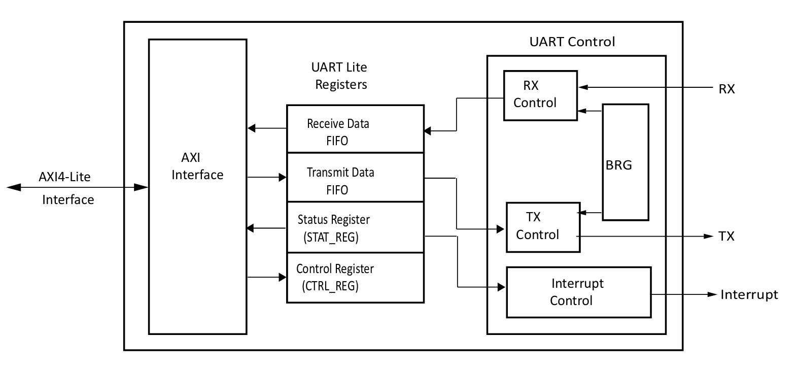
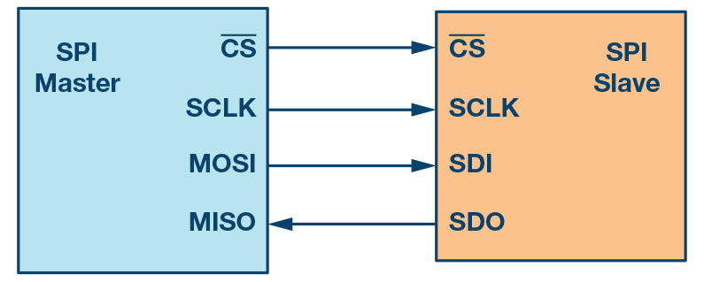
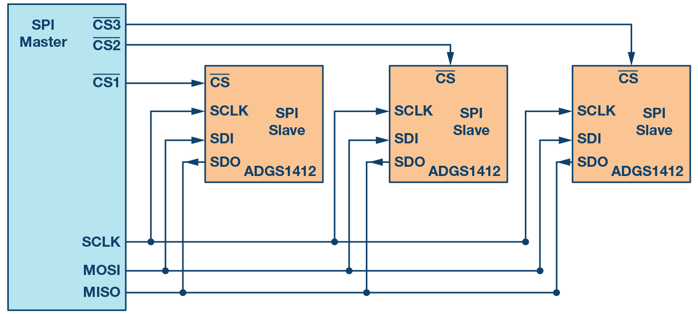
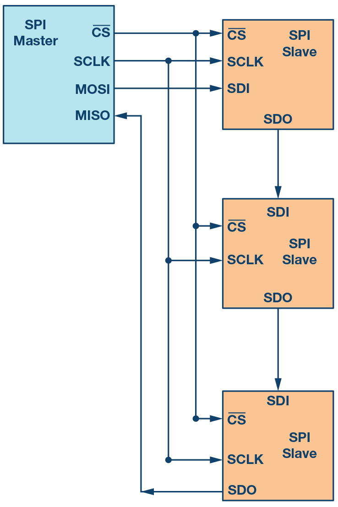

# AXI UART

A universal asynchronous receiver transmitter (UART) is a computer
hardware device for asynchronous serial communication in which the data
format and transmission speeds are configurable. The electric signaling
levels and methods are handled by a driver circuit external to the UART.
Astrome has used multiple AXI UART IPs from Xilinx as UARTs for
debugging and inter-communication between the device. The LogiCORE IP
AXI Universal Asynchronous Receiver Transmitter (UART) Lite interface
connects to the Advanced Microcontroller Bus Architecture (AMBA)
specifications Advanced eXtensible Interface (AXI) and provides the
controller interface for asynchronous serial data transfer. This soft
LogiCORE IP core is designed to interface with the AXI4-Lite protocol.
The internals of AXI UART IP is shown in .

::: center
{#UART
width="\\textwidth"}
:::

# AXI

## Protocol Overview

Xilinx adopted the Advanced eXtensible Interface (AXI) protocol for
Intellectual Property (IP)

There are three types of AXI4 interfaces:

1.  AXI4: For high-performance memory-mapped requirements

2.  AXI4-Lite: For simple, low-throughput memory-mapped communication
    (for example, to and from control and status registers)

3.  AXI4-Stream: For high-speed streaming data.

### Summary of AXI4 Benefits

1.  Productivity: By standardizing on the AXI interface, developers need
    to learn only a single protocol for IP.

2.  Flexibility: Providing the right protocol for the application:

    1.  AXI4 is for memory-mapped interfaces and allows high throughput
        bursts of up to 256 data transfer cycles with just a single
        address phase.

    2.  AXI4-Lite is a light-weight, single transaction memory-mapped
        interface. It has a small logic footprint and is a simple
        interface to work with both in design and usage.

    3.  AXI4-Stream removes the requirement for an address phase
        altogether and allows unlimited data burst size. AXI4-Stream
        interfaces and transfers do not have address phases and are
        therefore not considered to be memory-mapped.

3.  Availability: By moving to an industry-standard, you have access not
    only to the Vivado IP Catalog, but also to a worldwide community of
    ARM partners.

    1.  Many IP providers support the AXI protocol.

    2.  A robust collection of third-party AXI tool vendors is available
        that provide many verification, system development, and
        performance characterization tools. As you begin developing
        higher performance AXI-based systems, the availability of these
        tools is essential.

### How AXI Works

1.  The AXI specifications describe an interface between a single AXI
    master and AXI slave, representing IP cores that exchange
    information with each other. Multiple memory-mapped AXI masters and
    slaves can be connected together using AXI infrastructure IP blocks

2.  Both AXI4 and AXI4-Lite interfaces consist of five different
    channels:

    1.  Read Address Channel

    2.  Write Address Channel

    3.  Read Data Channel

    4.  Write Data Channel

    5.  Write Response Channel

3.  Data can move in both directions between the master and slave
    simultaneously, and data transfer sizes can vary. The limit in AXI4
    is a burst transaction of up to 256 data transfers (Requires a
    single address and then bursts up to 256 words of data). AXI4-Lite
    allows only one data transfer per transaction.

4.  AXI4 Read Transaction:

    ::: center
    {#AXIREAD width="4in"}
    :::

5.  AXI4 Write Transaction:

    ::: center
    {#AXIWRITE
    width="4in"}
    :::

6.  At a hardware level, AXI4 allows systems to be built with a
    different clock for each AXI master-slave pair. In addition, the
    AXI4 protocol allows the insertion of register slices (often called
    pipeline stages) to aid in timing closure.

7.  AXI4-Lite is similar to AXI4 with some exceptions: The most notable
    exception is that bursting is not supported.

8.  The AXI4-Stream protocol defines a single channel for transmission
    of streaming data. The AXI4-Stream channel models the write data
    channel of AXI4. Unlike AXI4, AXI4-Stream interfaces can burst an
    unlimited amount of data.

# SPI

## Protocol Overview

SPI stands for Serial Peripheral Interface. Serial Peripheral Interface
(SPI) is one of the most widely used interfaces between microcontroller
and peripheral ICs such as sensors, ADCs, DACs, shift registers, SRAM,
and others. SPI is a synchronous, full duplex master-slave-based
interface. The SPI interface can be either 3-wire or 4-wire.

::: center
{#SPI width="4in"}
:::

4-wire SPI devices have four signals:

1.  Clock (SPI CLK, SCLK)

2.  Chip select (CS)

3.  Master out, slave in (MOSI)

4.  Master in, slave out (MISO)

The device that generates the clock signal is called the Master. Data
transmitted between the master and the slave is synchronized to the
clock generated by the master. The data from the master or the slave is
synchronized on the rising or falling clock edge. Both master and slave
can transmit data at the same time. SPI devices support much higher
clock frequencies compared to I2C interfaces. SPI interfaces can have
only one master and can have one or multiple slaves. MOSI and MISO are
the data lines. MOSI transmits data from the master to the slave and
MISO transmits data from the slave to the master. The chip select signal
from the master is used to select the slave. This is normally an active
low signal and is pulled high to disconnect the slave from the SPI bus.
When multiple slaves are used, an individual chip select signal for each
slave is required from the master.

## Data Transmission

To begin SPI communication, the master must send the clock signal and
select the slave by enabling the CS signal. Usually chip select is an
active low signal. Hence, the master must send a logic 0 on this signal
to select the slave. SPI is a full-duplex interface both master and
slave can send data at the same time via the MOSI and MISO lines
respectively. During SPI communication, the data is simultaneously
transmitted (shifted out serially onto the MOSI/SDO bus) and received
(the data on the bus (MISO/SDI) is sampled or read in). The serial clock
edge synchronizes the shifting and sampling of the data. The SPI
interface provides the user with flexibility to select the rising or
falling edge of the clock to sample and/or shift the data. Please refer
to the device data sheet to determine the number of data bits
transmitted using the SPI interface.

## Clock Polarity and Clock Phase

In SPI, the master can select the clock polarity and clock phase. The
CPOL bit sets the polarity of the clock signal during the idle state.
The idle state is defined as the period when CS is high and
transitioning to low at the start of the transmission and when CS is low
and transitioning to high at the end of the transmission. The CPHA bit
selects the clock phase. Depending on the CPHA bit, the rising or
falling clock edge is used to sample and/or shift the data. The master
must select the clock polarity and clock phase, as per the requirement
of the slave. Depending on the CPOL and CPHA bit selection, four SPI
modes are available.

::: center
:::

through show an example of communication in four SPI modes. In these
examples, the data is shown on the MOSI and MISO line. The start and end
of transmission is indicated by the dotted green line, the sampling edge
is indicated in orange, and the shifting edge is indicated in blue.\
shows the timing diagram for SPI Mode 0. In this mode, clock polarity is
0, which indicates that the idle state of the clock signal is low. The
clock phase in this mode is 0, which indicates that the data is sampled
on the rising edge and the data is shifted on the falling edge of the
clock signal.

::: center
{#SPIMode0
width="90%"}
:::

shows the timing diagram for SPI Mode 1. In this mode, clock polarity is
0, which indicates that the idle state of the clock signal is low. The
clock phase in this mode is 1, which indicates that the data is sampled
on the falling edge and the data is shifted on the rising edge of the
clock signal.

::: center
{#SPIMode1 width="90%"}
:::

shows the timing diagram for SPI Mode 2. In this mode, the clock
polarity is 1, which indicates that the idle state of the clock signal
is high. The clock phase in this mode is 1, which indicates that the
data is sampled on the falling edge and the data is shifted on the
rising edge of the clock signal.

::: center
{#SPIMode2 width="90%"}
:::

shows the timing diagram for SPI Mode 3. In this mode, the clock
polarity is 1, which indicates that the idle state of the clock signal
is high. The clock phase in this mode is 0, which indicates that the
data is sampled on the rising edge and the data is shifted on the
falling edge of the clock signal.

::: center
{#SPIMode3 width="90%"}
:::

## Multislave Configuration

Multiple slaves can be used with a single SPI master. The slaves can be
connected in regular mode or daisy-chain mode.

### Regular SPI Mode

::: center
{#SPIMultiSlave
width="4in"}
:::

In regular mode, an individual chip select for each slave is required
from the master. Once the chip select signal is enabled (pulled low) by
the master, the clock and data on the MOSI/MISO lines are available for
the selected slave. If multiple chip select signals are enabled, the
data on the MISO line is corrupted, as there is no way for the master to
identify which slave is transmitting the data. As the number of slaves
increase, the number of chip select lines from the master increase. This
can quickly add to the number of inputs and outputs needed from the
master and limit the number of slaves that can be used.

### Daisy-Chain Method

::: center
{#SPIDaisy
width="2in"}
:::

In daisy-chain mode, the slaves are configured such that the chip select
signal for all slaves is tied together and data propagates from one
slave to the next. In this configuration, all slaves receive the same
SPI clock at the same time. The data from the master is directly
connected to the first slave and that slave provides data to the next
slave and so on.

As data is propagated from one slave to the next, the number of clock
cycles required to transmit data is proportional to the slave position
in the daisy chain. shows the clock cycles and data propagating through
the daisy chain. Daisy-chain mode is not necessarily supported by all
SPI devices.

::: center
{#SPIDaisyTiming width="50%"}
:::

# PCIe

PCIe or PCI Express, PCIe stands for Peripheral Component Interface
Express. It was developed by PCI Special Interest Group, also known as
PCI SIG.

-   PCI was Synchronous which means that it uses one clock.

-   PCI was also transaction or burst orientated. PCI could start a
    transaction. One could specify the starting address and then send as
    much data as needed and then end the transaction. PCI was also 32bit
    bus and had 32 line transfer data. Once the address is specified,
    the manydata cycles can go through. Hence, the PCI bandwidth is the
    best utilized in burst mode.

-   PCI allowed bus mastering. This means that it works in a
    master-slave configuration. The master is the agent that initiated a
    transaction that can be a read or write, while the CPU or host is
    often the bus master. So all the PCI both can potentially claim the
    bus and become the bus master.

-   PCI was also plug and play. So that means that the whole CPU or host
    operating system can basically determine the identity of the PCI
    board in the PCI bus.

## PCI speeds

PCI the first generation which was created around 1992 to 1993, had a
decent speed of 133 to 533 MBps. PCI X, which is the next generation and
was developedaround 1995, had one GBps. The latest, PCIe architectures,
have very highr data rates as mentioned below:

::: center
{#PCIeSpeeds width="5in"}
:::

## PCIe features

-   PCIe is a point to point system. So one can have a master and slave
    similar to RS-232.

-   PCIe is a serial bus, which means it requires much fewer pins than a
    parallel bus.

-   PCIe is also scalable and allows for lane aggregation. This means
    that if a single lane can transfer 2GB/s another lane can transfer
    4GB/s, thus scaling up the bandwidth two times.

-   PCIe is also packet based transaction protocol similar to ethernet
    and it uses the same memoryIO configuration address space as PCI.
    which means it's backward compatible with PCI.

-   PCIe also has improved data integrity and error handling.

## PCI connector

PCI Express comes commonly in two sizes: The 1 line and the 16 line. The
1 line is used for regular boards and 16 lines are useful graphic cards.
The 1 link connect has 36 contacts arranged in two rows of 18 contacts.
Out of the 36 contacts, only six are useful to transfer data. The rest
are power lines as well as auxiliary signals.\
The six function opens are use in three pairs. The first pair is called
REFCLK, which is the reference clock pair. The Second pair is your PER,
which is a received pair. And the last one is a transmit pair, which is
called PET.\
So the pairs are often referred to as differential pairs because a
signal from a pair carries the same signal, but with one inverted from
the other. The reason for using differential pairs is mainly for
reliability of transmission.

## PCIe clock recovery

At speeds starting at 2.5 GHz, the point to point architecture is still
a challenge to get working because the duration of each part is so
short. The timing jitter, which is the timing, uncertainty surrounding
the arrival each but becomes a problem. And even if each signal pair had
an associated clock pair transferred along with it the clockpair also be
subjected to timing jitter. So instead, a new technique called clock
recovery is used.\
Basically for each signal pair, a pair receiver looks at the signal
transitions a bit zero,followed by a bit one or vice versa from which it
can infer the position of the surrounding bits.

### 8b/10b encoding

So one problem is that many successive bits are transmitted with the
same value. Like a lot of zeros or a lot of ones and also no signal
transition is seen.\
So extra transmit transmitted to ensure that the signal transitions are
not too far apart, which synchronizes the clock recovery mechanism. The
extra bits are sent using a scheme called 8b/10b encoding, so that for
each 8 bits of useful data inputs are actually transmitteda 20 percent
overhead, basically in a specific way that guarantees enough signal
transitions.\
Unfortunately, that also means that for 2.5 gigahertz we only have 250
mbps of useful bandwidth per pair, instead of the three 312 mbps, which
would usually get without encoding overhead.\
\
Differential pair lanes:\
Advantages\
1. It is more immune to external interference's like EMF or
electromagnetic fields.\
2. It can operate at low voltages. Lower voltages also mean lower power
consumption and thus help for Clock recovery to get a more precise
signal transition.\
\
Disadvantage\
1. It takes twice as many wires to transmit one signal.\

### Packetized transactions

PCI Express is a serial bus. Hence, from a computer's perspective, it is
a conventional bus where read and write transactions can be achieved.
The trick is that all operations are packetized.\
\
Let us assume the CPU wants to write some data to the device. It folds
the order to the PCI Express bridge, which generates a packet. The
packet contains the address and data to be written and is forwarded
serially to the targeted device. And thus the device depacketizes the
data and executes it.\
\
While reading the data, the bridge forwards packet to the targeted
device which now has to execute to read, create a return packet and send
it to the bridge.

## PCIe Stack

As packets are transmitted at very high speed, they have to be
deserialized, assembled, decoded (8b/10b encoding) at destination,
interleaved if multiple lines are used and then checked against line
corruption, which means using CRC checks.\
\
Most of the complex functions mentioned above are handled by the
PCIExpress stack. PCIExpress stack is composed of three layers Physical
layer, Datalink layer, and Transition layer.

::: center
{#PCIeStack width="5in"}
:::

PCI Express FPGA core usually which is a combination of the hard and
soft core. This handles all the complexity. So as the user end, one only
has to work in the transaction layer.\

-   Physical layer comprises of pins toggling, 8b/10b encoding,decoding,
    link assembly and disassembly.

-   Data link layer checks the data integrity, checks CRC (cyclic
    redundancy check).

-   PCIe transaction layer receive packets. The packet lengths are
    always multiples of 32 (\"double word\") as they arrive on the 32bit
    bus. Transaction layer accept packets and issues packets as it's
    main task. The packets are structured in a specific format called
    the Transaction Layer Packets \"TLPs\". TLPs contain a header and a
    data payload. The header contains 3 or 4 double words where as the
    data payload can range from 0 to 1023 double words, and even up to
    4096 double words in latest generations.
