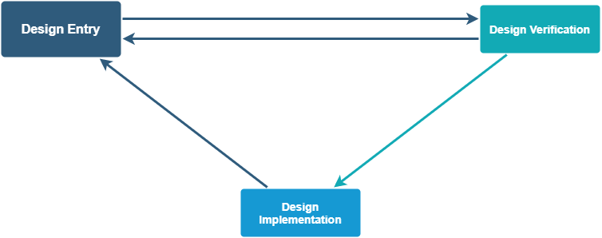
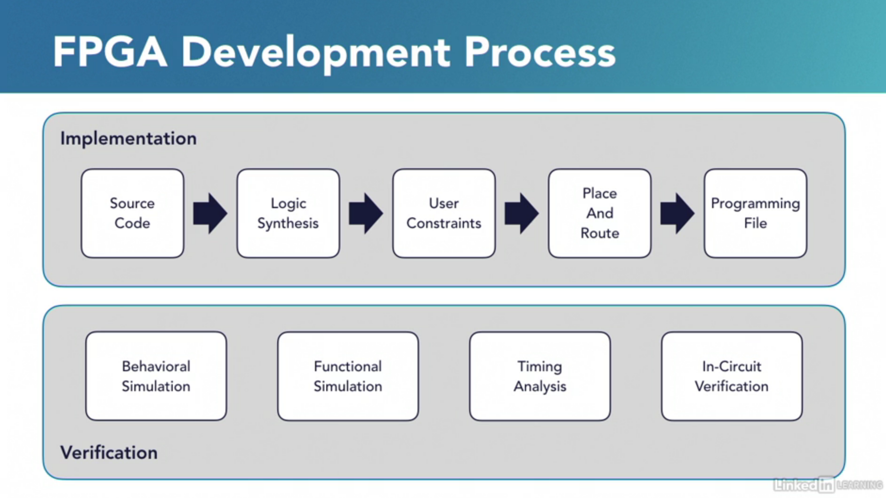
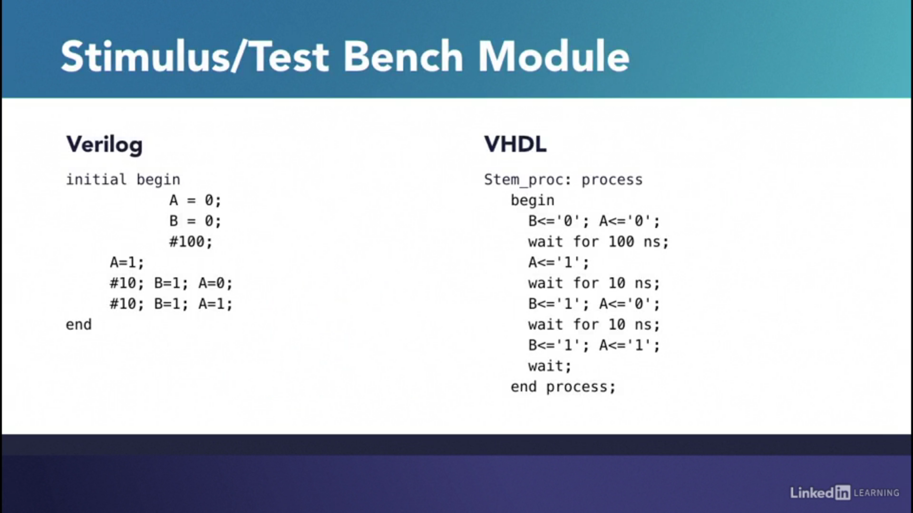
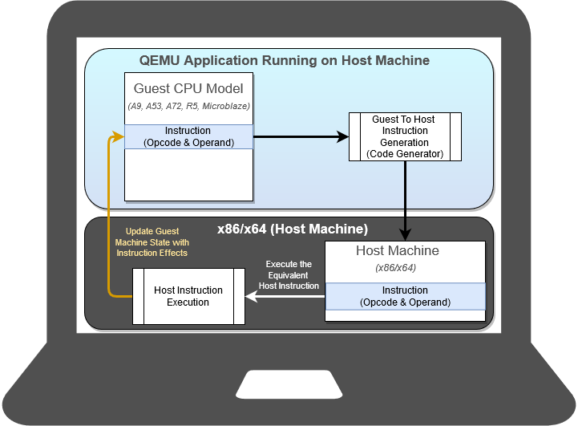

# FPGA development process overview

## FPGA generic design flow

FPGA generic design flow is shown in the .

### Design Entry

Creating design Schematic / HDL Code

### Design Implementation

Partitioning Placing Routing

### Design Verification

Simulation for checking functionality Debugging on the hardware: Logic
Analyser

FPGA development process as shown in the is usually divided in two
parts: implementation and verification.

-   **Implementation** is the process of moving forward from your
    abstract design all the way to the final application. This is done
    by a tool chain of programs that perform a number of steps just like
    a compiler does.

-   **Verification** which is the necessary process of testing the
    design in every step of the implementation. And this is, as you may
    imagine, an iterative process.

These are the steps involved in the implementation process. The first
step is to write the source code which is a description of the hardware
under development. There are several levels of abstraction to write this
code. For example, your code can specify the connections in your system
or the behavior of your system. This code is written in a hardware
description language. The two most popular of which are VHDL and
Verilog. Once the code is written, it goes through logic synthesis. A
process very similar to software compiling. In fact, this whole process
is sometimes called compiling. Logic synthesis consists in converting
the source code into a net list that is a logic representation of the
connections in the design under development. By this stage, not all HDL
code is synthesizable. There are limitations in the FPGA's architecture
that require your code to comply with some rules. A special level of
abstraction known as the register transfer level or RTL is regarded as
synthesizable most of the time. So it's very common to refer to the
source code as RTL code. Once your design is understood by the tool
chain, you get to specify the constraints of the final operational
system. These are the requirements that you want the system to meet. The
most important of these are timing constraints. You have to specify how
fast you need your system to operate. When you inform the tool chain
about your timing requirements, it can use these hints to choose a
combination of connections that will produce the best system possible.
Other aspects specified as user constraints are pin assignments, the
area you want your design to occupy inside the chip, and the logic level
voltages in the pins. Next the design goes through a process called
place and route. This is where the net lists are translated into devices
and connections, and these in turn are assigned to specific parts of the
FPGA in what is known as a floor plan. Cells are assigned to logic
elements, and the interconnects are routed. Finally you get to generate
the programming file. The output of this stage is a binary file
sometimes called a bit stream. The target may be an FPGA or some other
memory. In fact, more often than not, FPGAs implement their internal
configuration memory as volatile RAM. So there's usually an on board
non-volatile memory with a boot up procedure that loads its content into
the FPGAs configuration RAM. This whole process is prone to errors and
bugs. So that's why the verification process is so important. There's at
least one way to verify and validate your design at each step of the
implementation. At the source code stage, you get to perform a
behavioral simulation which reveals how the system behaves logically.
After synthesis, a functional simulation can be performed which uses the
newly produced gate level model. Once the timing constraints have been
considered by the tool chain, a timing analysis can be performed to
predict if there's any risk that your system will not meet these
requirements, and the final application hardware can be put to the test
with the help of in-circuit verification tools often provided by the
FPGA vendor.

The individual blocks Xilinx Vivado Workflow are explained below:

## RTL Design

You can specify RTL source files to create a project and use these
sources for RTL code development, analysis, synthesis and
implementation. Xilinx supplies a library of recommended RTL and
constraint templates to ensure RTL and XDC are formed optimally for use
with the Vivado Design Suite. Vivado synthesis and implementation
support multiple source file types, including Verilog, VHDL,
SystemVerilog, and XDC.

## IP Design and System-Level Design Integration

The Vivado Design Suite provides an environment to configure, implement,
verify, and integrate IP as a standalone module or within the context of
the system-level design. IP can include logic, embedded processors,
digital signal processing (DSP) modules, or C-based DSP algorithm
designs. Custom IP is packaged following IP-XACT protocol and then made
available through the Vivado IP catalog. The IP catalog provides quick
access to the IP for configuration, instantiation, and validation of IP.
Xilinx IP utilizes the AXI4 interconnect standard to enable faster
system-level integration. Existing IP can be used in the design either
in RTL or netlist format.

## IP Subsystem Design

The Vivado IP Integrator environment enables you to stitch together
various IP into IP subsystems using the AMBA AXI4 interconnect protocol.
You can interactively configure and connect IP using a block design
style interface and easily connect entire interfaces by drawing
DRC-correct connections similar to a schematic. Connecting the IP using
standard interfaces saves time over traditional RTL-based connectivity.
Connection automation is provided as well as a set of DRCs to ensure
proper IP configuration and connectivity. These IP block designs are
then validated, packaged, and treated as a single design source. Block
designs can be used in a design project or shared among other projects.
The IP Integrator environment is the main interface for embedded design
and the Xilinx evaluation board interface.

## I/O and Clock Planning

The Vivado IDE provides an I/O pin planning environment that enables I/O
port assignment either onto specific device package pins or onto
internal die pads, and provides tables to let you design and analyze
package and I/O-related data. Memory interfaces can be assigned
interactively into specific I/O banks for optimal data flow. You can
analyze the device and design-related I/O data using the views and
tables available in the Vivado pin planner. The tool also provides I/O
DRC and simultaneous switching noise (SSN) analysis commands to validate
your I/O assignments.

## Xilinx Platform Board Support

In the Vivado Design Suite, you can select an existing Xilinx evaluation
platform board as a target for your design. In the platform board flow,
all of the IP interfaces implemented on the target board are exposed to
enable quick selection and configuration of the IP used in your design.
The resulting IP configuration parameters and physical board
constraints, such as I/O standard and package pin constraints, are
automatically assigned and proliferated throughout the flow. Connection
automation enables quick connections to the selected IP.

### Board Files

## Synthesis

Vivado synthesis performs a global, or top-down synthesis of the overall
RTL design. However, by default, the Vivado Design Suite uses an
out-of-context (OOC), or bottom-up design flow to synthesize IP cores
from the Xilinx IP Catalog and block designs from the Vivado IP
integrator. You can also choose to synthesize specific modules of a
hierarchical RTL design as OOC modules. This OOC flow lets you
synthesize, implement, and analyze design modules of a hierarchical
design, IP cores, or block designs, out of the context of, or
independent from the top-level design. The OOC synthesized netlist is
stored and used during top-level implementation to preserve results and
reduce runtime. The OOC flow is an efficient technique for supporting
hierarchical team design, synthesizing and implementing IP and IP
subsystems, and managing modules of large complex designs.

The Vivado Design Suite also supports the use of third-party synthesized
netlists, including EDIF or structural Verilog. However, IP cores from
the Vivado IP Catalog must be synthesized using Vivado synthesis, and
are not supported for synthesis with a third-party synthesis tool.

Synthesis derives an optimized list of physical components and their
interconnections called a netlist from the model of a digital system
described in an HDL. Synthesis produces a database describing the
elements and structure of a circuit. It specifies how to fabricate a
phyical integrated circuit that implements in silicon the functionality
described by design entry.

## Design Analysis and Simulation

The Vivado Design Suite lets you analyze, verify, and modify the design
at each stage of the design process. You can run design rule and design
methodology checks, logic simulation, timing and power analysis to
improve circuit performance. This analysis can be run after RTL
elaboration, synthesis, and implementation.

The Vivado simulator enables you to run behavioral and structural logic
simulation of the design at different stages of the design flow. The
simulator supports Verilog and VHDL mixed-mode simulation, and results
can be displayed in a waveform viewer integrated in the Vivado IDE. You
can also use third-party simulators that can be integrated into and
launched from the Vivado IDE.

### Simulation

Logic debugging on PC before implementation of hardware. Allows line by
line debug. Allows use of external files to simulate circuit. Testbench
is another wrapper which tests the module you want to test (DUT: Device
under test).

Functions only in the simulation(non synthesizable):

-   \$monitor

-   \$display

-   \$stop

-   \$finish

-   \$error

clock generation:

*always begin\
clk \<= 1; #5;\
clk \<= 0; #5;\
end;*

## Placement and Routing

When the synthesized netlist is available, Vivado implementation
provides all the features necessary to optimize, place and route the
netlist onto the available device resources of the target part. Vivado
implementation works to satisfy the logical, physical, and timing
constraints of the design. For challenging designs the Vivado IDE also
provides advanced floorplanning capabilities to help drive improved
implementation results. These include the ability to constrain specific
logic into a particular area, or manually placing specific design
elements and fixing them for subsequent implementation runs.

## Hardware Debug and Validation

After implementation, the device can be programmed and then analyzed
with the Vivado logic analyzer, or within the standalone Vivado Lab
Edition environment. Debug signals can be identified in the RTL design,
or inserted after synthesis and are processed throughout the flow. Debug
cores can be configured and inserted either in RTL, in the synthesized
netlist, or in the implemented design using incremental implementation
techniques. Existing debug probes can be also modified, or internal
signals routed to a package pin for external probing using the ECO flow.

## Generate Bitstream

## Program FPGA

## FAQs

# Vivado

# HDL

Hardware Description Language (HDL) is a specialized computer language
used to describe the structure and behavior of electronic circuits, and
most commonly, digital logic circuits.

A hardware description language enables a precise, formal description of
an electronic circuit that allows for the automated analysis and
simulation of an electronic circuit. It also allows for the synthesis of
an HDL description into a netlist (a specification of physical
electronic components and how they are connected together), which can
then be placed and routed to produce the set of masks used to create an
integrated circuit.

First, the purpose of an HDL is hardware entry for your toolchain to
understand what system you want to produce. A simulator may be used to
interpret your code in order to predict its behavior. And later a
synthesis tool may be used to implement the design in a FPGA or ASIC.
The built in structure of an HDL based project consists of two
categories of modules.

A. Descriptive modules, where you define your hardware and test bench or
stimulus modules, where you enter a sequence of inputs to your system.

B. Test bench modules are used by simulators to execute the steps you
entered and produce the results you want to see.

In we have two code examples for the same module in Verilog and VHDL.
The module is the one shown in the schematic diagram and it's a
halfAdder, a basic block to implement a circuit that adds two integers.
A halfAdder calculates the addition of a one bit number with another one
bit number. If you look at the Verilog code at the left, you'll see that
the syntax is somewhat similar to the C programming language. Modules
are defined in a similar way to functions in C, but instead of a
parameter list they have a port list because remember, this is a
hardware module. Notice that this list specifies which port is an input
and which port is an output. Next, the body of the module is just two
lines of code which are instantiations of an and gate and an xor gate.
Notice that the first wire specified is the output and the remaining
ones are the inputs. Take your time to read the code and try to
understand what it means.

At the right we have its equivalent in VHDL, which is a language
inspired by the Ada and Pascal programming languages. In VHDL the port
list is specified in what is known as an entity and the implementation
is defined in an architecture. One can notice the differences and
similarities between these languages.

Finally, here's a partial test bench module in both languages describing
the same course of events for a simulation. In this example we have two
registers named A and B, which both take the value of zero. Then there's
a 100 nanosecond pause before assigning one to A and then more
assignments are performed on A and B separated by 10 nanosecond pauses.

## Digital system modeling

There are two main categories of digital systems.

-   **Combinational logic**, where the signals travel from an input
    through the logic circuit, progressing forward with no feedback
    loops, all the way to the output. Combinational systems have no
    memory and thus no notion of time. Every combination of input values
    will always yield the same output. Examples of combinational
    circuits are multiplexers, de-multiplexers, and arithmetic Adders.

-   **Sequential logic** has a combinational part with some feedback
    loops. This is the basic principle for flip flops, which are
    elements capable of holding a value acting as memory. This
    characteristic gives sequential systems a notion of time so they
    require a clock signal, which is a sequence of zeros and ones, at a
    constant known frequency. Examples of sequential systems are
    registers, counters, shift registers, and virtually every useful
    digital system, like a computer.

When it comes to modeling a digital system there are several levels of
abstraction that you may use in your code to let the toolchain know what
hardware you want to implement.

-   Behavioral Model: A rather high level of abstraction is the
    behavioral model in which you tell the toolchain what your system is
    supposed to do, how it's supposed to behave.

-   Structural Model: There's also the structural model where you
    specify connections. Remember that you're designing hardware and so,
    multiple blocks will eventually be connected to each other. So in a
    structural model, you get to specify these connections. This the
    level you'll use when you instantiate modules.

-   Gate-level Model: A lower level of abstraction is the gate level
    model which is very specific on the individual connections inside
    logic cells. This is similar to assembly language where most of the
    time you're advised to leave it to the compiler.

Just like in traditional programming, these levels of abstraction are
not mutually exclusive so you may have parts of your code at different
levels if you need to. Hardware description languages were created to
implement a modular design. So the modules you'll write are describing
blocks of hardware, like a counter, a pre-scaler, an adder, or a
decoder. These modules are instantiated as hardware building blocks, so
a complete digital system is usually created by nesting these block
instances. Now be aware that instantiating hardware blocks inside a loop
makes no sense at all. You would be instructing the toolchain to
dynamically spawn new hardware blocks. This is just not as safe as
allocating memory in a program because you have no guarantees on how the
new hardware will behave. So all hardware modules are rigid. They don't
change dynamically.

### Levels of abstraction

When writing a code in a hardware description language, one gets to
express your digital systems in several levels of abstraction. In
Verilog, there's a traditional distinction between the following levels.

-   Gate level, also called as Structural level: The gate level is the
    assembly language of FPGAs. At this level, all of the connections
    and devices are explicitly described. The building blocks are single
    logic devices or gates. So at the gate level the code only contains
    wires and gates.

-   Register-transfer level(RTL): The register-transfer level is the
    most widely-used level of abstraction, so much so that Verilog and
    VHDL code is often referred to as RTL code. The register-transfer
    level employs higher-level semantics than the gate level.

-   Behavioral level: The behavioral level concentrates on the behavior
    of your system. The code is not always synthesizable, meaning that
    some parts of the code may be a little too ambiguous to successfully
    yield a physical FPGA or ASIC. This level contains elements to
    provide quick information to the development tools, often useful in
    simulations for validation and verification.

These levels are not mutually exclusive. In fact, it's very uncommon to
come across code that uses one level exclusively. Useful digital systems
aren't exclusively written at the behavioral, register-transfer, or gate
level. As one may presume, they may combine modules at different levels
of abstraction.

## Verilog vs SystemVerilog

System Verilog and verilog both Both are IEEE standards, Verilog is IEEE
1364 -2005 (Latest Version)and System verilog is IEEE 1800 - 2017(
Latest version). Verilog is a Hardware Description Language , whereas
System verilog is a combination of Hardware Description Language (HDL)
and Hardware Verification Language (HVL). So, System verilog can be
considered as an extension or a superset of Verilog.

-   **History**\
    Verilog, is the popular Hardware Description Language invented in
    early 1980's. Whereas, System Verilog started initially with a name,
    as Superlog in 2002 and was standardized in 2005 with its own name.\
    System verilog for RTL design is an extension of verilog (2005) and
    has all of its features.System verilog for verification uses
    Object-oriented programming techniques.

-   **Data types** Verilog has majorly two datatypes -- Reg and Wire
    which are 4 valued logic 0,1,x,z. Whereas, System verilog has
    logic(inclusive of Wire & Reg), int, shortint, longint, logic, bit,
    real, realtime, reg, chandle, user defined data type, etc. which are
    both combination of 4 and 2 valued logic.

-   **Memory**Verilog does not allow packed array concept and the
    lifetime of memories will be static. Whereas, System verilog allows
    packed array declaration and the lifetime of memories can be
    dynamic.

-   **Procedural Block** Verilog has a general purpose always block to
    model different types of hardware structures. Whereas, System
    verilog uses three different procedural blocks namely, always_comb ,
    always_ff and always_latch intended to model specific type of
    hardware description.

-   **Construction** Verilog design is based on hierarchy of modules,
    where modules encapsulate the design hierarchy, and communicate with
    other modules through ports. Whereas , System verilog uses Class
    based design.

-   **Interface** Verilog ports (larger designs) for describing a
    module's connectivity with other module is difficult. Whereas,
    System verilog uses interface to reduce the redundancy of port
    declarations between modules.

-   **Random** Verilog uses inbuit system functions like \$random and
    \$urandom, whereas System Verilog uses a method called Randomize().

-   **Constraints** Verilog does not support any control over the
    variable to be randomized,Whereas System verilog uses constraints to
    have a control of what is being randomized.

-   **TB Environment** Verilog does not support for having reusable
    testbenches and so for complex designs verification will be a
    milestone.Whereas, System verilog supports for having reusable
    testbenches.

-   **Synchronisation** SystemVerilog uses interface construct which has
    used for bunching of all the signals along with clocking block which
    is used for synchronisation unlike Verilog in which instantiation
    with the DUT becomes tedious because of large number of signals.

# Petalinux

PetaLinux is a free Xilinx tool which offers everything necessary to
customize, build and deploy Embedded Linux solutions on Xilinx
processing systems. It enables developers to configure, build and deploy
essential open source and systems software to Xilinx silicon, including:

-   FSBL

-   U-Boot

-   ARM Trusted Firmware

-   Linux

-   Libraries and applications

With this tool developers can customize the boot loader, Linux kernel,
or Linux applications. They can add new kernels, device drivers,
applications, libraries, and boot & test software stacks on the included
full system simulator (QEMU) or on physical hardware via network or
JTAG. Some features of Petalinux include:

1.  **Custom BSP Generation Tools** PetaLinux tools will automatically
    generate a custom, Linux Board Support Package including device
    drivers for Xilinx embedded processing IP cores, kernel and boot
    loader configurations.

2.  **Linux Configuration Tools** PetaLinux includes tools to customize
    the boot loader, Linux kernel, file system, libraries and system
    parameters.

3.  **Software Development Tools** PetaLinux tools integrate development
    templates that allow software teams to create custom device drivers,
    applications, libraries and BSP configurations.

4.  **Reference Linux Distribution** PetaLinux provides a complete,
    reference Linux distribution that has been integrated and tested for
    Xilinx devices. The reference Linux distribution includes both
    binary and source Linux packages including:

    -   Boot loader

    -   CPU optimized kernel

    -   Linux applications & libraries

    -   C & C++ application development

    -   Debug

    -   Thread and FPU support

    -   Integrated web server for easy remote management of network and
        firmware configurations

There are seven independent tools that make up the PetaLinux design
flow.

1.  **petalinux-create** tool either creates a new PetaLinux project
    directory structure or a component within the specified project.

2.  **petalinux-config** tool allows you to customize the specified
    project. Either a project is initialized or updated to reflect the
    specified hardware configuration or a specified component is
    customized using a menuconfig interface.

3.  **petalinux-build** tool builds either the entire embedded Linux
    system or a specified component of the Linux system. This tool uses
    the Yocto Project underneath. Whenever petalinux-build is invoked,
    it internally calls bitbake.

4.  **petalinux-boot** command boots MicroBlaze CPU, Zynq and Zynq
    UltraScale devices with PetaLinux images through JTAG/QEMU. With
    JTAG, images are downloaded and booted on a physical board using a
    JTAG cable connection. With QEMU, images are loaded and booted using
    QEMU, the software emulator.

5.  **petalinux-package** tool packages a PetaLinux project into a
    format suitable for deployment. Based on the target package format,
    the supported formats/workflows are boot(.BIN or .MCS), bsp, and
    pre-built.

6.  **petalinux-util** tool provides various support services to the
    other PetaLinux workflows.

7.  **petalinux-upgrade** PetaLinux tool has system software components
    (embedded SW, ATF, Linux, U-Boot, OpenAMP, and Yocto framework) and
    host tool components (Vivado Design Suite, Xilinx Software
    Development Kit (SDK), HSI, and more). To upgrade to the latest
    system software components, you must install the corresponding host
    tools (Vivado design tools). The petalinux-upgrade command resolves
    this issue by upgrading the system software components without
    changing the host tool components.

## Petalinux Design Flow

1.  **Hardware platform creation** Vivado Design Suite

2.  **Create PetaLinux project** petalinux-create -t project

3.  **Initialize PetaLinux project** petalinux-config
    --get-hw-description

4.  **Configure system-level options** petalinux-config

5.  **Create user components** petalinux-create -t COMPONENT

6.  **Configure the Linux kernel** petalinux-config -c kernel

7.  **Configure the root file system** petalinux-config -c rootfs

8.  **Build the system** petalinux-build

9.  **Test the system on qemu** petalinux-boot --qemu

10. **Deploy the system** petalinux-package --boot

11. **Update the PetaLinux tool system software components**
    petalinux-upgrade --url/--file

## QEMU

QEMU (Quick EMUlator) is an open source, cross-platform, system
emulator. It is an executable that runs on an x86 Linux or Windows
operating systems. QEMU can emulate a full system (commonly referred to
as the guest), such as a Xilinx development boards. The emulation
includes the processors, peripherals, and other hardware on the
development board; allowing one to launch an operating system or other
applications on the virtualized hardware. These applications can be
developed using the exact same toolchain that would be used on physical
hardware. QEMU can also interact with the host machine through
interfaces, such as CAN, Ethernet and USB; allowing real-world data from
the host to be used in the guest machine in real time.

Reasons why QEMU is used as an emulator and testing tool:

-   Remote Development

-   Easier Debugging

-   Easier Testing

-   Developing and Running an OS

-   Hardware Modeling and Verification

-   Safety and Security

QEMU works by using dynamic translation. Instructions are translated
from the guest's instruction set to the equivalent host machine
instructions. The equivalent host instructions are then executed on the
host, and the results of those instructions are then pushed back into
the guest machine.

# Version Control: Git, Bitbucket

-   **git config**\
    Utility : To set your user name and email in the main configuration
    file.\
    How to : To check your name and email type in git config --global
    user.name and git config --global user.email. And to set your new
    email or name git config --global user.name = Maitreya Ranade" and
    git config --global user.email = maitreya.ranade@gmail.com"

-   **git init**\
    Utility : To initialise a git repository for a new or existing
    project.\
    How to : git init in the root of your project directory.

-   **git clone**\
    Utility : To copy a git repository from remote source, also sets the
    remote to original source so that you can pull again.\
    How to : git clone \<:clone git url:\>

-   **git status**\
    Utility : To check the status of files you've changed in your
    working directory, i.e, what all has changed since your last
    commit.\
    How to : git status in your working directory. lists out all the
    files that have been changed.

-   **git add**\
    Utility : adds changes to stage/index in your working directory.\
    How to : git add .

-   **git commit**\
    Utility : commits your changes and sets it to new commit object for
    your remote.\
    How to : git commit -m "sweet little commit message"

-   **git push/git pull**\
    Utility : Push or Pull your changes to remote. If you have added and
    committed your changes and you want to push them. Or if your remote
    has updated and you want those latest changes.\
    How to : git pull \<:remote:\> \<:branch:\> and git push
    \<:remote:\> \<:branch:\>

-   **git branch**\
    Utility : Lists out all the branches.\
    How to : git branch or git branch -a to list all the remote branches
    as well.

-   **git checkout**\
    Utility : Switch to different branches.\
    How to : git checkout \<:branch:\> or \*

-   **git stash**\
    Utility : Save changes that you don't want to commit immediately.\
    How to : git stash in your working directory. git stash apply if you
    want to bring your saved changes back.

-   **git merge**\
    Utility : Merge two branches you were working on.\
    How to : Switch to branch you want to merge everything in. git merge
    \<:branch_you_want_to_merge:\>

-   **git reset**\
    Utility : You know when you commit changes that are not complete,
    this sets your index to the latest commit that you want to work on
    with.\
    How to : git reset \<:mode:\> \<:COMMIT:\>

-   **git remote**\
    Utility : To check what remote/source you have or add a new remote.\
    How to : git remote to check and list. And git remote add
    \<:remote_url:\> \*\_git checkout -b \<:branch:\> if you want to
    create and switch to a new branch.

# Scripting

## Shell

Scripts are interpreted, and it's important that the very first two
characters in your script file be the \"#!\" Hash or pound sign and the
exclamation point, sometimes known as bangs, so pound bang should be the
very first two characters. (Eg. #! /bin/bash). Change execute permission
of script file by chmod u+x scriptFile

### Time commands and set variables

Bash has builtin commands.

-   **time** With the time command, you can say time and then another
    command. When that command finishes, bash will report how long it
    took to execute the command. The ouptput of the time command has 3
    values real, user and sys. The real line is how long it took in real
    time like if you had timed it with a stop watch. User and sys are
    CPU times. So how much time the program was actually processing, not
    sleeping, say, or getting preempted by other processes. And user was
    time or instructions in the program itself, and sys was time or
    instructions in the operating system, in the kernel doing something
    for that process.

-   **sleep** With sleep command and for a duration. CPU sleeps for the
    particular duration.

-   **export** Export puts the variable into the environment.

-   **enable** To take a look at the builtin.

-   **compgen minus k** list out the keywords.

Variables:\
Variables in Bash, you assign a value with equal sign. One of the
important things with Bash is no spaces before or after the equal sign.
If the value you want to assign to the variable has any special
characters in it like a space, then make sure you quote it.\
To remove the variable, then you can use the unset Bash command.\
To get the value of a variable, normally, you have to put the dollar
sign in front of it. So echo myvar is \$myvar\
It's important to realize that your shell keeps variables in two
different areas. The area called your environment, or exported
variables, are copied to new processes that you run or, say, new shells
that you run, including a shell script program. So if you want to assign
a variable and then run a shell program to get a value from that
variable, then you need to export it. So in Bash, it's most common just
to use the keyword export. So if you say export mynewvar, then the shell
puts mynewvar in your shell's environment, the set of exported
variables. And whenever it starts a new process, like by running a shell
program, then that new process gets a copy of those variables. They're
not shared. It gets a copy.\
When you create a variable, you can export it at the same time. for eg.
export var=0\
So one of the nice features of a function is that when you change a
variable in a function, it changes the corresponding variable in the
shell. Functions don't get a copy of the variables. They share the
variables.

### Bash startup

When Bash gets started Bash reads some startup files to, say, initialize
some variables. And there's a couple of those in home directory that one
can use to customize settings in Bash. One of them is .bash_profile,
that's read just when Bash is started when you log in. And the file
.bashrc is executed every time a new shell is started.

### Sourcing and aliasing with bash

Another way to execute a shell script is to source it, and one can use
the source command to source a script, or one can use dot space to
source a script. What's different is when you source a script, your
current shell just interprets the commands inside the source script as
if they were done themself. When a script is sourced and the script does
things like assigns a value to a variable, then that's happening in the
calling script itself.For example, sourcing is used to import variable
assignments or definitions of functions. So one can have a script that
defines some functions, and you could just source it, and then you can
call those functions from your script. Another handy thing to do with
Bash is to define alternative, oftentimes shorter alternatives to
commands \"Alias\". To unset an alias, unalias command is used for it.

### echo command

The echo command is how you print a message. There're a few options to
echo:

-   -n : don't print usual trailing newline.

-   -e : tells echo to interpret some special characters.

-   backslash n : is print a newline

-   backslash t : means print a tab character.

-   -E : disables special characters in case you want to see the
    backslash and the n instead of a newline.

Echo is particularly helpful when you want to do file globbing to expand
out the names of things. ls \* shows the contents of the directory
whereas echo \* shows the names of things. Echo is also used for saving
files with the usual file redirection techniques. for eg. \>&2 means
send standard output to the same place as file number two, which is
standard error. This is the technique you use with echo to print error
messages.

### The typeset and declare commands for variables

Local variable is a variable that is private inside of a function. And
when it's changed in the function, it doesn't affect a variable outside
of the function.

This is important because if you write a fairly complicated shell
script, you may have variables you use in the script that you overlook,
and you assign to a variable the same name in a function and you change
the global one. That could be pretty confusing and a tricky bug. So if
you have variables in a function that you only need in the function,
then it's good practice to declare them to be local. And you could do
that by declaring them with the typeset command. If the variable's only
going to have integer values then you can say typeset -i. And that makes
the arithmetic faster. In fact, a little benchmark I did, it was like 10
times faster. Also, if you declare a variable to be an integer then bash
lets you use some integer operations with them.

### Debugging

-   bash prog : run prog don't need execution

-   bash -x prog : echo commands after processing can also do set +/- x
    inside a script to choose which commands to echo.

-   bash -n prog : do not execute commands, check syntax.

-   bash -u : reports usage of unset, variable gives error.

-   lots of echo statements for debugging

-   tee command : redirects to output. eg. cmd \| tee log.file \| \...

-   trap command : similar to breakpoint.

Two more important commands are eval and getopt. For more information
and syntax for any of the commands, please connect to the internet.

## TCL

# CMake

# Linux Commands

## File Commands

-   **ls** Directory listing

-   **ls -al** Formatted listing with hidden files

-   **ls -lt** Sorting the Formatted listing by time modification

-   **cd dir** Change directory to dir

-   **cd** Change to home directory

-   **pwd** Show current working directory

-   **mkdir** dir Creating a directory dir

-   **cat \>file** Places the standard input into the file

-   **more file** Output the contents of the file

-   **head file** Output the first 10 lines of the file

-   **tail file** Output the last 10 lines of the file

-   **tail -f file** Output the contents of file as it grows,starting
    with the last 10 lines

-   **touch file** Create or update file

-   **rm file** Deleting the file

-   **rm -r dir** Deleting the directory

-   **rm -f file** Force to remove the file

-   **rm -rf dir** Force to remove the directory dir

-   **cp file1 file2** Copy the contents of file1 to file2

-   **cp -r dir1 dir2** Copy dir1 to dir2;create dir2 if not present

-   **mv file1 file2** Rename or move file1 to file2,if file2 is an
    existing directory

-   **ln -s file link** Create symbolic link link to file

## Process management

-   **ps** To display the currently working processes

-   **top** Display all running process

-   **kill pid** Kill the process with given pid

-   **killall proc** Kill all the process named proc

-   **pkill pattern** Will kill all processes matching the pattern

-   **bg** List stopped or background jobs,resume a stopped job in the
    background

-   **fg** Brings the most recent job to foreground

-   **fg** n Brings job n to the foreground

## File permission

-   **chmod octal file** Change the permission of file to octal,which
    can be found separately for user,group,world by adding, 4-read(r)
    2-write(w) 1-execute(x). The digits you can use and what they
    represent are: 0: No permission, 1: Execute permission, 2: Write
    permission, 3: Write and execute permissions, 4: Read permission, 5:
    Read and execute permissions, 6: Read and write permissions, 7:
    Read, write and execute permissions.

-   **sudo chown owner:group file** Allows you to change the owner and
    group owner of a file.

## Searching

-   **grep pattern file** Search for pattern in file

-   **grep -r pattern dir** Search recursively for pattern in dir

-   **command \| grep pattern** Search pattern in the output of a
    command

-   **locate file** Find all instances of file

-   **find . -name filename** Searches in the current directory
    (represented by a period) and below it, for files and directories
    with names starting with filename

-   **pgrep pattern** Searches for all the named processes , that
    matches with the pattern and, by default, returns their ID

## System Info

-   **date** Show the current date and time

-   **cal** Show this month's calender

-   **uptime** Show current uptime

-   **w** Display who is on line

-   **whoami** Who you are logged in as Unix/Linux Command Reference

-   **finger user** Display information about user

-   **uname -a** Show kernel information

-   **cat /proc/cpuinfo** Cpu information

-   **cat proc/meminfo** Memory information

-   **man command** Show the manual for command

-   **df** Show the disk usage

-   **du** Show directory space usage

-   **free** Show memory and swap usage

-   **whereis app** Show possible locations of app

-   **which app** Show which applications will be run by default

## Compression

-   **tar cf file.tar** file Create tar named file.tar containing file

-   **tar xf file.tar** Extract the files from file.tar

-   **tar czf file.tar.gz** files Create a tar with Gzip compression

-   **tar xzf file.tar.gz** Extract a tar using Gzip

-   **tar cjf file.tar.bz2** Create tar with Bzip2 compression

-   **tar xjf file.tar.bz2** Extract a tar using Bzip2

-   **gzip file** Compresses file and renames it to file.gz

-   **gzip -d file.gz** Decompresses file.gz back to file

## Network

-   **ping host** Ping host and output results

-   **whois domain** Get whois information for domains

-   **dig domain** Get DNS information for domain

-   **dig -x host** Reverse lookup host

-   **wget file** Download file

-   **wget -c file** Continue a stopped download

## Shortcuts

-   **ctrl+c** Halts the current command

-   **ctrl+z** Stops the current command, resume with fg in the
    foreground or bg in the background

-   **ctrl+d** Logout the current session, similar to exit

-   **ctrl+w** Erases one word in the current line

-   **ctrl+u** Erases the whole line

-   **ctrl+r** Type to bring up a recent command

-   **!!** Repeats the last command

-   **exit** Logout the current session

## Miscellaneous

-   **alias** Give your own name to a command or sequence of commands
