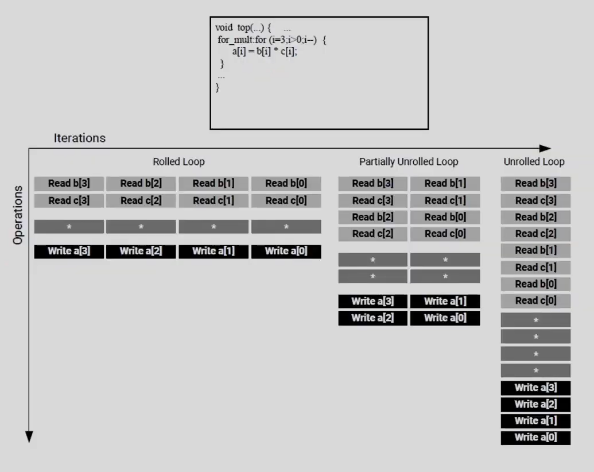
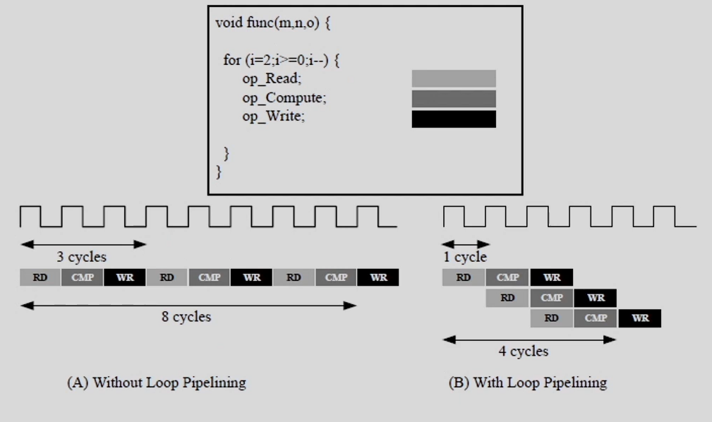
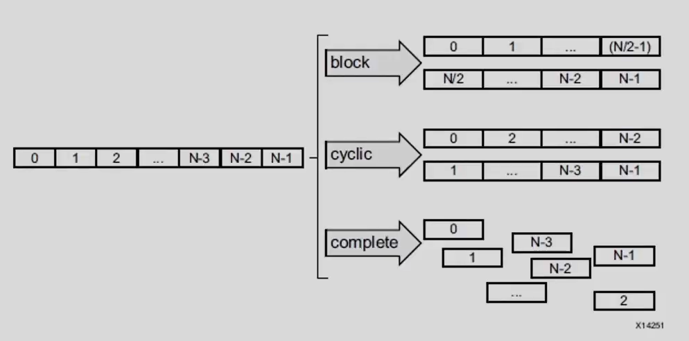

- [Design Principles for Software Programmers](#design-principles-for-software-programmers)
  - [Introduction](#introduction)
  - [Computer Architecture](#computer-architecture)
  - [Three Paradigms for Programming FPGAs](#three-paradigms-for-programming-fpgas)
    - [Producer-Consumer Paradigm](#producer-consumer-paradigm)
    - [Streaming Data Paradigm \"Dataflow\"](#streaming-data-paradigm-dataflow)
    - [Pipelining Paradigm](#pipelining-paradigm)
  - [Combining the Three Paradigms](#combining-the-three-paradigms)
  - [Conclusion - A Prescription for performance](#conclusion---a-prescription-for-performance)
- [Introduction to Vitis/Vivado HLS](#introduction-to-vitisvivado-hls)
  - [High-Level Synthesis Benefits](#high-level-synthesis-benefits)
  - [High-Level Synthesis Basics](#high-level-synthesis-basics)
- [Vitis/Vivado HLS Process Overview](#vitisvivado-hls-process-overview)
- [Creating project with Vitis HLS](#creating-project-with-vitis-hls)
  - [Coding C/C++ Functions](#coding-cc-functions)
    - [Coding Style](#coding-style)
    - [C/C++ Language Support](#cc-language-support)
    - [Libraries in Vitis HLS](#libraries-in-vitis-hls)
  - [Specifying the Clock Frequency](#specifying-the-clock-frequency)
- [C simulation verification](#c-simulation-verification)
  - [Writing a Test Bench](#writing-a-test-bench)
- [C Synthesis](#c-synthesis)
- [Analyzing the Results of Synthesis](#analyzing-the-results-of-synthesis)
  - [Schedule Viewer](#schedule-viewer)
  - [Function Call Graph Viewer](#function-call-graph-viewer)
  - [Dataflow Viewer](#dataflow-viewer)
- [Optimizing the HLS Project](#optimizing-the-hls-project)
  - [Creating Additional Solutions](#creating-additional-solutions)
  - [Adding Pragmas and Directives](#adding-pragmas-and-directives)
  - [Using Directives in Scripts vs Pragmas in Code](#using-directives-in-scripts-vs-pragmas-in-code)
    - [Directives file (Tcl Script)](#directives-file-tcl-script)
    - [Source Code (Pragma)](#source-code-pragma)
    - [Applying Directives to the Proper Scope](#applying-directives-to-the-proper-scope)
    - [Applying Optimization Directives to Global Variables](#applying-optimization-directives-to-global-variables)
    - [Applying Optimization Directives to Class Objects](#applying-optimization-directives-to-class-objects)
    - [Applying Optimization Directives to Templates](#applying-optimization-directives-to-templates)
- [C/RTL Co-Simulation in Vitis HLS](#crtl-co-simulation-in-vitis-hls)
  - [Automatically Verifying the RTL](#automatically-verifying-the-rtl)
    - [Verification of DATAFLOW and DEPENDENCE](#verification-of-dataflow-and-dependence)
    - [Unsupported Optimizations for Co-Simulation](#unsupported-optimizations-for-co-simulation)
  - [Analyzing RTL Simulations](#analyzing-rtl-simulations)
  - [Cosim Deadlock Viewer](#cosim-deadlock-viewer)
  - [Debugging C/RTL Co-Simulation](#debugging-crtl-co-simulation)
- [Exporting the RTL Design](#exporting-the-rtl-design)
- [Vitis HLS Command Line Interface](#vitis-hls-command-line-interface)
  - [Running Vitis HLS Interactively](#running-vitis-hls-interactively)
  - [Running Vitis HLS in Batch Mode](#running-vitis-hls-in-batch-mode)
- [Designing Efficient Kernels](#designing-efficient-kernels)
- [Vitis HLS Coding Styles](#vitis-hls-coding-styles)
  - [Unsupported C/C++ Constructs](#unsupported-cc-constructs)
    - [System Calls](#system-calls)
    - [Dynamic Memory Usage](#dynamic-memory-usage)
    - [Pointer Limitations](#pointer-limitations)
    - [Recursive Functions](#recursive-functions)
      - [Standard Template Libraries](#standard-template-libraries)
  - [Functions](#functions)
    - [Inlining Functions](#inlining-functions)
    - [C/C++ Builtin Functions](#cc-builtin-functions)
  - [Loops](#loops)
    - [Rolled implementation](#rolled-implementation)
    - [Full loop unroll](#full-loop-unroll)
    - [Partial loop unroll](#partial-loop-unroll)
    - [Loop Pipelining](#loop-pipelining)
    - [Nested Loop](#nested-loop)
    - [Loop flattening](#loop-flattening)
    - [Loop Merging](#loop-merging)
      - [Loop Merging Rules](#loop-merging-rules)
    - [Variable Loop Bounds](#variable-loop-bounds)
    - [Loop Parallelism](#loop-parallelism)
    - [Loop Dependencies](#loop-dependencies)
  - [Arrays](#arrays)
    - [Minimize the parallel array access](#minimize-the-parallel-array-access)
      - [Rewriting code to reduce memory access](#rewriting-code-to-reduce-memory-access)
    - [Array merging](#array-merging)
    - [Array partitioning](#array-partitioning)
- [Defining Interfaces](#defining-interfaces)
- [Optimization Techniques in Vitis HLS](#optimization-techniques-in-vitis-hls)

# Design Principles for Software Programmers

## Introduction

The discussion in this section is tool-agnostic and the concepts
introduced are common to most HLS tools.

-   **Throughput** is defined as the number of specific actions executed
    per unit of time or results produced per unit of time.

-   **Performance** is defined as higher throughput with low power
    consumption. Lower power consumption is just as important as higher
    throughput.

## Computer Architecture

The von Neumann architecture is the basis of almost all computing done
today even though it was designed more than 7 decades ago. This
architecture was deemed optimal for a large class of applications and
has tended to be very flexible and programmable. However, as application
demands started to stress the system, CPUs began supporting the
execution of multiple processes. Multithreading and/or Multiprocessing
can include multiple system processes (executing two or more programs at
the same time), or it can consist of one process that has multiple
threads within it. Multi-threaded programming using a shared memory
system became very popular as it allowed the software developer to
design applications by keeping parallelism in mind but with a fixed CPU
architecture.

But when multi-threading and the ever-increasing CPU speeds could no
longer handle the data processing rates, multiple CPU cores and
hyperthreading were used to improve throughput as shown in the figure on
the right.


This general purpose flexibility comes at a cost in terms of power and
peak throughput.


To achieve higher throughput, the workload must be closer to memory,
and/or into specialized functional units. So the new challenge is to
design a new programmable architecture in such a way that you can
maintain just enough programmability while achieving higher performance
and lower power costs.

A field-programmable gate array (FPGA) provides for this kind of
programmability and offers enough memory bandwidth to make this a
high-performance and lower power cost solution. Unlike a CPU that
executes a program, an FPGA can be configured into a custom hardware
circuit that will respond to inputs in the same way that a dedicated
piece of hardware would behave.

Reconfigurable devices such as FPGAs contain computing elements of
extremely flexible granularities, ranging from elementary logic gates to
complete arithmetic-logic units such as DSP blocks. At higher
granularities, user-specified composable units of logic called kernels
can then be strategically placed on the FPGA device to perform various
roles. This characteristic of reconfigurable FPGA devices allows the
creation of custom macro-architectures and gives FPGAs a big advantage
over traditional CPUs/GPUs in utilizing application-specific
parallelism. Computation can be spatially mapped to the device, enabling
much higher operational throughput than processor-centric platforms.
Today's latest FPGA devices can also contain processor cores (Arm-based)
and other hardened IP blocks that can be used without having to program
them into the programmable fabric.

## Three Paradigms for Programming FPGAs

While FPGAs can be programmed using lower-level Hardware Description
Languages (HDLs) such as Verilog or VHDL, there are now several
High-Level Synthesis (HLS) tools that can take an algorithmic
description written in a higher-level language like C/C++ and convert it
into lower-level hardware description languages such as Verilog or VHDL.
This can then be processed by downstream tools to program the FPGA
device. The main benefit of this type of flow is that you can retain the
advantages of the programming language like C/C++ to write efficient
code that can then be translated into hardware.

A program written in C/C++ is essentially written for the von Neumann
style of architecture where each instruction is executed sequentially.
In order to achieve high performance, the HLS tool must infer
parallelism in the sequential code and exploit it to achieve greater
performance.

Many coding techniques (such as RTTI, recursion, and dynamic memory
allocation) have no direct equivalency in hardware. Hence, arbitrary,
off-the-shelf software cannot be efficiently converted into hardware. At
a bare minimum, such software needs to be examined for non-synthesizable
constructs and the code needs to be refactored to make it synthesizable.
Even the automatically converted (or synthesized) program with
acceptable quality of results (QoR), will require additional work to
help the HLS tool achieve the desired performance goals.

### Producer-Consumer Paradigm

In a multithreaded program, there is usually a master thread that
performs some initialization steps and then forks off a number of child
threads to do some parallel computation and when all the parallel
computation is done, the main thread collates the results and writes to
the output.

Similarly, in FPGAs, same fork/join type of parallelism is applied. A
key pattern for throughput on FPGAs is the producer-consumer paradigm.
The producerconsumer paradigm is applied to a sequential program and it
is converted to extract functionality that can be executed in parallel
to improve performance. The goal is to decompose the program in such a
way that you can identify tasks that can potentially execute in parallel
and therefore increase the throughput of the system.

The first step is to understand the program workflow and identify the
independent tasks or functions. Two independent tasks need not wait to
happen sequentially instead, they can start the execution with
interleaving/overlapping. This is referred as Producer-Consumer
Paradigm. On FPGAs, due to the custom architecture, the producer and
consumer threads can be executed simultaneously with little or no
overhead leading to a considerable improvement in throughput unlike a
regular CPU.

### Streaming Data Paradigm \"Dataflow\"

A stream is an important abstraction: it represents an unbounded,
continuously updating data set, where unbounded means \"of unknown or of
unlimited size\". A stream can be a sequence of data (scalars or
buffers) flowing unidirectionally between a source (producer) process
and a destination (consumer) process.

Decomposing your algorithm into producerconsumer relationships that
communicate by streaming data through the network has several
advantages.

-   It lets the programmer define the algorithm in a sequential manner
    and the parallelism is extracted through other means (such as by the
    compiler).

-   Complexities like synchronization between the tasks etc. are
    abstracted away.

-   It allows the producer and the consumer tasks to process data
    simultaneously, which is key for achieving higher throughput.

-   Another benefit is cleaner and simpler code.

### Pipelining Paradigm

Another optimization that allows for finer-grained parallelism is
pipelining. Pipelining is a process which enables parallel execution of
program instructions.


Pipelining does not decrease the latency, that is, the total time for
one item to go through the whole system. It does however increase the
system's throughput, that is, the rate at which new items are processed
after the first one.


-   Delay associated with the number of clock cycles lost before the
    first valid output is delivered is referred to as *Iteration
    Latency*.

-   *Initiation Interval (II)* of the pipeline is defined as the time
    taken by the design between delivering two consecutive outputs post
    Iteration Latency or first output.

-   The overall time taken to deliver all the outputs through iterations
    is referred to as the *Total Latency* of the pipeline.


Total Latency = Iteration Latency + II \* (iterations - 1)


Pipelining is a classical micro-level architectural optimization that
can be applied to multiple levels of abstraction. Similar tp task-level
pipelining with the producer-consumer paradigm, pipelining applies to
the instruction-level as well. This is in fact key to keeping the
producer-consumer pipelines (and streams) filled and busy. The
producer-consumer pipeline will only be efficient if each task
produces/consumes data at a high rate, and hence the need for the
instruction-level pipelining (ILP).

## Combining the Three Paradigms

Functions and loops are the main focus of most optimizations in the
user's program. Each function can be converted into a specific hardware
component. Each such hardware component can be instantiated in the
hardware design. Each hardware component will in turn be composed of
many smaller predefined components that typically implement basic
functions such as add, sub, and multiply etc. Functions may call other
functions although recursion is not supported.

Functions that are small and called less often can be also inlined into
their callers just like how software functions can be inlined. In this
case, the resources needed to implement the function are subsumed into
the caller function's component which can potentially allow for better
sharing of common resources. Constructing your design as a set of
communicating functions lends to inferring parallelism when executing
these functions.


An inline function is a function for which the compiler copies the code
from the function definition directly into the code of the calling
function rather than creating a separate set of instructions in memory.
This eliminates call-linkage overhead and can expose significant
optimization opportunities.


Loops are one of the most important constructs in your program. Since
the body of a loop is iterated over a number of times, this property can
be easily exploited to achieve better parallelism. There are several
transformations (such as *pipelining* and *unrolling*) that can be made
to loops and loop nests in order to achieve efficient parallel
execution. These transformations enable both memory-system optimizations
as well as mapping to multi-core and SIMD execution resources.

In multiple cases, programs are expressed as operations over large data
structures with data dependencies across the iterations of the loop.
Such data dependencies impact the parallelism achievable in the loop. In
many such cases, the code must be restructured such that loop iterations
can be executed efficiently and in parallel on modern parallel
platforms.

An efficient technique to improve throughput and reuse computational
resources is to pipeline operators, loops, and/or functions.


The three paradigms show how parallelism can be achieved in the design
without needing the complexities of multi-threading and/or parallel
programming languages.


## Conclusion - A Prescription for performance

Checklist of high-level actions for achieving performance on
reconfigurable FPGA platforms:

-   Software written for CPUs and software written for FPGAs is
    fundamentally different.

-   Right from the start of your project, establish a flow that can
    functionally verify the source code changes that are being made.
    Testing the software against a reference model or using golden
    vectors are common practices.

-   (**Producer - Consumer Paradigm:** )Focus first on the
    macro-architecture of your design.

-   Visualize parallelism with function execution timeline and compare
    with the final achieved results.

-   Only start coding or refactoring your program once you have the
    macro-architecture and the activity timeline established.

-   As a general rule, the HLS compiler will only infer task-level
    parallelism from function calls.

-   **Data flow:** Decompose/partition the original algorithm into
    smaller components that talk to each other via streams (Visualize
    the data flow).

    -   Smaller modular components have the advantage that they can be
        replicated when needed to improve parallelism.

    -   Avoid having communication channels with very wide bit-widths.
        Decomposing such wide channels into several smaller ones will
        help implementation on FPGA devices.

    -   Large functions (written by hand or generated by inlining
        smaller functions) can have nontrivial control paths that can be
        hard for tools to process.

    -   Smaller functions with simpler control paths will aid
        implementation on FPGA devices.

    -   Aim to have a single loop nest (with either fixed loop bounds
        that can be inferred by HLS tool, or by providing loop trip
        count information by hand to the HLS tool) within each function.
        This greatly facilitates the measurement and optimization of
        throughput. (Not be applicable for all designs)

    -   

-   **Throughput:** Have an overall vision about what rates of
    processing will be required during each phase of your design is
    important. Knowing this will influence how you write your
    application for FPGAs.

    -   Try to locate the critical path(s) in the design a potential
        bottleneck.

    -   HLS GUI tools and/or the simulation waveform viewer can be used
        to visualize such throughput issues.

    -   Stream-based communication allows consumers to start processing
        as soon as producers start producing which allows for overlapped
        execution (which in turn increases parallelism and throughput).

    -   In order to keep the producer and consumer tasks running
        constantly without any hiccups, optimize the execution of each
        task to run as fast as possible using techniques such as
        pipelining and the appropriate sizing of streams.

-   Think about the granularity (and overhead) of the streaming channels
    with respect to synchronization.

-   PIPO and FIFO : The usage of PIPO channels allows you to overlap
    task execution without the fear of deadlock while explicit manual
    streaming FIFO channels allow you to start the overlapped execution
    sooner (than PIPOs) but require careful adjustment of FIFO sizes to
    avoid deadlocks.

-   Locate and remove un-synthesizable C/C++ coding styles.

-   Use the reports generated by the HLS compiler to guide the
    optimization process.

-   Another important aspect to consider is the interface of accelerated
    function or kernel. The interface of the kernel to the outside world
    is an important element of the eventual system design.

# Introduction to Vitis/Vivado HLS

Vitis/Vivado HLS is a high-level synthesis tool that allows C, C++, and
OpenCL functions to become hardwired onto the device logic fabric and
RAM/DSP blocks. Vitis/Vivado HLS implements hardware kernels in the
Vitis application acceleration development flow and uses C/C++ code for
developing RTL IP for Xilinx device designs in the Vivado Design Suite.

In the Vitis application acceleration flow, the Vitis/Vivado HLS tool
automates much of the code modifications required to implement and
optimize the C/C++ code in programmable logic and to achieve low latency
and high throughput. The inference of required pragmas to produce the
right interface for your function arguments and to pipeline loops and
functions within your code is the foundation of Vitis/Vivado HLS in the
application acceleration flow. Vitis/Vivado HLS also supports
customization of your code to implement different interface standards or
specific optimizations to achieve your design objectives.

Following is the Vitis/Vivado HLS design flow:

1.  Compile, simulate, and debug the C/C++ algorithm.

2.  View reports to analyze and optimize the design.

3.  Synthesize the C algorithm into an RTL design.

4.  Verify the RTL implementation using RTL co-simulation.

5.  Package the RTL implementation into a compiled object file (.xo)
    extension, or export to an RTL IP.

## High-Level Synthesis Benefits

High-level synthesis bridges hardware and software domains, providing
the following benefits:

-   Improved productivity for hardware designers:\
    Hardware designers can work at a higher level of abstraction while
    creating high-performance hardware.

-   Improved system performance for software designers:\
    Software developers can accelerate the computationally intensive
    parts of their algorithms on a new compilation target, the FPGA.

Using a high-level synthesis design methodology allows you to:

Develop algorithms at the C-level

:   Work at a level that is abstract from the implementation details,
    which consume development time.

Verify at the C-level

:   Validate the functional correctness of the design more quickly than
    with traditional hardware description languages.

Control the C synthesis process through optimization directives

:   Create specific high-performance hardware implementations.

Create multiple implementations from the C source code using optimization directives

:   Explore the design space, which increases the likelihood of finding
    an optimal implementation.

Create readable and portable C source code

:   Retarget the C source into different devices as well as incorporate
    the C source into new projects.

## High-Level Synthesis Basics

High-level synthesis includes the following phases:

-   Scheduling Determines which operations occur during each clock cycle
    based on:

    -   Length of the clock cycle or clock frequency.

    -   Time it takes for the operation to complete, as defined by the
        target device.

    -   User-specified optimization directives.

    -   Operation's dependencies.

    -   Available resource allocation.

    If the clock period is longer or a faster FPGA is targeted, more
    operations are completed within a single clock cycle, and all
    operations might complete in one clock cycle. Conversely, if the
    clock period is shorter or a slower FPGA is targeted, high-level
    synthesis automatically schedules the operations over more clock
    cycles, and some operations might need to be implemented as
    multicycle resources.

-   Binding Determines which hardware resource implements each scheduled
    operation. To implement the optimal solution, high-level synthesis
    uses information about the target device.

-   Control logic extraction Extracts the control logic to create a
    finite state machine (FSM) that sequences the operations in the RTL
    design.

# Vitis/Vivado HLS Process Overview

Vitis/Vivado HLS is project based and can contain multiple variations
called \"solutions\" to drive synthesis and simulation. Each solution
can target either the Vivado IP flow, or the Vitis Kernel flow. Based on
the target flow, each solution will specify different constraints and
optimization directives.

The following are the synthesis, analysis, and optimization steps in the
typical design flow:

1.  Create a new Vitis/Vivado HLS project.

2.  Verify the source code with C simulation.

3.  Run high-level synthesis to generate RTL files.

4.  Analyze the results by examining latency, initiation interval (II),
    throughput, and resource utilization.

5.  Optimize and repeat as needed.

6.  Verify the results using C/RTL Co-simulation.

Vitis/Vivado HLS implements the solution based on the target flow,
default tool configuration, design constraints, and any optimization
pragmas or directives you specify. You can use optimization directives
to modify and control the implementation of the internal logic and I/O
ports, overriding the default behaviors of the tool.

The C/C++ code is synthesized as follows:

-   Top-level function arguments synthesize into RTL I/O port interfaces
    automatically by Vitis/Vivado HLS.

-   Sub-functions of the top-level C/C++ function synthesize into blocks
    in the hierarchy of the RTL design.

    -   The final RTL design includes a hierarchy of modules or entities
        that correspond with the original top-level C function
        hierarchy.

    -   Vitis/Vivado HLS automatically inlines sub-functions into higher
        level functions, or the top-level function as needed to improve
        performance.

    -   By default, each call of the C sub-function uses the same
        instance of the RTL module.

-   Loops in the C functions are kept rolled and are pipelined by
    default to improve performance.

    -   The Vitis/Vivado HLS tool will not unroll loops unless it
        improves the performance of the solution.

    -   Loops can be manually unrolled.

    -   Loops can also be pipelined, either with a finite-state machine
        fine-grain implementation (loop pipelining) or with a more
        coarse-grain handshake-based implementation (dataflow).

-   Arrays in the code are synthesized into block RAM (BRAM), LUT RAM,
    or UltraRAM in the final FPGA design.

    -   If the array is on the top-level function interface, high-level
        synthesis implements the array as ports with access to a block
        RAM outside the design.

    -   The type of memory used can be reconfigured, or read/write
        memory transfers can be reconfigured.

After synthesis, you can analyze the results in the various reports
produced to determine the quality of your results. After analyzing the
results, you can create additional solutions for your project specifying
different constraints and optimization directives, and synthesize and
analyze those results. You can compare results between different
solutions to see what has worked and what has not. You can repeat this
process until the design has the desired performance characteristics.
Using multiple solutions allows you to proceed with development while
retaining prior solutions.

These are the performance metrics:

-   Area: Amount of hardware resources required to implement the design
    based on the resources available in the FPGA, including look-up
    tables (LUT), registers, block RAMs, and DSP48s.

-   Latency: Number of clock cycles required for the function to compute
    all output values.

-   Initiation interval (II): Number of clock cycles before the function
    can accept new input data.

-   Loop iteration latency: Number of clock cycles it takes to complete
    one iteration of the loop.

-   Loop initiation interval: Number of clock cycles before the next
    iteration of the loop starts to process data.

-   Loop latency: Number of cycles to execute all iterations of the
    loop.

# Creating project with Vitis HLS

Inputs of the Vitis/Vivado HLS are:

-   **C function written in C, C++11, C++14, or SystemC**\
    is the primary input to Vitis/Vivado HLS. The function can contain a
    hierarchy of subfunctions.

-   **Constraints**\
    are required and include the clock period, clock uncertainty, and
    FPGA target. The clock uncertainty defaults to 12.5% of the clock
    period if not specified.

-   **Directives**\
    are optional and direct the synthesis process to implement a
    specific behavior or optimization.

-   **C test bench and any associated files**\
    are needed to simulate the C function prior to synthesis and to
    verify the RTL output using C/RTL Cosimulation.

Outputs of the Vitis/Vivado HLS are:

-   **RTL implementation files in hardware description language (HDL)
    formats**\
    This is the primary output from Vitis/Vivado HLS. RTL IP produced by
    Vitis/Vivado HLS is available in both Verilog (IEEE 1364-2001), and
    VHDL (IEEE 1076-2000) standards, and can be synthesized and
    implemented into Xilinx devices.

-   **Report files**\
    This output is the result of synthesis, C/RTL co-simulation, and IP
    packaging.

-   **Compiled object files (.xo)(Vitis)**\
    This output lets you create compiled hardware functions for use in
    the Vitis application acceleration development flow. Vitis/Vivado
    HLS produces this output when called as part of the compilation
    process from the Vitis tool flow, or when invoked as a stand-alone
    tool in the bottom up flow.

The shows an overview of the Vitis/Vivado HLS input and output files.


{#VitisFlow
width="70%"}


## Coding C/C++ Functions

### Coding Style

In any C program, the top-level function is called main(). In the Vitis
HLS design flow, you can specify any sub-function below main() as the
top-level function for synthesis. You cannot synthesize the top-level
function main(). Following are additional rules:

-   Only one function is allowed as the top-level function for
    synthesis.

-   Any sub-functions in the hierarchy under the top-level function for
    synthesis are also synthesized.

-   If you want to synthesize functions that are not in the hierarchy
    under the top-level function for synthesis, you must merge the
    functions into a single top-level function for synthesis.

### C/C++ Language Support

Vitis HLS supports the C/C++ 11/14 for compilation/simulation. Vivado
HLS supports the following standards for C compilation/simulation:
ANSI-C (GCC 4.6), C++ (G++ 4.6), SystemC (IEEE 1666-2006, version 2.2).

Vitis/Vivado HLS supports many C and C++ language constructs, and all
native data types for each language, including float and double types.
However, synthesis is not supported for some constructs, including:

-   **Dynamic memory allocation**\
    An FPGA has a fixed set of resources, and the dynamic creation and
    freeing of memory resources is not supported.

-   **Operating system (OS) operations**\
    All data to and from the FPGA must be read from the input ports or
    written to output ports. OS operations, such as file read/write or
    OS queries like time and date, are not supported. Instead, the host
    application or test bench can perform these operations and pass the
    data into the function as function arguments.

### Libraries in Vitis HLS

Vitis HLS provides foundational C libraries allowing common hardware
design constructs and functions to be easily modeled in C and
synthesized to RTL. Vitis HLS provides the following C libraries to
extend the standard C languages:

-   Arbitrary Precision Data Types Library: Arbitrary precision data
    types let your C code use variables with smaller bit-widths than
    standard C or C++ data types, to enable improved performance and
    reduced area in hardware.

-   Vitis HLS Math Library: Used to specify standard math operations for
    synthesis into RTL and implementation on Xilinx devices.

-   HLS Stream Library: For modeling and compiling streaming data
    structures.

-   In addition, the Vitis accelerated libraries are available for use
    with Vitis HLS, including common functions of math, statistics,
    linear algebra and DSP; and also supporting domain specific
    applications, like vision and image processing, quantitative
    finance, database, data analytics, and data compression.
    Documentation for the Vitis accelerated libraries can be found at
    <https://xilinx.github.io/Vitis_Libraries/>

## Specifying the Clock Frequency

For C and C++ designs only a single clock is supported. The same clock
is applied to all functions in the design. The clock period, can be set
in a particular solution. Vitis HLS uses the concept of a clock
uncertainty to provide a user defined timing margin. The default clock
uncertainty, when it is not specified, is 27% of the clock period.

Using the clock frequency and device target information Vitis HLS
estimates the timing of operations in the design but it cannot know the
final component placement and net routing: these operations are
performed by logic synthesis of the output RTL. As such, Vitis HLS
cannot estimate the exact delays.

Vitis HLS aims to satisfy all constraints: timing, throughput, latency.
However, if a constraints cannot be satisfied, Vitis HLS always outputs
an RTL design.

# C simulation verification

Verification in the Vitis HLS flow can be separated into two distinct
processes.

1.  Pre-synthesis validation that the C program correctly implements the
    required functionality which is referred to as **C simulation**.

2.  Post-synthesis verification that the generated RTL code performs as
    expected which is referred to as **C/RTL co-simulation**.

Using C to develop and validate the algorithm before synthesis is much
faster than developing and debugging RTL code. Vitis HLS uses the test
bench to compile and execute the C simulation. Vitis HLS also uses the
same test bench to verify the RTL output of synthesis during C/RTL
Co-Simulation in Vitis HLS. The first step in high-level synthesis
should be to validate the C code functionality, before generating RTL
code, by performing simulation using a well written test bench.

## Writing a Test Bench

1.  A C test bench includes a main() as a top-level function, that calls
    the function to be synthesized by the Vitis HLS project.

2.  The test bench includes the main() function which verifies the
    top-level functionality for synthesis by providing stimuli and
    calling the function for synthesis, and by consuming and validating
    its output.

3.  The test bench should execute the top-level function for multiple
    transactions, allowing many different data values to be applied and
    verified.

4.  The test bench is only as good as the variety of tests it performs.

5.  In addition, the test bench must provide multiple transactions if II
    is to be calculated during RTL simulation.

6.  The test bench should ideally be **Self-checking**, and should
    validate the results from the function to be synthesized are
    correct.

7.  If the results are correct the test bench returns a value of 0 to
    main(). Otherwise, the test bench should return any non-zero value.

8.  The test bench can return any non-zero value. A complex test bench
    can return different values depending on the type of failure. If the
    test bench returns a non-zero value after C simulation or C/RTL
    co-simulation, Vitis HLS reports an error and simulation fails.

9.  As Vitis HLS reuses the C test bench for RTL verification, it
    requires that the test bench and any associated files be denoted as
    test bench files when they are added to the Vitis HLS project.

# C Synthesis

During C synthesis, the C/C++ source code is synthesized into an RTL
implementation.

Parameters of the C synthesis:

-   Latency: Number of clock cycles required for the function to compute
    all output values.

-   Initiation interval (II): Number of clock cycles before the function
    can accept new input data.

-   Loop iteration latency: Number of clock cycles it takes to complete
    one iteration of the loop.

-   Loop iteration interval: Number of clock cycles before the next
    iteration of the loop starts to process data.

-   Loop latency: Number of cycles to execute all iterations of the
    loop.

-   Resource Utilization: Amount of hardware resources required to
    implement the design based on the resources available in the FPGA,
    including look-up tables (LUT), registers, block RAMs, and DSP
    blocks.

# Analyzing the Results of Synthesis

After synthesis completes, Vitis HLS automatically creates synthesis
reports to help you understand and analyze the performance of the
implementation. Examples of these reports include the Synthesis Summary
report, Schedule Viewer, Function Call Graph, and Dataflow Viewer.

-   **Schedule Viewer**: Shows each operation and control step of the
    function, and the clock cycle that it executes in.

-   **Dataflow Viewer**: Shows the dataflow structure inferred by the
    tool, inspect the channels (FIFO/PIPO), to let you examine the
    effect of channel depth on performance.

-   **Function Call Graph Viewer**: Displays your full design after C
    Synthesis or C/RTL Cosimulation to show the throughput of the design
    in terms of latency and II.

The Vitis HLS tool also provides additional views to expand on the
information available for analysis of your design.

-   **Module Hierarchy**: Shows the resources and latency contribution
    for each block in the RTL hierarchy It also indicates any II or
    timing violations. In case of timing violations, the hierarchy
    window will also show the total negative slack observed in a
    specific module.

-   **Performance Profile**: Shows details on the performance of the
    block currently selected in the Module Hierarchy view. Performance
    is measured in terms of latency and the initiation interval, and
    includes details on whether the block was pipelined or not.

-   **Resource Profile**: Shows the resources used at the selected level
    of hierarchy, and shows the control state of the operations used.

-   **Properties view**: Shows the properties of the currently selected
    control step or operation in the Schedule Viewer.

## Schedule Viewer

The Schedule Viewer provides a detailed view of the synthesized RTL,
showing each operation and control step of the function, and the clock
cycle that it executes in. It helps you to identify any loop
dependencies that are preventing parallelism, timing violations, and
data dependencies. The Schedule Viewer is displayed by default in the
Analysis perspective.

## Function Call Graph Viewer

The new Function Call Graph Viewer, which can be opened from the Flow
Navigator, illustrates your full design after C Synthesis or C/RTL
Co-simulation. The goal of this viewer is to show the throughput of the
design in terms of latency and II. It helps identify the critical path
in your design and helps you identify bottlenecks in the design to focus
on to improve throughput. It can also show the paths through the design
where throughput may be imbalanced leading to FIFO stalls and/or
deadlock.

In some cases, the displayed hierarchy of the design might not be the
same as your source code as a result of HLS optimizations that convert
loops into function pipelines, etc. Functions that are in-lined will no
longer be visible in the call graph, as they are no longer separate
functions in the synthesized code. If multiple instances of a function
are created, each unique instance of the function is shown in the call
graph.

The call graph displays functions as rectangular boxes, and loops as
oval boxes, each with II, latency, and resource or timing data depending
on the specific view. Before C/RTL cosimulation is completed the
performance and resource metrics that are shown in the graph are from
the C Synthesis phase, and are therefore estimates from the HLS tool.

After co-simulation, actual II and latency numbers are reported along
with stalling percentages, and this information is back annotated from
data collected during co-simulation.

Heat Map feature can also be used to highlight several metrics of
interest:

-   II (min, max, avg)

-   Latency (min, max, avg)

-   Stalling Time Percentage

The heat map uses color coding to highlight problematic modules. Using a
color scale of red to green where red indicates the high value of the
metric (highest II or highest latency) while green indicates a low value
of the metric in question. The colors that are neither red nor green
represent the range of values that are in between the highest and lowest
values. This helps in quickly identifying the modules that need
attention.

## Dataflow Viewer

The DATAFLOW optimization is a dynamic optimization which can only be
fully understood after the RTL co-simulation is complete. Due to this
fact, the Dataflow viewer lets you see the dataflow structure inferred
by the tool, inspect the channels (FIFO/PIPO), and examine the effect of
channel depth on performance. Performance data is back-annotated to the
Dataflow viewer from the co-simulation results.

One must apply the DATAFLOW pragma or directive to the design for the
Dataflow viewer to be populated. Dataflow can be applied to the
top-level function, or specify regions of a function, or loops. The
Dataflow viewer displays a representation of the dataflow graph
structure, showing the different processes and the underlying
producer-consumer connections.

Features of the Dataflow viewer include the following:

-   Source Code browser.

-   Automatic cross-probing from process/channel to source code.

-   Filtering of ports and channel types.

-   Process and Channel table details the characteristics of the design:

    -   Channel Profiling (FIFO sizes etc), enabled from Solution
        Settings dialog box.

    -   Process Read Blocking/Write Blocking/Stalling Time reported
        after RTL co-simulation.

    -   Process Latency and II displayed.

    -   Channel type and widths are displayed in the Channel table.

    -   Automatic cross-probing from Process and Channel table to the
        Graph and Source browser.

    -   Hover over channel or process to display tooltips with design
        information.

The Dataflow viewer can help with performance debugging your designs.
When the design deadlocks during RTL co-simulation, the GUI will open
the Dataflow viewer and highlight the channels and processes involved in
the deadlock so you can determine what the cause is.

# Optimizing the HLS Project

After analysis, designer will most likely need or want to optimize the
performance of your function. Even if it is performing well there may be
opportunities for improvement. One can add optimization directives
directly into the source code as compiler pragmas, using various HLS
PRAGMAS, or by using Tcl set_directive commands to apply optimization
directives in a Tcl script to be used by a solution. In addition to
optimization pragmas and directives, Vitis HLS provides a number of
configuration settings to let you manage the default results of
simulation and synthesis.

## Creating Additional Solutions

The most typical use of Vitis HLS is to create an initial design,
analyze the results, and then perform optimizations to meet the desired
area and performance goals. This is often an iterative process,
requiring multiple steps and multiple optimizations to achieve the
desired results. Solutions offer a convenient way to configure the tool,
add directives to your function to improve the results, and preserve
those results to compare with other solutions.

## Adding Pragmas and Directives

Vitis HLS pragmas and directives let you configure the synthesis results
for your code.

-   HLS Pragmas are added to the source code to enable the optimization
    or change in the original source code. Every time the code is
    synthesized, it is implemented according to the specified pragmas.

-   Optimization Directives, or the set_directive commands, can be
    specified as Tcl commands that are associated with a specific
    solution, or set of solutions. Allowing you to customize the
    synthesis results for the same code base across different solutions.


In cases where pragmas or directives conflict with other pragmas or
directives, the synthesis process returns an error until the conflict is
resolved.


## Using Directives in Scripts vs Pragmas in Code

In Vitis HLS, there are two destinations possible:

-   Directive File: Vitis HLS inserts the directive as a Tcl command
    into the file directives.tcl in the solution directory.

-   Source File: Vitis HLS inserts the directive directly into the C
    source file as a pragma.

### Directives file (Tcl Script)

-   Advantage: Each solution has independent directives. If any solution
    is re-synthesized, only the directives specified in that solution
    are applied.

-   Disadvantage: If the C source files are transferred to a third-party
    or archived, the directives.tcl file must be included. The
    directives.tcl file is required if the results are to be re-created.

### Source Code (Pragma)

-   Advantage: The optimization directives are embedded into the C
    source code. Ideal when the C sources files are shipped to a
    third-party as C IP.

-   Disadvantage: If the optimization directives are embedded in the
    code, they are automatically applied to every solution when
    re-synthesized.

### Applying Directives to the Proper Scope

Although the Vitis HLS GUI lets you apply directives to specific code
objects, the directives are added to the scope that contains the object.
Optimization directives can be applied to the following objects and
scopes:

-   Functions: When you apply directives to functions, Vitis HLS applies
    the directive to all objects within the scope of that function. The
    effect of any directive stops at the next level of the function
    hierarchy, and does not apply to sub-functions.

-   Interfaces: Vitis HLS applies the directive to the top-level
    function, which is the scope that contains the interface.

-   Loops: Directives apply to all objects within the scope of the loop.

-   Arrays: Directives are applied to the scope that contains the array.


Directives that include a recursive option, such as the PIPELINE
directive, can be applied recursively through the hierarchy.


### Applying Optimization Directives to Global Variables

Directives can only be applied to scopes, or to objects within a scope.
As such, they cannot be directly applied to global variables which are
declared outside the scope of any function. Therefore, directive to a
global variable should be assigned manually.

### Applying Optimization Directives to Class Objects

Optimization directives can be also applied to objects or scopes defined
in a class. The difference is typically that classes are defined in a
header file.

### Applying Optimization Directives to Templates

To apply optimization directives manually on templates when using Tcl
commands, specify the template arguments and class when referring to
class methods.

# C/RTL Co-Simulation in Vitis HLS

The C test bench for the simulation purposes, is reused for C/RTL
co-simulation to verify that the RTL is functionally identical to the C
source code.

## Automatically Verifying the RTL


{#CRTLVerification.PNG width="90%"}


C/RTL co-simulation uses a C test bench, running the main() function, to
automatically verify the RTL design running in behavioral simulation.
The C/RTL verification process consists of three phases:

1.  The C simulation is executed and the inputs to the top-level
    function, or the Design-Under-Test (DUT), are saved as \"input
    vectors.\"

2.  The \"input vectors\" are used in an RTL simulation using the RTL
    created by Vitis HLS in Vivado simulator, or a supported third-party
    HDL simulator. The outputs from the RTL, or results of simulation,
    are saved as \"output vectors.\"

3.  The \"output vectors\" from the RTL simulation are returned to the
    main() function of the C test bench to verify the results are
    correct. The C test bench performs verification of the results, in
    some cases by comparing to known good results.

The following are requirements of C/RTL co-simulation:

-   The test bench must be self-checking as described in Writing a Test
    Bench, and return a value of 0 if the test passes or returns a
    non-zero value if the test fails.

-   Any third-party simulators must be available in the search path to
    be launched by Vitis HLS.

-   Interface Synthesis Requirements must be met (mentioned below).

-   Any arrays or structs on the design interface cannot use the
    optimization directives listed in Unsupported Optimizations for
    Co-Simulation.

-   IP simulation libraries must be compiled for use with third-party
    simulators as described in Simulating IP Cores.

Interface Synthesis Requirements: To use the C/RTL co-simulation feature
to verify the RTL design, at least one of the following conditions must
be true:

-   Top-level function must be synthesized using an ap_ctrl_chain or
    ap_ctrl_hs blocklevel protocol.

-   Design must be purely combinational

-   Top-level function must have an initiation interval of 1

-   Interfaces must be all arrays that are streaming and implemented
    with axis or ap_hs interface modes

### Verification of DATAFLOW and DEPENDENCE

C/RTL co-simulation automatically verifies aspects of the DATAFLOW and
DEPENDENCE directives. If the DATAFLOW directive is used to pipeline
tasks, it inserts channels between the tasks to facilitate the flow of
data between them. It is typical for the channels to be implemented with
FIFOs and the FIFO depth specified using the STREAM directive.

If co-simulation is attempted from the Vitis HLS IDE and the simulation
results in a deadlock, the Vitis HLS IDE will automatically launch the
Dataflow Viewer and show the processes involved in the deadlock
(displayed in red). It will also show which channels are full (in red)
versus empty (in white).

In a similar manner, the RTL test bench is also configured to
automatically check the validity of false dependencies specified using
the DEPENDENCE directive. A warning message during cosimulation
indicates the dependency is not false, and the corresponding directive
must be removed to achieve a functionally valid design.

### Unsupported Optimizations for Co-Simulation

For Vivado IP mode, automatic RTL verification does not support cases
where multiple transformations are performed on arrays on the interface,
or arrays within structs. In order for automatic verification to be
performed, arrays on the function interface, or array inside structs on
the function interface, can use any of the following optimizations, but
not two or more:

-   Vertical mapping on arrays of the same size

-   Reshape

-   Partition, for dimension 1 of the array

Automatic RTL verification does not support any of the following
optimizations used on a top-level function interface:

-   Horizontal mapping.

-   Vertical mapping of arrays of different sizes.

-   Conditional access on the AXI4-Stream with register slice enabled.

-   Mapping arrays to streams.

## Analyzing RTL Simulations

When the C/RTL co-simulation completes, the simulation report opens and
shows the measured latency and II. These results may differ from values
reported after HLS synthesis. The results provided after C/RTL
co-simulation show the actual values of latency and II for the given
simulation data set (and may change if different input stimuli is used).

In non-pipelined designs, C/RTL co-simulation measures latency between
ap_start and ap_done signals. The II is 1 more than the latency, because
the design reads new inputs 1 cycle after all operations are complete.

In pipelined designs, the design might read new inputs before the first
transaction completes, and there might be multiple ap_start and ap_ready
signals before a transaction completes. In this case, C/RTL
co-simulation measures the latency as the number of cycles between data
input values and data output values. The II is the number of cycles
between ap_ready signals, which the design uses to requests new inputs.

## Cosim Deadlock Viewer

A deadlock is a situation in which processes inside a DATAFLOW region
share the same channels, effectively preventing each other from writing
or reading from it, resulting in both processes getting stuck. This
scenario is common when there are either FIFO's or a mix of PIPOs and
FIFOs as channels inside the DATAFLOW.

The deadlock viewer visualizes this deadlock scenario on the static
dataflow viewer. It highlights the problematic processes and channels.
The viewer also provides a cross-probing capability to link between the
problematic dataflow channels and the associated source code. The viewer
automatically opens only after, the co-simulation detects the deadlock
situation and the co-sim run has finished.

## Debugging C/RTL Co-Simulation

When C/RTL co-simulation completes, Vitis HLS typically indicates that
the simulations passed and the functionality of the RTL design matches
the initial C code.

Following are the primary reasons for a C/RTL co-simulation failure:

-   Incorrect environment setup

-   Unsupported or incorrectly applied optimization directives

-   Issues with the C test bench or the C source code

# Exporting the RTL Design

The final step in the Vitis HLS flow is to export the RTL design in a
form that can be used by other tools in the Xilinx design flow. When
Vitis HLS reports the results of the high-level synthesis, it only
provides an estimate of the results with projected clock frequencies and
resource utilization (LUTs, DSPs, BRAMs, etc.). These results are only
estimates because Vitis HLS cannot know what optimizations or routing
delays will be in the final synthesized or implemented design. To get a
better view of the RTL design, you can actually run Vivado synthesis and
place and route on the generated RTL design, and review actual results
of timing and resource utilization.

# Vitis HLS Command Line Interface

Vitis HLS can be run from the GUI, interactively from the command line,
or in batch mode from a Tcl script.

## Running Vitis HLS Interactively

You can launch Vitis HLS using the -i option to open the tool in
interactive mode.

``` {style="CStyle"}
vitis_hls -i  // Launch Vitis HLS in interactive mode

  // The tool then displays a command line prompt
  vitis_hls> help // get a list of commands & Help for any command 

  // Vitis HLS supports an auto-complete feature by pressing the tab key
  exit // exit Vitis HLS.
  quit // quit Vitis HLS.
```

## Running Vitis HLS in Batch Mode

Vitis HLS can also be run in batch mode, by specifying a Tcl script for
the tool to run.

``` {style="CStyle"}
vitis_hls -f tcl_script.tcl  // Commands embedded in the specified 
  // script are executed in the specified sequence
```

If the Tcl script includes the exit or quit command, then the tool exits
at that point, completing the batch process. If the Tcl script does not
end with the exit command, Vitis HLS returns to the command prompt,
letting you continue in interactive mode. All of the Tcl commands used
when creating a project in the GUI are written to the solution/
script.tcl file within the project. You can use this script as a
starting point for developing your own batch scripts. An example script
is provided below:

``` {style="CStyle"}
open_project dct
  set_top dct
  add_files ../dct_src/dct.cpp
  add_files -tb ../dct_src/out.golden.dat -cflags "-Wno-unknown-pragmas" -
  csimflags "-Wno-unknown-pragmas"
  add_files -tb ../dct_src/in.dat -cflags "-Wno-unknown-pragmas" -csimflags "-Wno-unknown-pragmas"
  add_files -tb ../dct_src/dct_test.cpp -cflags "-Wno-unknown-pragmas" -
  csimflags "-Wno-unknown-pragmas"
  open_solution "solution1" -flow_target vitis
  set_part {xcvu11p-flga2577-1-e}
  create_clock -period 10 -name default
  source "./dct/solution1/directives.tcl"
  csim_design
  csynth_design
  cosim_design
  export_design -format ip_catalog
```

# Designing Efficient Kernels


Revisit


# Vitis HLS Coding Styles

This chapter explains how various constructs of C and C++11/C++14 are
synthesized into an FPGA hardware implementation, and discusses any
restrictions with regard to standard C coding.

The coding examples in this guide are available on GitHub for use with
the Vitis HLS release. You can clone the examples repository from GitHub
by clicking the Clone Examples command from the Vitis HLS Welcome
screen. Note: To view the Welcome screen at any time, select Help →
Welcome.

## Unsupported C/C++ Constructs

While Vitis HLS supports a wide range of the C/C++ languages, some
constructs are not synthesizable, or can result in errors further down
the design flow. To be synthesized:

-   The function must contain the entire functionality of the design.

-   None of the functionality can be performed by system calls to the
    operating system.

-   The C/C++ constructs must be of a fixed or bounded size.

-   The implementation of those constructs must be unambiguous.

### System Calls

System calls cannot be synthesized because they are actions that relate
to performing some task upon the operating system in which the C/C++
program is running. Vitis HLS ignores commonly-used system calls that
display only data and that have no impact on the execution of the
algorithm, such as printf() and fprintf(stdout,). In general, calls to
the system cannot be synthesized and should be removed from the function
before synthesis. Other examples of such calls are getc(), time(),
sleep(), all of which make calls to the operating system.

Vitis HLS defines the macro \_\_SYNTHESIS\_\_ when synthesis is
performed. This allows the \_\_SYNTHESIS\_\_ macro to exclude
non-synthesizable code from the design.


Only the \_\_SYNTHESIS\_\_ macro should be used in the code to be
synthesized. Macro in the test bench should not be used, as it is not
obeyed by C/C++ simulation or C/C++ RTL co-simulation.


The \_\_SYNTHESIS\_\_ macro must not be defined or undefined in code or
with compiler options, otherwise compilation might fail. The
\_\_SYNTHESIS\_\_ macro is a convenient way to exclude non-synthesizable
code without removing the code itself from the function, it can result
in different results between C/C++ simulation and C/C++ synthesis.

### Dynamic Memory Usage

Any system calls that manage memory allocation within the system, for
example, malloc(), alloc(), and free(), are not supported byt synthesis.
Memory allocation system calls must be removed from the design code
before synthesis. Xilinx recommends that you perform the following
steps:

1.  Add the user-defined macro NO_SYNTH to the code and modify the code.

2.  Enable macro NO_SYNTH, execute the C/C++ simulation, and save the
    results.

3.  Disable the macro NO_SYNTH, and execute the C/C++ simulation to
    verify that the results are identical.

4.  Perform synthesis with the user-defined macro disabled.

This methodology ensures that the updated code is validated with C/C++
simulation and that the identical code is then synthesized.

### Pointer Limitations

-   General Pointer Casting: Vitis HLS does not support general pointer
    casting, but supports pointer casting between native C/C++ types.

-   Pointer Arrays: Vitis HLS supports pointer arrays for synthesis,
    provided that each pointer points to a scalar or an array of
    scalars. Arrays of pointers cannot point to additional pointers.

-   Function Pointers: Function pointers are not supported.

-   Pointer to pointer is not supported.

### Recursive Functions

-   Recursive functions cannot be synthesized. This applies to functions
    that can form endless recursion.

-   Vitis HLS also does not support tail recursion, in which there is a
    finite number of function calls.

-   Virtual Functions are not supported.

#### Standard Template Libraries

Many of the C++ Standard Template Libraries (STLs) contain function
recursion and use dynamic memory allocation. For this reason, the STLs
cannot be synthesized by Vitis HLS. The solution for STLs is to create a
local function with identical functionality that does not feature
recursion, dynamic memory allocation, or the dynamic creation and
destruction of objects.

## Functions

The top-level function becomes the top level of the RTL design after
synthesis. Sub-functions are synthesized into blocks in the RTL design.


The top-level function cannot be a static function.


### Inlining Functions

Sub-functions can optionally be inlined to merge their logic with the
logic of the surrounding function. While inlining functions can result
in better optimizations, it can also increase runtime as more logic must
be kept in memory and analyzed.


Vitis HLS can perform automatic inlining of small functions.


If a function is inlined, there is no report or separate RTL file for
that function. The logic and loops of the sub-function are merged with
the higher-level function in the hierarchy.

### C/C++ Builtin Functions

Vitis HLS supports the following C/C++ builtin functions:

-   \_\_builtin_clz(unsigned int x): Returns the number of leading
    0-bits in x, starting at the most significant bit position. If x is
    0, the result is undefined.

-   \_\_builtin_ctz(unsigned int x): Returns the number of trailing
    0-bits in x, starting at the least significant bit position. If x is
    0, the result is undefined.

## Loops

Loops provide a very intuitive and concise way of capturing the behavior
of an algorithm and are used often in C/C++ code. Loops are very well
supported by synthesis. Loops can be pipelined, unrolled, partially
unrolled, merged, and flattened.

The optimizations unroll, partially unroll, flatten, and merge
effectively make changes to the loop structure as if the code were
changed. These optimizations ensure that limited coding changes are
required while optimizing the loops.


Avoid use of global variables for loop index variables, as this can
inhibit some optimizations.


The loop implementation techniques are as follows:

1.  Rolled implementation / iterative execution

2.  Full loop unroll

3.  Partial loop unroll

4.  Loop pipelining

### Rolled implementation

Rolled implementation or iterative execution is a default
implementation. In rolled implementation, every iteration will execute
in a serial and iterative manner. The loop will execute in 'n\*k'
cycles, where 'n' is number of loop iterations and 'k' is number of
cycles required for each iteration.

-   This type of implementation takes maximum time and minimum
    resources.

-   The loops imply latency. Incrementing a loop counter always consumes
    at least one clock cycle.

-   These rolled loops are treated as a single entity; all operations in
    the loop are implemented using the same hardware resources for each
    iteration of the loop.

### Full loop unroll

In full loop unroll implementation, all the loops are removed by
rewriting the operations of iterations of the loop. Loop becomes a basic
block and schedule normally. This can be achieved using the following
assumption:


There should not be any inter-iteration dependency, only then a full
loop unroll can be achieved.


-   If a loop is completely unrolled, all operations will be performed
    in parallel if data dependencies and resources allow.

-   In the fully unrolled version all loop operations can be performed
    in a single clock cycle.

-   This type of implementation takes minimum time and maximum
    resources.

-   Loops can be unrolled if their indices are statically determinable
    at elaboration time. They cannot be unrolled when the number of
    iterations is variable.

Syntax: #pragma HLS UNROLL

### Partial loop unroll

Partial loop unroll implementation is a tradeoff between Rolled
implementation & Full loop unroll implementation. In this
implementation, the loop is unrolled by a certain factor provided by the
designer.


As the loop is unrolled partially by a certain factor, the
accesses/fetches from a memory are increased by the same factor. Hence,
the array or memory must be split or partitioned.


Syntax: #pragma HLS UNROLL factor=8


{#LoopRoll
width="\\textwidth"}


### Loop Pipelining

Loop pipelining implementation allows the operations in a loop to be
implemented in an overlapping manner. The pipeline executes until all
iterations of the loop are completed.


{#LoopPipe width="\\textwidth"}


Syntax: #pragma HLS PIPELINE II=1

### Nested Loop

Having nested loops in C code is very common. In the case of nested
loops:

-   Additional clock cycles are required to move between the rolled
    nested loops.

-   One clock cycle is required to move from an outer loop to an inner
    loop and vice versa.

-   When pipelining loops, the optimal balance between area and
    performance is typically found by pipelining the innermost loop.
    This also results in the fastest runtime.

-   Pipelining the innermost loop gives the smallest hardware with
    generally acceptable throughput for most applications.

-   When a loop or function is pipelined, any loop in the hierarchy
    below the loop or function being pipelined must be unrolled.

-   There are three cases that can be explored:

    1.  Pipelining the innermost loop (Minimum area, Good performance)

    2.  Pipelining the outer loop and Unrolling the inner loop (Low
        area, Better performance)

    3.  Pipelining the function (Maximum area, Maximum performance)

The nested loops present in the code can be perfect, semi-perfect, or
imperfect loops.

Perfect Loops

:   In a perfect loop, only the innermost loop has the loop body
    content. There is no logic specified between the loop statements.
    All the loop bounds are constant.

Semi-Perfect Loops

:   In a semi-perfect loop, only the innermost loop has the loop body
    content. There is no logic specified between the loop statements.
    The outermost loop bound can be a variable.

Imperfect Loops

:   For imperfect loop nests where the inner loop has variable bounds or
    the loop body is not exclusively inside the inner loop, designers
    should try to restructure the code or unroll the loops in the loop
    body to create a perfect loop nest. The trivial transformation from
    an imperfect to perfect loop (initialization and final write) is
    made automatically by the tool. When the inner loop of a loop
    hierarchy is pipelined, Vitis HLS flattens the nested loops to
    reduce latency and improve overall throughput by removing any cycles
    caused by loop transitioning.

### Loop flattening

The Vitis HLS tool provides the FLATTEN directive to allow the nested
loops to be flattened, removing the need to recode for optimal hardware
performance and reducing the number of cycles it takes to perform the
operations in the loop.

The Vitis HLS tool can automatically flatten the nested loops. The
recommendation is that the flattening should be specified on the
innermost loop. The off option can prevent loops in the hierarchy from
being flattened.

### Loop Merging

Merging the loops allow the logic within the loops to be optimized
together. It allows for more efficient architecture explorations.

All rolled loops imply and create at least one state in the design FSM.
When there are multiple sequential loops, it can create additional
unnecessary clock cycles and prevent further optimizations. The Vitis
HLS tool provides the LOOP_MERGE optimization directive, which can be
used to automatically merge the loops. The LOOP_MERGE directive will
seek to merge all the loops within the scope it is placed.

#### Loop Merging Rules

Currently, the loop merging in the Vitis HLS tool has a few
restrictions.

-   If loop bounds are all variables, they must have the same value.

-   If loops bounds are constants, the maximum constant value is used as
    the bound of the merged loop.

-   Loops with both variable bound and constant bound cannot be merged.

-   Code between loops to be merged cannot have side effects: multiple
    execution of this code should generate the same results.

-   Loops cannot be merged when they contain FIFO accesses. Merging
    would change the order of the reads and writes from a FIFO, which
    will affect the functioning of the FIFO.

-   These loops can be merged using the force option.

### Variable Loop Bounds

Some of the optimizations that Vitis HLS can apply are prevented when
the loop has variable bounds. In this case, Vitis HLS cannot know when
the loop will complete. Issues created by variable loop bounds are:

-   Variable loop bounds prevent Vitis HLS from determining the latency
    of the loop as Vitis HLS cannot statically determine the exact value
    of variable width, and hence, does not know the number of cycles to
    completely execute every iteration of the loop. Hence, variable
    bound loops cannot be unrolled.

-   Another issue with variable loop bounds is that the performance of
    the design is unknown. There are two ways to overcome this issue:

    -   Use the pragma HLS loop_tripcount or
        set_directive_loop_tripcount. The tripcount is the number of
        loop iterations. The tripcount directive allows a minimum and/or
        maximum tripcount to be specified for the loop.

    -   Use an assert macro in the C/C++ code.

The solution to loops with variable bounds is to make the number of loop
iteration a fixed value with conditional executions inside the loop.

``` {style="CStyle"}
#define N 32
    LOOP_X:for (x=0; x<N; x++) {
    if (x<width) {
    out_accum += A[x];
    }
    }
```

### Loop Parallelism

Loop Parallelism refers to executing multiple loops parallely on the
FPGA. Vitis HLS schedules logic and functions early as possible to
reduce latency while keeping the estimated clock period below the
user-specified period. To perform this, it schedules as many logic
operations and functions as possible in parallel.

-   Vitis HLS does not schedule loops to execute in parallel.

-   If the loops have different bounds with same functionality, they
    cannot be merged. But, by placing the loops in separate functions,
    the identical functionality can be achieved and both loops can be
    scheduled in parallel as well.

-   The principle of capturing loops in functions to exploit parallelism
    is presented here for cases in which dataflow optimization cannot be
    used.

-   The dataflow optimization could also be used in the sequential
    loops.

### Loop Dependencies

Loop dependencies are data dependencies that prevent optimization of
loops, typically pipelining. They can be within a single iteration of a
loop and or between different iteration of a loop. Loop dependencies can
occur with any and all types of data. They are particularly common when
using arrays.

## Arrays

-   Array is a contiguous memory.

-   Arrays are usually implemented as memory RAM, ROM , or Registers.

-   Arrays on the top-level function interface are synthesized as RTL
    ports that access a memory outside.

-   Internal to the design, arrays sized less than 1024 will be
    synthesized as FIFO. Arrays sized greater than 1024 will be
    synthesized into block RAM, LUTRAM, and UltraRAM depending on the
    optimization settings.

-   Array access may create a bottleneck to performance.

-   These memories are accessed through ports. There are only a fixed
    number of ports(typically one or two)

### Minimize the parallel array access

To mitigate this bottleneck, the designer has to minimize the parallel
array access. It can be done in two ways:

1.  Rewriting code to reduce memory access.

2.  Using HLS tool features to reduce the number of arrays.

#### Rewriting code to reduce memory access

-   Read array in minimum time

-   Store locally and reuse

-   Reduce memory access as much as possible

### Array merging

-   For multiple small arrays, there will be wastage of memory if we map
    each array to a RAM.

-   Small arrays can be merged into single block RAM.

-   These small arrays should preferably have non-overlapping access.

-   Merging can be done either horizontally or vertically. Extra
    locations in the memory will be padded with zeros.

-   Syntax: #pragma HLS ARRAY_MAP variable instance horizontal/vertical

### Array partitioning

-   An array to be used will be larger than standard RAM size or it has
    many accesses.

-   An array can be partitioned into multiple smaller arrays if it has
    non-overlapping accesses.

-   Syntax: #pragma HLS array_partition variable=\<name\> \<type\>
    factor=\<int\> dim=\<int\>

    -   Partition types:

        1.  Cyclic: cyclic partitioning creates smaller arrays by
            interleaving elements from the original array.

        2.  Block: block partitioning creates smaller arrays from blocks
            of the original array. This effectively splits the array
            into N equal blocks.

        3.  Complete: complete partitioning decomposes the array into
            individual elements.

    -   factor: specifies the number of smaller arrays that are to be
        created.

    -   dim: specifies which dimension of a multi-dimensional array to
        partition.

-   Advantages of array partitioning:

    -   Results in RTL with multiple small memories instead of one large
        memory.

    -   Effectively increases the amount of read and write ports for
        storage.

    -   Potentially improves the throughput of the design.


{#ArrayPart
width="\\textwidth"}


# Defining Interfaces

# Optimization Techniques in Vitis HLS
