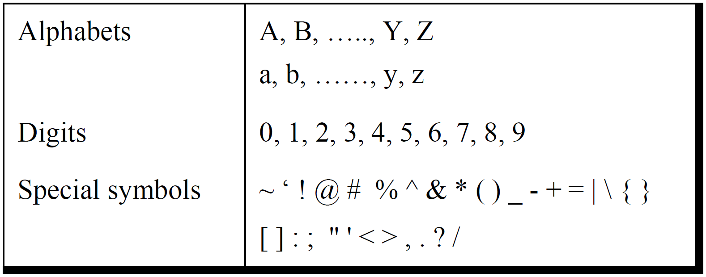

## History of Computing

Multiple devices have been used to aid computation for thousands of
years like abacus, astronomical calenders, differential analyser, etc.
Charles Babbage, an English mechanical engineer, (considered the
\"father of the computer\") originated the concept of a programmable
computer in the early 19th century.

A computer is a machine that can be programmed to carry out sequences of
arithmetic or logical operations automatically. Modern computers can
perform generic sets of operations known as programs. The principle of
the modern computer was proposed by Alan Turing in 1936. The fundamental
concept of Turing's design was the stored program, where all the
instructions for computing were stored in a memory. The next great
advance in computing power came with the advent of the transistors,
semiconductors, and integrated circuits.

Machine code was the language of early programs, written in the
instruction set of the particular machine, often in binary notation.
Assembly languages were soon developed that let the programmer specify
instruction in a text format, with abbreviations for each operation code
and meaningful names for specifying addresses.

With further development in software as well as hardware, Compiler
languages were formulated. High-level languages made the process of
developing a program simpler and more understandable, and less bound to
the underlying hardware. These compiled languages allowed the programmer
to write programs in terms that are syntactically richer, and more
capable of abstracting the code, making it easy to target for varying
machine instruction sets via compilation declarations and heuristics.
Compilers harnessed the power of computers to make programming easier by
allowing programmers to specify calculations by entering a formula using
infix notation.

### Introduction to C language

C is a procedural programming language. It was initially developed at
the AT & T's Bell Laboratories of USA by Dennis Ritchie in the year
1972. It was mainly developed as a system programming language to write
an operating system. The main features of the C language include:

-   Portability (Machine Specific)

-   Requires less lines of code than assembly language

-   Procedural programming

-   Middle level language

    -   Direct access to memory through Pointers

    -   Bit manipulation using bitwise Operators

    -   Writing assembly code within C code

-   Popular choice for system level apps

-   Wide variety of built in functions, standard libraries and header
    files.

## Elements of C Language

Communicating with a computer involves speaking the language the
computer understands. However, there is a close analogy between learning
English and C language. Learning English comprises of learning the
alphabets, then learn to combine those to form words, which in turn are
combined to form sentences and then sentences are combined to form
paragraphs.

Similarly, instead of straight-away learning how to write programs, we
must first know what alphabets, numbers and special symbols are used in
C, then how using them constants, variables and keywords are
constructed, and finally how are these combined to form an instruction.
A group of instructions would be combined later on to form a program.

### The C Character Set

A character denotes any alphabet, digit or special symbol used to
represent information. shows the valid alphabets, numbers and special
symbols allowed in C.

::: center
{#CCharSet width="\\textwidth"}
:::

### Constants, Variables and Keywords

The alphabets, numbers and special symbols when properly combined form
constants, variables and keywords. Following sections explain
'constants' and 'variables' in detail.

### C Instructions

Constants, Variables and Keywords are combined to form an instruction to
perform a certain functionality. There are basically three types of
instructions in C:

1.  Type Declaration Instruction

2.  Arithmetic Instruction

3.  Control Instruction

The purpose of each of these instructions is given below:

Type declaration instruction

:   To declare the type of variables used in a C program.

Arithmetic instruction

:   To perform arithmetic operations between constants and variables.

Control instruction

:   To control the sequence of execution of various statements in a C
    program.

These instructions are decoded in the following sections.
