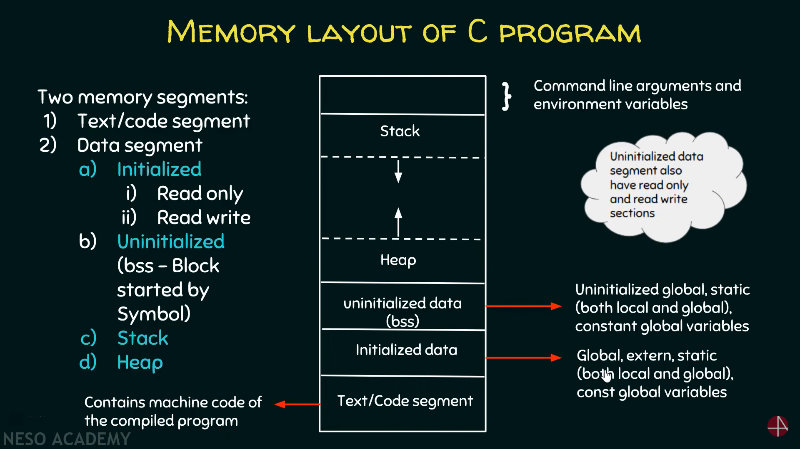

A typical memory representation of a C program consists of the following
sections.

1.  Text/Code segment

2.  Initialized data segment

3.  Uninitialized data segment (bss)

4.  Heap

5.  Stack

::: center
{#memoryLayoutC
width="60%"}
:::

C program gets stored into not one but multiple sections of the memory.
A typical memory layout of a running process is as follows:

## Text/Code segment

-   A text segment, also known as a code segment or simply as text,
    contains machine code of the compiled program or executable
    instructions.

-   The text segment is often read-only, to prevent a program from
    accidentally modifying its instructions.

-   As a memory region, a text segment may be placed below the heap or
    stack in order to prevent heaps and stack overflows from overwriting
    it.

-   Usually, the text segment is sharable so that only a single copy
    needs to be in memory for frequently executed programs, such as text
    editors, the C compiler, the shells, and so on.

## Initialized Data Segment

-   Initialized data segment, usually called simply the Data Segment.

-   A data segment is a portion of the virtual address space of a
    program, which contains the global, extern, static (local and
    global), and const global variables that are initialized by the
    programmer.

-   Note that, the data segment is not read-only, since the values of
    the variables can be altered at run time.

-   This segment can be further classified into the read-only (for
    const-s) area and the read-write sections.

## Uninitialized Data Segment

-   Uninitialized data segment often called the \"bss\" segment, named
    after an ancient assembler operator that stood for \"block started
    by symbol\".

-   Uninitialized data segment contains all uninitialized global,
    static(local and global), and constant global variables.

-   Data in this segment is initialized by the kernel to arithmetic 0
    before the program starts executing.

-   This segment is also further classified into read-only (for const-s)
    area and read-write sections.

## Stack

The stack area traditionally adjoined the heap area and grew in the
opposite direction; when the stack pointer met the heap pointer, free
memory was exhausted. (With modern large address spaces and virtual
memory techniques they may be placed almost anywhere, but they still
typically grow in opposite directions.)

The stack area contains the program stack, a LIFO structure, typically
located in the higher parts of memory. On the standard PC x86 computer
architecture, it grows toward address zero; on some other architectures,
it grows in the opposite direction. A \"stack pointer\" register tracks
the top of the stack; it is adjusted each time a value is \"pushed\"
onto the stack. The set of values pushed for one function call is termed
a \"stack frame\"; A stack frame consists at minimum of a return
address.

Stack, where automatic variables are stored, along with information that
is saved each time a function is called. Each time a function is called,
the address of where to return to and certain information about the
caller's environment, such as some of the machine registers, are saved
on the stack. The newly called function then allocates room on the stack
for its automatic and temporary variables. This is how recursive
functions in C can work. Each time a recursive function calls itself, a
new stack frame is used, so one set of variables doesn't interfere with
the variables from another instance of the function.

## Heap

Heap is the segment where dynamic memory allocation usually takes place.

The heap area begins at the end of the BSS segment and grows to larger
addresses from there. The Heap area is managed by malloc, realloc, and
free, which may use the brk and sbrk system calls to adjust its size
(note that the use of brk/sbrk and a single \"heap area\" is not
required to fulfill the contract of malloc/realloc/free; they may also
be implemented using mmap to reserve potentially non-contiguous regions
of virtual memory into the process' virtual address space). The Heap
area is shared by all shared libraries and dynamically loaded modules in
a process.
