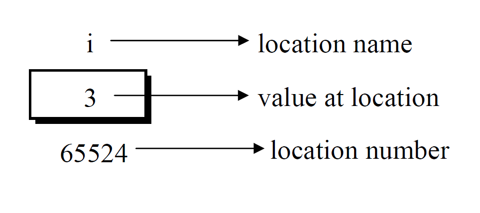

## An Introduction to Pointers

The textbook definition of a pointer is *The pointer in C language is a
variable which stores the address of another variable.* This variable
can be of type int, char, array, function, or any other pointer. The
size of the pointer depends on the architecture.

### Pointer Notation

Consider the declaration,**int i = 3;**\
This declaration tells the C compiler to:

1.  Reserve space in memory to hold the integer value.

2.  Associate the name i with this memory location.

3.  Store the value 3 at this location.

We may represent i's location in memory by the following memory map.


{#pointer width="\\textwidth"}


We see that the computer has selected memory location 65524 as the place
to store the value 3. **i's address in memory is a number.**

#### Operator &

\"&\" is used in C as an \"address of\" operator. The expression \"&i\"
returns the address of the variable i, which in this case happens to be
65524. We have been using the \"&\" operator all the time in the scanf()
statement.

#### Operator \*

Pointer operator \"\*\" is called as the \"value at address\" operator.
It gives the value stored at a particular address. The \"value at
address\" operator is also called \"indirection\" operator

Note that printing the value of \"\*(&i)\" is same as printing the value
of i.

The expression &i gives the address of the variable i. This address can
be collected in a variable, by saying, j = &i ;

But remember that j is not an ordinary variable like any other integer
variable. It is a variable that contains the address of other variable
(i in this case). Since j is a variable the compiler must provide it
space in the memory.

#### Pointer declaration

int \*j;\
This declaration tells the compiler that j will be used to store the
address of an integer value. In other words, j points to an integer.

Here is a program that demonstrates the relationships we have been
discussing.

``` {style="CStyle"}
main( )
{
    int i = 3 ;
    int *j ;

    j = &i ;
    printf ( "\nAddress of i = %u", &i ) ;
    printf ( "\nAddress of i = %u", j ) ;
    printf ( "\nAddress of j = %u", &j ) ;
    printf ( "\nValue of j = %u", j ) ;
    printf ( "\nValue of i = %d", i ) ;
    printf ( "\nValue of i = %d", *( &i ) ) ;
    printf ( "\nValue of i = %d", *j ) ;
}
```

The output of the above program would be:

``` {style="CStyle"}
Address of i = 65524
    Address of i = 65524
    Address of j = 65522
    Value of j = 65524
    Value of i = 3
    Value of i = 3
    Value of i = 3
```

***Note: Remember that, addresses (location numbers) are always going to
be whole numbers, therefore pointers always contain whole numbers.***
