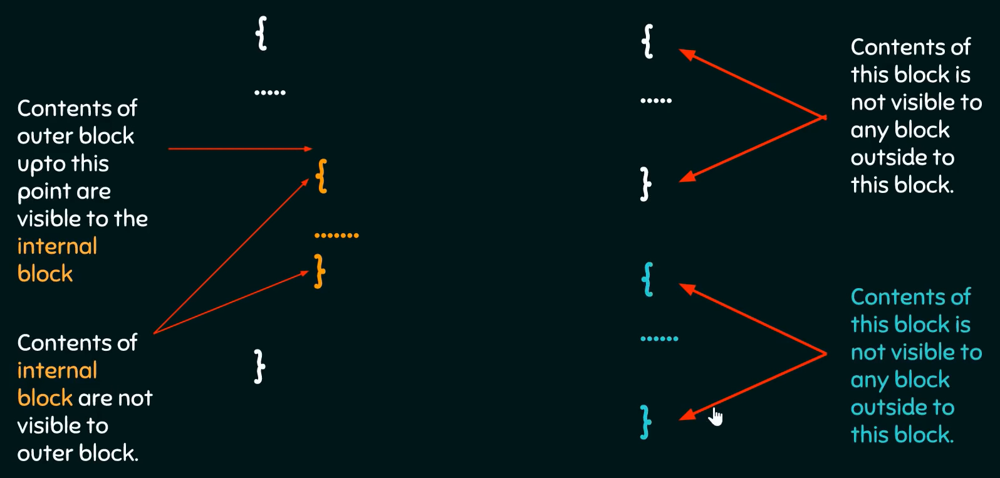

Variables are just names that point to a memory location. It is used to
store data. Its value can be changed, and it can be reused many times.
Variable is a way to represent memory location through symbol so that it
can be identified easily.

Declaration of variables: Announcing the propoerties of variable to the
compiler

Properties:

-   Size of the variable

-   Name of the variable

Data type: how much space a variable is going to occupy in memory.

Definition of variables: Allocating memory to a variable. Most of the
time declaration and definition will be done at the same time.

Initialization of variables: Initializing a variable means specifying an
initial value to assign to it (i.e., before it is used at all).\
Notice that a variable that is not initialized does not have a defined
value, hence it cannot be used until it is assigned such a value. If the
variable has been declared but not initialized, we can use an assignment
statement to assign it a value.

Variable name: composed of alphabets or combination of letters and
digits.

Variable naming conventions:

1.  Don't start variable name with digit.

2.  Beginning with underscore is valid but not recommended.

3.  C language is case sensitive.

4.  Special characters except underscore are not allowed in the variable
    name.

5.  Blanks or white spaces not allowed.

6.  Don't use keywords to name your variables.

7.  Don't use long names your variables.

8.  Redefinition of a variable is not allowed.

Scope of variables:

Scope of variables refers to the area of the program where the variables
can be accessed post declaration. In other words, a block or a region
where a variable is declared, defined and used and when a region ends,
variable is automatically destroyed.

In C, every variable defined in scope. You can define scope as the
section or region of a program where a variable has its existence;
moreover, that variable cannot be used or accessed beyond that region.

Scope of a variable: Local scope or Block scope A local scope or block
scope is collective program statements put in and declared within a
function or block (a specific region enclosed with curly braces) and
variables lying inside such blocks are termed as local variables.

Variable(s) that are declared within a block can be accessed within that
specific block and all other inner blocks of that block, but those
variables cannot be accessed outside the block.

Local Variable Variables that are declared within the function block and
can be used only within the function are called local variables.

Global variable Variables that are declared outside of all function
blocks and can be accessed inside all the functions are called global
variables.

## Data types

-   Exceeding the valid range of data type: Let us say that the max
    number of bytes in a particular data type is 'n'. Exceeding the
    range of the data type means that assigning a number with bits
    greater than 'n' bits. Hence, (MSB) bits beyond 'n' bits will be
    missed.

-   **Range** is nothing but upper and lower limits of some set of data.
    Binary: $2^{n} - 1$, where, n is number of buts. Unsigned range: o
    to 65535 2 bytes Signed range: -32768 to +32767\

-   **sizeof()** is a unary operator (not a function) that can get the
    size of a data type programmatically.\
    **Modifiers for integers (short, long, signed, unsigned)**\
    **long & short** are modifiers which are used to take either less or
    more memory.

-   Number systems

    -   Decimal number system: Human understandable number system. Also,
        called as base 10 number system. Range 0 to 9.

    -   Binary number system: Computer understandable number system.
        Also, called as base 2 number system. Range 0 to 1.

-   **Fixed point and Floating point representation** Fixed point and
    floating point are two ways of representing fractional numbers.

    -   In fixed point, there is a specific number of digits to
        represent the integer section and fraction section i.e. the
        decimal point has a fixed location.

    -   In floating point, there is no specific number of digits to
        represent integer section and fraction section i.e. the decimal
        point is floating. A number in floating point representation is
        as follows: $+/- Mantissa * 10^{exponent}$

### integer

-   integer data type is used to represent integers.

-   Syntax: int variable_name; (by default variable is chosen as a
    signed integer)\
    Unsigned int declaration: unsigned int variable_name;\

-   Format specifier:

    -   int = \"%d\" (signed int)

    -   short int = \"%d\" (signed short int)

    -   long int = \"%ld\" (signed long int)

    -   unsigned int = \"%u\" (unsigned int)

    -   short unsigned int = \"%u\" (unsigned short int)

    -   long unsigned int = \"%lu\" (unsigned long int)

-   size: Integer can take either 2 or 4 bytes of memory. (vary as per
    system)

    -   int = 4

    -   short int = 2

    -   long int = 8

-   Range: Unsigned: 0 to 255 & Signed: -128 to +127

-   sizeof(short int) \<= sizeof(int) \<= sizeof(long int)

### Character

-   Character data type is used to represent characters.

-   Representation: Characters are encoded using ASCII encoding scheme
    into 8 bit binary representation. There are 2 types of ASCII
    encoding schemes:

    -   Traditional ASCII: 7 bit representation MSB is always zero

    -   Extended ASCII: 8 bit representation of characters

-   Syntax: char variable_name = 'N';

-   Character data type can hold a single character and cannot hold a
    string.

-   Format specifier: \"%c\"

-   size: 1 byte

-   Range: Unsigned: 0 to 255 & Signed: -128 to +127

Signed characters: 2's complement representation Unsigned characters:

### float

-   float data type is used to represent fractional numbers.

-   Representation: IEEE 754 Single Precision Floating Point

-   Syntax: float variable_name = 'fractional number';

-   float data type has a precision of upto 8 decimals(including decimal
    point and integer)

-   Format specifier: \"%f\"

-   size: 4 bytes (vary as per system)

### double

-   double data type is used to represent fractional numbers.

-   Representation: IEEE 754 Double Precision Floating Point

-   Syntax: double variable_name = 'fractional number';

-   double data type has a precision of upto 16 decimals(including
    decimal point and integer)

-   Format specifier: \"%f\" or \"%lf\"

-   size: 8 bytes (vary as per system)

### long double

-   long double data type is used to represent fractional numbers.

-   Representation: Extended Precision Floating Point

-   Syntax: long double variable_name = 'fractional number';

-   long double data type has a precision of upto 32 decimals(including
    decimal point and integer)

-   Format specifier: \"%Lf\"

-   size: 16 bytes (vary as per system)

# Variable Modifiers

## Auto

-   Auto stands for Automatic.

-   Syntax: auto int variable_name;

-   Variables declared inside a scope by default are automatic
    variables. Automatic variable is a variable which automatically gets
    destroyed after the completion of a function or a scope in which it
    is defined.

-   Advantage: This variable does not waste memory.

-   If auto variable is not initialized, it will be assigned a random
    value by default. Whereas, a global variable is initialized to 0 by
    default.

## Extern modifier

-   Extern is a short for External.

-   Syntax: (declaration) extern int variable_name; (no memory is
    allocated.)

-   Extern is used when a particular file needs to access a variable
    from another file.

-   When an extern variable is initialized, then memory for this
    variable is allocated and it will be considered defined.

## Register

-   Register keyword hints the compiler to store a variable in register
    memory.

-   Syntax: register data_type variable_name;

-   Access time reduces greatly for most frequently referred variables.

-   To put or to not put a variable in register is the choice of
    compiler.

-   Usually compiler do the necessary optimizations.

## Static

-   Static variables have a property of preserving their value even
    after they are out of their scope. Hence, static variables preserve
    their previous value in their previous scope and are not initialized
    again in the new scope.

-   Syntax: static = variable_value;

-   A static int variable remains in memory while the program is
    running. A normal or auto variable is destroyed when a function call
    where the variable was declared is over.

-   Static variables (like global variables) are initialized as 0 if not
    initialized explicitly.

-   Static variables are allocated memory in data segment, not stack
    segment.

-   Static global variables and functions are also possible in C/C++.
    The purpose of these is to limit scope of a variable or function to
    a file.

-   Static variables should not be declared inside structure.
