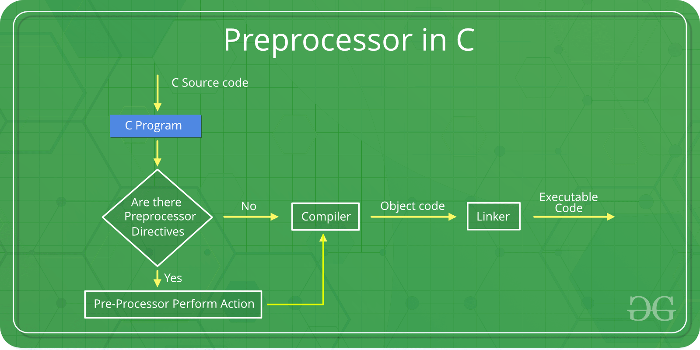

Date: 2022-09-11 Name: Maitreya Ranade

::: center
C++ Language\
:::

# C Programming

## Introduction

## Variables

## Constants

-   Constant is something that never changes. In other words, once
    defined cannot be modified later in the code.

-   #define is a preprocessor directive.

    -   Syntax: #define name value (name is also called macro)

    -   Avoid semicolon at the end in the syntax.

    -   Choosing capital letters for name is good practice.

    -   Preprocessor replaces Name with value.

    -   We can use macros like functions.

    -   First expansion then evaluation.

    -   There are current predefined / standard Macros ex. \_\_TIME\_\_
        & \_\_DATE\_\_.

-   Const keyword

    -   A variable defined with the const modifier are considered
        variables, and not macro definitions.

    -   syntax: const data_type variable_name

-   Const-s are handled by the compiler, where as #define-s are handled
    by the pre-processor.

-   The big advantage of const-s over #define is type checking.
    #define-s can't be type checked.

-   Since const-s are considered variables, we can use pointers on them.
    This means we can typecast, move addresses, and everything else
    you'd be able to do with a regular variable besides change the data
    itself, since the data assigned to that variable is constant.

## Memory Layout of C program

A typical memory representation of a C program consists of the following
sections.

1.  Text/Code segment

2.  Initialized data segment

3.  Uninitialized data segment (bss)

4.  Heap

5.  Stack

::: center
{#memoryLayoutC
width="60%"}
:::

C program gets stored into not one but multiple sections of the memory.
A typical memory layout of a running process is as follows:

### Text/Code segment

-   A text segment, also known as a code segment or simply as text,
    contains machine code of the compiled program or executable
    instructions.

-   The text segment is often read-only, to prevent a program from
    accidentally modifying its instructions.

-   As a memory region, a text segment may be placed below the heap or
    stack in order to prevent heaps and stack overflows from overwriting
    it.

-   Usually, the text segment is sharable so that only a single copy
    needs to be in memory for frequently executed programs, such as text
    editors, the C compiler, the shells, and so on.

### Initialized Data Segment

-   Initialized data segment, usually called simply the Data Segment.

-   A data segment is a portion of the virtual address space of a
    program, which contains the global, extern, static (local and
    global), and const global variables that are initialized by the
    programmer.

-   Note that, the data segment is not read-only, since the values of
    the variables can be altered at run time.

-   This segment can be further classified into the read-only (for
    const-s) area and the read-write sections.

### Uninitialized Data Segment

-   Uninitialized data segment often called the \"bss\" segment, named
    after an ancient assembler operator that stood for \"block started
    by symbol\".

-   Uninitialized data segment contains all uninitialized global,
    static(local and global), and constant global variables.

-   Data in this segment is initialized by the kernel to arithmetic 0
    before the program starts executing.

-   This segment is also further classified into read-only (for const-s)
    area and read-write sections.

### Stack

The stack area traditionally adjoined the heap area and grew in the
opposite direction; when the stack pointer met the heap pointer, free
memory was exhausted. (With modern large address spaces and virtual
memory techniques they may be placed almost anywhere, but they still
typically grow in opposite directions.)

The stack area contains the program stack, a LIFO structure, typically
located in the higher parts of memory. On the standard PC x86 computer
architecture, it grows toward address zero; on some other architectures,
it grows in the opposite direction. A \"stack pointer\" register tracks
the top of the stack; it is adjusted each time a value is \"pushed\"
onto the stack. The set of values pushed for one function call is termed
a \"stack frame\"; A stack frame consists at minimum of a return
address.

Stack, where automatic variables are stored, along with information that
is saved each time a function is called. Each time a function is called,
the address of where to return to and certain information about the
caller's environment, such as some of the machine registers, are saved
on the stack. The newly called function then allocates room on the stack
for its automatic and temporary variables. This is how recursive
functions in C can work. Each time a recursive function calls itself, a
new stack frame is used, so one set of variables doesn't interfere with
the variables from another instance of the function.

### Heap

Heap is the segment where dynamic memory allocation usually takes place.

The heap area begins at the end of the BSS segment and grows to larger
addresses from there. The Heap area is managed by malloc, realloc, and
free, which may use the brk and sbrk system calls to adjust its size
(note that the use of brk/sbrk and a single \"heap area\" is not
required to fulfill the contract of malloc/realloc/free; they may also
be implemented using mmap to reserve potentially non-contiguous regions
of virtual memory into the process' virtual address space). The Heap
area is shared by all shared libraries and dynamically loaded modules in
a process.

## Operators

## Conditionals

## Loops

## Functions & Pointers

## C/C++ Preprocessors

As the name suggests Preprocessors are programs that process our source
code before compilation. There are a number of steps involved between
writing a program and executing a program in C / C++.

::: center
{#Cpreprocessor
width="60%"}
:::

The source code file is processed by preprocessors and an expanded
source code file is generated named program. This expanded file is
compiled by the compiler and an object code file is generated named
program .obj. Finally, the linker links this object code file to the
object code of the library functions to generate the executable file
program.exe.

Preprocessor programs provide preprocessors directives which tell the
compiler to preprocess the source code before compiling. All of these
preprocessor directives begin with a '#' (hash) symbol. The '#' symbol
indicates that, whatever statement starts with #, is going to the
preprocessor program, and preprocessor program will execute this
statement. Examples of some preprocessor directives are: #include,
#define, #ifndef etc. Remember that \# symbol only provides a path that
it will go to the preprocessor, and command such as include is processed
by preprocessor program. For example, include will include extra code to
your program. We can place these preprocessor directives anywhere in our
program.

There are 4 main types of preprocessor directives:

1.  Macros

2.  File Inclusion

3.  Conditional Compilation

4.  Other directives

Macros: Macros are a piece of code in a program which is given some
name. Whenever this name is encountered by the compiler the compiler
replaces the name with the actual piece of code. The '#define' directive
is used to define a macro.

::: highlight
Note: There is no semi-colon(';') at the end of macro definition. Macro
definitions do not need a semi-colon to end.
:::

File Inclusion: This type of preprocessor directive tells the compiler
to include a file in the source code program. There are two types of
files which can be included by the user in the program: Header File or
Standard files: These files contains definition of pre-defined functions
like printf(), scanf() etc. These files must be included for working
with these functions. Different function are declared in different
header files. For example standard I/O functions are in 'iostream' file
whereas functions which perform string operations are in 'string' file.

user defined files: When a program becomes very large, it is good
practice to divide it into smaller files and include whenever needed.
These types of files are user defined files. These files can be included
as:

Conditional Compilation: Conditional Compilation directives are type of
directives which helps to compile a specific portion of the program or
to skip compilation of some specific part of the program based on some
conditions. This can be done with the help of two preprocessing commands
'ifdef' and 'endif'.

If the macro with name as 'macroname' is defined then the block of
statements will execute normally but if it is not defined, the compiler
will simply skip this block of statements.

Other directives: Apart from the above directives there are two more
directives which are not commonly used. These are: #undef Directive: The
#undef directive is used to undefine an existing macro. This directive
works as:

Using this statement will undefine the existing macro LIMIT. After this
statement every "#ifdef LIMIT" statement will evaluate to false.

#pragma Directive: This directive is a special purpose directive and is
used to turn on or off some features. This type of directives are
compiler-specific, i.e., they vary from compiler to compiler. Some of
the #pragma directives are discussed below: #pragma startup and #pragma
exit: These directives helps us to specify the functions that are needed
to run before program startup( before the control passes to main()) and
just before program exit (just before the control returns from main()).
Note: Below program will not work with GCC compilers. Look at the below
program:

#pragma warn Directive: This directive is used to hide the warning
message which are displayed during compilation. We can hide the warnings
as shown below: #pragma warn -rvl: This directive hides those warning
which are raised when a function which is supposed to return a value
does not returns a value. #pragma warn -par: This directive hides those
warning which are raised when a function does not uses the parameters
passed to it. #pragma warn -rch: This directive hides those warning
which are raised when a code is unreachable. For example: any code
written after the return statement in a function is unreachable.

##### Pragma Directive in C/C++

This directive is a special purpose directive and is used to turn on or
off some features. This type of directives are compiler-specific i.e.,
they vary from compiler to compiler. Some of the pragma directives are
discussed below:

#pragma startup and #pragma exit: These directives helps us to specify
the functions that are needed to run before program startup( before the
control passes to main()) and just before program exit (just before the
control returns from main()). Note: Below program will not work with GCC
compilers. Look at the below program:

## References

-   [Neso Academy (Youtube Channel) (C Programming & Data Structures
    playlist)](https://youtube.com/playlist?list=PLBlnK6fEyqRhX6r2uhhlubuF5QextdCSM)

-   Let us C by Yashwant Kanetkar

-   [Tutorials
    Point](https://www.tutorialspoint.com/cprogramming/index.htm)

-   [Geeks for
    geeks](https://www.geeksforgeeks.org/c-programming-language/)

-   [The C book](https://publications.gbdirect.co.uk/c_book/)
