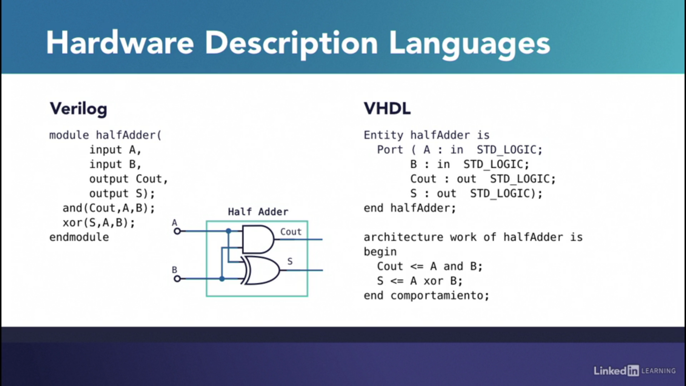

# HDL Basics

- [HDL Basics](#hdl-basics)
- [Introduction](#introduction)
- [Use of HDL in design flow](#use-of-hdl-in-design-flow)
- [Digital system modeling](#digital-system-modeling)
  - [Abstraction Levels/Models](#abstraction-levelsmodels)
- [HDL Structure](#hdl-structure)

---

# Introduction

Manual methods for designing logic circuits are feasible only when the circuit is small. For larger circuits (usual scenario), designers use computer-based design tools which use hardware description languages.

> **A *Hardware Description Language* (HDL) is a computer-based language that describes the hardware of digital systems in a textual form.**

- It resembles an ordinary computer programming language, such as C, but is specifically oriented to describing hardware structures and the behavior of logic circuits.
- It can be used to represent logic diagrams, truth tables, Boolean expressions, and complex abstractions of the behavior of a digital system.
- HDL jas a notion of time.
- HDLs support concurrency.

> In the public domain, there are two standard HDLs that are supported by the IEEE: **VHDL** and **Verilog**.

- VHDL is a Department of Defense–mandated language. (The V in VHDL stands for the first letter in VHSIC, an acronym for very high-speed integrated circuit.)
- Verilog began as a proprietary HDL of Cadence Design Systems.
- The Verilog HDL was initially approved as a standard HDL in 1995; revised and enhanced versions of the language were approved in 2001 and 2005.

# Use of HDL in design flow
HDLs are used in several major steps in the design flow of an integrated circuit:
- *Design entry*: creates an HDL-based description of the functionality that is to be implemented in hardware.
- *Functional simulation or verification*: displays the behavior of a digital system through the use of a computer.
  - A simulator interprets the HDL description and either produces readable output  or displays waveforms of the signals.
  - Simulation detects functional errors in a design without having to physically create and operate the circuit.
  - The stimulus (i.e., the logic values of the inputs to a circuit) that tests the functionality of the design is called a *test bench*.
- *Logic synthesis*: is the process of deriving a list of physical components and their interconnections (called a *netlist*) from the model of a digital system described in an HDL.
  - The netlist can be used to fabricate an integrated circuit.
  - Logic synthesis is similar to compiling a program in a conventional high-level language.
  - But, logic synthesis produces a database describing the elements and structure of a circuit instead of the compiled code.
  - The design of today’s large, complex circuits is made possible by logic synthesis software.
- *Timing verification*: confirms that the fabricated, integrated circuit will operate at a specified speed.
  - Timing verification checks each signal path to verify that it is not compromised by propagation delay.
- *Fault simulation*: compares the behavior of an ideal circuit with the behavior of a circuit that contains a process-induced flaw/s.
  - Fault simulation is used to identify input stimuli that can be used to reveal the difference between the faulty circuit and the fault-free circuit.
  - These test patterns will be used to test fabricated devices to ensure that only good devices are shipped to the customer.

# Digital system modeling
There are two main categories of digital systems:

- **Combinational logic**, where the signals travel from an input through the logic circuit, progressing forward with no feedback loops, all the way to the output. 
  - Combinational systems have no memory and thus no notion of time
  - Every combination of input values will always yield the same output
  - Examples are MUX, de-MUX, and arithmetic Adders.

- **Sequential logic** has a combinational part with some feedback loops. 
  - This is the basic principle for flip flops, which are elements capable of holding a value acting as memory. 
  - This characteristic gives sequential systems a notion of time so they require a clock.
  - A clock signal is a sequence of zeros and ones, at a constant known frequency.
  - Examples are registers, counters, shift registers, and virtually every useful digital system which runs on a clock, like a computer.

## Abstraction Levels/Models
When it comes to modeling a digital system there are 3 levels of abstraction that can be used to let the toolchain know what hardware you want to implement.

The logic of a module can be described in any one (or a combination) of the following modeling styles:

- **Behavioral Model**: uses language-specific procedural statements to form an abstract model of a circuit.
  - This is a high level of abstraction in which you tell the toolchain:
    - what your system is supposed to do &
    - how it's supposed to behave.

- **Dataflow Model**: uses HDL operators and assignment statements to describe the functionality represented by boolean equations.
  - In this model, internal functional blocks and the interconnections to those blocks are specified. This model is used when modules are instantiated.
  - Continuous assignment is used in this model.

- **Gate-level or structural Model**: In this model, a circuit is specified by its logic gates and their interconnections.
  - The gate level is the assembly language of FPGAs.
  - The building blocks are single logic devices or gates. So at the gate level the code only contains wires and gates.

- **Register-transfer level(RTL)**: The register-transfer level is the most widely-used level of abstraction, so much so that Verilog and VHDL code is often referred to as RTL code.

- Just like in traditional programming, these levels of abstraction are not mutually exclusive so you may have parts of your code at different levels if you need to.
- Useful digital systems aren't exclusively written at the behavioral, register-transfer, or gate level.
- Hardware description languages were created to implement a modular design.
- A complete digital system is usually created by nesting basic building block instances which are defined separately. 
- Hardware modules are rigid and they don't change dynamically.

A simple verilog code for 2:1 MUX is written in different modeling styles for better understanding:

```verilog
// Gate-level modeling
// Y = D0.Sbar + D1.S
module m21(Y, D0, D1, S);
output Y;
input D0, D1, S;
wire T1, T2, Sbar;

and (T1, D1, S), (T2, D0, Sbar);
not (Sbar, S);
or (Y, T1, T2);

endmodule
```

```verilog
// Dataflow modeling
module m21(D0, D1, S, Y);
output Y;
input D0, D1, S;

assign Y=(S)?D1:D0;

endmodule
```

```verilog
// Behavioral modeling
module m21( D0, D1, S, Y);
input wire D0, D1, S;
output reg Y;

always @(D0 or D1 or S)
begin
  if(S) 
    Y= D1;
  else
    Y=D0;
end
endmodule
```

# HDL Structure

The built in structure of an HDL based project consists of two categories of modules.

1. **Descriptive modules**: where you define your hardware and test bench or stimulus modules, where you enter a sequence of inputs to your system.

2. **Test bench modules**: are used by simulators to execute the steps you entered and produce the results you want to see.

The same module is defined below in Verilog as well as VHDL. The module is a Half Adder. It adds two one bit numbers. 



VHDL is a language inspired by the Ada and Pascal programming languages. In VHDL the port list is specified in what is known as an entity and the implementation is defined in an architecture. One can notice the differences and similarities between these languages.


The test bench module in both languages describes the same course of events for a simulation.
- The two registers A & B take the value of zero. 
- Then, there's a 100 nanosecond pause.
- One is assigned to A
- Then more assignments are performed on A and B separated by 10 nanosecond pauses.
