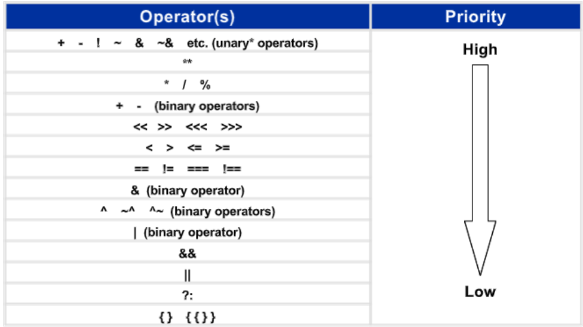
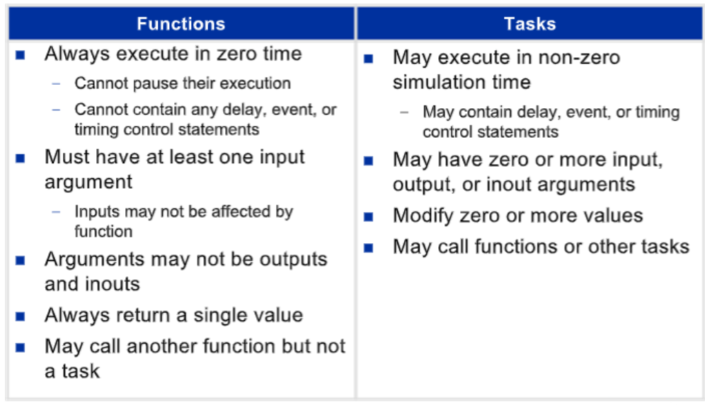

# Verilog

---

- [Verilog](#verilog)
- [Introduction](#introduction)
- [Modules \& Instantiation](#modules--instantiation)
  - [Basic definitions and syntax](#basic-definitions-and-syntax)
    - [Module Instantiation](#module-instantiation)
    - [Keywords](#keywords)
    - [Identifiers](#identifiers)
    - [Comments](#comments)
    - [Port list](#port-list)
  - [Delays](#delays)
    - [Assignment delays](#assignment-delays)
    - [Procedural statement delays](#procedural-statement-delays)
- [Simulation](#simulation)
- [Data types](#data-types)
  - [Register data type](#register-data-type)
  - [Net data types](#net-data-types)
  - [Numbers](#numbers)
  - [Values and Signal strengths](#values-and-signal-strengths)
  - [Vectors](#vectors)
  - [Arrays](#arrays)
  - [Memories](#memories)
  - [Parameters](#parameters)
  - [Strings](#strings)
  - [Port assignment](#port-assignment)
- [Operators](#operators)
  - [Operator Precedence](#operator-precedence)
- [Assignments](#assignments)
  - [Continuous assignments](#continuous-assignments)
  - [Structured procedure](#structured-procedure)
  - [Procedural assignments](#procedural-assignments)
  - [Behavioral statements](#behavioral-statements)
  - [RTL processes](#rtl-processes)
  - [System tasks](#system-tasks)
  - [Compiler directives](#compiler-directives)
- [Subprograms](#subprograms)
  - [Functions](#functions)
  - [Tasks](#tasks)
- [Verilog Code structure](#verilog-code-structure)


---
# Introduction
Verilog is a hardware description language standardized as IEEE 1364-2001. Verilog is used to describe the low level hardware.
- **Features of Verilog** are:
  - Verilog is a case sensitive language.
  - Combinational logic can be described by a schematic connection of gates, by a set of Boolean equations, or by a truth table.

---
# Modules & Instantiation
- A module is the basic building block in verilog. A module is the fundamental descriptive unit in the Verilog language.
- A module can be an element or a collection of lower-level design blocks.
- It provides the required functionality to the higher level block through its port interface but hides the internal implementation. 
  
## Basic definitions and syntax
- Module is declared by the keyword **module** and must always be terminated by the keyword **endmodule**.
- *Module definition* starts the declaration (description) of the module.
- *Module declaration* specifies the input–output behavior of the hardware that it represents.
- The keyword **module** is followed by a name and a list of ports.
- Internal connections are declared as wires and is declared with the keyword **wire**.
- The structure of the circuit is specified by a list of (predefined) primitive gates, each identified by a descriptive keyword (**and, not, or**).
- The module description ends with the keyword **endmodule**. 
- Each statement must be terminated with a semicolon.
- But there is no semicolon after **endmodule**
  
### Module Instantiation
- Instantiation allows the creation of hierarchy in verilog description.
- It is a process of creating object from a module template and the objects are called instances.
  - For ex. In Full adder, one can define and instantiate Half adder.
- In verilog, nesting of module is illegal.

### Keywords
- Verilog model is composed of text using _keywords_. _Keywords_ are predefined lowercase identifiers that define the language constructs.
- All keywords are in lowercase
- For ex. **module, endmodule, input, output, wire, and, or, & not**

### Identifiers
*Identifiers* are names given to modules, variables (eg. a signal), and other elements of the language so that they can be referenced in the design. Identifiers:
- are case sensitive
- composed of alphanumeric characters and the underscore (_)
- must start with an alphabetic character or an underscore
- cannot start with a number.

### Comments
- Any text between two forward slashes ( // ) and the end of the line is interpreted as a comment.
- Multiline comment: /* .... multiple lines ....  */
- Blank spaces are ignored.
  
### Port list
- The *port list* of a module is the interface between the module and its environment.
  - Usually, ports are the inputs and outputs of the  circuit.
- Logic values of the inputs to a circuit are determined by the environment.
- Logic values of the outputs are determined within the circuit and result from the action of the inputs on the circuit.
- Keywords **input** and **output** specify direction of the ports which is input or output.
- There are two methods to define port connections
  - By ordered list: port connections defined by the order of the port list in the lower-level module.
  - By name: port connections defined by name, order of the port connections does not matter.
- Mixed is not possible.

---
## Delays
There are 2 types of delays in verilog:

### Assignment delays
Delay values control the time between the change in the value and assignment of the value. There are 3 ways of specifying delay:
1. Regular assignment delay: the delay value is specified after the keyword **assign**. For ex. assign #10 out = in1 & in2;
2. Implicit continuous assignment delay: specify both a delay and an assignment on the net. For ex. wire #10 out = in1 & in2;
3. Net declaration delay: A delay can be specifies on a net when it is declared without putting a continuous assignment on the net.
   - For ex.: wire #10 out;
   - assign out  = in1 & in2;

### Procedural statement delays
Delay values control the time between when the statement is encountered and when it is executed. There are 2 ways of specifying delay:
1. Regular delay: Entire operation(evaluation and assignment) will be delayed by the delay value. For ex.: #10 y = x + 1;
2. Intra-assignment delay: Evaluation happens at the current time but the value is assigned after the mentioned delay. For ex.: y = #10 x + 1;
  
---
# Simulation
Simulation is used to verify the functionality of the digital design that is modeled using HDL like verilog.

- Simulation uses _testbench_ with different input stimulus applied to the design at different time to check whether the RTL code behaves in intended way or not.
- A Verilog _testbench_ is a code module that describes the stimulus to a logic design and checks whether the design's outputs match its specification.
- An HDL description that provides the stimulus to a design is called a *test bench*.
- A test bench is a module containing a signal generator and an instantiation of the module that is to be verified.
- Note that the test bench has no input or output ports, because it does not interact with its environment.
  
---
# Data types
Data type is a classification that specifies which type of value can be assigned to a variable. Data types used in Verilog are:
- Nets
- Registers
- Vectors
- Integer
- Real
- Time
- Arrays
- Parameters
- Strings
  
## Register data type
Register represents data storage elements.
- It is a variable that can hold a value
- It is declared by the keyword **reg**
- Default value of reg data type is _X_
- Register represents a class of data types such as reg, integer, real, time etc.
  - reg: unsigned variable of any bit size (reg signed : signed implementation)
  - integer: used for loop counting, stores the values as signed numbers
  - real: used to store floating point numbers (non-synthesizable), allows decimal and scientific notation
  - time: keeps track of simulation time (non-synthesizable)

>  NOTE: Verilog registers do not necessary produce Flip flops in FPGA or ASIC implementation. The synthesis tool will decide if the behavior really requires and actual register.

## Net data types
Nets represent connections between hardware elements. 
- It must be continuously driven and cannot be used to store values.
- It is declared by the keyword **wire**
- wire represents a node or connection
- Default value of reg data type is _Z_
  - _Z_ represents high impedance state which is neither a zero or one. But, equivalent to a floating node.
- Net represents a class of data types such as wire, wand, wor, tri, triand, trior, trireg, supply0, supply1 etc.
  - tri: represents a tri-state node
  - supply0: constant logic 0
  - supply1: constant logic 1

## Numbers

Syntax: \<size\>'\<base\>\<number\>

- For ex. 
  - 1'b1  // logic-1 (1-bit)
  - 4'd1  // 4 bit number 0001

- Bases used in verilog:
  - Binary: b or B
  - Octal: o or O
  - Decimal: d or D
  - Hexadecimal: h or H
- '_' (underscore) is used to improve readability.
  - For ex.: 16'b 0000_0101_0000_0111
- Extension: appending numbers to match total number of bits
  - there are 3 types (Zero, X and Z extension)
  - For ex. 
    - 4'bX0 // XXX_0
    - 5'd1  // 0000_1
    - 16'hZ6  // ZZZZ_ZZZZ_ZZZZ_0110

## Values and Signal strengths
Verilog supports 4 value levels and 8 strength levels to model the functionality of real hardware.


Value levels | Condition in hardware circuits
-------------|------------------------------------
0            | Logic zero, false
1            | Logic one, true
X            | Unknown logic value
Z            | High impedance, floating state


strength levels |   Type         | Degree
----------------|----------------|---------- 
Supply          | Driving        | Strongest
strong          | Driving        |
pull            | Driving        |
large           | Storage        |
weak            | Driving        |
medium          | Storage        |
small           | Storage        |
highz           | High Impedance | Weakest

  

## Vectors
_nets_ or _reg_ data types can be declared as vectors. Vectors represent buses.
For ex: reg [1:40]bus;

## Arrays
- Arrays are allowed for reg, integer, time, realm vector register data types.
- For ex: 
  - reg [7:0] reg [15:0] // 16 8-bit registers
  - reg num[31:0] // array of 32 one-bit numbers

## Memories
- Memories are modeled as a one dimensional array of registers.
- Each element of the array is known as an element or a word.
- For ex: 
  - reg mem1 [0:63] // Memory mem1 with 64 1-bit words
  - reg [7:0]mem2 [0:63] // Memory mem2 with 64 8-bit words

## Parameters
- Parameter is value assigned to a symbolic name.
- Parameter values for each module instance can be overridden individually at compile time.
- Parameters are used in customizing the module instances.
- For ex. parameter width=8;
- _localparam_ is same as parameter but cannot be overwritten to protect it from accidental or incorrect redefinition.

## Strings
- String is defined as the sequence of characters. 
- Strings can be stored in reg.
- For ex. reg[10:0] str = "maitreya";
- There are some special characters of strings:
  - \n : newline
  - \t : tab
  - \\% : %
  - \\\ : \
  - \\" : " 

## Port assignment
- **Input**: internally net, externally reg or net
- **Output**: internally reg or net, externally net
- **Inout**: only wire data type


---
# Operators

Verilog operators operate on several data types to produce an output. Not all Verilog operators are synthesizable (can produce gates). Some operators are similar to those in the C language. Remember, you are making gates, not an algorithm (in most cases).


**Character** | **Operation** | **Type of operator**
--------------|---------------|---------------------
\+ | Add | Arithmatic
\- | Subtract | Arithmatic
/ | Divide | Arithmatic
\* | Multiply | Arithmatic
\% | Modulus | Arithmatic
$\sim$ | Invert | bitwise
& | And | bitwise
\| | Or | bitwise
$\wedge$ | Xor | bitwise
$\wedge$$\sim$ or $\sim$$\wedge$ | Xnor | bitwise
& | And all bits | reduction
$\sim$ & | Nand all bits | reduction
\| | Or all bits | reduction
$\sim$ \| | Nor all bits | reduction
$\wedge$ | Xor all bits | reduction
$\wedge$ or $\sim$$\wedge$ | Xnor all bits | reduction
\> | Greater than | Relational
\< | Smaller than | Relational
\>= | Greater than or equal | Relational
\<= | Smaller than or equal | Relational
== | Equality | Relational
!= | Inequality | Relational
=== | Case equality | Relational
!== | Case inequality | Relational
! | Not true | Logical
&& | Both expressions true | Logical
\|\| | One or both expressions true | Logical
\>\> | Shift right | shift
\<\< | Shift left | shift
\>\>\> | Arithmatic Shift right | shift
\<\<\< | Arithmatic Shift left | shift
? | Conditions testing | Misc
{,} | Concatenate | Misc
{{}} | Replicate | Misc


## Operator Precedence

The order of the table tells what operation is made first, the first ones has the highest priority. The () can be used to override default.



--- 
# Assignments

Assignment statements are categorized as follows:

## Continuous assignments

These statements repeat continuously throughout the duration of simulation time.
- Concurrent in nature and starts at 0 simulation time.
- Parallel execution in case of multiple always block.
- A deadlock condition will be created if an always construct has no control for simulation time.

## Structured procedure
Verilog supports 2 structured procedure statements, Initial and Always.

1. **initial**: Initializes behavioral statements for simulation.
  - Initial block starts at 0
  - Executes only once during simulation
  - Does not execute again
   
2. **always**: Describe the circuit functionality using behavioral statements.
  - Block executes concurrently starting at time 0 
  - Executes continuously in a looping fashion until end of simulation time

- Each _always_ and _initial_ block represents a separate process. 
- Processes run in parallel and start at simulation time 0. 
- Statements inside a process execute sequentially. 
- _always_ and _initial_ blocks cannot be nested.

## Procedural assignments
Procedural assignments update values of reg, integer, real or time variables. There are two types of procedural assignments:
  - **Blocking** assignments: executed in the order they are specified in a sequential block or sequentially. One statement blocks the execution of other statements until it is executed.
  - **Non blocking** assignments: Allow scheduling of assignments without blocking execution of the statements that follow in a sequential block.

## Behavioral statements
Must be inside a procedural block (either initial or always)

- _if-else_: conditions are evaluated in order from top to bottom, Prioritization.
- _case_: conditions are evaluated at once, No prioritization
- _Loop_ statements are used for repetitive operations with or without delay. There are 4 types of loop statements:
  - _forever_: infinite loop.(non synthesizable) until $finish statement.
  - _repeat_: executes a fixed number of times without a expression.
  - _while_: repeats until condition is achieved.(non synthesizable)
  - _for_: executes initial assignment at the start of the loop and then executes loop body if expression is true.

## RTL processes
There are two types of RTL processes:
- Combinatorial Process: sensitive to all inputs used in the combinatorial logic. 
  - ex: always @(a,b,sel)
- Clocked proess: sensitive to a clock or/and control signal. 
  - ex: always @(posedge clk, posedge rst)

## System tasks
There are tasks and functions that are used to generate input and output during simulation. And are denoted with ($).

- Internal variable monitoring ST:
  - $display: print the messages with new line
  - $write: print the messages on same line
  - $strobe: displays the simulation data at a selected time.
  - $monitor: displays every time when any parameter changes
  - $random: generates a 32-bit random integer when called
- Simulation control tasks:
  - $reset: resets the simulation back to time 0.
  - $stop: halts the simulator and puts it in interactive mode where the user can enter commands.
  - $finish: exits the simulator back to the OS.
- Simulation time related tasks:
  - $time: returns the current simulation time as a 64-bit integer
  - $stime: returns the current simulation time as a 32-bit integer
  - $realtime: returns the current simulation time as a real integer

## Compiler directives
A compiler directive is used to control the compilation of a verilog description. And is denoted with (`).
- `define: gives a name to a collection of characters. The name is then referred as _macro_.
- `include: used to insert entire contents of a source file to another file during compilation time.
- `timescale: is used to associate a time unit with physical time 
  - For example: **`timescale** 1ns/100ps
  - The first number specifies the unit of measurement for time delays. 
  - The second number specifies the precision for which the delays are rounded off.
  - **`timescale** time unit/precision

---

# Subprograms
Subprograms breaks up large behavioral designs into smaller pieces. They provide a mechanism of reusing the same section of code at different places in a module. Uses of subprograms are: 
1. Replacing repetitive code
2. Enhancing readability

## Functions
- Declared with keywords **function** and **endfunction**.
- Returns a value based on its inputs and produces combinational logic. 
- Cannot pause execution. 
- Cannot contain delay, event, or timing control statements.

## Tasks
- Declared with keywords **task** and **endtask**.
- Can be combinatorial or registered. 
- May contain delay, event, or timing control statements.


    
---

# Verilog Code structure

Sample code to explain verilog code structure:

```verilog
`timescale 1 ns / 10 ps
// timescale directive tells the simulator the base units and precision of the simulation 

module name (input and outputs); 
// parameter declarations 
parameter parameter_name = parameter value; 
// Input output declarations 
input in1; 
input in2; // single bit inputs 
output [msb:lsb] out; // a bus output 
// internal signal register type declaration - register types (only assigned within always statements). reg register
variable 1; 
reg [msb:lsb] register variable 2; 
// internal signal. net type declaration - (only assigned outside always statements) wire net variable 1; 
// hierarchy - instantiating another module 
reference name instance name ( 
  .pin1 (net1), 
  .pin2 (net2), 
  ....
  .pinn (netn) 
); 

// synchronous procedures 
always @ (posedge clock) 
begin 
....
end 

// combinatinal procedures 
always @ (signal1 or signal2 or signal3) 
begin 
....
end 

assign net variable = combinational logic; 

endmodule 
```
---