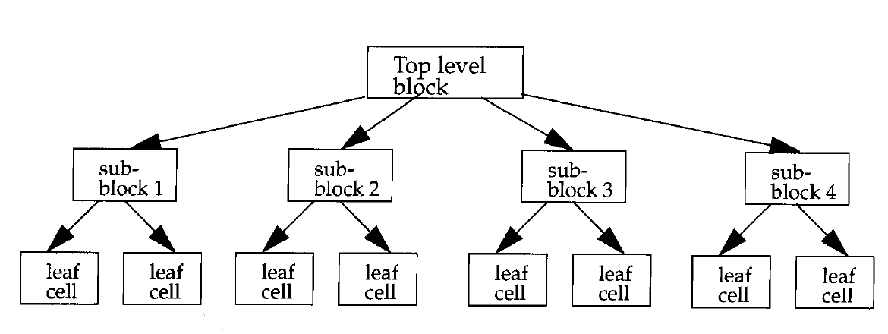
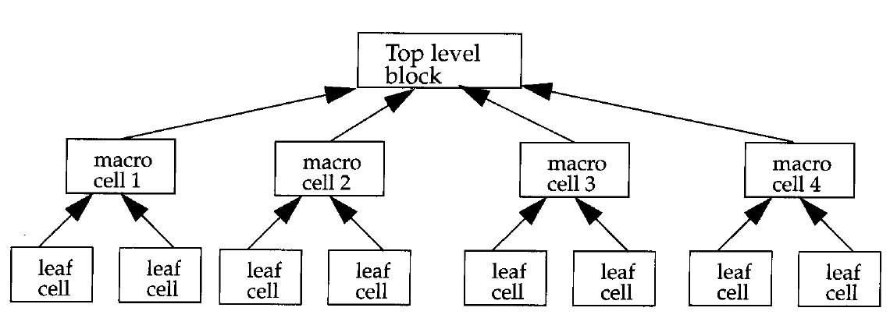
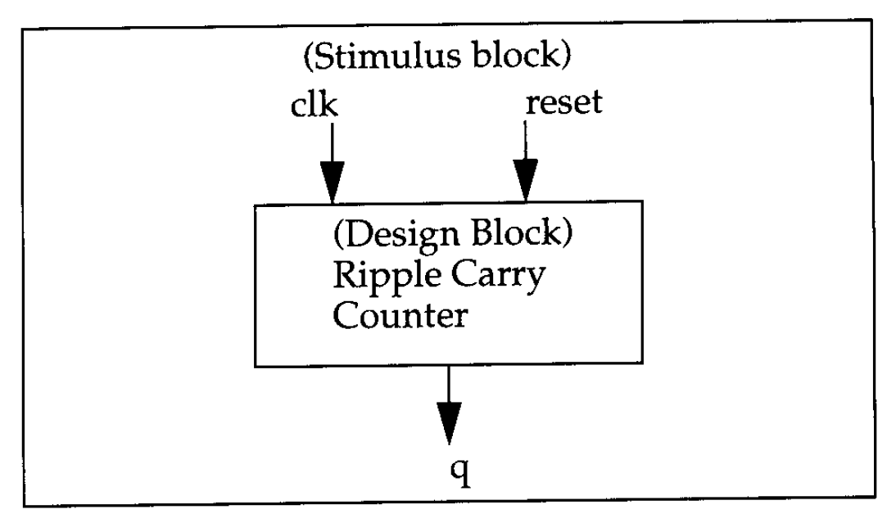
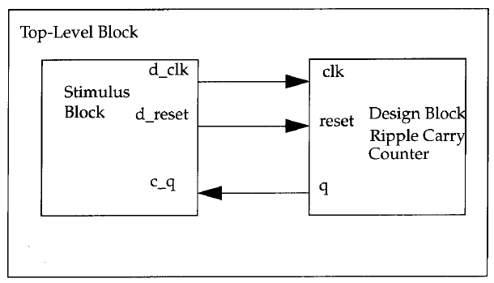

# Hierarchical Modeling Concepts

- Hierarchical modeling is a fundamental concept in digital design that enables designers to manage complexity by structuring designs into smaller, reusable components. 
- A well-defined design methodology is essential for efficient HDL-based design.
- A digital system is composed of multiple interconnected components. Understanding how these components are structured and interact is critical for both design and simulation.

---

## 1. Design Methodologies

Digital design primarily follows two methodologies: top-down and bottom-up. In practice, a combination of both is used.

### Top-Down Design Methodology
- The design process begins by defining the top-level system functionality.
- The system is progressively decomposed into smaller sub-blocks.
- This decomposition continues until indivisible units, called leaf cells, are reached.
- This approach emphasizes system-level planning and architecture.

### Bottom-Up Design Methodology
- The design begins with basic building blocks such as logic gates or primitive cells.
- These blocks are combined to form higher-level modules.
- The process continues until the complete system is constructed.
- This approach focuses on optimized implementation of low-level components.

### Combined Approach
- In real-world designs, both methodologies are used together.
- System architects define the overall structure using a top-down approach.
- Circuit designers simultaneously develop optimized leaf cells using a bottom-up approach.
- The two approaches converge at an intermediate level, typically at standard building blocks such as flip-flops.

---

## 2. Modules in Verilog

A module is the fundamental building block in Verilog.

- A module can represent either a simple element or a complex system composed of submodules.
- It provides functionality through a defined interface consisting of input and output ports.
- The internal implementation of a module is hidden from other modules, enabling abstraction and modularity.
- This encapsulation allows internal changes without affecting the rest of the design.

A module is defined using the `module` and `endmodule` keywords and includes:
- A unique module name
- A list of input and output ports
- Internal implementation

---

## 3. Levels of Abstraction in Verilog

Verilog supports multiple levels of abstraction to describe the same hardware module. The external behavior of the module remains consistent regardless of abstraction level.

### Behavioral Level
- This is the highest level of abstraction.
- The design is described using algorithms without specifying hardware details.
- It is similar to high-level programming languages like C.

### Dataflow Level
- The design is expressed in terms of data movement between registers.
- The designer specifies how data is processed and transferred.

### Gate Level
- The design is described using logic gates and their interconnections.
- This corresponds closely to schematic-based design.

### Switch Level
- This is the lowest level of abstraction.
- The design is described using switches and storage nodes.
- It requires detailed knowledge of transistor-level behavior.

### Key Observations
- Designers can mix different abstraction levels within the same design.
- RTL (Register Transfer Level) typically combines behavioral and dataflow modeling.
- Higher abstraction levels provide better flexibility and portability.
- Lower abstraction levels offer more control but reduce flexibility and increase complexity.

---

## 4. Module Instantiation and Instances

A module acts as a template from which instances are created.

- Instantiation is the process of creating a specific instance of a module.
- Each instance is a unique object with its own name, signals, and parameters.
- Multiple instances of the same module can exist in a design.

For example, a ripple carry counter may instantiate multiple T flip-flop modules, each with unique connections.

### Important Rules
- Each instance must have a unique name.
- Module definitions cannot be nested inside other module definitions.
- Modules must be instantiated to be used; defining a module alone does not include it in the design.

This distinction between module definition and module instance is critical in Verilog design.

---

## 7. Components of a Simulation

After designing a module, its functionality must be verified through simulation.

### Design Block
- Represents the actual hardware design to be tested.

### Stimulus Block (Testbench)
- Provides input signals to the design block.
- Observes and verifies output responses.
- Typically written in Verilog.

It is considered good practice to keep the design and stimulus blocks separate to improve modularity and reusability.

### Methods of Applying Stimulus

#### Method 1: Stimulus as Top-Level Module
- The stimulus block instantiates the design block.
- It directly drives input signals and monitors outputs.
- The stimulus block acts as the top-level module.

#### Method 2: Separate Top-Level Module
- A dummy top-level module instantiates both the design and stimulus blocks.
- The stimulus interacts with the design through defined interfaces.
- This approach improves modularity and separation of concerns.

Both methods are valid and can be chosen based on design and testing requirements.

---