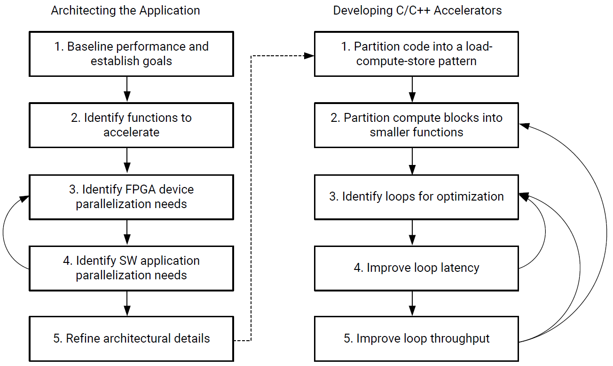
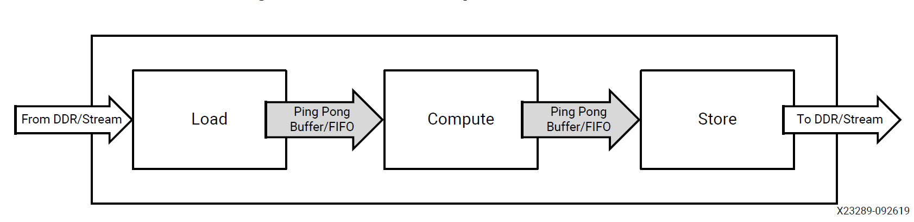

Vitis Unified Software Platform

- [Vitis Unified Software Platform Overview](#vitis-unified-software-platform-overview)
  - [Vitis AI Development Environment](#vitis-ai-development-environment)
  - [Vitis Accelerated Libraries](#vitis-accelerated-libraries)
  - [Vitis Core Development Kit](#vitis-core-development-kit)
  - [Xilinx Runtime library](#xilinx-runtime-library)
  - [Vitis Target Platforms](#vitis-target-platforms)
  - [Vitis Model Composer](#vitis-model-composer)
- [Vitis Application Acceleration Development](#vitis-application-acceleration-development)
  - [Introduction to the Vitis Environment for Acceleration](#introduction-to-the-vitis-environment-for-acceleration)
    - [Accelerated Flow Application Development Using the Vitis Software Platform](#accelerated-flow-application-development-using-the-vitis-software-platform)
      - [FPGA Acceleration](#fpga-acceleration)
    - [Execution Model](#execution-model)
    - [Data Center Application Acceleration Development Flow](#data-center-application-acceleration-development-flow)
    - [Embedded Processor Application Acceleration Development Flow](#embedded-processor-application-acceleration-development-flow)
    - [Build Targets](#build-targets)
  - [Methodology for Accelerating Applications with the Vitis Software Platform](#methodology-for-accelerating-applications-with-the-vitis-software-platform)
    - [Introduction](#introduction)
    - [Methodology Overview](#methodology-overview)
    - [Methodology for Architecting a Device Accelerated Application](#methodology-for-architecting-a-device-accelerated-application)
      - [Step 1: Establish a Baseline Application Performance and Establish Goals](#step-1-establish-a-baseline-application-performance-and-establish-goals)
        - [Measure Running Time](#measure-running-time)
        - [Measure Throughput](#measure-throughput)
        - [Determine the Maximum Achievable Throughput](#determine-the-maximum-achievable-throughput)
        - [Establish Overall Acceleration Goals](#establish-overall-acceleration-goals)
      - [Step 2: Identify Functions to Accelerate](#step-2-identify-functions-to-accelerate)
        - [Identify Performance Bottlenecks](#identify-performance-bottlenecks)
        - [Identify Acceleration Potential](#identify-acceleration-potential)
      - [Step 3: Identify Device Parallelization Needs](#step-3-identify-device-parallelization-needs)
        - [Estimate Hardware Throughput without Parallelization](#estimate-hardware-throughput-without-parallelization)
        - [Determine How Much Parallelism is Needed](#determine-how-much-parallelism-is-needed)
        - [Determine How Many Samples the Datapath Should be Processing in Parallel](#determine-how-many-samples-the-datapath-should-be-processing-in-parallel)
        - [Determine How Many Kernels Can and Should be Instantiated in the Device](#determine-how-many-kernels-can-and-should-be-instantiated-in-the-device)
      - [Step 4: Identify Software Application Parallelization Needs](#step-4-identify-software-application-parallelization-needs)
        - [Minimize CPU Idle Time While the Device Kernels are Running](#minimize-cpu-idle-time-while-the-device-kernels-are-running)
        - [Keep the Device Kernels Utilized](#keep-the-device-kernels-utilized)
        - [Optimize Data Transfers to and from the Device](#optimize-data-transfers-to-and-from-the-device)
        - [Conceptualize the Desired Application Timeline](#conceptualize-the-desired-application-timeline)
      - [Step 5: Refine Architectural Details](#step-5-refine-architectural-details)
        - [Finalize Kernel Boundaries](#finalize-kernel-boundaries)
        - [Decide Kernel Placement and Connectivity](#decide-kernel-placement-and-connectivity)
    - [Methodology for Developing C/C++ Kernels](#methodology-for-developing-cc-kernels)
      - [Step 1: Partition the Code into a Load-Compute-Store Pattern](#step-1-partition-the-code-into-a-load-compute-store-pattern)
        - [Create a Top-Level Function with the Desired Interface](#create-a-top-level-function-with-the-desired-interface)
        - [Code the Load and Store Functions](#code-the-load-and-store-functions)
        - [Code the Compute Functions](#code-the-compute-functions)
        - [Connect the Load, Compute, and Store Functions](#connect-the-load-compute-and-store-functions)
      - [Step 2: Partition the Compute Blocks into Smaller Functions](#step-2-partition-the-compute-blocks-into-smaller-functions)
        - [Decompose to Identify Throughput Goals](#decompose-to-identify-throughput-goals)
        - [Aim for Functions with a Single Loop Nest](#aim-for-functions-with-a-single-loop-nest)
        - [Connect Compute Functions Using the Dataflow 'Canonical Form'](#connect-compute-functions-using-the-dataflow-canonical-form)
      - [Step 3: Identify Loops Requiring Optimization](#step-3-identify-loops-requiring-optimization)
      - [Step 4: Improve Loop Latencies](#step-4-improve-loop-latencies)
        - [Apply Loop Unrolling](#apply-loop-unrolling)
        - [Apply Array Partitioning](#apply-array-partitioning)
      - [Step 5: Improve Loop Throughput](#step-5-improve-loop-throughput)
        - [Eliminate I/O Contentions](#eliminate-io-contentions)
        - [Eliminate Loop-Carried Dependencies](#eliminate-loop-carried-dependencies)
  - [Programming Model](#programming-model)
    - [Device Topology](#device-topology)
    - [Kernel Properties](#kernel-properties)
  - [Host Programming](#host-programming)
    - [Specifying the Device ID and Loading the XCLBIN](#specifying-the-device-id-and-loading-the-xclbin)
    - [Setting Up XRT-Managed Kernels and Kernel Arguments](#setting-up-xrt-managed-kernels-and-kernel-arguments)
    - [Transferring Data between Host and Kernels](#transferring-data-between-host-and-kernels)
    - [Executing Kernels on the Device](#executing-kernels-on-the-device)
    - [Setting Up User-Managed Kernels and Argument Buffers](#setting-up-user-managed-kernels-and-argument-buffers)
    - [Summary](#summary)
  - [C/C++ Kernels](#cc-kernels)
    - [Process Execution Modes](#process-execution-modes)
    - [Data Types](#data-types)
    - [Interfaces](#interfaces)
    - [Loops](#loops)
    - [Dataflow Optimization](#dataflow-optimization)
    - [Array Configuration](#array-configuration)
    - [Function Inlining](#function-inlining)
    - [Auto-Restarting Kernels](#auto-restarting-kernels)
    - [Summary](#summary-1)
  - [RTL Kernels](#rtl-kernels)
    - [Requirements of an RTL Kernel](#requirements-of-an-rtl-kernel)
    - [Creating User-Managed RTL Kernels](#creating-user-managed-rtl-kernels)
    - [RTL Kernel Development Flow](#rtl-kernel-development-flow)
    - [Design Recommendations for RTL Kernels](#design-recommendations-for-rtl-kernels)
  - [Best Practices for Acceleration with Vitis](#best-practices-for-acceleration-with-vitis)
- [Vitis Tutorials](#vitis-tutorials)
  - [Getting Started](#getting-started)
    - [Vitis Introduction and Getting Started](#vitis-introduction-and-getting-started)
      - [Part 1 : Essential Concepts](#part-1--essential-concepts)
        - [Understanding the Vitis Programming and Execution Model](#understanding-the-vitis-programming-and-execution-model)
        - [Understanding the Vitis Build Process](#understanding-the-vitis-build-process)
        - [Understanding Vitis Build Targets](#understanding-vitis-build-targets)
    - [Vitis HLS](#vitis-hls)
  - [Acceleration Tutorial](#acceleration-tutorial)
  - [AI Engine Development](#ai-engine-development)
  - [Platform Creation Tutorial](#platform-creation-tutorial)
  - [Vitis Developers Contributed Tutorials](#vitis-developers-contributed-tutorials)
  - [Other Vitis Tutorial Repositories](#other-vitis-tutorial-repositories)
    - [Machine Learning Tutorial](#machine-learning-tutorial)
    - [Embedded Design Tutorials](#embedded-design-tutorials)
- [Vitis Accelerated Libraries](#vitis-accelerated-libraries-1)
  - [Vitis Vision Library](#vitis-vision-library)
    - [Overview](#overview)
      - [Basic Features](#basic-features)
      - [Vitis Vision Library Contents](#vitis-vision-library-contents)
    - [Getting Started with Vitis Vision](#getting-started-with-vitis-vision)
      - [Vitis Design Methodology](#vitis-design-methodology)
        - [Host Code with OpenCL](#host-code-with-opencl)
        - [Wrappers around HLS Kernel(s)](#wrappers-around-hls-kernels)
      - [Evaluating the Functionality](#evaluating-the-functionality)
- [References](#references)

# Vitis Unified Software Platform Overview

The Vitis unified software platform is a tool that combines all aspects
of Xilinx software development into one unified environment. The Vitis
unified software platform enables the development of embedded software
and accelerated applications on heterogeneous Xilinx platforms including
FPGAs, SoCs, and Versal ACAPs. It provides a unified programming model
for accelerating Edge, Cloud, and Hybrid computing applications.

Leverage integration with high-level frameworks, develop in C, C++, or
Python using accelerated libraries or use RTL-based accelerators &
low-level runtime APIs for more fine-grained control over
implementation.

The Vitis unified software platform includes:

-   Comprehensive core development kit to seamlessly build accelerated
    applications

-   Rich set of hardware-accelerated open-source libraries optimized for
    Xilinx FPGA and Versal ACAP hardware platforms

-   Plug-in domain-specific development environments enabling
    development directly in familiar, higher-level frameworks

-   Growing ecosystem of hardware-accelerated partner libraries and
    pre-built applications

-   Vitis Model Composer, a Model-Based Design tool that enables rapid
    design exploration and verification within the MathWorks MATLAB and
    Simulink environment and accelerates the path to production on
    Xilinx devices.

-   Vitis Networking P4 allows for the creation of soft-defined
    networks. VitisNetP4 data plane builder generates systems that can
    be programmed for a wide range of packet processing functions from
    simple packet classification to complex packet editing.

{#VitisOverview width="\\textwidth"}

Vitis Unified Software Platform documentation is divided into the
following:

1.  Accelerated application development (UG1393)

2.  Embedded software development (UG1400)

3.  Vitis HLS (UG1399)

4.  AI Engine (UG1076), AI Engine Kernel Coding Best Practices (UG1079)

Key Components of the Vitis Unified Software Platform are as follows:

## Vitis AI Development Environment

The Vitis AI development environment is a specialized development
environment for accelerating AI inference on Xilinx embedded platforms,
Alveo accelerator cards, or on the FPGA-instances in the cloud. Vitis AI
development environment supports the industry's leading deep learning
frameworks like Tensorflow and Caffe, and offers comprehensive APIs to
prune, quantize, optimize, and compile your trained networks to achieve
the highest AI inference performance for your deployed application.

## Vitis Accelerated Libraries

Open-source, performance-optimized libraries that offer out-of-the-box
acceleration with minimal to zero-code changes to your existing
applications, written in C, C++ or Python. Leverage the domain-specific
accelerated libraries as-is, modify to suit your requirements or use as
algorithmic building blocks in your custom accelerators.

## Vitis Core Development Kit

Complete set of graphical and command-line developer tools that include
the Vitis compilers, analyzers and debuggers to build, analyze
performance bottlenecks and debug accelerated algorithms, developed in
C, C++ or OpenCL. Leverage these features within your own IDEs or use
the standalone Vitis IDE.

## Xilinx Runtime library

Xilinx Runtime library (XRT) facilitates communication between your
application code (running on an embedded ARM or x86 Host) and the
accelerators deployed on the reconfigurable portion of PCIe based Xilinx
accelerator cards, MPSoC based embedded platforms or ACAPs. It includes
user-space libraries and APIs, kernel drivers, board utilities, and
firmware.

## Vitis Target Platforms

The Vitis target platform defines base hardware and software
architecture and application context for Xilinx platforms, including
external memory interfaces, custom input/output interfaces and software
runtime.

-   For Xilinx accelerator cards on-premise or in the cloud, the Vitis
    target platform automatically configures the PCIe interfaces that
    connect and manage communication between your FPGA accelerators and
    x86 Application code you dont need to implement any connection
    details!

-   For Xilinx embedded devices, the Vitis target platform also includes
    the operating system for the processor on the platform, boot loader
    and drivers for platform peripherals, and root file system. You can
    use predefined Vitis target platforms for Xilinx evaluation boards
    or define your own in Vivado Design Suite.

## Vitis Model Composer

The Vitis Model Composer is a Xilinx toolbox for MATLAB and Simulink
enabling rapid design exploration and verification within the MATLAB and
Simulink environment and accelerates the path to production on Xilinx
devices.

-   Create a design using optimized blocks targeting AI Engines and
    Programmable Logic. Visualize and analyze simulation results and
    compare the output to golden references generated using MATLAB and
    Simulink.

-   Seamlessly co-simulation AI Engine and Programmable Logic (HLS, HDL)
    blocks.

-   Automatically generate code (AI Engines dataflow graph, RTL, HLS
    C++) and test bench for a design.

-   Validate your design in Hardware with unparalleled Ease of Use.

# Vitis Application Acceleration Development

## Introduction to the Vitis Environment for Acceleration

### Accelerated Flow Application Development Using the Vitis Software Platform

The Vitis application acceleration development flow provides a framework
for developing and delivering FPGA accelerated applications using
standard programming languages for both software and hardware
components. The software component, or host program, is developed using
C/C++ to run on x86 or embedded processors, with OpenCL API calls to
manage runtime interactions with the accelerator. The hardware
component, or kernel, can be developed using C/C++, OpenCL C, or RTL.
The Vitis software platform promotes concurrent development and test of
the Hardware and Software elements of an heterogeneous application.

#### FPGA Acceleration

Xilinx FPGAs offer many advantages over traditional CPU/GPU
acceleration, including a custom architecture capable of implementing
any function that can run on a processor, resulting in better
performance at lower power dissipation. When compared with processor
architectures, the structures that comprise the programmable logic (PL)
fabric in a Xilinx device enable a high degree of parallelism in
application execution.

To realize the advantages of software acceleration on a Xilinx device,
you should look to accelerate large compute-intensive portions of your
application in hardware. Implementing these functions in custom hardware
gives you an ideal balance between performance and power.

### Execution Model

In the Vitis core development kit, an application program is split
between a host application and hardware accelerated kernels with a
communication channel between them. The host program, written in C/C++
and using API abstractions like OpenCL, is compiled into an executable
that runs on a host processor (such as an x86 server or an Arm processor
for embedded platforms); while hardware accelerated kernels are compiled
into an executable device binary (.xclbin) that runs within the
programmable logic (PL) region of a Xilinx device.

The API calls, managed by XRT, are used to process transactions between
the host program and the hardware accelerators. Communication between
the host and the kernel, including control and data transfers, occurs
across the PCIe bus or an AXI bus for embedded platforms. While control
information is transferred between specific memory locations in the
hardware, global memory is used to transfer data between the host
program and the kernels. Global memory is accessible by both the host
processor and hardware accelerators, while host memory is only
accessible by the host application.

The target platform contains the FPGA accelerated kernels, global
memory, and the direct memory access (DMA) for memory transfers. Kernels
can have one or more global memory interfaces and are programmable. The
Vitis core development kit execution model can be broken down into the
following steps:

1.  The host program writes the data needed by a kernel into the global
    memory of the attached device through the PCIe interface on an Alveo
    Data Center accelerator card, or through the AXI bus on an embedded
    platform.

2.  The host program sets up the kernel with its input parameters.

3.  The host program triggers the execution of the kernel function on
    the FPGA.

4.  The kernel performs the required computation while reading data from
    global memory, as necessary.

5.  The kernel writes data back to global memory and notifies the host
    that it has completed its task.

6.  The host program reads data back from global memory into the host
    memory and continues processing as needed.

The FPGA can accommodate multiple kernel instances on the accelerator,
both different types of kernels, and multiple instances of the same
kernel. XRT transparently orchestrates the interactions between the host
program and kernels in the accelerator.

### Data Center Application Acceleration Development Flow

describes the steps needed to build and run an application for use on
the Alveo Data Center accelerator cards.

1.  x86 Application Compilation: Compile the host application to run on
    the x86 processor using the G++ compiler to create a host executable
    file. The host program interacts with kernels in the PL region.

2.  PL Kernel Compilation and Linking: PL kernels are compiled for
    implementation in the PL region of the target platform. PL kernels
    can be compiled into Xilinx object form (XO) file using the Vitis
    compiler (v++), Vitis HLS for C/C++ kernels, or the package_xo
    command for RTL kernels.

    -   The Vitis compiler also links the kernel XO files with the
        hardware platform to create a device executable (.xclbin) for
        the application.

    -   Xilinx object (XO) files are linked with the target hardware
        platform by the v++ --link command to create a device binary
        file (.xclbin) that is loaded into the Xilinx device on the
        target platform.

3.  Running the Application: For Alveo Data Center accelerator cards,
    the .xclbin file is the required build object for running the
    system. When running the application, you can run software
    emulation, hardware emulation, or run on the actual physical
    accelerator platform.

    -   When the build target is software or hardware emulation, the
        emconfigutil command builds an emulation model of the target
        platform. The Vitis compiler generates simulation models of the
        kernels in the device binary and running the application runs
        this model of the system. Emulation targets let you build, run,
        and iterate the design over relatively quick cycles; debugging
        the application and evaluating performance.

    -   When the build target is the hardware system, the target
        platform is the physical device. The Vitis compiler generates
        the .xclbin using the Vivado Design Suite to run synthesis and
        implementation and resolve timing. Running the application runs
        your system on the hardware. The build process is automated to
        generate high quality results.

{#DataCenterFlow width="\\textwidth"}

### Embedded Processor Application Acceleration Development Flow

The following diagram describes the steps needed to build and run an
application using Arm processors and kernels running in programmable
logic regions of Versal ACAP, Zynq UltraScale+ MPSoC, and Zynq-7000 SoC
devices. The steps are summarized below in .

{#EmbeddedFlow
width="\\textwidth"}

1.  PS Application Compilation: Compile the host application to run on
    the Cortex-A72 or Cortex-A53 core processor using the GNU Arm
    cross-compiler to create an ELF file. The host program interacts
    with kernels in the PL and AI Engine regions of the device.

2.  AI Engine Array (Optional for Versal AI Engine Core series only):
    Some Versal ACAP devices incorporate an AI Engine array of very-long
    instruction word (VLIW) processors with single instruction multiple
    data (SIMD) vector units that are highly optimized for
    compute-intensive applications such as 5G wireless and artificial
    intelligence (AI) applications. AI Engine graphs and kernels are
    built using Vitis tools such as the aiecompiler and aiesimulator,
    and can be integrated into the embedded processor application
    acceleration flow.

3.  PL Kernel Compilation and Linking: PL kernels are compiled for
    implementation in the PL region of the target platform. PL kernels
    can be compiled into Xilinx object form (XO) file using the Vitis
    compiler (v++), Vitis HLS for C/C++ kernels, or the package_xo
    command for RTL kernels.

    -   The Vitis compiler also links the kernel XO files with the
        hardware platform to create a device executable (.xclbin) for
        the application.

    -   Xilinx object (XO) files are linked with the target hardware
        platform by the v++ --link command to create a device binary
        file (.xclbin) that is loaded into the Xilinx device on the
        target platform.

4.  System Package: Use the v++ --package command to gather the required
    files to configure and boot the system, to load and run the
    application, including the host application and PL kernel binaries.
    This step builds the necessary package to run software or hardware
    emulation and debug, or to create an SD card to run your application
    on hardware.

5.  Running the Application: When running the application, you can run
    software emulation, hardware emulation, or run on the actual
    physical accelerator platform. Running the application on embedded
    processor platforms is different from running on data center
    accelerator cards.

    -   When the build target is software or hardware emulation, the
        QEMU environment models the hardware device. The Vitis compiler
        generates simulation models of the kernels in the device binary
        and running the application runs in the QEMU model of the
        system. Emulation targets let you build, run, and iterate the
        design over relatively quick cycles; debugging the application
        and evaluating performance.

    -   When the build target is the hardware system, the target
        platform is the physical device. The Vitis compiler generates
        the .xclbin using the Vivado Design Suite to run synthesis and
        implementation, and resolve timing. Running the application runs
        your system on the hardware. The build process is automated to
        generate high quality results; however, hardware-savvy
        developers can fully leverage the Vivado tools in their design
        process.

### Build Targets

The Vitis compiler provides three different build targets, two emulation
targets used for debug and validation purposes, and the default hardware
target used to generate the actual FPGA binary:

-   Software Emulation (sw_emu): Both the host application code and the
    kernel code are compiled to run on the host processor. This allows
    iterative algorithm refinement through fast build-and-run loops.
    This target is useful for identifying syntax errors, performing
    source-level debugging of the kernel code running together with
    application, and verifying the behavior of the system.

-   Hardware Emulation (hw_emu): The kernel code is compiled into a
    hardware model (RTL), which is run in a dedicated simulator. This
    build-and-run loop takes longer but provides a detailed,
    cycle-accurate view of kernel activity. This target is useful for
    testing the functionality of the logic that will go in the FPGA and
    getting initial performance estimates.

-   Hardware (hw): The kernel code is compiled into a hardware model
    (RTL) and then implemented on the FPGA, resulting in a binary that
    will run on the actual FPGA.

## Methodology for Accelerating Applications with the Vitis Software Platform

### Introduction

There are distinct differences between CPUs, GPUs, and programmable
devices. Understanding these differences is key to efficiently
developing applications for each kind of device and achieving optimal
acceleration.

Both CPUs and GPUs have pre-defined architectures, with a fixed number
of cores, a fixed instruction set, and a rigid memory architecture. GPUs
scale performance through the number of cores and by employing SIMD/SIMT
parallelism. In contrast, programmable devices are fully customizable
architectures. The developer creates compute units that are optimized
for application needs. Performance is achieved by creating deeply
pipelined data-paths, rather than multiplying the number of compute
units.

::: highlight
Traditional software development is about programming functionality on a
pre-defined architecture. Programmable device development is about
programming an architecture to implement the desired functionality.

### Methodology Overview

The methodology is comprised of two major phases:

1.  Architecting the application

2.  Developing the C/C++ kernels

In the first phase, the developer makes key decisions about the
application architecture by determining which software functions should
be mapped to device kernels, how much parallelism is needed, and how it
should be delivered.

In the second phase, the developer implements the kernels. This
primarily involves structuring source code and applying the desired
compiler pragma to create the desired kernel architecture and meet the
performance target.

{#Methodology
width="75%"}

### Methodology for Architecting a Device Accelerated Application

In architecting a Device Accelerated Application phase, the developer
makes key decisions about the architecture of the application and
determines factors such as what software functions should be mapped to
device kernels, how much parallelism is needed, and how it should be
delivered.

{#MethodologyArchitect
width="75%"}

#### Step 1: Establish a Baseline Application Performance and Establish Goals

Start by measuring the runtime and throughput performance, to identify
bottlenecks of the current application running on your existing
platform. These performance numbers should be generated for the entire
application (end-to-end) as well as for each major function in the
application. The most effective way is to run the application with
profiling tools, like valgrind, callgrind, and GNU gprof. The profiling
data generated by these tools show the call graph with the number of
calls to all functions and their execution time. These numbers provide
the baseline for most of the subsequent analysis process. The functions
that consume the most execution time are good candidates to be offloaded
and accelerated onto FPGAs.

##### Measure Running Time

Measuring running time is a standard practice in software development.
This can be done using common software profiling tools such as gprof, or
by instrumenting the code with timers and performance counters.

##### Measure Throughput

Throughput is the rate at which data is being processed. To compute the
throughput of a given function, divide the volume of data the function
processed by the running time of the function.

$$T_{SW} = max(V_{INPUT}, V_{OUTPUT}) / Running Time$$

Some functions process a pre-determined volume of data. In this case,
simple code inspection can be used to determine this volume. In some
other cases, the volume of data is variable. In this case, it is useful
to instrument the application code with counters to dynamically measure
the volume.

##### Determine the Maximum Achievable Throughput

In most device-accelerated systems, the maximum achievable throughput is
limited by the PCIe bus. PCIe performance is influenced by many
different aspects, such as motherboard, drivers, target platform, and
transfer sizes. Run DMA tests upfront to measure the effective
throughput of PCIe transfers and thereby determine the upper bound of
the acceleration potential, such as the xbutil dma test.

An acceleration goal that exceeds this upper bound throughput cannot be
met as the system is I/O bound. Similarly, when defining kernel
performance and I/O requirements, keep this upper bound in mind.

##### Establish Overall Acceleration Goals

Determining acceleration goals early in the development is necessary
because the ratio between the acceleration goal and the baseline
performance drives the analysis and decision-making process.
Acceleration goals can be hard or soft. Domain expertise is important
for setting obtainable and meaningful acceleration goals.

#### Step 2: Identify Functions to Accelerate

::: highlight
Minimize changes to the existing code at this point so you can quickly
generate a working design on the FPGA and get the baselined performance
and resource numbers.

When selecting functions to accelerate in hardware, two aspects are
considered:

-   Performance bottlenecks

-   Acceleration potential

##### Identify Performance Bottlenecks

In a purely sequential application, performance bottlenecks can be
easily identified by looking at profiling reports. However, most
real-life applications are multi-threaded and it is important to the
take the effects of parallelism in consideration when looking for
performance bottlenecks. When looking for acceleration candidates,
consider the performance of the entire application, not just of
individual functions.

##### Identify Acceleration Potential

A function that is a bottleneck in the software application does not
necessarily have the potential to run faster in a device. However,
following simple guidelines can be used to assess if a function has
potential for hardware acceleration:

-   **Computational complexity** of a function is the number of basic
    computing operations required to execute the function.

-   **Computational intensity** of a function is the ratio of the total
    number of operations to the total amount of input and output data.
    Functions with a high computational intensity are better candidates
    for acceleration because the overhead of moving data to the
    accelerator is comparatively lower.

-   **Data access locality profile:** The concepts of data reuse,
    spatial locality, and temporal locality are useful to assess how
    much overhead of moving data to the accelerator can be optimized.
    Spatial locality reflects the average distance between several
    consecutive memory access operations. Temporal locality reflects the
    average number of access operations for an address in memory during
    program execution. The lower these measures the better, because it
    makes data more easily cacheable in the accelerator, reducing the
    need to expensive and potentially redundant accesses to global
    memory.

-   **How does the throughput of the function compare to the maximum
    achievable in a device?** The throughput of the overall application
    does not exceed the throughput of its slowest function. The
    developer can determine the maximum acceleration potential by
    dividing the throughput of the slowest function by the throughput of
    the selected function.
    $$Maximum Acceleration Potential = T_{Min} / T_{SW}$$ On Alveo Data
    Center accelerator cards, the PCIe bus imposes a throughput limit on
    data transfers. While it may not be the actual bottleneck of the
    application, it constitutes a possible upper bound and can therefore
    be used for early estimates.

#### Step 3: Identify Device Parallelization Needs

Parallelism is possibilities within kernels:

-   The progressive and simultaneous processing of inputs is called as
    pipelining.

-   Increasing the width of the datapath within the kernel is another
    form of Parallelism.

The developer needs to determine which combination of parallelization
techniques is most effective at meeting the acceleration goals.

##### Estimate Hardware Throughput without Parallelization

The throughput of the kernel without any parallelization can be
approximated as:
$$T_{HW} = Frequency / Computational Intensity = Frequency * max(V_{INPUT},V_{OUTPUT}) / V_{OPS}$$
Frequency is the clock frequency of the kernel. This value is determined
by the targeted acceleration platform, or target platform. The
Computational Intensity of a function is the ratio of the total number
of operations to the total amount of input and output data. The formula
above clearly shows that functions with a high volume of operations and
a low volume of data are better candidates for acceleration.

##### Determine How Much Parallelism is Needed

The initial HW/SW performance ratio can be estimated as:
$$Speed-up = T_{HW}/T_{SW} = F_{max} * Running Time /V_{ops}$$ Without
any parallelization, the initial speed-up will most likely be less
than 1. To calculate how much parallelism is needed to meet the
performance goal:

$$Parallelism Needed = T_{Goal} / T_{HW} = T_{Goal} * V_{ops} / (F_{max} * max(V_{INPUT}, V_{OUTPUT}))$$

This parallelism can be implemented in various ways: by widening the
datapath, by using multiple engines, and by using multiple kernel
instances. The developer should then determine the best combination
given their needs and the characteristics of their application.

##### Determine How Many Samples the Datapath Should be Processing in Parallel

One possibility is to accelerate the computation by creating a wider
datapath and processing more samples in parallel. Processing more
samples in parallel using a wider datapath improves performance by
reducing the latency (running time) of the accelerated function.

##### Determine How Many Kernels Can and Should be Instantiated in the Device

If the datapath cannot be parallelized (or not sufficiently), then more
kernel instances can be added. This is usually referred to as using
multiple compute units (CUs). Adding more kernel instances improves the
performance of the application by allowing the execution of more
invocations of the targeted function in parallel. Multiple data sets are
processed concurrently by the different instances. Application
performance scales linearly with the number of instances, provided that
the host application can keep the kernels busy.

#### Step 4: Identify Software Application Parallelization Needs

Parallelism in the software application can be achieved by aiming the
following:

-   Aim to minimize CPU idle time

-   Aim to maximize kernel utilization

-   Aim to optimize data transfers

{#SoftwareOptimization
width="90%"}

##### Minimize CPU Idle Time While the Device Kernels are Running

Device-acceleration is about offloading certain computations from the
host processor to the kernels in the device. In a purely sequential
model, the application would be waiting idly for the results to be ready
and resume processing. Instead, engineer the software application to
avoid such idle cycles. Begin by identifying parts of the application
that do not depend on the results of the kernel. Then structure the
application so that these functions can be executed on the host in
parallel to the kernel running in the device.

##### Keep the Device Kernels Utilized

Kernels might be present in the device, but they will only run when the
application requests them. To maximize performance, engineer the
application so that it will keep the kernels busy. Conceptually, this is
achieved by issuing the next requests before the current ones have
completed. This results in pipelined and overlapping execution, leading
to kernels being optimally utilized, as shown in

{#AcceleratorPipeline
width="90%"}

##### Optimize Data Transfers to and from the Device

In an accelerated application, data must be transferred from the host to
the device especially in the case of PCIe-based applications. This
introduces latency, which can be very costly to the overall performance
of the application.

Data needs to be transferred at the right time, otherwise the
application performance is negatively impacted if the kernel must wait
for data to be available. It is therefore important to transfer data
ahead of when the kernel needs it. This is achieved by overlapping data
transfers and kernel execution.

Another method of optimizing data transfers is to transfer optimally
sized buffers. PCIe throughput varies greatly based on the transferred
buffer size. The larger the buffer, the better the throughput, ensuring
the accelerators always have data to operate on and are not wasting
cycles. It is usually better to make data transfers of 1 MB or more.
Running DMA tests upfront can be useful for finding the optimal buffer
sizes. Also, when determining optimal buffer sizes, consider the effect
of large buffers on resource utilization and transfer latency. Xilinx
recommends grouping multiple sets of data in a common buffer to achieve
the highest possible throughput.

##### Conceptualize the Desired Application Timeline

The timeline sequences, as shown in , are very effective ways of
representing performance and parallelization in action as the
application runs. The Vitis software platform generates timeline views
from actual application runs which can be used to validate the user
timeline, identify potential issues, and iterate and converge on the
optimal results.

#### Step 5: Refine Architectural Details

The final step consists of refining and deriving second order
architectural details from the top-level decisions.

##### Finalize Kernel Boundaries

As discussed earlier, performance can be improved by creating multiple
instances of kernels (compute units). However, adding CUs has a cost in
terms of I/O ports, bandwidth, and resources. In the Vitis software
platform flow, kernel ports have a maximum width of 512 bits (64 bytes)
and have a fixed cost in terms of device resources. Most importantly,
the targeted platform sets a limit on the maximum number of ports which
can be used.

An alternative to scaling with multiple compute units is to scale by
adding multiple engines within a kernel. This approach allows increasing
performance in the same way as adding more CUs: multiple data sets are
processed concurrently by the different engines within the kernel.

Placing multiple engines in the same kernel takes the fullest advantage
of the bandwidth of the kernel's I/O ports. Putting multiple engines in
a kernel also reduces the number of ports and the number of transactions
to global memory that require arbitration, improving the effective
bandwidth.

On the other hand, this transformation requires coding explicit I/O
multiplexing behavior in the kernel. This is a trade-off the developer
needs to make.

##### Decide Kernel Placement and Connectivity

At this point, it is important to understand the features of the target
platform and what global memory resources are available.

Using multiple DDRs helps balance the data transfer loads and improve
performance. This comes with a cost, however, as each DDR controller
consumes device resources. Balance these considerations when deciding
how to connect kernel ports to memory banks. Establishing these
connections is done through a simple compiler switch, making it easy to
change configurations if necessary.

After refining the architectural details, the developer should have all
the information necessary to start implementing the kernels, and
ultimately, assembling the entire application.

### Methodology for Developing C/C++ Kernels

The Vitis software platform supports kernels modeled in either C/C++ or
RTL (Verilog, VHDL, System Verilog). The following key kernel
requirements for optimal application performance should have already
been identified during the architecture definition phase:

-   Throughput goal

-   Latency goal

-   Datapath width

-   Number of engines

-   Interface bandwidth

These requirements drive the kernel development and optimization
process. Achieving the kernel throughput goal is the primary objective,
as overall application performance is predicated on each kernel meeting
the specified throughput.

The kernel development methodology therefore follows a throughput-driven
approach and works from the outside-in. This approach has two phases:

1.  Defining and implementing the macro-architecture of the kernel

2.  Coding and optimizing the micro-architecture of the kernel

Before starting the kernel development process, it is essential to
understand:

-   **Functionality** is the mathematical relationship between input
    parameters and output results.

-   **Algorithm** is a series of steps for performing a specific
    functionality. A given functionality can be performed using a
    variety of different algorithms.

-   **Architecture**, in this context, refers to the characteristics of
    the underlying hardware implementation of an algorithm.

You must understand that the Vitis compiler generates optimized hardware
architectures from algorithms written in C/C++. However, it does not
transform a particular algorithm into another one. Even if the software
program can be automatically converted (or synthesized) into hardware,
achieving acceptable quality of results (QoR), requires additional work
such as rewriting the software to help the HLS tool achieve the desired
performance goals.

::: highlight
Because the algorithm directly influences data access locality as well
as potential for computational parallelism, your choice of algorithm has
a major impact on achievable performance, more so than the compiler's
abilities or user specified pragmas.

{#KernelMethodology
width="90%"}

#### Step 1: Partition the Code into a Load-Compute-Store Pattern

::: highlight
A kernel is essentially a custom datapath (optimized for the desired
functionality) and an associated data storage and motion network.

Data storage and motion network is also referred to as the memory
architecture or memory hierarchy of the kernel. It is responsible for
moving data in and out of the kernel and through the custom datapath as
efficiently as possible.

Knowing that kernel accesses to global memory are expensive and that
bandwidth is limited, it is very important to carefully plan this aspect
of the kernel. To help with this, the first step of the kernel
development methodology requires structuring the kernel code into the
load-compute-store pattern. This means creating a top-level function
with:

-   Interface parameters matching the desired kernel interface.

-   Three sub-functions: load, compute, and store.

-   Local arrays or hls::stream variables to pass data between these
    functions.

{#LCSPattern
width="90%"}

Structuring the kernel code this way enables task-level pipelining, also
known as HLS dataflow. This compiler optimization results in a design
where each function can run simultaneously, creating a pipeline of
concurrently running tasks. And this structure is key to achieving and
sustaining the desired throughput.

-   The **load function** is responsible for efficient data transfer
    (including buffering and caching if necessary) from external to the
    kernel (global memory).

-   The **compute function**, as its name suggests, is where all the
    processing is done.

-   The **store function** mirrors the load function. It is responsible
    for moving data out of the kernel, taking the results of the compute
    function and transferring them to global memory outside the kernel.

Understanding and visualizing the data movement as a block diagram will
help to partition and structure the different functions within the
kernel.

##### Create a Top-Level Function with the Desired Interface

The Vitis technology infers kernel interfaces from the parameters of the
top-level function. Therefore, it is necessary to write a kernel
top-level function with parameters matching the desired interface.

-   Input parameters should be passed as scalars.

-   Blocks of input and output data should be passed as pointers.

-   Compiler pragmas should be used to finalize the interface
    definition.

##### Code the Load and Store Functions

Data transfers between the kernel and global memories have a very big
influence on overall system performance. If not properly done, they
might throttle the kernel. The following are guidelines for improving
the efficiency of data transfers in and out of the kernel.

-   Match Port Width to Datapath Width

-   Use Burst Transfers

-   Minimize the Number of Data Transfers from Global Memory

##### Code the Compute Functions

The compute function is where all the actual processing is done. This
first step of the methodology is focused on getting the top-level
structure right and optimizing data movement. The priority is to have a
function with the right interfaces and make sure the functionality is
correct.

##### Connect the Load, Compute, and Store Functions

Use standard C/C++ variables and arrays to connect the top-level
interfaces and the load, compute and store functions. It can also be
useful to use the hls::stream class, which models a streaming behavior.

Streaming is a type of data transfer in which data samples are sent in
sequential order starting from the first sample. Streaming requires no
address management and can be implemented with FIFOs.

Key recommendations for function connections include:

-   Data should be transferred in the forward direction only, avoiding
    feedback whenever possible.

-   Each connection should have a single producer and a single consumer.

-   Only the load and store functions should access the primary
    interface of the kernel.

#### Step 2: Partition the Compute Blocks into Smaller Functions

The next step is to refine the main compute function, decomposing it
into a sequence of smaller sub-functions, as shown in the

{#computeSubFunctions
width="90%"}

##### Decompose to Identify Throughput Goals

In a dataflow system like the one created with this approach, the
slowest task will be the bottleneck.

$$Throughput(Kernel) = min(Throughput(Task1), Throughput(Task2), \dots,$$
$$Throughput(TaskN))$$

Therefore, during the decomposition process, always have the kernel
throughput goal in mind and assess whether each sub-function will be
able to satisfy this throughput goal.

##### Aim for Functions with a Single Loop Nest

As a general rule, if a function has sequential loops in it, these loops
execute sequentially in the hardware implementation generated by the HLS
compiler. This is usually not desirable, as sequential execution hampers
throughput.

However, if these sequential loops are pushed into sequential functions,
then the HLS compiler can apply the dataflow optimization and generate
an implementation that allows the pipelined and overlapping execution of
each task.

During this partitioning and refining process, put sequential loops into
individual functions. Ideally, the lowest-level compute block should
only contain a single perfectly-nested loop.

##### Connect Compute Functions Using the Dataflow 'Canonical Form'

Rules regarding connectivity while decomposing the compute function:

-   Aim for feed-forward connections.

-   Have a single producer and consumer for each connecting variable.

-   If a variable must be consumed by more than one function, then it
    should be explicitly duplicated.

-   When moving blocks of data from one compute block to another, the
    developer can choose to use arrays or hls::stream objects.

Using arrays requires fewer code changes and is usually the fastest way
to make progress during the decomposition process. However, using
hls::stream objects can lead to designs using less memory resources and
having shorter latency. It also helps the developer reason about how
data moves through the kernel, which is always an important thing to
understand when optimizing for throughput.

At this stage, maintaining a graphical representation of the
architecture of the kernel can be very useful to reason through data
dependencies, data movement, control flows, and concurrency.

#### Step 3: Identify Loops Requiring Optimization

The throughput of a function is measured by dividing the volume of data
processed by the latency, or running time, of the function.
$$T = max(V_{INPUT}, V_{OUTPUT}) / Latency$$

The latency of a loop can be calculated as follows:
$$LatencyLoop = (Steps + II x (TripCount - 1)) x ClockPeriod$$ Where:

-   **Steps**: Duration of a single loop iteration, measured in number
    of clock cycles

-   **TripCount**: Number of iterations in the loop.

-   **II**: Initiation Interval, the number of clock cycles between the
    start of two consecutive iterations. When a loop is not pipelined,
    its II is equal to the number of Steps.

Assuming a given clock period, there are three ways to reduce the
latency of a loop, and thereby improve the throughput of a function:

-   Reduce the number of Steps in the loop (take less time to perform
    one iteration).

-   Reduce the Trip Count, so that the loop performs fewer iterations.

-   Reduce the Initiation Interval, so that loop iterations can start
    more often.

Assuming a trip count much larger than the number of steps, halving
either the II or the trip count can be sufficient to double the
throughput of the loop.

#### Step 4: Improve Loop Latencies

After identifying loops latencies that exceed their target, the first
optimization to consider is loop unrolling.

##### Apply Loop Unrolling

Loop unrolling unwinds the loop, allowing multiple iterations of the
loop to be executed together, reducing the loop's overall trip count.
Loop unrolling can widen the resulting datapath by the corresponding
factor. This usually increases the bandwidth requirements as more
samples are processed in parallel. This has two implications:

-   The width of the function I/Os must match the width of the datapath
    and vice versa.

-   No additional benefit is gained by loop unrolling and widening the
    datapath to the point where I/O requirements exceed the maximum size
    of a kernel port (512 bits / 64 bytes).

Guidelines to optimize the use of loop unrolling:

-   Start from the innermost loop within a loop nest.

-   Assess which unroll factor would eliminate all loop-carried
    dependencies.

-   For more efficient results, unroll loops with fixed trip counts.

-   If there are function calls within the unrolled loop, in-lining
    these functions can improve results through better resource sharing,
    although at the expense of longer synthesis times. Note also that
    the interconnect may become increasingly complex and lead to routing
    problems later on.

-   Do not blindly unroll loops. Always unroll loops with a specific
    outcome in mind.

##### Apply Array Partitioning

If a loop makes array accesses ensure that the resulting datapath can
access all the data it needs in parallel. If unrolling a loop does not
result in the expected performance improvement, this is almost always
because of memory access bottlenecks.

Consider using various pragmas to partition and reshape arrays, when
loop unrolling to create a memory structure that allows the desired
level of parallel accesses.

Unrolling and partitioning arrays can be sufficient to meet the latency
and throughput goals for the targeted loop. If so, shift to the next
loop of interest. Otherwise, look at additional optimizations to improve
throughput.

#### Step 5: Improve Loop Throughput

If loop latency can be further impriovced by reducing the initiation
interval (II). The loop II is the count of clock cycles between the
start of two loop iterations. The Vitis HLS compiler will always try to
pipeline loops, minimize the II, and start loop iterations as early as
possible, ideally starting a new iteration each clock cycle (II=1).
There are two main factors that can limit the II:

-   I/O contentions

-   Loop-carried dependencies

##### Eliminate I/O Contentions

I/O contentions appear when a given I/O port of internal memory
resources must be accessed more than once per loop iteration. A loop
cannot be pipelined with an II lower than the number of times an I/O
resource is accessed per loop iteration. If port A must be accessed four
times in a loop iteration, then the lowest possible II will be 4 in
single-port RAM.

The most common techniques for reducing I/O contentions are:

-   Creating internal cache structures

-   Reconfiguring I/Os and memories

##### Eliminate Loop-Carried Dependencies

The most common case for loop-carried dependencies is when a loop
iteration relies on a value computed in a prior iteration.

-   Eliminating dependencies on arrays: The HLS compiler performs index
    analysis to determine whether array dependencies exist
    (read-after-write, write-after-read, write-after-write). Special
    compiler pragmas can overwrite these dependencies and improve the II
    of the design.

-   Eliminating dependencies on scalars: In the case of scalar
    dependencies, there is usually a feedback path with a computation
    scheduled over multiple clock cycles. The number of cycles in the
    feedback path directly limits the potential II and should be reduced
    to improve II and throughput.

If an II of 1 is usually the best scenario, it is rarely the only
sufficient scenario. The goal is to meet the latency and throughput
goal. To this extent, various combinations of II and unroll factor are
often sufficient.

## Programming Model

### Device Topology

### Kernel Properties

## Host Programming

### Specifying the Device ID and Loading the XCLBIN

### Setting Up XRT-Managed Kernels and Kernel Arguments

### Transferring Data between Host and Kernels

### Executing Kernels on the Device

### Setting Up User-Managed Kernels and Argument Buffers

### Summary

## C/C++ Kernels

### Process Execution Modes

### Data Types

### Interfaces

### Loops

### Dataflow Optimization

### Array Configuration

### Function Inlining

### Auto-Restarting Kernels

### Summary

## RTL Kernels

### Requirements of an RTL Kernel

### Creating User-Managed RTL Kernels

### RTL Kernel Development Flow

### Design Recommendations for RTL Kernels

## Best Practices for Acceleration with Vitis

# Vitis Tutorials

The Vitis Tutorials take users through the design methodology and
programming model for deploying accelerated application on all Xilinx
platforms.

Getting Started

:   The basics of the Vitis programming model by putting together a very
    first application.

Acceleration Tutorial

:   Learn how to use the Vitis core development kit to build, analyze,
    and optimize an accelerated algorithm developed in C++, OpenCL, and
    even low-level hardware description languages (HDLs) like Verilog
    and VHDL. Learn how to use Vitis High-Level Synthesis (HLS),
    compiler, analyzer, and debugger to identify performance bottlenecks
    and make modifications to increase algorithm efficiency and
    performance using an Alveo Data Center acceleration card.

AI Engine Development

:   Learn how to use the Vitis core tools to develop for Versal, the
    first Adaptive Compute Acceleration Platform (ACAP) device from
    Xilinx. Learn how to target, develop, and deploy advance algorithms
    using Versal's AI Engine array in conjunction with PL IP/kernels and
    software applications running on the embedded processors.

Platform Creation Tutorial

:   Learn how to build custom platforms for Vitis to target your own
    boards, and how to modify and extend existing platforms. Learn how
    to configure the platform hardware sources, construct the runtime
    software environment, add support for software and hardware
    emulation, and more.

Vitis Developers Contributed Tutorials

:   Vitis-Tutorials repository for community contribution.

Other Vitis Tutorial Repositories

:   Other Vitis Tutorial Repositories are as follows:

    Machine Learning Tutorial

    :   Learn how to use Vitis, Vitis AI, and the Vitis accelerated
        libraries to implement a fully end-to-end accelerated
        application using purely software-defined flows. Use Vitis AI to
        configure Xilinx hardware using the Tensorflow framework. Vitis
        AI allows the user to quantize, compile, and deploy an inference
        model in a matter of minutes.

    Embedded Design Tutorials

    :   Learn how to build and use embedded operating systems and
        drivers on Xilinx Adaptive SoCs and the MicroBlaze soft
        processor. These tutorials cover open-source operating systems
        and bare metal drivers available from Xilinx, compilers,
        debuggers, and profiling tools for traditional SoC software
        development.

## Getting Started

There are two top-level getting started tutorials for Vitis:

Vitis Introduction and Getting Started

:   An overview of the Vitis workflow including kernel development, host
    software creation, emulation, implementation, and analysis, and how
    Vitis unifies software, acceleration, and ML development under a
    single development platform.

Vitis HLS

:   In-Depth tutorial to optimize, implement, and unit test individual
    hardware accelerators from within the Vitis High-Level Synthesis
    environment

### Vitis Introduction and Getting Started

The Vitis tool provides a unified flow for developing FPGA accelerated
application targeted to either Data Center accelerator cards or Embedded
Processor platforms. This tutorial is divided into two separate flows:

1.  Data Center flow

2.  Embedded Processor flow

These two flows are similar in that host applications and accelerated
kernels written for one flow can be used in the other flow, and the
build processes are similar. However, while similar the flows are also
different in that the build and runtime environments of Data Center
accelerator cards and Embedded Processor platforms have different
requirements that must be met.

This tutorial provides instructions for building and running on both the
Alveo U200 Data Center accelerator card, and the Zynq Ultrascale MPSoC
ZCU102 platform. These instructions can be easily adapted to other
Xilinx cards.

The two flows in this tutorial are both organized into 5 parts and are
designed to walk you through all the key aspects of the Vitis flow.

1.  covers all the essential concepts of the Vitis FPGA acceleration
    flow in under 10 minutes

2.  guides you through the process of installing the Vitis tools,
    platforms and runtime library.

3.  explains the source code of vector-add example used in the rest of
    the tutorial

4.  describes the Data Center flow and the Embedded Platform flow. Each
    flow includes the commands required to compile, link and run the
    example on your acceleration card.

5.  gives an overview of Vitis Analyzer and shows how to open and
    analyze reports

#### Part 1 : Essential Concepts

The Vitis unified software platform provides a framework for developing
and delivering FPGA accelerated applications using standard programming
languages like C and C++. The Vitis flow offers all of the features of a
standard software development environment, including:

-   Compiler or cross-compiler for host applications running on x86 or
    Arm processors

-   Cross-compilers for building the FPGA binary

-   Debugging environment to help identify and resolve issues in the
    code

-   Performance profilers to identify bottlenecks and help you optimize
    the application

##### Understanding the Vitis Programming and Execution Model

A Vitis accelerated application consists of two distinct components: a
software program running on a standard processor such as an X86
processor, or ARM embedded processor, and a Xilinx device binary
(xclbin) containing hardware accelerated functions, or kernels.

The software program, or host application, is written in C/C++ and runs
on a conventional CPU. The software program uses the XRT native API
implemented by the Xilinx Runtime library (XRT), or OpenCL 1.2 C/C++ API
to interact with the acceleration kernel in the Xilinx device. A
description of the host application and required API calls can be found
in the Vitis documentation under Host Programming.

The hardware accelerated kernels can be written in C/C++ or RTL (Verilog
or VHDL) and run within the programmable logic part of the Xilinx
device. Refer to C/C++ Kernels, or RTL Kernels in the Vitis
documentation for coding requirements. The kernels are integrated with a
Vitis hardware platform using standard AXI interfaces.

{width="5in"}
[]{#part1_execution_model label="part1_execution_model"}

Vitis accelerated applications can execute on either Data Center or
Embedded Processor acceleration platforms:

-   On Data Center accelerator cards, the software program runs on an
    x86 server and the kernels run in the FPGA on a PCIe-attached
    acceleration card.

-   On Embedded Processor platforms, the software program runs on an ARM
    processor of a Xilinx MPSoC device and the kernels run within the
    same device.

Because the software and hardware components of a Vitis application use
standardized interfaces (XRT APIs and AXI protocols) to interact with
each other, the user's source code remains mostly agnostic of
platform-specific details and can be easily ported across different
acceleration platforms.

There are multiple ways by which the software program can interact with
the hardware kernels. The simplest method can be decomposed into the
following steps:

1.  The host application writes the data needed by a kernel into the
    global memory of the FPGA device.

2.  The host program sets up the input parameters of the kernel.

3.  The host program triggers the execution of the kernel.

4.  The kernel performs the required computation, accessing global
    memory to read or write data, as necessary. Kernels can also use
    streaming connections to communicate with other kernels, passing
    data from one kernel to the next.

5.  The kernel notifies the host that it has completed its task.

6.  The host program transfers data from global memory back into host
    memory, or can give ownership of the data to another kernel.

##### Understanding the Vitis Build Process

The Vitis build process follows a standard compilation and linking
process for both the host program and the kernel code:

-   The host program is built using the GNU C++ compiler (g++) for Data
    Center applications or the GNU C++ Arm cross-compiler for Embedded
    Processor devices.

-   The FPGA binary is built using the Vitis compiler (v++). First the
    kernels are compiled into a Xilinx object (.xo) file. Then, the .xo
    files are linked with the hardware platform to generate the Xilinx
    device binary (.xclbin) file. As described in Vitis Compiler
    Command, the Vitis compiler and linker accepts a wide range of
    options to tailor and optimize the results.

{width="5in"} []{#part1_build_flow
label="part1_build_flow"}

##### Understanding Vitis Build Targets

The Vitis compiler provides three different build targets: two emulation
targets used for debug and validation purposes, and the default hardware
target used to generate the actual FPGA binary:

-   Software Emulation - The kernel code is compiled to run on the host
    processor. This allows iterative algorithm refinement through fast
    build-and-run loops. This target is useful for identifying syntax
    errors, performing source-level debugging of the kernel code running
    together with application, and verifying the behavior of the system.

-   Hardware Emulation - The kernel code is compiled into a hardware
    model (RTL), which is run in a dedicated simulator. This
    build-and-run loop takes longer but provides a detailed,
    cycle-accurate view of kernel activity. This target is useful for
    testing the functionality of the logic that will go in the FPGA and
    getting initial performance estimates.

-   Hardware - The kernel code is compiled into a hardware description
    language (RTL), and then synthesized and implemented for a target
    Xilinx device, resulting in a binary (xclbin) file that will run on
    the actual FPGA.

TIP: As described in Running Emulation, there are significant
differences in the build and runtime environments between Data Center
and Embedded Processor platforms. These two flows will be discussed in
detail in the following sections.

### Vitis HLS

Vitis HLS Analysis and Optimization Introduction

Vitis High-Level Synthesis (HLS) is a key part of the Vitis application
acceleration development flow. The tool is responsible for compiling
C/C++ and OpenCL code into a kernel for acceleration in the programmable
logic (PL) region of Xilinx devices. Thus, it is the tool that compiles
the hardware kernels for the Vitis tools by performing high-level
synthesis.

TIP: Vitis HLS can also be used to generate Vivado IP from C/C++ code,
but that flow is not the subject of this tutorial. Although similar,
there are some significant differences between producing Vitis XO
kernels and Vivado RTL IP. However, you can use this tutorial as a
general introduction to the Vitis HLS tool.

In this tutorial, you will work through the Vitis HLS tool GUI to build,
analyze, and optimize a hardware kernel. You are working through the
Vitis kernel flow in the Vitis tool. For more information, refer to
Enabling the Vitis Kernel Flow in the Vitis HLS Flow of the Vitis
Unified Software Platform Documentation (UG1416).

Complete the labs in the following order:

-   Creating a Vitis HLS Project

-   Running High-Level Synthesis and Analyzing Results

-   Using Optimization Techniques

-   Reviewing the DATAFLOW Optimization

## Acceleration Tutorial

## AI Engine Development

## Platform Creation Tutorial

## Vitis Developers Contributed Tutorials

## Other Vitis Tutorial Repositories

### Machine Learning Tutorial

### Embedded Design Tutorials

# Vitis Accelerated Libraries

Vitis Unified Software Platform includes an extensive set of
open-source, performance-optimized libraries that offer out-of-the-box
acceleration with minimal to zero-code changes to the existing
applications.

-   Xilinx offers the following Vitis accelerated-libraries:

    -   **Common Vitis accelerated-libraries** for Math, Statistics,
        Linear Algebra, and DSP offer a set of core functionality for a
        wide range of diverse applications.

    -   **Domain-specific Vitis accelerated libraries** offer
        out-of-the-box acceleration for workloads like Vision and Image
        Processing, Quantitative Finance, Database, and Data Analytics,
        Data Compression etc.

    -   Leverage the rich growing ecosystem of **partner-accelerated
        libraries**, framework plug-ins, and accelerated applications to
        hit the ground running and accelerate your path to production.

-   Vitis accelerated-libraries can be **used in commonly-used
    programming languages** like C, C++, and Python.

-   Vitis accelerated-libraries are accessible to all developers through
    GitHub and scalable across all Xilinx platforms and hence are
    **scalable and flexible.**

## Vitis Vision Library

The Vitis Vision library is a set of 90+ kernels, optimized for Xilinx
FPGAs, AI Engine, and SoCs, based on the OpenCV computer vision library.
The kernels in the Vitis Vision library are optimized and supported in
the Xilinx Vitis Tool Suite. The library provides a software interface
for computer vision functions accelerated on FPGA and AI Engine devices.

### Overview

The Vitis vision library has been designed to work in the Vitis
development environment, and provides a software interface for computer
vision functions accelerated on an FPGA device. Vitis vision library
functions are mostly similar in functionality to their OpenCV
equivalent.

#### Basic Features

All Vitis vision library functions follow a common format. The following
properties hold true for all the functions.

-   All the functions are designed as templates and all arguments that
    are images, must be provided as xf::cv::Mat.

-   All functions are defined in the xf::cv namespace.

-   Some of the major template arguments are:

    -   Maximum size of the image to be processed

    -   Datatype defining the properties of each pixel

    -   Number of pixels to be processed per clock cycle

    -   Other compile-time arguments relevant to the functionality.

#### Vitis Vision Library Contents

The following table lists the contents of the Vitis vision library.

[]{#id20 label="id20"}

### Getting Started with Vitis Vision

Describes the methodology to create a kernel, corresponding host code
and a suitable makefile to compile a Vitis Vision kernel for any of the
supported platforms in Vitis.

#### Vitis Design Methodology

There are three critical components in making a kernel work on a
platform using Vitis:

-   Host code with OpenCL constructs

-   Wrappers around HLS Kernel(s)

-   Makefile to compile the kernel for emulation or running on hardware.

##### Host Code with OpenCL

Host code is compiled for the host machine that runs on the host and
provides the data and control signals to the attached hardware with the
FPGA. The host code is written using OpenCL constructs and provides
capabilities for setting up, and running a kernel on the FPGA. The
following functions are executed using the host code:

-   Loading the kernel binary on the FPGA - xcl::import_binary_file()
    loads the bitstream and programs the FPGA to enable required
    processing of data.

-   Setting up memory buffers for data transfer - Data needs to be sent
    and read from the DDR memory on the hardware. cl::Buffers are
    created to allocate required memory for transferring data to and
    from the hardware.

-   Transfer data to and from the hardware - enqueueWriteBuffer() and
    enqueueReadBuffer() are used to transfer the data to and from the
    hardware at the required time.

-   Execute kernel on the FPGA - There are functions to execute kernels
    on the FPGA. There can be single kernel execution or multiple kernel
    execution that could be asynchronous or synchronous with each other.
    Commonly used command is enqueueTask().

-   Profiling the performance of kernel execution - The host code in
    OpenCL also enables measurement of the execution time of a kernel on
    the FPGA. The function used in our examples for profiling is
    getProfilingInfo().

##### Wrappers around HLS Kernel(s)

All Vitis Vision kernels are provided with C++ function templates
(located at \<Github repo\>/include) with image containers as objects of
xf::cv::Mat class. In addition, these kernels will work either in stream
based (where complete image is read continuously) or memory mapped
(where image data access is in blocks).

Vitis flow (OpenCL) requires kernel interfaces to be memory pointers
with width in power(s) of 2. So glue logic is required for converting
memory pointers to xf::cv::Mat class data type and vice-versa when
interacting with Vitis Vision kernel(s). Wrapper(s) are build over the
kernel(s) with this glue logic.

**Stream Based Kernels** To facilitate the conversion of pointer to
xf::Mat and vice versa, two adapter functions are included as part of
Vitis Vision xf::cv::Array2xfMat() and xf::cv::xfMat2Array(). It is
necessary for the xf::Mat objects to be invoked as streams using HLS
pragma with a minimum depth of 2.

-   Array2xfMat function converts the input array to xf::cv::Mat.

-   xfMat2Array function converts the input xf::cv::Mat to output array.

-   There are two utility functions available in Vitis Vision,
    axiStrm2xfMat and xfMat2axiStrm to support streaming of data between
    two kernels.

-   axiStrm2xfMat is used by consumer kernel to support streaming data
    transfer between two kernels.

-   xfMat2axiStrm is used by producer kernel to support streaming data
    transfer between two kernels.

**Memory Mapped Kernels** In the memory map based kernels such as crop,
Mean-shift tracking and bounding box, the input read will be for
particular block of memory based on the requirement for the algorithm.
The streaming interfaces will require the image to be read in raster
scan manner, which is not the case for the memory mapped kernels.

#### Evaluating the Functionality

One can build the kernels and test the functionality through software
emulation, hardware emulation, and running directly on a supported
hardware with the FPGA.

-   **Software emulation** is equivalent to running a C-simulation of
    the kernel. The time for compilation is minimal, and is therefore
    recommended to be the first step in testing the kernel.

-   **Hardware emulation** runs the test on the generated RTL after
    synthesis of the C/C++ code. The simulation, since being done on RTL
    requires longer to complete when compared to software emulation.

-   **Testing on the Hardware:** To test on the hardware, the kernel
    must be compiled into a bitstream (building for hardware). This
    would consume some time since the C/C++ code must be converted to
    RTL, run through synthesis and implementation process before a
    bitstream is created.

# References

-   [Vitis Tutorials](https://github.com/Xilinx/Vitis-Tutorials/)

-   [Vitis - Hardware Acceleration
    Tutorials](https://github.com/Xilinx/Vitis-Tutorials/tree/2021.1/Hardware_Acceleration)

-   [Vitis Accel Examples
    Repository](https://github.com/Xilinx/Vitis_Accel_Examples)

-   [Vitis Unified Software Platform Documentation
    (UG1393)](https://www.xilinx.com/support/documentation/sw_manuals/xilinx2020_2/ug1393-vitis-application-acceleration.pdf)

-   [Vitis Vision Library User
    Guide](https://xilinx.github.io/Vitis_Libraries/vision/2021.2/overview.html#)

-   [Vitis Vision
    Library](https://github.com/Xilinx/Vitis_Libraries/tree/master/vision)

-   [XRT architecture documentation](https://xilinx.github.io/XRT/)
