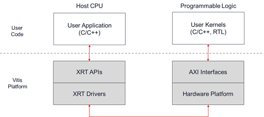
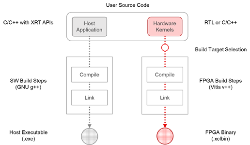

The Vitis Tutorials take users through the design methodology and
programming model for deploying accelerated application on all Xilinx
platforms.

Getting Started

:   The basics of the Vitis programming model by putting together a very
    first application.

Acceleration Tutorial

:   Learn how to use the Vitis core development kit to build, analyze,
    and optimize an accelerated algorithm developed in C++, OpenCL, and
    even low-level hardware description languages (HDLs) like Verilog
    and VHDL. Learn how to use Vitis High-Level Synthesis (HLS),
    compiler, analyzer, and debugger to identify performance bottlenecks
    and make modifications to increase algorithm efficiency and
    performance using an Alveo Data Center acceleration card.

AI Engine Development

:   Learn how to use the Vitis core tools to develop for Versal, the
    first Adaptive Compute Acceleration Platform (ACAP) device from
    Xilinx. Learn how to target, develop, and deploy advance algorithms
    using Versal's AI Engine array in conjunction with PL IP/kernels and
    software applications running on the embedded processors.

Platform Creation Tutorial

:   Learn how to build custom platforms for Vitis to target your own
    boards, and how to modify and extend existing platforms. Learn how
    to configure the platform hardware sources, construct the runtime
    software environment, add support for software and hardware
    emulation, and more.

Vitis Developers Contributed Tutorials

:   Vitis-Tutorials repository for community contribution.

Other Vitis Tutorial Repositories

:   Other Vitis Tutorial Repositories are as follows:

    Machine Learning Tutorial

    :   Learn how to use Vitis, Vitis AI, and the Vitis accelerated
        libraries to implement a fully end-to-end accelerated
        application using purely software-defined flows. Use Vitis AI to
        configure Xilinx hardware using the Tensorflow framework. Vitis
        AI allows the user to quantize, compile, and deploy an inference
        model in a matter of minutes.

    Embedded Design Tutorials

    :   Learn how to build and use embedded operating systems and
        drivers on Xilinx Adaptive SoCs and the MicroBlaze soft
        processor. These tutorials cover open-source operating systems
        and bare metal drivers available from Xilinx, compilers,
        debuggers, and profiling tools for traditional SoC software
        development.

# Getting Started

There are two top-level getting started tutorials for Vitis:

Vitis Introduction and Getting Started

:   An overview of the Vitis workflow including kernel development, host
    software creation, emulation, implementation, and analysis, and how
    Vitis unifies software, acceleration, and ML development under a
    single development platform.

Vitis HLS

:   In-Depth tutorial to optimize, implement, and unit test individual
    hardware accelerators from within the Vitis High-Level Synthesis
    environment

## Vitis Introduction and Getting Started

The Vitis tool provides a unified flow for developing FPGA accelerated
application targeted to either Data Center accelerator cards or Embedded
Processor platforms. This tutorial is divided into two separate flows:

1.  Data Center flow

2.  Embedded Processor flow

These two flows are similar in that host applications and accelerated
kernels written for one flow can be used in the other flow, and the
build processes are similar. However, while similar the flows are also
different in that the build and runtime environments of Data Center
accelerator cards and Embedded Processor platforms have different
requirements that must be met.

This tutorial provides instructions for building and running on both the
Alveo U200 Data Center accelerator card, and the Zynq Ultrascale MPSoC
ZCU102 platform. These instructions can be easily adapted to other
Xilinx cards.

The two flows in this tutorial are both organized into 5 parts and are
designed to walk you through all the key aspects of the Vitis flow.

1.  covers all the essential concepts of the Vitis FPGA acceleration
    flow in under 10 minutes

2.  guides you through the process of installing the Vitis tools,
    platforms and runtime library.

3.  explains the source code of vector-add example used in the rest of
    the tutorial

4.  describes the Data Center flow and the Embedded Platform flow. Each
    flow includes the commands required to compile, link and run the
    example on your acceleration card.

5.  gives an overview of Vitis Analyzer and shows how to open and
    analyze reports

### Part 1 : Essential Concepts

The Vitis unified software platform provides a framework for developing
and delivering FPGA accelerated applications using standard programming
languages like C and C++. The Vitis flow offers all of the features of a
standard software development environment, including:

-   Compiler or cross-compiler for host applications running on x86 or
    Arm processors

-   Cross-compilers for building the FPGA binary

-   Debugging environment to help identify and resolve issues in the
    code

-   Performance profilers to identify bottlenecks and help you optimize
    the application

#### Understanding the Vitis Programming and Execution Model

A Vitis accelerated application consists of two distinct components: a
software program running on a standard processor such as an X86
processor, or ARM embedded processor, and a Xilinx device binary
(xclbin) containing hardware accelerated functions, or kernels.

The software program, or host application, is written in C/C++ and runs
on a conventional CPU. The software program uses the XRT native API
implemented by the Xilinx Runtime library (XRT), or OpenCL 1.2 C/C++ API
to interact with the acceleration kernel in the Xilinx device. A
description of the host application and required API calls can be found
in the Vitis documentation under Host Programming.

The hardware accelerated kernels can be written in C/C++ or RTL (Verilog
or VHDL) and run within the programmable logic part of the Xilinx
device. Refer to C/C++ Kernels, or RTL Kernels in the Vitis
documentation for coding requirements. The kernels are integrated with a
Vitis hardware platform using standard AXI interfaces.

::: center
{width="5in"}
[]{#part1_execution_model label="part1_execution_model"}
:::

Vitis accelerated applications can execute on either Data Center or
Embedded Processor acceleration platforms:

-   On Data Center accelerator cards, the software program runs on an
    x86 server and the kernels run in the FPGA on a PCIe-attached
    acceleration card.

-   On Embedded Processor platforms, the software program runs on an ARM
    processor of a Xilinx MPSoC device and the kernels run within the
    same device.

Because the software and hardware components of a Vitis application use
standardized interfaces (XRT APIs and AXI protocols) to interact with
each other, the user's source code remains mostly agnostic of
platform-specific details and can be easily ported across different
acceleration platforms.

There are multiple ways by which the software program can interact with
the hardware kernels. The simplest method can be decomposed into the
following steps:

1.  The host application writes the data needed by a kernel into the
    global memory of the FPGA device.

2.  The host program sets up the input parameters of the kernel.

3.  The host program triggers the execution of the kernel.

4.  The kernel performs the required computation, accessing global
    memory to read or write data, as necessary. Kernels can also use
    streaming connections to communicate with other kernels, passing
    data from one kernel to the next.

5.  The kernel notifies the host that it has completed its task.

6.  The host program transfers data from global memory back into host
    memory, or can give ownership of the data to another kernel.

#### Understanding the Vitis Build Process

The Vitis build process follows a standard compilation and linking
process for both the host program and the kernel code:

-   The host program is built using the GNU C++ compiler (g++) for Data
    Center applications or the GNU C++ Arm cross-compiler for Embedded
    Processor devices.

-   The FPGA binary is built using the Vitis compiler (v++). First the
    kernels are compiled into a Xilinx object (.xo) file. Then, the .xo
    files are linked with the hardware platform to generate the Xilinx
    device binary (.xclbin) file. As described in Vitis Compiler
    Command, the Vitis compiler and linker accepts a wide range of
    options to tailor and optimize the results.

::: center
{width="5in"} []{#part1_build_flow
label="part1_build_flow"}
:::

#### Understanding Vitis Build Targets

The Vitis compiler provides three different build targets: two emulation
targets used for debug and validation purposes, and the default hardware
target used to generate the actual FPGA binary:

-   Software Emulation - The kernel code is compiled to run on the host
    processor. This allows iterative algorithm refinement through fast
    build-and-run loops. This target is useful for identifying syntax
    errors, performing source-level debugging of the kernel code running
    together with application, and verifying the behavior of the system.

-   Hardware Emulation - The kernel code is compiled into a hardware
    model (RTL), which is run in a dedicated simulator. This
    build-and-run loop takes longer but provides a detailed,
    cycle-accurate view of kernel activity. This target is useful for
    testing the functionality of the logic that will go in the FPGA and
    getting initial performance estimates.

-   Hardware - The kernel code is compiled into a hardware description
    language (RTL), and then synthesized and implemented for a target
    Xilinx device, resulting in a binary (xclbin) file that will run on
    the actual FPGA.

TIP: As described in Running Emulation, there are significant
differences in the build and runtime environments between Data Center
and Embedded Processor platforms. These two flows will be discussed in
detail in the following sections.

## Vitis HLS

Vitis HLS Analysis and Optimization Introduction

Vitis High-Level Synthesis (HLS) is a key part of the Vitis application
acceleration development flow. The tool is responsible for compiling
C/C++ and OpenCL code into a kernel for acceleration in the programmable
logic (PL) region of Xilinx devices. Thus, it is the tool that compiles
the hardware kernels for the Vitis tools by performing high-level
synthesis.

TIP: Vitis HLS can also be used to generate Vivado IP from C/C++ code,
but that flow is not the subject of this tutorial. Although similar,
there are some significant differences between producing Vitis XO
kernels and Vivado RTL IP. However, you can use this tutorial as a
general introduction to the Vitis HLS tool.

In this tutorial, you will work through the Vitis HLS tool GUI to build,
analyze, and optimize a hardware kernel. You are working through the
Vitis kernel flow in the Vitis tool. For more information, refer to
Enabling the Vitis Kernel Flow in the Vitis HLS Flow of the Vitis
Unified Software Platform Documentation (UG1416).

Complete the labs in the following order:

-   Creating a Vitis HLS Project

-   Running High-Level Synthesis and Analyzing Results

-   Using Optimization Techniques

-   Reviewing the DATAFLOW Optimization

# Acceleration Tutorial

# AI Engine Development

# Platform Creation Tutorial

# Vitis Developers Contributed Tutorials

# Other Vitis Tutorial Repositories

## Machine Learning Tutorial

## Embedded Design Tutorials
